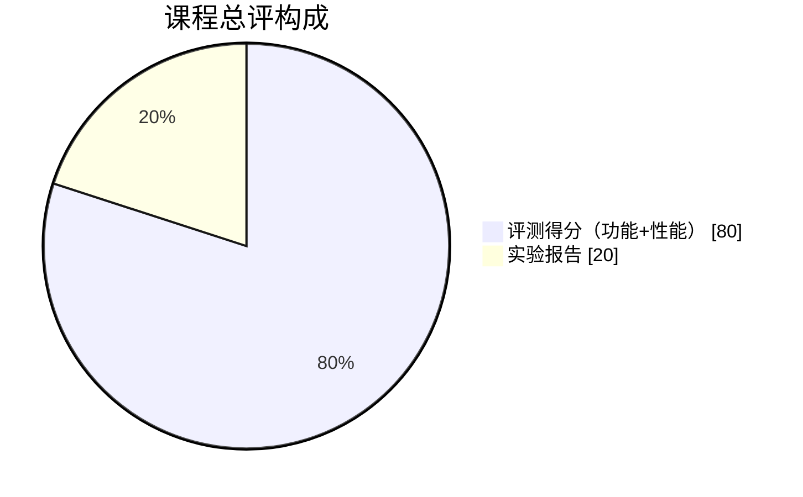

# 评分标准

## 一、总评构成

本课程最终成绩由**评测得分**和**实验报告得分**两部分构成：

| 组成部分 | 占比 |
| --- | ---: |
| 评测得分（代码功能与性能） | 80% |
| 实验报告得分 | 20% |

## 二、评测得分（80%）

评测得分由希冀平台自动计算，分为功能评测和性能评测两部分：

| 项目 | 权重 | 说明 |
| --- | ---: | --- |
| 功能评测 | 68% | 20 组功能样例，每组 5 分，检查 RV64GC 汇编的运行结果 |
| 性能评测 | 12% | 10 组性能样例，每组 10 分，重点检查 IR 和目标代码优化 |

评测部分按 **功能 85%、性能 15%** 合成。

:::info[计分说明]
词法分析、语法分析以及选做语义分析只用于检查输入能否正确进入后端，**不单独计分**。评测重点是目标代码生成和优化部分。
:::

## 三、实验报告得分（20%）

实验报告由助教人工批改，主要考察以下方面：

| 评分要点 | 说明 |
| --- | --- |
| 实验原理 | 是否正确描述涉及的编译理论 |
| 设计思路 | 架构设计、模块划分是否合理 |
| 关键算法 | 算法描述是否清晰 |
| 测试结果 | 测试是否充分 |
| 分工说明 | 团队合作水平 |
| 问题与心得 | 遇到的问题记录和解决思路 |

