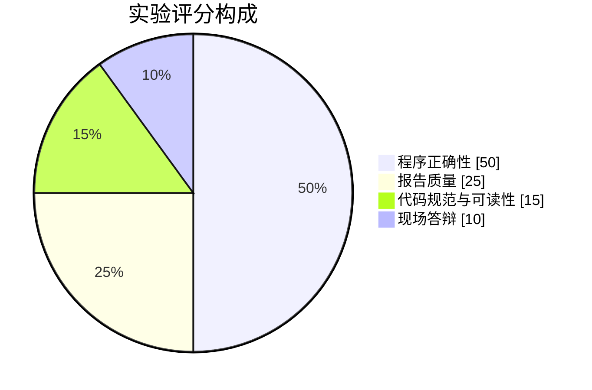

# 实验报告与提交规范

## 一、报告结构

每份实验报告使用 Markdown 编写，文件名固定为 `report.md`，结构如下：

```markdown
# 实验N：<实验名称>

## 一、实验目的
## 二、实验原理
## 三、数据结构设计
## 四、算法与流程
## 五、关键代码说明
## 六、测试与结果分析
## 七、遇到的问题与解决
## 八、心得体会
## 九、参考文献
```

## 二、各章节要求

### 一、实验目的

用 3–5 条说明本次实验要达成的能力目标，不要照抄本网站文字。

### 二、实验原理

说明本阶段涉及的编译理论，例如：

- 实验一：正则表达式、有限自动机、最长匹配原则；
- 实验三：LR(1) 项目集、有效项目、移进-归约冲突的消解；
- 实验六：基本块划分、控制流图、活跃变量分析、数据流方程。

**必须包含至少一张原理图**（状态转换图、DFA、数据流图或流程图）。

### 三、数据结构设计

给出核心结构体的定义并解释字段含义：

```cpp
// 例：词法分析器的 Token 结构
struct Token {
  TokenType type;      // 记号类别
  std::string lexeme;  // 原始字面量
  int line;            // 所在行（从 1 开始）
  int column;          // 所在列（从 1 开始）
  std::variant<int64_t, double, std::string> value; // 语义值
};
```

### 四、算法与流程

用伪代码或流程图描述核心算法，并标注时间复杂度。

### 五、关键代码说明

只贴核心片段，**不要整文件复制**。每段代码说明"为什么这样写"。

### 六、测试与结果分析

必须包含测试用例表格：

| 用例 | 输入特点 | 期望输出 | 实际输出 | 结论 |
| --- | --- | --- | --- | --- |
| case01 | 单行注释 | 正确跳过 | 一致 | 通过 |
| case02 | 未闭合注释 | 报错 line 3 | 一致 | 通过 |
| case03 | 超长标识符 | 正常识别 | 一致 | 通过 |

### 七、遇到的问题与解决

记录真实踩过的坑，例如"最长匹配与回退的边界处理"。

### 八、心得体会

不少于 200 字，写你自己的思考。

## 三、评分标准



| 项目 | 分值 | 评分要点 |
| --- | --- | --- |
| 程序正确性 | 50 | 测试集通过率；错误输入能否优雅处理 |
| 报告质量 | 25 | 原理阐述是否准确；图表是否清晰；分析是否深入 |
| 代码规范 | 15 | 命名、注释、模块划分、构建脚本可用性 |
| 现场答辩 | 10 | 能否准确解释自己的实现选择 |

## 四、提交方式

```bash
# 1. 切到本次实验的分支
git checkout -b lab1-lexer

# 2. 提交代码与报告
git add labs/lab1-lexer
git commit -m "lab1: 完成词法分析器与实验报告"

# 3. 推送到远端并发起 PR
git push -u origin lab1-lexer
```

在 GitHub 上发起 Pull Request，标题格式为 `[Lab1] 学号 姓名`，
描述中填写自测通过率。

:::tip 关于 Latex
报告中如果出现文法产生式，建议使用 Markdown 内联代码或代码块书写，
例如 `E -> E + T | T`，避免不同渲染器对公式支持不一致。
:::
