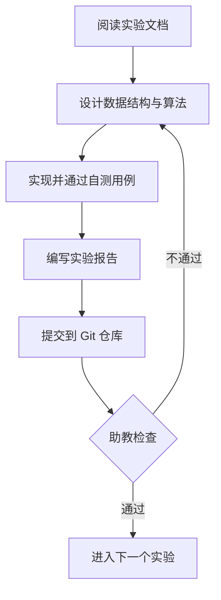

# 实验流程与代码规范

## 一、总体流程



## 二、提交规范

### 分支模型

- `main`：只接受合并，不直接开发；
- `partN`：每个实验部分一个分支，例如 `part1-lexer`；
- 提交信息使用如下格式：

```text
<part>: <简述>

例：
part1: 实现标识符与数字常量的扫描
part1: 修复注释跨行时的状态回退缺陷
```

提交内容与禁止事项见[希冀提交与评测](./submission)。

## 三、代码规范

### 命名与注释（建议）

按语言选择对应的命名规则，同一项目内必须保持一致：

- **类型名**：使用 PascalCase（首字母大写的驼峰），如 `Token`、`BasicBlock`、`LiveInterval`；
- **函数与变量（C / C++ / Rust）**：使用 snake_case（全小写下划线连接），如 `next_token`、`current_line`；
- **函数与变量（Java）**：使用 camelCase（首字母小写的驼峰），如 `nextToken`、`currentLine`；
- **常量**：使用 UPPER_SNAKE_CASE（全大写下划线），如 `MAX_TOKEN_LEN`、`EOF`。

示例：

```cpp
// C/C++ / Rust 风格
struct Token {                  // 类型名 PascalCase
  TokenType type;               // 变量名 snake_case
  std::string lexeme;
  int line_no;
};

Token next_token();             // 函数名 snake_case
static constexpr int MAX_LEN = 64;  // 常量 UPPER_SNAKE_CASE

// Java 风格
class Token {                   // 类型名 PascalCase
  TokenType type;               // 变量名 camelCase
  String lexeme;
  int lineNo;
}

Token nextToken();              // 函数名 camelCase
static final int MAX_LEN = 64;  // 常量 UPPER_SNAKE_CASE
```

关键算法（如子集构造、First/Follow 计算、活变量分析）必须写明算法逻辑（如果复现某种算法需要介绍出处）。

### 错误处理

编译器对错误输入必须正常退出（返回非零状态），不允许崩溃或产生未定义行为。约定：

```c
// 词法错误：报告行列号后继续扫描，便于一次性发现多处错误
error: line 12, column 5: unexpected character '@'
```

- 退出码：`0` 表示编译成功，`1` 表示源码存在错误，`2` 表示内部实现错误；
- 错误信息统一输出到 stderr，正常结果输出到 stdout，方便脚本化测试。

### 可测试性

统一驱动使用原实验约定的 `--dump-*` 开关，从标准输入读取 ToyC 源程序、向标准输出写入阶段结果，测试时用重定向保存到文件：

```bash
./compiler --dump-tokens   < input.c > input.token      # 第一部分：Token 流
./compiler --check-ast     < input.c > input.check-ast  # 第二部分：语法检查，输出 accept / reject
./compiler --dump-ir       < input.c > input.ll         # 第三部分：LLVM IR
./compiler --dump-ir --opt < input.c > input.opt.ll     # 第三部分：优化后 LLVM IR
./compiler --dump-asm      < input.c > input.s          # 第四部分：基线汇编
./compiler --dump-asm -opt < input.c > input.opt.s      # 第五、六部分：优化汇编

```

`--dump-*` 模式用于检查中间结果；最终评测重点是 `--dump-asm` 产生的 RV64GC 汇编及其运行结果。

## 四、验收方式

提交前请阅读[希冀提交与评测](./submission)，提交后希冀评测机会自行评测你的编译器正确性与性能，除此之外你还需要对每阶段实现原理代码比较熟悉，因为助教会提问相关内容（尽管你们可能使用cursor、codex、claudecode或其他agent进行编写代码，但你仍要保证输出的代码在你的可理解范围内，这是使用ai最基本的要求）。

- **自动测试**：助教用统一的测试集运行你的编译器，比对输出；
- **现场答辩**：随机问答，并要求你解释某阶段产物被如何处理；
- **代码抽查**：抽查关键数据结构（符号表、活跃变量、寄存器分配）。

## 五、进度建议

| 周次 | 内容 |
| --- | --- |
| 第 2 周 | 第一部分完成验收 |
| 第 4 周 | 第二、三部分完成验收 |
| 第 6 周 | 第四部分完成验收 |
| 第 8 周 | 第五部分完成验收 |
| 第 10 周 | 第六部分完成验收 |
| 第 12–16 周 | 综合课程设计 |
