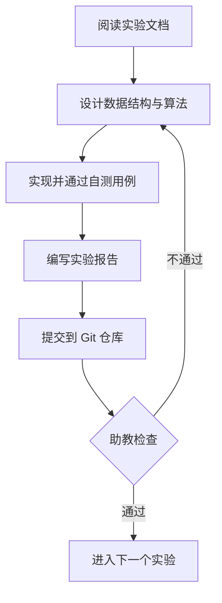

# 实验流程与代码规范

## 一、总体流程



## 二、提交规范

### 分支模型

- `main`：只接受合并，不直接开发；
- `labN`：每个实验一个分支，例如 `lab1-lexer`；
- 提交信息使用如下格式：

```text
<lab>: <简述>

例：
lab1: 实现标识符与数字常量的扫描
lab1: 修复注释跨行时的状态回退缺陷
```

### 提交内容

每个实验提交时必须包含：

1. **源代码**：可独立构建运行；
2. **构建脚本**：`Makefile` / `build.sh` / `pom.xml`，确保助教一条命令可编译；
3. **测试用例**：至少 5 组，覆盖正常输入与边界输入；
4. **实验报告**：`report.md`，规范见 [实验报告与提交规范](./report.md)。

:::danger 禁止事项
- 禁止提交编译产物（`a.out`、`*.class`、`*.o`）与 IDE 配置目录；
- 禁止抄袭。代码相似度检测工具会跨届比对，一经确认双方均为零分。
:::

## 三、代码规范

### 命名与注释

- 类型名用 `PascalCase`，函数与变量用 `snake_case`（Java 用 `camelCase`）；
- 每个源文件头部注明：实验名称、学号、姓名、日期；
- 关键算法（如子集构造、First/Follow 计算、活变量分析）必须写明算法出处与复杂度。

### 错误处理

编译器对错误输入必须**优雅退出**，不允许崩溃或输出未定义行为。约定：

```c
// 词法错误：报告行列号后继续扫描，便于一次性发现多处错误
error: line 12, column 5: unexpected character '@'
```

- 退出码：`0` 表示编译成功，`1` 表示源码存在错误，`2` 表示内部实现错误；
- 错误信息统一输出到 **stderr**，正常结果输出到 **stdout**，方便脚本化测试。

### 可测试性

程序的每个阶段都应提供独立的 dump 开关，例如：

```bash
./mycompiler --dump-tokens  input.mc   # 实验一
./mycompiler --dump-ast     input.mc   # 实验二、三
./mycompiler --dump-ir      input.mc   # 实验五
./mycompiler --dump-asm     input.mc   # 实验七
```

这样助教可以在不阅读源码的情况下验证每个阶段的正确性。

## 四、验收方式

- **自动测试**：助教用统一的测试集运行你的编译器，比对输出；
- **现场答辩**：随机抽取一段代码，要求你口述其在本阶段被如何处理；
- **代码走查**：抽查关键数据结构（符号表、活跃变量、寄存器分配）。

## 五、进度建议

| 周次 | 内容 |
| --- | --- |
| 第 2 周 | 实验一完成验收 |
| 第 4 周 | 实验二、三完成验收 |
| 第 6 周 | 实验四完成验收 |
| 第 8 周 | 实验五完成验收 |
| 第 10 周 | 实验六、七完成验收 |
| 第 12–16 周 | 综合课程设计 |
