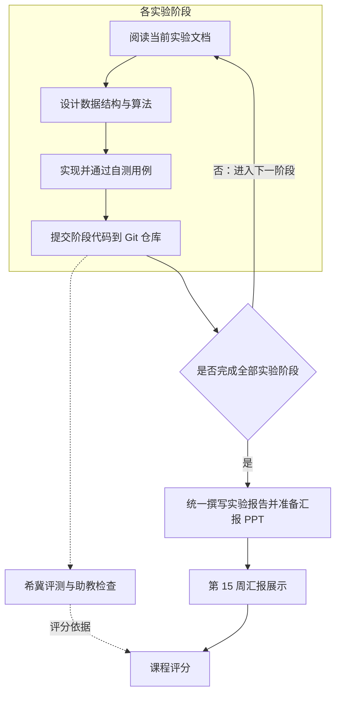

# 实验流程与代码规范

## 一、总体流程


```mermaid
flowchart TD
  subgraph STAGE[各实验阶段]
    A[阅读当前实验文档] --> B[设计数据结构与算法]
    B --> C[实现并通过自测用例]
    C --> D[提交阶段代码到 Git 仓库]
  end
  D --> E{是否完成全部实验阶段}
  E -- 否：进入下一阶段 --> A
  E -- 是 --> F[统一撰写实验报告并准备汇报 PPT]
  F --> G[第 15 周汇报展示]
  D -.-> H[希冀评测与助教检查]
  H -. 评分依据 .-> I[课程评分]
  G --> I
```

各阶段按对应要求完成设计、实现、自测与代码提交，不逐阶段撰写实验报告。完成全部实验后，小组统一撰写一份报告，按实验部分组织内容。助教检查用于评分，不作为进入下一阶段的审核关卡，也不会将流程退回数据结构设计。

## 二、提交规范

### 分支模型

- `main`：只接受合并，不直接开发；
- `partN`：每个实验部分一个分支，例如 `part1-lexer`；
- 提交信息使用如下格式：

```text
<part>: <简述>

例：
part1: 实现标识符与数字常量的扫描
part1: 修复注释跨行时的状态回退缺陷
```

提交内容与禁止事项见[希冀提交与评测](./submission)。

## 三、代码规范

### 命名与注释（建议）

按语言选择对应的命名规则，同一项目内必须保持一致：

- **类型名**：使用 PascalCase（首字母大写的驼峰），如 `Token`、`BasicBlock`、`LiveInterval`；
- **函数与变量（C / C++ / Rust）**：使用 snake_case（全小写下划线连接），如 `next_token`、`current_line`；
- **函数与变量（Java）**：使用 camelCase（首字母小写的驼峰），如 `nextToken`、`currentLine`；
- **常量**：使用 UPPER_SNAKE_CASE（全大写下划线），如 `MAX_TOKEN_LEN`、`EOF`。

示例：

```cpp
// C/C++ / Rust 风格
struct Token {                  // 类型名 PascalCase
  TokenType type;               // 变量名 snake_case
  std::string lexeme;
  int line_no;
};

Token next_token();             // 函数名 snake_case
static constexpr int MAX_LEN = 64;  // 常量 UPPER_SNAKE_CASE

// Java 风格
class Token {                   // 类型名 PascalCase
  TokenType type;               // 变量名 camelCase
  String lexeme;
  int lineNo;
}

Token nextToken();              // 函数名 camelCase
static final int MAX_LEN = 64;  // 常量 UPPER_SNAKE_CASE
```

关键算法（如子集构造、First/Follow 计算、活变量分析）必须写明算法逻辑（如果复现某种算法需要介绍出处）。

### 错误处理

编译器对错误输入必须正常退出（返回非零状态），不允许崩溃或产生未定义行为。课程不规定错误信息的固定文本格式；实现应提供足够的错误位置和原因，便于定位问题。诊断信息输出到 stderr，正常阶段结果输出到 stdout，方便脚本化测试。

### 可测试性

统一驱动使用原实验约定的 `--dump-*` 开关，从标准输入读取 ToyC 源程序、向标准输出写入阶段结果，测试时用重定向保存到文件：

```bash
./compiler --dump-tokens   < input.c > input.token      # 第一部分：Token 流
./compiler --check-ast     < input.c > input.check-ast  # 第二部分：语法检查，输出 accept / reject
./compiler --dump-ir       < input.c > input.ll         # 第三部分：LLVM IR
./compiler --dump-ir --opt < input.c > input.opt.ll     # 第三部分：优化后 LLVM IR
./compiler --dump-asm      < input.c > input.s          # 第四部分：基线汇编
./compiler --dump-asm -opt < input.c > input.opt.s      # 第五、六部分：优化汇编

```

`--dump-*` 模式用于检查中间结果；最终评测重点是 `--dump-asm` 产生的 RV64GC 汇编及其运行结果。

## 四、验收方式

提交前请阅读[希冀提交与评测](./submission)。提交后希冀评测机会自动检查编译器的正确性与性能；同时，你还需要熟悉每个阶段的实现原理和代码，因为助教会围绕阶段产物进行提问。无论是否借助自动化编程工具，提交的代码都应在你的理解范围内。

- **自动测试**：助教用统一的测试集运行你的编译器，比对输出；
- **汇报展示与提问**：说明编译器架构、阶段产物和关键实现；
- **助教检查**：检查关键数据结构（符号表、活跃变量、寄存器分配）及实现说明，结果只影响课程评分。

检查结果作为评分依据，不设置“检查不通过则重新设计”的流程。

## 五、时间安排

| 周次 | 里程碑 | 交付 |
| --- | --- | --- |
| 第 10 周 | 完成词法分析 | 词法分析器与 Token 流 |
| 第 11 周 | 完成语法分析 | 语法分析器与 AST |
| 第 12 周 | 完成中间代码表示 | IR 设计与 AST 到 IR 的转换方案 |
| 第 13–14 周 | 完成目标代码生成和优化 | 可运行的 RISC-V64GC 汇编与优化验证结果 |
| 第 15 周 | 汇报展示 | 统一实验报告、汇报 PPT 与实验结果说明 |
