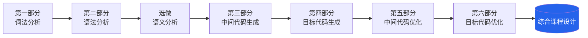

# 编译原理实验 · 课程总览

本课程以一个 **ToyC 编译器** 为主线，分六个部分带你从零实现一个完整的编译流程。
各部分的程序产出或设计报告共同构成编译器流水线，最终你会得到一个能把 ToyC 源码
翻译为汇编指令的编译器。

:::tip 文档即唯一内容源
本网站的每一页都直接由仓库 `docs/` 目录下的 Markdown 文件构建生成，
网页与 md 文档一一对应，不存在需要手工同步的第二份内容。
:::

## 实验路线



## 实验一览

| 序号 | 实验部分 | 核心产出 | 建议课时 |
| --- | --- | --- | --- |
| 一 | 词法分析 | Token 流 | 4 |
| 二 | 语法分析 | AST 与分析器 | 8 |
| 三 | 中间代码生成 | IR 设计与转换报告 | 6 |
| 四 | 目标代码生成 | 基线 RISC-V64GC 汇编 | 6 |
| 五 | 中间代码优化 | 优化后的 IR | 6 |
| 六 | 目标代码优化 | 优化后的 RISC-V 汇编 | 6 |

## 目录结构

```text
CompilerSystemPractice/
├── docs/                 # ← 所有实验文档（Markdown，站点内容源）
│   ├── intro.md
│   ├── guide/            # 实验指南：环境、流程、报告规范
│   ├── labs/             # 六个实验部分 + 综合课程设计
│   └── reference/        # 公共文法、词法约定、FAQ
├── src/                  # 站点 UI（React 组件与样式）
├── static/               # 静态资源（图片、图标）
├── docusaurus.config.ts  # 站点配置
└── sidebars.ts           # 侧边栏配置
```

## 考核方式

本次作业的计分重点是目标代码生成与优化。词法分析、语法分析和选做语义分析不单独计分，
只作为编译器能够正确处理测试输入的前置条件。

| 项目 | 权重 | 说明 |
| --- | ---: | --- |
| 功能评测 | 68% | 20 组功能样例，每组 5 分；检查生成的 RV64GC 汇编能否正确运行。词法和语法只通过最终运行结果检查。 |
| 性能评测 | 12% | 10 组性能样例，每组 10 分；重点观察目标代码生成、IR 优化和目标代码优化的运行效率。 |
| 实验报告与设计说明 | 20% | LLVM IR/SSA、代码生成、优化、寄存器分配、测试与小组分工。 |

评测部分内部按功能 `85%`、性能 `15%` 计算，最终成绩为“评测得分 `80%` + 报告得分 `20%`”。
`-opt` 或 `--dump-ir --opt` 可以启用优化；未启用优化时必须保证功能正确，是否实现优化不影响基础正确性判定。

## 如何开始

1. 阅读 [开发环境与工具链](./guide/environment.md)，把环境跑起来；
2. 阅读 [实验流程与代码规范](./guide/workflow.md)，了解提交与评分规则；
3. 从 [第一部分：词法分析](./labs/part1-lexer.md) 开始动手。

遇到问题先看 [常见问题 FAQ](./reference/faq.md)，仍未解决再向助教提问。
