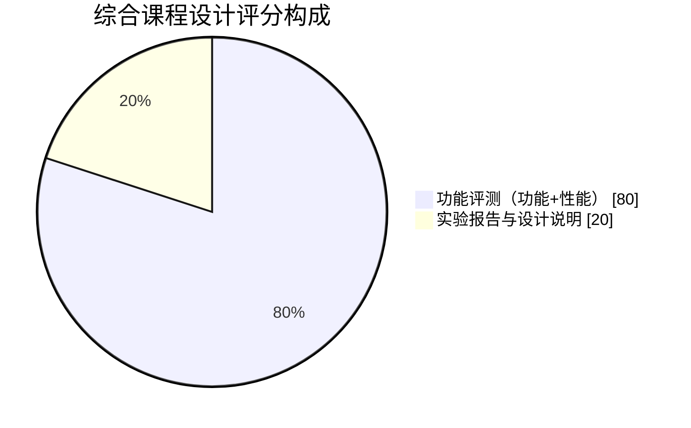
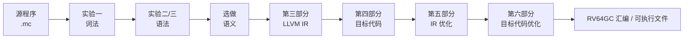
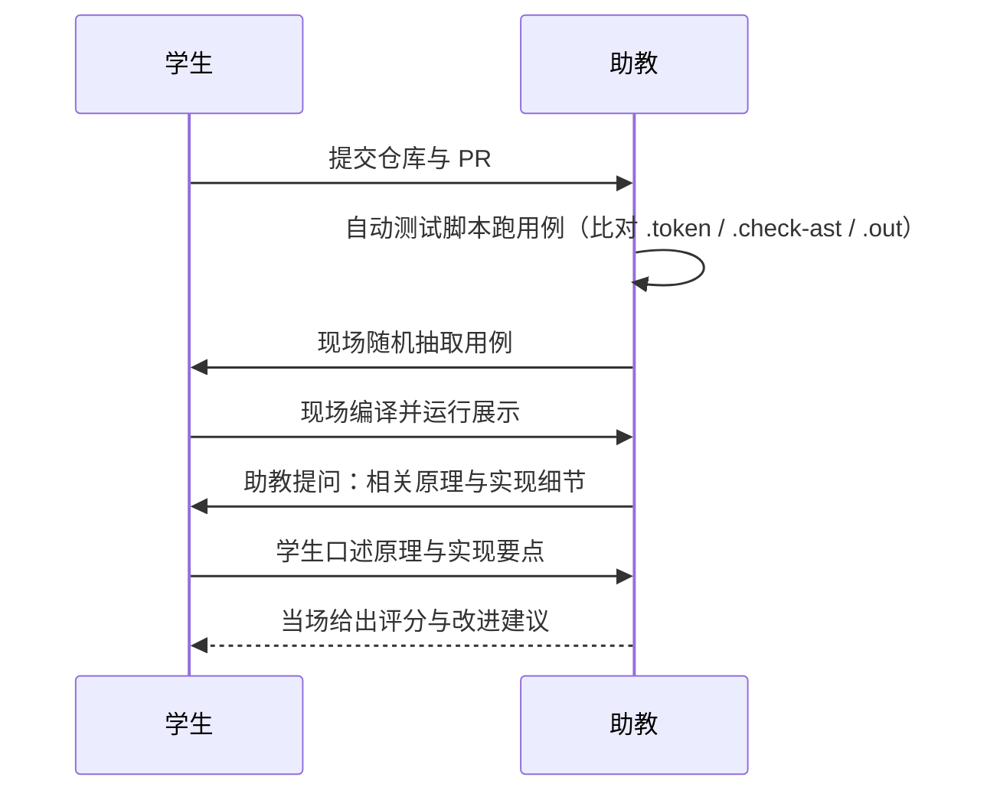

# 课程总览

本页先给出**课程总览**（实验路线、考核方式），
再展开**综合课程设计**（设计目标、交付物、验收流程等）。从这一页起就能对课程形成完整印象，
并知道综合阶段要交付什么、什么时候交付、如何被评分。

## 一、课程总览

本课程以一个 **ToyC 编译器** 为主线，分六个部分带你从零实现一个完整的编译流程。
各部分的程序产出或设计报告共同构成编译器流水线，最终你会得到一个能把 ToyC 源码
翻译为汇编指令的编译器。


### 实验路线


### 实验一览

| 序号 | 实验部分 | 核心产出 | 建议课时 |
| --- | --- | --- | --- |
| 一 | 词法分析 | Token 流 | 4 |
| 二 | 语法分析 | AST 与分析器 | 8 |
| 三 | 中间代码生成 | IR 设计与转换报告 | 6 |
| 四 | 目标代码生成 | 基线 RISC-V64GC 汇编 | 6 |
| 五 | 中间代码优化 | 优化后的 IR | 6 |
| 六 | 目标代码优化 | 优化后的 RISC-V 汇编 | 6 |

### 如何开始

1. 阅读 [开发环境与工具链](../guide/environment)，把环境跑起来；
2. 阅读 [实验流程与代码规范](../guide/workflow)，了解提交与评分规则；
3. 从 [第一部分：词法分析](./part1-lexer) 开始动手。

遇到问题先看 [常见问题 FAQ](../reference/faq)，仍未解决再向助教提问。

## 二、考核方式

:::info[计分说明]
本次作业的计分重点是目标代码生成与优化。词法分析、语法分析和选做语义分析不单独计分，只用于检查输入能否正确进入后端。
:::

| 项目 | 权重 | 说明 |
| --- | ---: | --- |
| 功能评测 | 68% | 20 组功能样例，每组 5 分；检查生成的 RV64GC 汇编能否正确运行。词法和语法只通过最终运行结果检查。 |
| 性能评测 | 12% | 10 组性能样例，每组 10 分；重点观察目标代码生成、IR 优化和目标代码优化的运行效率。 |
| 实验报告与设计说明 | 20% | LLVM IR/SSA、代码生成、优化、寄存器分配、测试与小组分工。 |

评测部分内部按功能 `85%`、性能 `15%` 计算，最终成绩为"评测得分 `80%` + 报告得分 `20%`。
`-opt` 或 `--dump-ir --opt` 可以启用优化；未启用优化时必须保证功能正确，是否实现优化不影响基础正确性判定。



## 三、综合设计目标

把六个部分的产物整合成一个**完整的、可独立运行的编译器**，
从 ToyC 源程序一路生成 RISC-V64GC 可执行目标汇编，并接受现场随机用例测试。



## 四、交付物

| 序号 | 交付物 | 说明 |
| --- | --- | --- |
| 1 | 源码（含构建脚本） | 完整的编译器源代码与一份构建脚本（`Makefile` / `CMakeLists.txt` / `pom.xml` / `build.gradle` 等），保证一条命令在干净 Linux 环境下从源码构建出可执行文件。 |
| 2 | 设计文档 | 格式不限，建议使用 `DESIGN.md` 或 `docs/`，覆盖整体架构、模块接口、关键设计决策与代码框架介绍。 |
| 3 | 实验报告 | 按六部分实验分别记录关键算法、数据结构、遇到的问题与解决思路。 |
| 4 | 汇报 PPT | 10–15 页，答辩时使用，覆盖架构、亮点与不足。 |

:::info[提交与严禁]
**提交时机**：源码与设计文档按实验部分随 Git 仓库迭代提交；实验报告与汇报 PPT 在结课时统一提交。
**严禁**：构建产物（`a.out`、`*.class`、`*.o`）、IDE 配置目录、`libtoyc.a`、绝对路径与本地缓存；评测平台另行规定的除外。
:::

## 五、测试文件命名约定

评测时助教提供的测试文件按以下约定命名，学生在自己的验证命令中也应遵循同样格式：

| 阶段 | 编译器输入 | 程序运行时输入 | 链接产物 | 程序输出 |
|---|---|---|---|---|
| 第一部分（词法） | `*.c` | — | — | `*.token` |
| 第二部分（语法） | `*.c` | — | — | `*.check-ast` |
| 第三部分（IR） | `*.c` | — | — | `*.ll` / `*.opt.ll` |
| 第四部分（汇编） | `*.c` | `*.in` | `input`（无后缀） | `*.out` |

:::info[关于源文件命名]
ToyC 源文件统一使用 `.c` 后缀（与 C 语言一致，便于工具链识别）。编译流程是**两步**：

1. 你的 `./compiler` 把 `*.c` 转成 RV64GC 汇编 `*.s`；
2. 用 `riscv64-unknown-elf-gcc` 链接 `*.s` 与运行时库，生成一个 **无后缀的可执行文件**（直接叫 `input`），再用 `qemu-riscv64` 运行它；
3. 运行结果（ToyC 程序的 stdout）重定向到 `*.out`，这是助教用来与标准答案对比的文件。

**示例**：

```bash
./compiler --dump-asm < input.c > input.s
riscv64-unknown-elf-gcc -march=rv64gc -mabi=lp64d \
  -nostdlib -static input.s third_party/toyc/libtoyc.a -o input
./input < input.in > result.out        # result.out 是 ToyC 程序的 stdout，与 input.out 对比
```

**完整虚拟机开发环境**

需要完整 Linux 环境时，使用 qemu-system 启动虚拟机：

```bash
qemu-system-riscv64 \
  -machine virt \
  -cpu rv64gc \
  -nographic -m 4G -smp 4 \
  -kernel /usr/lib/u-boot/qemu-riscv64_smode/uboot.elf \
  -device virtio-net-device,netdev=eth0 \
  -netdev user,id=eth0,hostfwd=tcp::2222-:22 \
  -device virtio-rng-pci \
  -drive file=ubuntu-24.04-riscv64.img,format=raw,if=virtio

# SSH 连接后使用 Linux 工具链
ssh -p 2222 ubuntu@localhost
# 首次登录后安装编译工具
sudo apt-get update
sudo apt-get install gcc gdb
riscv64-linux-gnu-gcc -march=rv64gc -mabi=lp64d \
  -nostdlib -static input.s libtoyc.a -o input
./input < input.in
```
:::

:::info[关于文件类型区分]
**`*.c` vs `*.in` vs `*.out` 三者不要混淆**：

- `*.c` — ToyC 源文件，由**编译器**从 stdin 读取；
- `*.in` — ToyC 程序运行时的标准输入数据（例如 `getint()` 要读取的数字），由**被编译出的可执行文件**从 stdin 读取；
- `*.out` — ToyC 程序运行时的**标准输出结果**（例如 `putint()` 写入的内容），是助教评测脚本实际比对的文件。
:::

示例（第一部分，词法）：

```bash
./compiler --dump-tokens < input.c > input.token
```

示例（第四部分，汇编链接与运行）：

```bash
./compiler --dump-asm < input.c > input.s
riscv64-unknown-elf-gcc -march=rv64gc -mabi=lp64d \
  -nostdlib -static input.s third_party/toyc/libtoyc.a -o input
./input < input.in > result.out        # result.out 是 ToyC 程序 stdout，与 input.out 对比
```

:::info
`*.c` 是 ToyC 源文件（编译器输入），`*.in` 是程序运行时的标准输入数据，`*.out` 是程序的标准输出结果（即助教评测时实际比对的输出），三者不要混淆。
:::

## 六、统一驱动接口

课程组要求的命令行接口（必须全部支持）：

```bash
./compiler [选项] < input.c

选项：
  --dump-tokens    输出词法单元流
  --check-ast      检查抽象语法树：构造正确则输出true，错误则输出 <line>:<reason>
  --dump-ir        [自调试] 输出 LLVM IR
  --dump-ir --opt  [自调试] 输出优化后的 LLVM IR
  --dump-asm       输出 RV64GC 目标汇编代码
  -opt             启用基础优化
  -o <file>        [自调试]指定输出文件
```

:::tip[关于统一接口]
`--dump-tokens`、`--check-ast`、`--dump-asm`、`-opt` 是自动测评必须支持的接口，参数名称必须逐字符一致，否则该部分记为 0 分。
`--dump-ir`、`--dump-ir --opt` 与 `-o` 属于自调试可选接口，方便你在本地观察中间结果或指定输出文件，测评脚本不会调用，无需严格对齐名称。
:::

## 七、验收流程



### 助教提问范围

- **词法分析**：状态机设计、Token 分类依据、错误恢复策略；
- **语法分析**：文法改写、FIRST/FOLLOW 集、递归下降 / LL(1) / LR 的取舍与冲突解决；
- **语义分析**（如已实现）：符号表作用域、类型检查、控制流约束；
- **IR 与 SSA**：SSA 构造、支配边界、phi 节点插入策略；
- **优化**：常量传播、死代码消除、循环不变代码外提、公共子表达式消除、强度削减等的数据流方程与不动点计算；
- **目标代码生成**：指令选择、调用约定、栈帧布局、调用者/被调用者保存寄存器；
- **寄存器分配**：活跃变量分析、图着色 / 线性扫描的取舍、spill 策略；
- **目标代码优化**：窥孔优化、寄存器复用、分支优化等。

:::info
提问不限于以上范围，助教可能就任意模块的设计取舍、数据结构选择或调试经验追问，请提前熟悉自己提交的代码。
:::

## 八、时间安排

| 周次 | 里程碑 | 交付 |
| --- | --- | --- |
| 第 12 周 | 模块整合 | 统一驱动跑通实验一至四 |
| 第 13 周 | 打通后端 | 简单程序可生成并运行汇编 |
| 第 14 周 | 优化接入 | `-O1` 可显著减少指令数且结果不变 |
| 第 15 周 | 测试完善 | 30 个用例全部通过，文档初稿 |
| 第 16 周 | 答辩 | 幻灯片 + 现场演示 |

## 九、加分项

1. 实现完整的**图着色寄存器分配**并给出与线性扫描的对比数据；
2. 支持**自定义扩展语言特性**（如 `struct` 嵌套、多维数组），并有测试覆盖；
3. 提供 **Web 版编译器演示**（浏览器内编译并展示各阶段产物）；
4. 单元测试覆盖率 ≥ 70%，并接入 CI 自动运行。

## 十、常见扣分点

- 编译器遇到非法输入直接崩溃，而不是给出错误信息；
- 统一驱动接口参数名不一致，导致自动测试无法调用；
- 只在"自己写的用例"上正确，换一个用例就出错；
- 文档只有截图没有设计说明，无法解释关键取舍；
- 代码中留有大量注释掉的旧实现与调试输出。
