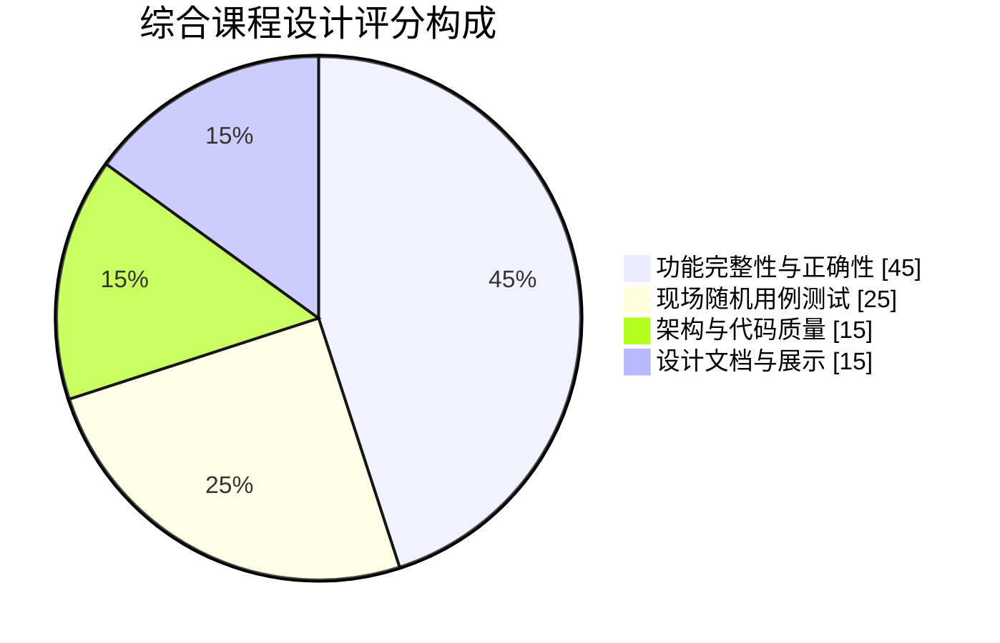
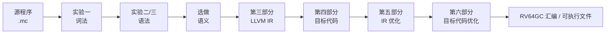
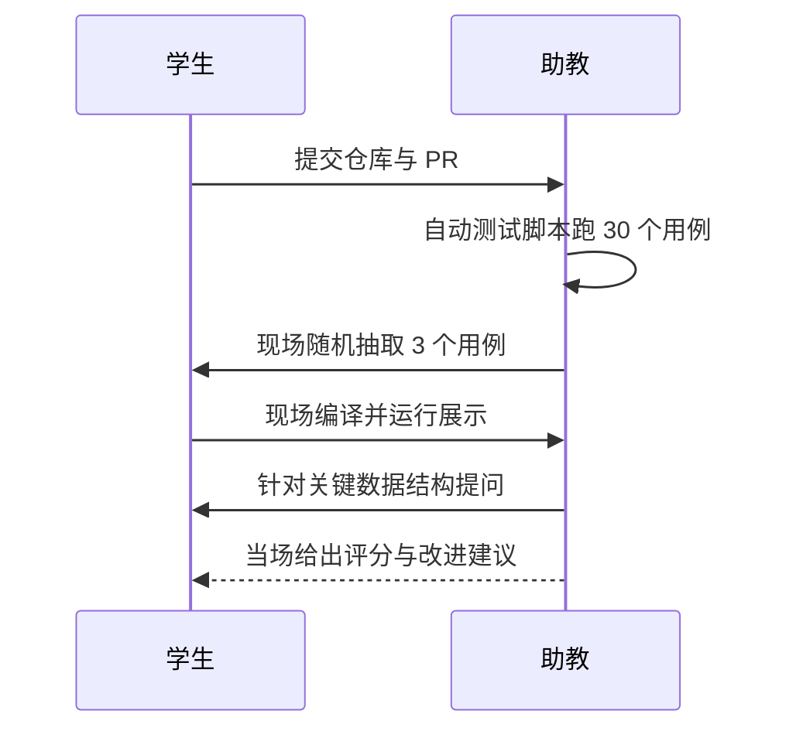

# 课程总览

本页先给出**课程总览**（实验路线、考核方式），
再展开**综合课程设计**（设计目标、交付物、验收流程等）。从这一页起就能对课程形成完整印象，
并知道综合阶段要交付什么、什么时候交付、如何被评分。

## 一、课程总览

本课程以一个 **ToyC 编译器** 为主线，分六个部分带你从零实现一个完整的编译流程。
各部分的程序产出或设计报告共同构成编译器流水线，最终你会得到一个能把 ToyC 源码
翻译为汇编指令的编译器。

:::tip[文档即唯一内容源]
本网站的每一页都直接由仓库 `docs/` 目录下的 Markdown 文件构建生成，
网页与 md 文档一一对应，不存在需要手工同步的第二份内容。
:::

### 实验路线


### 实验一览

| 序号 | 实验部分 | 核心产出 | 建议课时 |
| --- | --- | --- | --- |
| 一 | 词法分析 | Token 流 | 4 |
| 二 | 语法分析 | AST 与分析器 | 8 |
| 三 | 中间代码生成 | IR 设计与转换报告 | 6 |
| 四 | 目标代码生成 | 基线 RISC-V64GC 汇编 | 6 |
| 五 | 中间代码优化 | 优化后的 IR | 6 |
| 六 | 目标代码优化 | 优化后的 RISC-V 汇编 | 6 |

### 如何开始

1. 阅读 [开发环境与工具链](../guide/environment)，把环境跑起来；
2. 阅读 [实验流程与代码规范](../guide/workflow)，了解提交与评分规则；
3. 从 [第一部分：词法分析](./part1-lexer) 开始动手。

遇到问题先看 [常见问题 FAQ](../reference/faq)，仍未解决再向助教提问。

## 二、考核方式

本次作业的计分重点是目标代码生成与优化。词法分析、语法分析和选做语义分析不单独计分，
只作为编译器能够正确处理测试输入的前置条件。

| 项目 | 权重 | 说明 |
| --- | ---: | --- |
| 功能评测 | 68% | 20 组功能样例，每组 5 分；检查生成的 RV64GC 汇编能否正确运行。词法和语法只通过最终运行结果检查。 |
| 性能评测 | 12% | 10 组性能样例，每组 10 分；重点观察目标代码生成、IR 优化和目标代码优化的运行效率。 |
| 实验报告与设计说明 | 20% | LLVM IR/SSA、代码生成、优化、寄存器分配、测试与小组分工。 |

评测部分内部按功能 `85%`、性能 `15%` 计算，最终成绩为"评测得分 `80%` + 报告得分 `20%`。
`-opt` 或 `--dump-ir --opt` 可以启用优化；未启用优化时必须保证功能正确，是否实现优化不影响基础正确性判定。



## 三、综合设计目标

把六个部分的产物整合成一个**完整的、可独立运行的编译器**，
从 ToyC 源程序一路生成 RISC-V64GC 可执行目标汇编，并接受现场随机用例测试。



## 四、交付物

| 序号 | 交付物 | 说明 |
| --- | --- | --- |
| 1 | 完整源码 | 一条命令可构建：`./build.sh` |
| 2 | 统一驱动 | 单一可执行文件，支持全部 `--dump-*` 开关 |
| 3 | 测试集 | ≥ 30 个 `.mc` 用例，含期望输出与运行结果 |
| 4 | 设计文档 | `DESIGN.md`：整体架构、模块接口、关键设计决策 |
| 5 | 演示脚本 | `demo.sh`：一键跑完整编译流程 |
| 6 | 答辩幻灯片 | 10–15 页，覆盖架构、亮点与不足 |

## 五、统一驱动接口

课程组要求的命令行接口（必须全部支持）：

```bash
./compiler [选项] <源文件>

选项：
  --dump-tokens    输出词法单元流
  --dump-ast       输出抽象语法树
  --dump-symtab    输出符号表
  --dump-ir        输出 LLVM IR
  --dump-ir --opt  输出优化后的 LLVM IR
  --dump-asm       输出 RV64GC 目标汇编代码
  -opt             启用基础优化
  -o <file>        指定输出文件
  -h, --help       显示帮助
```

:::tip[关于统一接口]
接口是自动测试的前提。助教会用统一脚本调用你的编译器，
因此参数名称必须逐字符一致，否则该部分记为 0 分。
:::

## 六、验收流程



## 七、时间安排

| 周次 | 里程碑 | 交付 |
| --- | --- | --- |
| 第 12 周 | 模块整合 | 统一驱动跑通实验一至四 |
| 第 13 周 | 打通后端 | 简单程序可生成并运行汇编 |
| 第 14 周 | 优化接入 | `-O1` 可显著减少指令数且结果不变 |
| 第 15 周 | 测试完善 | 30 个用例全部通过，文档初稿 |
| 第 16 周 | 答辩 | 幻灯片 + 现场演示 |

## 八、加分项

1. 实现完整的**图着色寄存器分配**并给出与线性扫描的对比数据；
2. 支持**自定义扩展语言特性**（如 `struct` 嵌套、多维数组），并有测试覆盖；
3. 提供 **Web 版编译器演示**（浏览器内编译并展示各阶段产物）；
4. 单元测试覆盖率 ≥ 70%，并接入 CI 自动运行。

## 九、常见扣分点

- 编译器遇到非法输入直接崩溃，而不是给出错误信息；
- 统一驱动接口参数名不一致，导致自动测试无法调用；
- 只在"自己写的用例"上正确，换一个用例就出错；
- 文档只有截图没有设计说明，无法解释关键取舍；
- 代码中留有大量注释掉的旧实现与调试输出。
