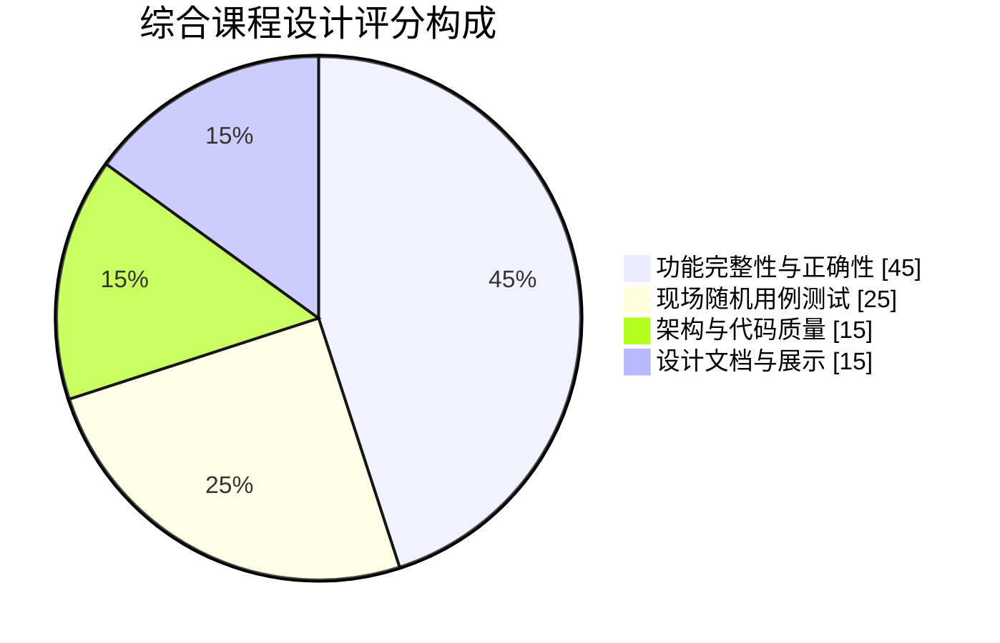
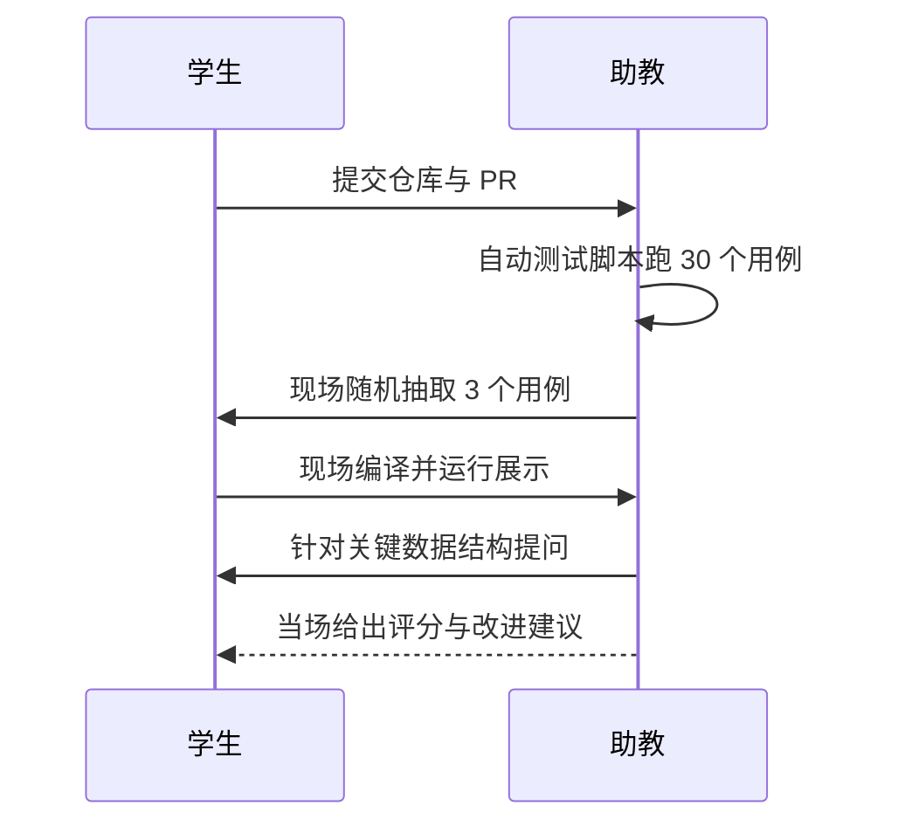

# 综合课程设计

## 一、设计目标

把实验一至实验七的产物整合成一个**完整的、可独立运行的编译器**，
从 MiniC 源程序一路生成可执行的目标汇编，并接受现场随机用例测试。


## 二、交付物

| 序号 | 交付物 | 说明 |
| --- | --- | --- |
| 1 | 完整源码 | 一条命令可构建：`./build.sh` |
| 2 | 统一驱动 | 单一可执行文件，支持全部 `--dump-*` 开关 |
| 3 | 测试集 | ≥ 30 个 `.mc` 用例，含期望输出与运行结果 |
| 4 | 设计文档 | `DESIGN.md`：整体架构、模块接口、关键设计决策 |
| 5 | 演示脚本 | `demo.sh`：一键跑完整编译流程 |
| 6 | 答辩幻灯片 | 10–15 页，覆盖架构、亮点与不足 |

## 三、统一驱动接口

课程组要求的命令行接口（**必须**全部支持）：

```bash
./mycompiler [选项] <源文件>

选项：
  --dump-tokens    输出词法单元流
  --dump-ast       输出抽象语法树
  --dump-symtab    输出符号表
  --dump-ir        输出四元式中间代码
  --dump-ir --opt  输出优化后的四元式
  --dump-asm       输出目标汇编代码
  -O0 / -O1        优化等级
  -o <file>        指定输出文件
  -h, --help       显示帮助
```

:::tip 关于统一接口
接口是自动测试的前提。助教会用统一脚本调用你的编译器，
因此**参数名称必须逐字符一致**，否则该部分记为 0 分。
:::

## 四、评分构成



| 项目 | 分值 | 评分要点 |
| --- | --- | --- |
| 功能完整性与正确性 | 45 | 七个阶段是否全部打通；测试集通过率 |
| 现场随机用例测试 | 25 | 助教当场给出用例，能否正确编译并运行 |
| 架构与代码质量 | 15 | 模块解耦、接口清晰、无大量重复代码 |
| 设计文档与展示 | 15 | 文档完整度、幻灯片逻辑、答辩表达 |

## 五、验收流程



## 六、时间安排

| 周次 | 里程碑 | 交付 |
| --- | --- | --- |
| 第 12 周 | 模块整合 | 统一驱动跑通实验一至四 |
| 第 13 周 | 打通后端 | 简单程序可生成并运行汇编 |
| 第 14 周 | 优化接入 | `-O1` 可显著减少指令数且结果不变 |
| 第 15 周 | 测试完善 | 30 个用例全部通过，文档初稿 |
| 第 16 周 | 答辩 | 幻灯片 + 现场演示 |

## 七、加分项

1. 实现完整的**图着色寄存器分配**并给出与线性扫描的对比数据；
2. 支持**自定义扩展语言特性**（如 `struct` 嵌套、多维数组），并有测试覆盖；
3. 提供 **Web 版编译器演示**（浏览器内编译并展示各阶段产物）；
4. 单元测试覆盖率 ≥ 70%，并接入 CI 自动运行。

## 八、常见扣分点

- 编译器遇到非法输入直接崩溃，而不是给出错误信息；
- 统一驱动接口参数名不一致，导致自动测试无法调用；
- 只在"自己写的用例"上正确，换一个用例就出错；
- 文档只有截图没有设计说明，无法解释关键取舍；
- 代码中留有大量注释掉的旧实现与调试输出。
