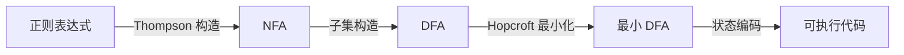
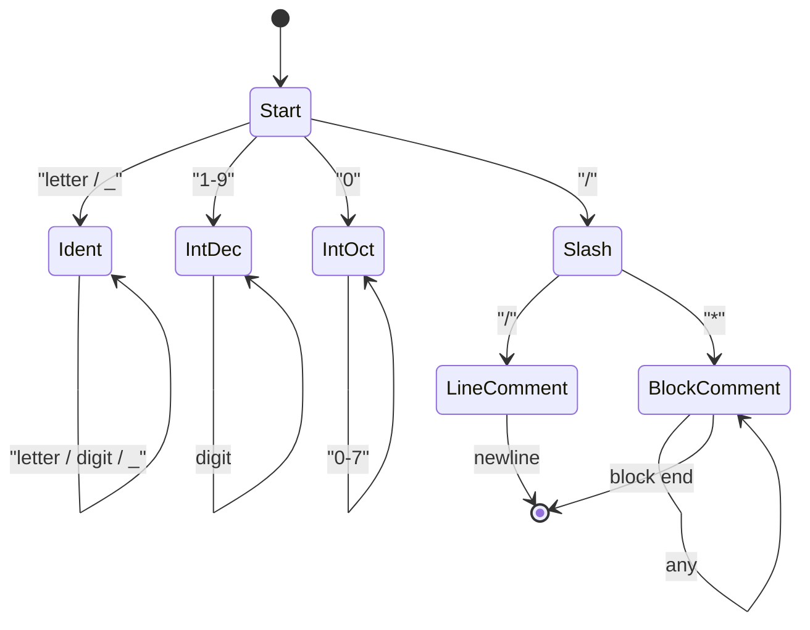

# 实验一 · 词法分析器

## 一、实验目的

1. 理解词法分析在编译流程中的位置与职责；
2. 掌握正则表达式到有限自动机的转换方法；
3. 实现一个能报告行列位置、支持最长匹配的词法分析器；
4. 建立"错误恢复而非崩溃"的工程习惯。

## 二、实验原理

词法分析器（Scanner / Lexer）把字符流转换为记号流。其理论基础是
**正则表达式 ≡ NFA ≡ DFA** 的等价性：



### 最长匹配

扫描器在每个状态下持续读入字符直到无法继续，然后回退到最后一个接受状态。
这正是"最长匹配 + 优先级"策略的实现方式：



:::info 为什么用 DFA 而不是直接写 if-else
对小语言两者等价；但当关键字与运算符增多时，状态驱动的写法更易验证正确性。
本实验允许任意实现方式，只要求通过测试集。
:::

## 三、实验要求

### 基本要求

1. 支持 [ToyC 词法约定](../reference/grammar.md) 中的**全部**记号类别；
2. 支持 ToyC 规定的十进制整数；
3. 正确处理单行注释与块注释（块注释不可嵌套）；
4. 每个 Token 记录**行号与列号**（均从 1 开始）；
5. 输出格式遵循 `<类别, 行号, 列号, "字面量">`。

### 进阶要求

6. 输出同时保留原始字面量与规范化语义值；
7. 关键字与标识符共用一张表，通过哈希查表区分。

## 四、数据结构设计

```cpp
enum class TokenType {
  KwInt, KwVoid, KwIf, KwElse, KwWhile,
  KwBreak, KwContinue, KwReturn,
  Identifier, Number,
  Plus, Minus, Star, Slash, Percent,
  Assign, Eq, Ne, Lt, Le, Gt, Ge, And, Or, Not,
  LParen, RParen, LBrace, RBrace, Semicolon, Comma,
  Eof, Error
};

struct Token {
  TokenType type;
  std::string lexeme;   // 原始字面量
  int line{1};
  int column{1};
};
```

## 五、关键算法

```text
scan_token():
    skip_whitespace_and_comments()
    start_line, start_col = current position
    c = peek()

    if end of input:                 return Token(Eof)
    if isalpha(c) or c == '_':       return scan_identifier_or_keyword()
    if isdigit(c) or (c == '-' and isdigit(peek_next())):
                      return scan_number()

    for op in operators_by_length_desc:   # 先试长运算符
        if match(op):                return Token(op)

    advance()
    report_error(start_line, start_col, "unexpected character")
    return Token(Error)
```

- `scan_number()` 按 ToyC 的十进制整数规则识别 `NUMBER`；
- 遇到非法后缀（如 `123abc`）应报错并**继续扫描**，以便一次报告多个错误。

## 六、测试用例

仓库 `labs/lab1-lexer/tests/` 下应包含至少以下用例：

| 文件名 | 覆盖点 |
| --- | --- |
| `basic.mc` | 关键字、标识符、基本运算 |
| `numbers.mc` | 十进制整数 |
| `comments.mc` | 单行注释、块注释、注释中的记号 |
| `longest.mc` | `a+++b`、`--x` 等最长匹配边界 |
| `errors.mc` | 非法字符、未闭合注释 |

### 输入与期望输出示例

输入 `numbers.mc`：

```c
int x = 42;
```

期望输出：

```text
<INT, 1, 1, "int">
<ID, 1, 5, "x">
<ASSIGN, 1, 7, "=">
<NUMBER, 1, 9, "42">
<SEMI, 1, 11, ";">
<ASSIGN, 2, 9, "=">
<FLOAT_LIT, 2, 11, "1.0e-5">
<SEMI, 2, 17, ";">
<EOF, 3, 1, "">
```

## 七、思考题

1. 若块注释允许嵌套，DFA 需要增加什么？为什么用一个计数器就够了？
2. 列号在遇到制表符时应该按 1 还是按 8 推进？两种做法各有什么影响？
3. 用子集构造法从你写的正则描述自动生成 DFA，代码量会变多还是变少？为什么？
4. 如果语言允许标识符包含 Unicode 字符，你的 DFA 需要怎样修改？

## 八、提交要求

```text
labs/lab1-lexer/
├── src/           # 源代码
├── tests/         # 上表中的测试用例
├── build.sh       # 或 Makefile
├── report.md      # 实验报告
└── README.md      # 构建与运行说明
```
