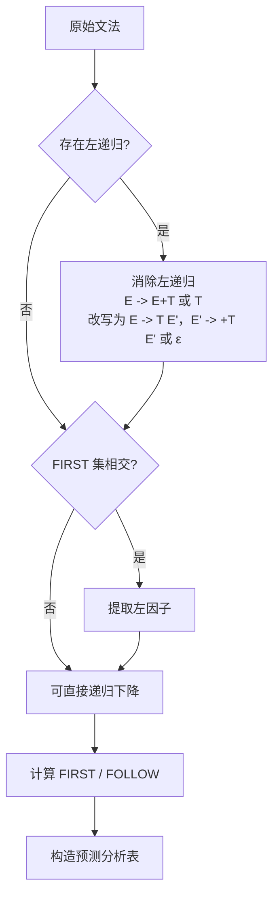

# 实验二 · 语法分析：递归下降与 LL(1)

## 一、实验目的

1. 理解上下文无关文法与推导的概念；
2. 掌握消除左递归与提取左因子的方法；
3. 会计算 FIRST 集与 FOLLOW 集；
4. 实现递归下降解析器，并构造非递归的 LL(1) 预测分析表。

## 二、实验原理

### 自顶向下分析的两个障碍



### FIRST 与 FOLLOW 的递归计算

```text
FIRST(α):
    if α 以终结符 a 开头:            return { a }
    if α = ε:                        return { ε }
    if α = X β:
        F = FIRST(X) - { ε }
        if ε ∈ FIRST(X):  F = F ∪ FIRST(β)
        return F

FOLLOW(A):
    FOLLOW(S) ⊇ { $ }                # $ 为输入结束符
    for each 产生式 B -> α A β:
        FOLLOW(A) ⊇ FIRST(β) - { ε }
        if ε ∈ FIRST(β):  FOLLOW(A) ⊇ FOLLOW(B)
    重复上述过程直到所有集合不再变化
```

### 预测分析表

对每条产生式 `A -> α`：

1. 对每个 `a ∈ FIRST(α) - {ε}`，令 `M[A][a] = A -> α`；
2. 若 `ε ∈ FIRST(α)`，对每个 `b ∈ FOLLOW(A)`，令 `M[A][b] = A -> α`；
3. 若某个单元格被写入两次，说明该文法**不是 LL(1)**。

## 三、实验要求

### 基本要求

1. 读入 [MiniC 文法](../reference/grammar.md) 中 `Expr` 及其下所有产生式；
2. 消除左递归并输出改写后的文法；
3. 计算并输出每个非终结符的 FIRST 与 FOLLOW 集；
4. 构造预测分析表，检测并报告冲突单元格；
5. 实现**递归下降解析器**，对合法输入输出语法树，对非法输入给出错误位置。

### 进阶要求

6. 实现**表驱动的非递归 LL(1) 分析器**（显式栈），并输出分析过程表；
7. 支持基本的错误恢复：跳过记号直到遇到 `FOLLOW` 集中的元素后继续。

## 四、输出约定

### 语法树（S-表达式形式）

```text
(AddExpr (MulExpr (PrimaryExpr a)) (MulExpr (PrimaryExpr b)))
```

### 分析过程表

| 步骤 | 分析栈（栈顶在右） | 剩余输入 | 动作 |
| --- | --- | --- | --- |
| 1 | `$ Expr` | `a + b $` | 用 `Expr -> AddExpr` |
| 2 | `$ AddExpr` | `a + b $` | 用 `AddExpr -> MulExpr AddExpr'` |
| 3 | `$ AddExpr' MulExpr` | `a + b $` | 用 `MulExpr -> PrimaryExpr` |
| 4 | `$ AddExpr' PrimaryExpr` | `a + b $` | 匹配 `a` |

## 五、关键算法：递归下降骨架

```cpp
// 对应 E -> T E',  E' -> + T E' | ε
AstNode* parse_add_expr() {
  AstNode* left = parse_mul_expr();
  while (check(TokenType::Plus) || check(TokenType::Minus)) {
    Token op = advance();
    AstNode* right = parse_mul_expr();
    left = make_binary(op.type, left, right);
  }
  return left;
}

// 对应 U -> ! U | P，右递归天然适合递归下降
AstNode* parse_unary_expr() {
  if (check(TokenType::Not) || check(TokenType::Minus)) {
    Token op = advance();
    return make_unary(op.type, parse_unary_expr());
  }
  return parse_postfix_expr();
}
```

:::tip 左递归与迭代的对应关系
`E -> T E'`、`E' -> + T E' | ε` 这种"左递归消成右递归"的形态，
在递归下降中通常直接写成 `while` 循环，既省栈又更直观。
:::

## 六、测试用例

| 用例 | 输入 | 考察点 |
| --- | --- | --- |
| `precedence.mc` | `a + b * c` | 优先级正确（应为 `a + (b*c)`） |
| `assoc.mc` | `a - b - c` | 左结合 |
| `paren.mc` | `(a + b) * c` | 括号提升优先级 |
| `unary.mc` | `!!a + -b` | 一元运算符右结合 |
| `nested.mc` | `f(g(a), h(b))` | 函数调用嵌套 |
| `bad.mc` | `a + * b` | 错误恢复与报错位置 |

## 七、思考题

1. 为什么左递归会导致递归下降无限循环？请从"函数调用自身前未消耗输入"的角度解释。
2. `a - b - c` 用右递归改写后为什么还要在循环中处理？请画出两种解析结果的区别。
3. 提取左因子会引入 ε 产生式，这对 FOLLOW 集有什么影响？
4. 举一个 FIRST/FIRST 冲突的例子，说明为什么它不是 LL(1)。

## 八、提交要求

```text
labs/lab2-parser/
├── src/
├── tests/
├── build.sh
├── report.md      # 需包含改写后的文法、FIRST/FOLLOW 表、预测分析表
└── README.md
```
