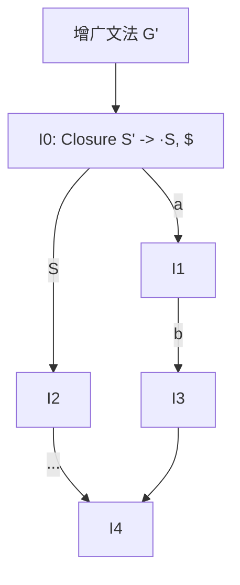

# 实验三 · 语法分析：LR 分析

## 一、实验目的

1. 理解自底向上分析与规范归约的概念；
2. 掌握 LR(0) 项目、闭包（Closure）与 GOTO 函数的计算；
3. 能构造 LR(0) / SLR(1) / LALR(1) 分析表并识别冲突；
4. 实现一个表驱动的 LR 分析器。

## 二、实验原理

### 项目与项目集规范族

LR 分析的核心是**项目**（产生式加一个圆点，表示已识别的部分）：

```text
E -> E · + T     移进项目：期待读入 '+'
E -> E + T ·     归约项目：可以按 E -> E + T 归约
E -> E · + T,  E -> T ·   归约-移进冲突
```



### 构造流程

```text
1. 增广文法：新增 S' -> S，使接受动作唯一
2. I0 = CLOSURE({ S' -> ·S })
3. 对每个项目集 I 与每个文法符号 X：
       J = GOTO(I, X) = CLOSURE({ A -> αX·β | A -> α·Xβ ∈ I })
4. 重复直到不再产生新的项目集
5. 根据项目集与 GOTO 填表：
       ACTION[I, a]  = 移进 / 归约 / 接受 / 出错
       GOTO[I, A]    = J
```

### 三种文法的区分

| 文法 | 项目集 | 归约条件 | 冲突能力 |
| --- | --- | --- | --- |
| LR(0) | LR(0) 项目 | 任何输入符号都归约 | 最弱，冲突多 |
| SLR(1) | LR(0) 项目 | 仅当输入 ∈ FOLLOW(A) 时归约 | 中等 |
| LALR(1) | 合并同心集 | 仅当输入 ∈ 该状态下的展望符 | 较强，表较小 |
| LR(1) | LR(1) 项目（含展望符） | 展望符精确匹配 | 最强，表最大 |

:::warning 同心项目集合并
把 LR(1) 的同心项目集合并为 LALR(1) 时，可能引入新的归约-归约冲突
（不会引入移进-归约冲突）。报告中必须说明合并后是否产生冲突。
:::

## 三、实验要求

### 基本要求

1. 从文法文件读入产生式，自动完成增广；
2. 计算并输出 CLOSURE 与 GOTO；
3. 输出 LR(0) 项目集规范族（每个项目集列出其全部项目）；
4. 构造 ACTION / GOTO 表，输出为可读表格；
5. 检测并报告所有冲突（移进-归约、归约-归约），指出所在状态与符号；
6. 实现 LR 分析驱动程序，输出分析过程（状态栈、符号栈、剩余输入、动作）。

### 进阶要求

7. 同时实现 SLR(1) 与 LALR(1) 两种表的构造，输出规模对比（状态数、表项数）；
8. 用一个"SLR 有冲突但 LALR 无冲突"的文法验证第 7 点的效果。

## 四、分析过程输出示例

对输入 `a + b $`：

| 步骤 | 状态栈 | 符号栈 | 输入 | 动作 |
| --- | --- | --- | --- | --- |
| 1 | `0` | | `a + b $` | 移进，转到 3 |
| 2 | `0 3` | `a` | `+ b $` | 按 `T -> a` 归约 |
| 3 | `0 2` | `T` | `+ b $` | 移进，转到 5 |
| 4 | `0 2 5` | `T +` | `b $` | 移进，转到 3 |
| 5 | `0 2 5 3` | `T + b` | `$` | 按 `T -> b` 归约 |
| 6 | `0 2 5 7` | `T + T` | `$` | 按 `E -> E + T` 归约 |
| 7 | `0 1` | `E` | `$` | 接受 |

## 五、关键算法

```text
closure(I):
    repeat:
        for each item [A -> α · B β, a] in I:
            for each production B -> γ:
                for each b in FIRST(β a):
                    add [B -> · γ, b] to I
    until I stops changing
    return I

goto(I, X):
    J = { [A -> α X · β, a] | [A -> α · X β, a] ∈ I }
    return closure(J)
```

实现提示：用 `(产生式编号, 圆点位置, 展望符)` 作为项目集元素的哈希键，
项目集本身用排序后的元素列表做规范化，便于判重与合并同心集。

## 六、测试用例

| 用例 | 文法 | 考察点 |
| --- | --- | --- |
| `expr_grammar.txt` | 含 `+ *` 的表达式文法 | SLR 表构造无冲突 |
| `slr_conflict.txt` | 经典的 `S -> L = R \| R` 文法 | SLR 冲突、LALR 可解 |
| `lr1_only.txt` | 需要 LR(1) 才能分析的文法 | 展示 LALR 合并引入的冲突 |
| `reduce_reduce.txt` | 含归约-归约冲突的文法 | 冲突检测与报告 |

## 七、思考题

1. 为什么 LR(1) 的展望符可以沿 GOTO 传递？请说明 `FIRST(βa)` 中 `a` 的来源。
2. 同心项目集合并为什么不会引入移进-归约冲突？
3. SLR 用 FOLLOW(A) 作为归约条件，比 LR(1) 的展望符"粗糙"在哪里？
4. 一个文法的 LALR(1) 表与 LR(1) 表状态数相差多少？构造一个差距最大的例子。

## 八、提交要求

```text
labs/lab3-parser-lr/
├── src/
├── tests/
├── build.sh
├── report.md      # 需包含项目集规范族、ACTION/GOTO 表、冲突分析
└── README.md
```
