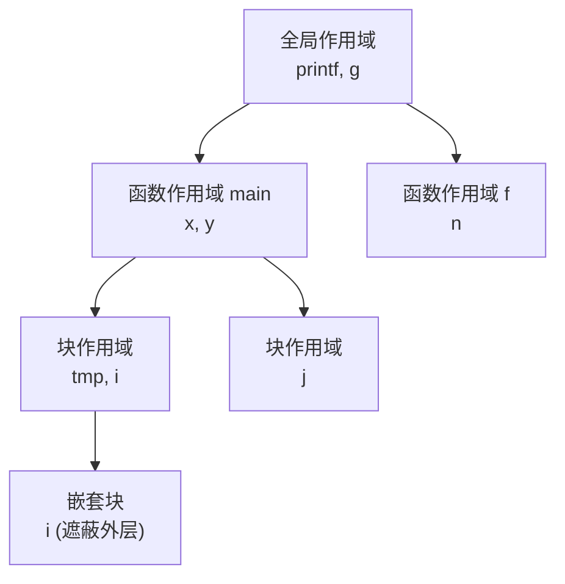

# 实验四 · 语义分析与符号表

## 一、实验目的

1. 理解符号表在编译过程中的桥梁作用；
2. 掌握作用域栈的组织方式与名字解析规则；
3. 实现类型系统与类型检查；
4. 能为非法程序给出准确的语义错误信息。

## 二、实验原理

### 符号表的作用域组织



查找规则：从当前作用域向外逐层查找，**首次命中即返回**；
进入块时压入新表，离开块时弹出。

### 语义规则清单

| 规则 | 说明 | 错误示例 |
| --- | --- | --- |
| 声明先于使用 | 名字必须先声明 | `x = 1; int x;` |
| 禁止重复声明 | 同一作用域内不可重名 | `int a; float a;` |
| 类型匹配 | 赋值、运算、返回值的类型兼容 | `int * float` 赋值给 `int` |
| 函数调用一致 | 实参个数、类型、返回类型 | `f(1, 2)` 但 `f` 只接受 1 个参数 |
| 左值检查 | 赋值左侧必须是可寻址对象 | `1 = x;` |
| 控制流 | `break`/`continue` 必须在循环内 | 循环外的 `break` |
| 返回值 | 非 void 函数必须有返回 | `int f() { }` |

## 三、实验要求

### 基本要求

1. 实现作用域符号表，支持嵌套作用域与名字遮蔽；
2. 在语法树上做一遍**遍历式**语义检查，输出错误列表（不要遇到第一个错误就退出）；
3. 为每个表达式节点标注类型（`int` / `float` / `void` / 数组 / 指针）；
4. 实现隐式类型转换规则：`int` 可提升为 `float`，反之需显式转换；
5. 每条错误信息包含**行列号 + 错误类别 + 具体原因**。

### 进阶要求

6. 输出带类型标注的 AST（可用于实验五的中间代码生成）；
7. 支持常量折叠的语义检查（如数组下标必须是编译期常量）。

## 四、数据结构设计

```cpp
struct Symbol {
  std::string name;
  Type type;
  SymbolKind kind;      // Variable / Function / Parameter / Constant
  int scope_level;
  int line_declared;
  bool initialized{false};
  bool is_constant{false};
  // 函数专用
  std::vector<Type> param_types;
  Type return_type;
};

class ScopeStack {
public:
  void enter_scope();
  void leave_scope();
  bool declare(const Symbol& sym, std::string* err);
  const Symbol* lookup(const std::string& name) const;  // 自内向外
  const Symbol* lookup_current(const std::string& name) const;
private:
  std::vector<std::unordered_map<std::string, Symbol>> scopes_;
};
```

:::tip 数组与指针的类型表示
建议把 `Type` 设计为递归结构（`base` + `dimensions`），
而不是为每种数组类型建一个独立的枚举值。
:::

## 五、错误的输出格式

```text
semantic error at line 8, column 3: redeclaration of 'x' (previously declared at line 5)
semantic error at line 12, column 7: assignment to non-lvalue '1'
semantic error at line 15, column 10: too many arguments to 'f' (expected 1, got 2)
semantic error at line 21, column 1: missing return statement in function 'g' returning int
```

程序退出码为 `1`（存在错误）或 `0`（通过）。

## 六、测试用例

| 用例 | 输入特点 | 期望 |
| --- | --- | --- |
| `shadow.mc` | 内层块遮蔽外层同名变量 | 通过，且引用解析到内层 |
| `redeclare.mc` | 同作用域重复声明 | 报 redeclaration |
| `undeclared.mc` | 使用未声明变量 | 报 undeclared identifier |
| `type_mismatch.mc` | `float` 赋给 `int` 指针 | 报类型不兼容 |
| `bad_call.mc` | 实参个数不符 | 报 too many/few arguments |
| `break_outside.mc` | 循环外 `break` | 报 break outside loop |

## 七、思考题

1. 名字遮蔽会不会带来"无法访问外层变量"的问题？其他语言怎么解决？
2. 为什么数组下标为变量时不能直接折叠？编译期常量的判定边界在哪里？
3. 若把符号表实现为单一哈希表 + 作用域编号（而非栈），查找逻辑如何变化？
4. 结构化异常（C++ 的 `try/catch`）会给作用域分析带来什么额外复杂度？

## 八、提交要求

```text
labs/lab4-semantic/
├── src/
├── tests/
├── build.sh
├── report.md      # 需包含符号表结构图与语义规则表
└── README.md
```
