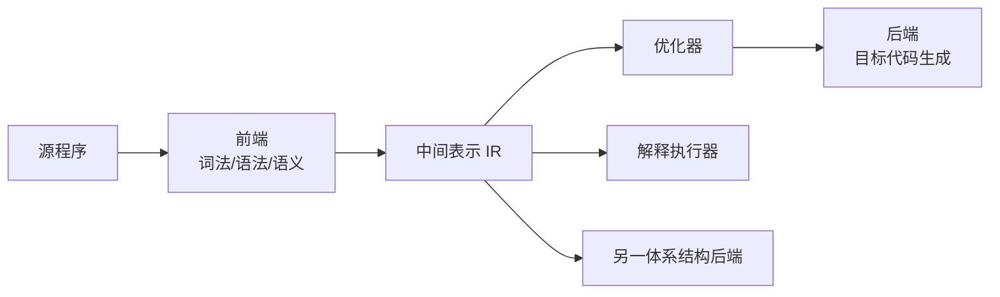
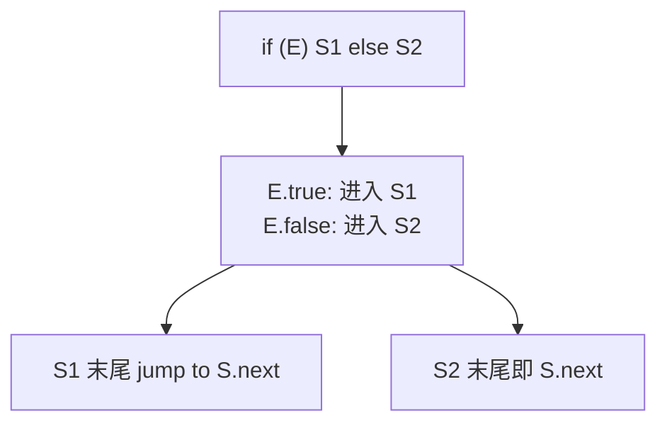

# 实验五 · 中间代码生成

## 一、实验目的

1. 理解中间表示（IR）在编译器中的解耦作用；
2. 掌握三地址码 / 四元式的生成方法；
3. 能用**回填（backpatching）** 技术翻译布尔表达式与控制流；
4. 为后续优化与目标代码生成提供统一输入。

## 二、实验原理

### 为什么需要中间代码



前端只需关心"语言 → IR"，后端只需关心"IR → 指令"，`m` 种源语言与 `n` 种
目标机器只需 `m + n` 个工作量，而不是 `m × n`。

### 四元式

每条指令形如 `(op, arg1, arg2, result)`：

```text
(*, c, d, t1)
(+, b, t1, t2)
(=, t2, _, a)
```

### 控制流的翻译与回填



回填的核心思想：**先生成跳转指令但把目标地址留空，等目标确定后再填入**。

```text
E -> E1 || E2:
    E1.false = E2 的起始位置

E -> E1 && E2:
    E1.true  = E2 的起始位置
```

## 三、实验要求

### 基本要求

1. 输入为实验四输出的带类型标注 AST；
2. 生成四元式序列，覆盖：算术/关系/逻辑运算、赋值、`if/else`、`while`、`for`、
   函数调用、`return`、数组下标访问；
3. 使用**临时变量**存放中间结果，命名形如 `t0, t1, t2 ...`；
4. `&&` 与 `||` 必须实现**短路求值**；
5. 输出格式为 `(op, arg1, arg2, result)`，每行一条。

### 进阶要求

6. 使用基本块与控制流图组织四元式（为实验六铺路）；
7. 实现 `break` / `continue` 的跳转目标回填。

## 四、输出示例

### 赋值与算术

输入：

```c
a = b + c * d;
```

输出：

```text
(*, c, d, t0)
(+, b, t0, t1)
(=, t1, _, a)
```

### 条件语句

输入：

```c
if (a < b) x = 1; else x = 2;
```

输出：

```text
(<, a, b, t0)
(jf, t0, _, L1)
(=, 1, _, x)
(j, _, _, L2)
L1:
(=, 2, _, x)
L2:
```

### 短路求值

输入：

```c
if (a > 0 && b > 0) x = 1;
```

输出：

```text
(>, a, 0, t0)
(jf, t0, _, L2)      // 短路：a <= 0 时直接跳过
(>, b, 0, t1)
(jf, t1, _, L2)
(=, 1, _, x)
L2:
```

### 循环

```text
while (c) S   ==>   L1: (jf, c, _, L2)
                         S 的四元式
                         (j, _, _, L1)
                    L2:
```

## 五、关键算法：回填

```cpp
struct BackpatchList {
  std::vector<int> instr_indices;   // 待填目标地址的指令下标

  BackpatchList& merge(const BackpatchList& other) {
    instr_indices.insert(instr_indices.end(),
                         other.instr_indices.begin(), other.instr_indices.end());
    return *this;
  }

  void patch(const std::string& target) {
    for (int idx : instr_indices) quad[idx].result = target;
    instr_indices.clear();
  }
};
```

翻译 `||` 时的伪代码：

```text
translate(E1 || E2):
    E1.false = new_backpatch_list()      // 还不知道跳去哪
    translate(E1)
    E1.false.patch(current_position())   // E2 的起始位置已确定
    translate(E2)
    E.true  = E1.true.merge(E2.true)
    E.false = E2.false
```

:::tip 临时变量的作用
把 `b + c * d` 拆成两条四元式，保证"每条指令只做一次运算"，
后端做指令选择和寄存器分配时就不必再处理嵌套表达式。
:::

## 六、测试用例

| 用例 | 输入特点 | 考察点 |
| --- | --- | --- |
| `arith.mc` | 多层括号的算术表达式 | 临时变量顺序与优先级 |
| `if_else.mc` | 嵌套 `if/else` | 跳转回填正确 |
| `short_circuit.mc` | `a && b \|\| c` | 短路求值 |
| `loops.mc` | `while` + `break` + `continue` | 跳转目标 |
| `array.mc` | `a[i] = a[j] + 1` | 下标地址计算 |
| `call.mc` | 函数调用与参数传递 | 参数四元式 |

## 七、思考题

1. 为什么短路求值必须依赖回填？顺序求值能不能直接用 `(&&, a, b, t)`？
2. 如果 `||` 的右操作数包含副作用（如 `f()`），短路语义为何仍然正确？
3. 四元式与三地址码在存储上的差别是什么？各适合什么场景？
4. 把四元式组织为基本块后，跳转指令的目标为何必须是块首？

## 八、提交要求

```text
labs/lab5-ir/
├── src/
├── tests/         # 输入 .mc 与期望 .quad
├── build.sh
├── report.md      # 需包含回填算法说明与基本块划分图
└── README.md
```
