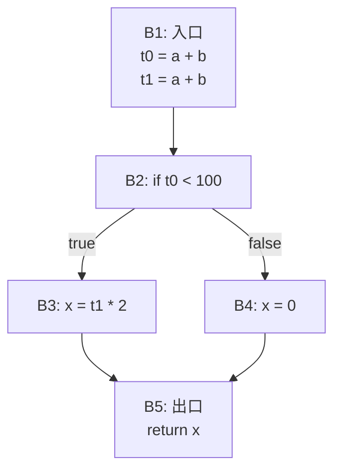

# 实验六 · 代码优化

## 一、实验目的

1. 理解基本块、控制流图与数据流分析的概念；
2. 掌握常量传播、公共子表达式消除、死代码消除等经典优化；
3. 会用**迭代法**求解数据流方程（到达定义、活跃变量）；
4. 能定量评估优化的效果并验证语义等价性。

## 二、实验原理

### 基本块与控制流图



**基本块**：只有一个入口（第一条指令）和一个出口（最后一条指令）的最大指令序列。
**控制流图**：以基本块为结点，跳转关系为边。

### 局部优化 vs 全局优化

| 类别 | 范围 | 典型技术 |
| --- | --- | --- |
| 局部优化 | 单个基本块内 | 常量折叠、常量传播、公共子表达式消除、死代码消除 |
| 全局优化 | 跨基本块 | 全局公共子表达式消除、循环不变代码外提、强度削弱 |
| 循环优化 | 循环结构 | 循环展开、归纳变量消除、循环不变量外提 |

### 活跃变量分析

数据流方程（**后向**分析）：

```text
out[B] = ∪ over 后继 S of B:  in[S]
in[B]  = use[B] ∪ ( out[B] - def[B] )
```

迭代到所有集合不再变化即达到不动点。

活跃变量分析沿**逆序**（从出口向入口）传播信息：


## 三、实验要求

### 基本要求

1. 输入实验五输出的四元式，划分基本块并输出控制流图；
2. 实现**局部优化**：
   - 常量折叠（`2 + 3` → `5`）
   - 常量传播（`a = 5; b = a + 1` → `b = 6`）
   - 公共子表达式消除（同一块内重复计算）
   - 死代码消除（结果从未被使用的赋值）
3. 输出优化前后的四元式序列与指令条数对比；
4. 保证优化前后程序**运行结果完全一致**。

### 进阶要求

5. 实现全局公共子表达式消除（需到达定义分析 + 可用表达式）；
6. 实现循环不变代码外提；
7. 输出优化对测试集指令数的总体下降比例。

## 四、输出示例

### 常量折叠与传播

优化前：

```text
(=, 2, _, a)
(+, a, 3, t0)
(*, t0, 4, t1)
(=, t1, _, b)
```

优化后：

```text
(=, 2, _, a)
(+, 2, 3, t0)        // 常量传播
(=, 5, _, t0)        // 常量折叠
(=, 20, _, b)        // 继续传播并折叠
```

### 公共子表达式消除

优化前：

```text
(+, a, b, t0)
(*, t0, 2, t1)
(+, a, b, t2)
(*, t2, 3, t3)
```

优化后：

```text
(+, a, b, t0)
(*, t0, 2, t1)
(*, t0, 3, t3)       // t2 被消除，直接复用 t0
```

:::warning 优化的正确性前提
只有在**没有副作用**且**变量在两次使用之间未被重定义**时，
才能复用已计算的表达式。请务必在报告中说明你如何检查这两个条件。
:::

## 五、核心数据结构

```cpp
struct BasicBlock {
  std::string label;
  std::vector<Quad> quads;
  std::vector<BasicBlock*> successors;
  std::vector<BasicBlock*> predecessors;

  // 数据流分析用
  std::set<std::string> use;      // 本块内先使用后定义的变量
  std::set<std::string> def;      // 本块内定义的变量
  std::set<std::string> in, out;  // 活跃变量
  std::set<Quad> gen, kill;       // 到达定义
};
```

## 六、测试用例

| 用例 | 输入特点 | 考察点 |
| --- | --- | --- |
| `const_fold.mc` | 大量编译期可求值的表达式 | 折叠与传播 |
| `cse.mc` | 重复子表达式跨语句出现 | 公共子表达式消除 |
| `dead_code.mc` | 计算后从未使用的临时变量 | 死代码消除 |
| `loop_invariant.mc` | 循环体内不变的表达式 | 循环不变量外提 |
| `no_regression.mc` | 含副作用（函数调用） | 优化不得越界 |

### 等价性验证方法

对每个用例，分别用未优化和优化后的程序运行，比对输出：

```bash
./compiler --dump-ir input.mc > before.quad
./compiler --dump-ir --opt input.mc > after.quad
diff before.quad after.quad          # 期望：内容变化
./run before.quad > out1.txt
./run after.quad  > out2.txt
diff out1.txt out2.txt               # 期望：完全一致
```

## 七、思考题

1. 为什么到达定义是前向分析，而活跃变量是后向分析？两者的初始值如何设定？
2. 迭代法一定收敛吗？请给出一个数据流分析必须满足的数学条件。
3. 循环不变代码外提在什么情况下是**不安全的**？（提示：考虑循环可能执行 0 次）
4. 常量传播在存在函数调用时为什么容易失效？如何改进？

## 八、提交要求

```text
labs/lab6-optimize/
├── src/
├── tests/
├── build.sh
├── report.md      # 需包含控制流图、数据流方程、优化前后指令数对比表
└── README.md
```
