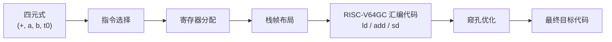
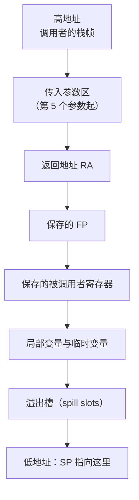
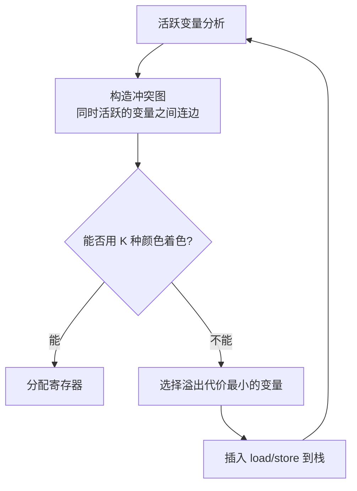

# 实验七 · 目标代码生成

## 一、实验目的

1. 理解后端在编译流程中的职责与输入输出边界；
2. 掌握指令选择、寄存器分配与栈帧布局三项核心技术；
3. 会用线性扫描或图着色做寄存器分配，并正确处理溢出；
4. 能生成在模拟器/真实机器上正确运行的汇编代码。

## 二、实验原理

### 从中间代码到机器指令



### 栈帧布局

以 RISC-V64GC 为例，函数调用时的栈帧自高地址向低地址生长：



### 寄存器分配



## 三、实验要求

### 基本要求

1. 目标架构固定为 **RISC-V64GC**，不得生成 RISC-V32、MIPS32 或 x86-64 代码；
2. 实现覆盖全部四元式算子的指令选择；
3. 实现寄存器分配：
   - 至少实现**线性扫描**；鼓励实现**图着色 + 溢出**；
   - 必须正确处理"活跃区间重叠"导致的冲突；
4. 实现栈帧布局，明确 `SP`/`FP` 的维护约定；
5. 遵守目标架构的调用约定（参数传递、返回值、被调用者保存寄存器）；
6. 生成的汇编可直接交给支持 RV64GC 的 Linux 交叉工具链汇编和链接执行；
7. 对 ToyC 运行时库中的 `getint()` 与 `putint(int)` 生成外部函数调用，
  并通过静态链接加入 `libtoyc.a`。

### 进阶要求

7. 实现窥孔优化：合并相邻的 `lw`/`sw`、删除 `add x, x, 0`、消除紧邻的冗余存取；
8. 输出**分配前后的指令条数**与**溢出次数**统计。

## 四、输出示例

输入四元式：

```text
(+, a, b, t0)
(=, t0, _, c)
```

生成的 RISC-V64GC 汇编（示意）：

```asm
ld    t0, 0(a0)
ld    t1, 0(a1)
add   t2, t0, t1
sd    t2, 0(a2)
```

## 五、关键算法：线性扫描寄存器分配

```text
1. 按活跃区间起点对所有区间排序
2. active = ∅          # 当前占用寄存器的区间
3. free = { 所有可用寄存器 }
4. for each 区间 i in 排序后的区间:
      移除 active 中 end < i.start 的区间，回收其寄存器
      if free 非空:
          分配一个寄存器给 i
      else:
          在 active ∪ { i } 中挑选 end 最大者溢出到栈
          若被溢出者是 i，则不给 i 分配寄存器
          否则把它的寄存器让给 i
```

:::warning 溢出与调用约定
被调用者保存寄存器（RISC-V 的 `s0-s11`）如果在函数内被使用，必须
在序言中压栈、在尾声恢复，否则调用者的值会被破坏。这是最常见的错误来源。
:::

## 六、测试用例

| 用例 | 输入特点 | 考察点 |
| --- | --- | --- |
| `simple.mc` | 单变量算术 | 基本指令选择 |
| `pressure.mc` | 超过寄存器数量的活跃变量 | 溢出处理与溢出槽布局 |
| `calls.mc` | 嵌套函数调用 | 参数传递、RA 保存 |
| `recursion.mc` | 递归（斐波那契） | 栈帧与调用约定 |
| `loops.mc` | 循环求和 | 跳转目标与标号 |
| `arrays.mc` | 数组读写 | 地址计算与访存 |

### 正确性验证流程

```bash
./compiler --dump-asm < input.mc > out.s
riscv64-unknown-elf-gcc -march=rv64gc -mabi=lp64d \
  -nostdlib -static out.s libtoyc.a -o out.elf
echo "exit code: $?"      # 与解释执行四元式的期望结果比对
```

## 七、思考题

1. 为什么寄存器分配必须在指令选择之后、栈帧布局之前？
2. 线性扫描与图着色相比，各在什么场景下更优？为什么现代 JIT 多用线性扫描？
3. 溢出代价函数一般考虑哪些因素？如何避免把循环体内的变量溢出？
4. 窥孔优化为什么只需要滑动一个小窗口就能保证正确性？它有什么理论局限？

## 八、提交要求

```text
labs/lab7-codegen/
├── src/
├── tests/         # 输入 .mc 与期望运行结果
├── build.sh
├── report.md      # 需包含栈帧图、冲突图、溢出统计与优化前后对比
└── README.md
```
