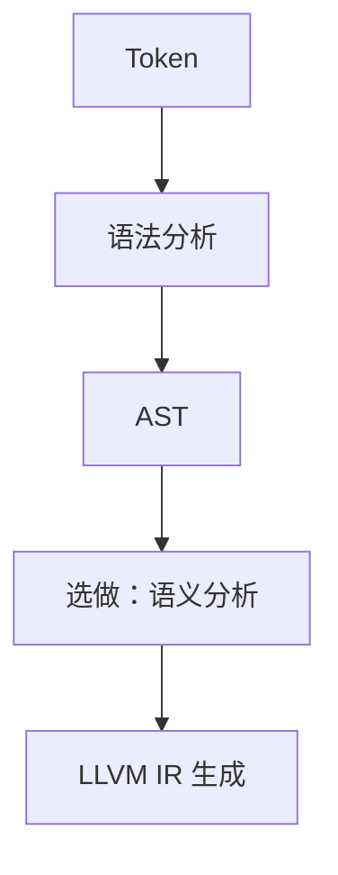
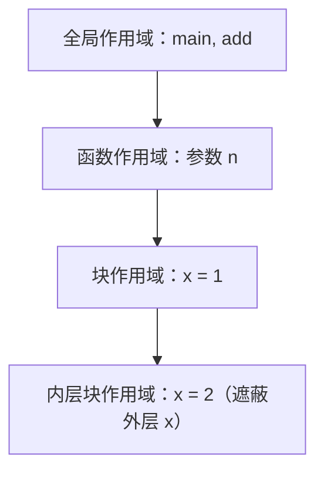

# 选做 · 语义分析

语义分析位于语法分析之后、IR 生成之前。它不改变 AST 的语法结构，而是为 AST 补充符号、类型和控制流信息，并拒绝"语法正确但语义错误"的程序。本部分为选做，不影响第一、第二、第三部分的基本提交要求。



:::tip[先建立直觉]
语法分析只保证程序"写得对"，语义分析才保证程序"讲得通"——变量有没有声明过、类型对不对、`break` 有没有写在循环里，都由它来把关。
:::

## 一、符号表与作用域

符号表至少记录名称、类别、类型、是否为常量、声明位置和 IR 对应值：

```
Symbol {
    name
    kind: variable | constant | parameter | function
    type: int | void
    is_const
    declaration_location
    llvm_value
}

Scope {
    symbols: Map<string, Symbol>
    parent: Scope?
}
```

进入语句块时压入新作用域，离开时弹出；查找名称时从内向外逐层查找。内层作用域可以遮蔽外层同名变量：



离开内层块后，`x` 又指回外层；同一作用域内重复声明同名变量则应报错。

## 二、检查内容

语义分析需要报告的典型错误：

| 类别 | 检查内容 |
| --- | --- |
| 程序结构 | `main` 必须是无参数、返回 `int` 的函数 |
| 函数 | 函数名全局唯一；调用目标存在；调用位置满足声明顺序 |
| 声明 | 变量和形参使用前必须声明；同一作用域不能重名 |
| 常量 | `const int` 必须有初始化表达式；常量不能作为赋值左值 |
| 类型 | `int` / `void` 返回值与 return 匹配；void 调用不能作为条件或右值 |
| 控制流 | `break`、`continue` 只能出现在 while 循环中 |
| 表达式 | 二元运算两侧为 `int`；比较和逻辑表达式结果为 `int`（0/1） |
| 除零 | 除数为编译期常量时不能为零 |
| 返回值 | `int` 函数的所有可能路径都必须返回值 |

## 三、AST 标注

语义分析通过后，可以给节点附加类型和符号引用，让 IR 生成器不必再"猜"名字含义：

```
Variable("x")        -> symbol = x,  type = int,  llvm_value = %x
Call("add", args)    -> function = add,  return_type = int
Binary("<", lhs, rhs)-> type = int,  is_boolean = true
```

## 四、遍历伪代码

记号约定：`=` 表示赋值，`//` 后是注释，注释中英文结合。

**算法 1 · 函数体语义分析（Analyze Function）**

**输入（Input）：** 函数 AST 节点 `fn`。
**输出（Output）：** 完成标注的函数，或报告语义错误。

```
 1: analyzeFunction(fn):
 2:     declareFunctionSignature(fn);              // 登记函数名与签名，检查 main 约定
 3:     enterScope();                               // 进入函数作用域
 4:     for each param p in fn.params do
 5:         if type(p) != int then error("参数只能为 int"); end if
 6:         declare(p.name, kind = parameter, type = int);
 7:     end for
 8:     ctx.loopDepth = 0;
 9:     analyzeBlock(fn.body);
10:     if fn.returnType == int and not returnsOnAllPaths(fn.body) then
11:         error("int 函数必须在所有路径上返回值");       // 见算法 5
12:     end if
13:     leaveScope();
```

**算法 2 · 作用域栈的压入、声明与查找（Scope Stack）**

**输入（Input）：** 当前作用域栈 `scopes`，名称 `name`。
**输出（Output）：** 命中的符号，或报告"未声明 / 重复声明"。

```
 1: enterScope():  scopes.push({});               // 压入新作用域
 2: leaveScope():  scopes.pop();                  // 弹出
 3:
 4: declare(name, sym):
 5:     if scopes.top contains name then
 6:         error("同一作用域重复声明: " + name);     // 同层不能重名
 7:     end if
 8:     scopes.top[name] = sym;
 9:
10: lookup(name):
11:     for scope in reversed(scopes) do              // 由内向外逐层查找
12:         if name in scope then return scope[name]; end if
13:     end for
14:     error("使用了未声明的标识符: " + name);        // 未找到
```

**算法 3 · 变量与常量声明检查（Declaration Check）**

**输入（Input）：** 声明节点 `decl`。
**输出（Output）：** 已登记并完成类型检查的符号。

```
 1: analyzeDecl(decl):
 2:     for each item in decl.items do
 3:         if decl.isConst and item.initializer == none then
 4:             error("const 必须有初始化表达式");      // 常量必须有初值
 5:         end if
 6:         sym = declare(item.name, { type: decl.type, isConst: decl.isConst });
 7:         if item.initializer != none then
 8:             t = analyzeExpr(item.initializer);
 9:             checkType(t, decl.type);                // 类型必须一致
10:         end if
11:     end for
```

**算法 4 · 语句与表达式检查（Statement & Expression Check）**

**输入（Input）：** 语句或表达式节点。
**输出（Output）：** 标注后的类型信息，或报告语义错误。

```
 1: analyzeStmt(stmt):
 2:     match stmt:
 3:         Block(b):        enterScope();  for s in b do analyzeStmt(s); end for  leaveScope();
 4:         Assign(lhs, rhs):
 5:             sym = requireDeclared(lhs.name);
 6:             if sym.isConst then error("常量不能作为赋值左值"); end if
 7:             checkType(analyzeExpr(rhs), sym.type);
 8:         If(c, t, e):
 9:             checkCond(c);  analyzeStmt(t);
10:             if e != none then analyzeStmt(e); end if
11:         While(c, body):
12:             checkCond(c);
13:             ctx.loopDepth++;                        // 进入循环，深度 +1
14:             analyzeStmt(body);
15:             ctx.loopDepth--;                        // 离开循环，深度 -1
16:         Break | Continue:
17:             if ctx.loopDepth == 0 then error("break/continue 只能出现在循环中"); end if
18:         Return(v):
19:             checkType(analyzeExpr(v), ctx.currentFunction.returnType);
20:         ExprStmt(e):     analyzeExpr(e);
21:     end match
22:
23: analyzeExpr(e):
24:     match e:
25:         Call(name, args):
26:             fn = lookupFunction(name);
27:             if fn == none then error("调用未声明的函数: " + name); end if
28:             if fn.returnType == void then error("void 函数不能作为右值"); end if
29:             for a in args do checkType(analyzeExpr(a), int); end for
30:             return fn.returnType;
31:         Number(n):       return int;
32:         Variable(n):     return requireDeclared(n).type;
33:         Binary/Unary:    both sides must be int;  return int;   // 比较/逻辑结果也是 int(0/1)
34:     end match
```

**算法 5 · 所有路径返回值检查（Return-on-All-Paths）**

**输入（Input）：** 语句节点 `node`。
**输出（Output）：** 布尔值，表示该节点是否在所有路径上返回。

```
 1: returnsOnAllPaths(node):
 2:     match node:
 3:         Return(_):    return true;                     // 直接 return
 4:         Block(stmts):
 5:             for s in stmts do
 6:                 if returnsOnAllPaths(s) then return true; end if
 7:             end for
 8:             return false;
 9:         If(c, t, e):
10:             if e == none then return false; end if      // 没有 else，则可能不返回
11:             return returnsOnAllPaths(t) and returnsOnAllPaths(e);
12:         While(_, _):  return false;                     // 循环可能一次都不执行
13:         others:       return false;
14:     end match
```

## 五、提交与验收

选做实现应输出错误位置、错误类别和简短原因，并在报告中给出至少一个合法程序和三个语义错误程序（例如：使用未声明变量、常量被赋值、`break` 出现在循环外）。