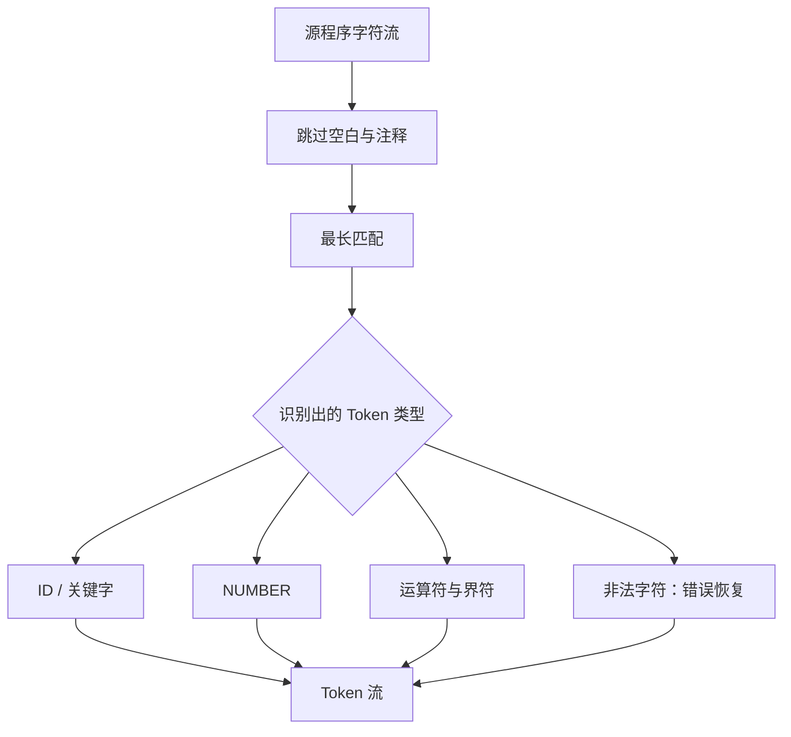
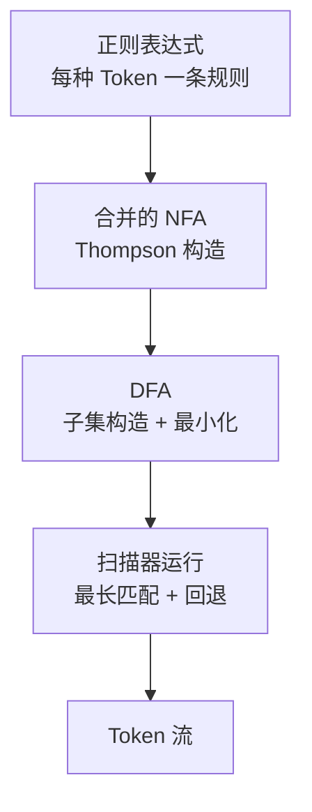
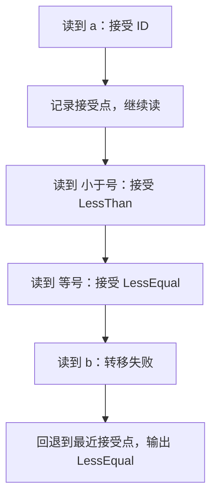

# 第一部分 · 词法分析

## 一、实验目标

词法分析器（lexer，也叫 scanner）是编译器的第一站。它把 ToyC 源程序的字符流切成一个个有意义的词法单元（Token），并记录每个 Token 的类别、字面量和所在位置。

:::tip[先建立直觉]
源程序先被切成一个个"词"，每个词标上类别（标识符、数字、运算符……），再交给下一阶段——这一步就是词法分析。
:::

本部分的产出是 Token 流。每个 Token 至少携带三类信息：

| 信息 | 含义 | 示例 |
| --- | --- | --- |
| 类别 `kind` | Token 的种类 | `ID`、`NUMBER`、`KwInt`、`LessEqual` |
| 字面量 `lexeme` | 原始字符片段 | `main`、`123`、`<=` |
| 位置 `line / column` | 用于报错的源位置 | 第 1 行第 5 列 |



### 为什么需要词法分析？

- **降低复杂度**：让语法分析工作在"Token 序列"而不是"字符序列"上，后续阶段更简单；
- **过滤噪声**：空白、换行、注释在这里被丢弃，后续阶段无需关心；
- **提前报错**：非法字符在词法阶段就能定位到行列，方便错误恢复。

## 二、原理：从正则表达式到 DFA

词法分析的理论基础是有限状态自动机。每种 Token 用一种正则规则描述，整体流程分三步：



1. **正则 → NFA**：把每条正则规则用 Thompson 构造法转成 NFA。正则的连接对应边的串联，选择对应 ε 分支，重复对应回边。
2. **NFA → DFA**：加入一个新的总起点，用 ε 边连接所有规则起点，给接受状态标记 Token 类型和优先级；再用子集构造（ε-closure + move）合并成一个 DFA。
3. **运行 DFA**：从起点出发逐个读字符并转移状态，同时记录"最后一次经过的接受状态"，以实现最长匹配。

:::info[为什么要合成一个 DFA？]
ToyC 有几十条词法规则。如果每条规则各跑一个自动机，就要反复回溯、效率很低。把全部规则合并成一个 DFA，扫描一遍字符流就能同时匹配所有规则，这是词法分析器的标准做法。
:::

## 三、ToyC 词法规则

- `ID`：`[_A-Za-z][_A-Za-z0-9]*`
- `NUMBER`：`-?(0|[1-9][0-9]*)`
- 关键字：`int`、`void`、`const`、`if`、`else`、`while`、`break`、`continue`、`return`
- 运算符：`+ - * / % = == != < > <= >= && || !`
- 界符：`( ) { } ; ,`
- 注释：`//` 到行尾，或 `/* ... */`；空白与注释均忽略。

**关于负号**：`-` 既可以是 `NUMBER` 的一部分（如 `-3`），也可以是取负运算符（如 `a - -b`）。实现时应根据课程约定统一选择一种策略，并在报告中说明；推荐把 `-` 独立为运算符，由语法分析的一元表达式处理，这样词法更简单、语义更清晰。

## 四、实现步骤

下面给出四个核心算法的伪代码。记号约定：`=` 表示赋值，`∅` 表示空集，`//` 后面是注释；注释采用中英文结合，便于对照标准写法。

### 4.1 由正则规则构造 DFA

**算法 1 · 由正则规则构造 DFA（Regex → NFA → DFA）**

**输入（Input）：** 词法规则集合 `R = { (rᵢ, kindᵢ, prioᵢ) }`，其中 `rᵢ` 是正则、`kindᵢ` 是 Token 类型、`prioᵢ` 是匹配优先级。
**输出（Output）：** 合并后的 DFA `D`，以及接受状态到 Token 类型的映射。

```
 1: N = ∅;                                          // 合并后的 NFA / combined NFA
 2: for each rule (rᵢ, kindᵢ, prioᵢ) in R do
 3:     Nᵢ = thompson(rᵢ);                          // 正则 -> NFA，Thompson 构造
 4:     mark_accept(Nᵢ, kindᵢ, prioᵢ);              // 标记接受状态及其优先级
 5:     N = N ∪ Nᵢ;
 6: end for
 7: s0 = new_start_state();                         // 新建总起点
 8: for each Nᵢ in N do
 9:     add_epsilon_edge(s0, start_of(Nᵢ));         // ε 边连接所有规则起点
10: end for
11: D = subset_construction(N);                     // ε-closure + move，直到不再产生新状态
12: D = hopcroft_minimize(D);                       // 可选：Hopcroft 合并等价状态
13: return D;
```

### 4.2 扫描主循环

**算法 2 · 词法扫描主循环（Scanning Driver）**

**输入（Input）：** ToyC 源程序字符流 `S`。
**输出（Output）：** Token 序列 `T`。

```
 1: pos = 0;                                        // 当前扫描下标 / cursor
 2: T = ∅;                                          // 结果 Token 序列
 3: while pos < |S| do
 4:     (tok, pos) = scanToken(S, pos);             // 扫描一个 Token，见算法 3
 5:     if tok.kind == EOF then break; end if       // 文件结束 / end of file
 6:     if tok.kind != ERROR then T = T ∪ {tok}; end if
 7: end while
 8: return T;
```

### 4.3 扫描单个 Token（最长匹配）

**算法 3 · 扫描单个 Token（Longest-Match scanToken）**

**输入（Input）：** 字符流 `S`、当前下标 `pos`。
**输出（Output）：** 下一个 Token 及更新后的 `pos`。

```
 1: (pos, line, col) = skipWhitespaceAndComment(S, pos, line, col);   // 见算法 4
 2: start = pos;
 3: if pos >= |S| then return (EOF, pos); end if      // 输入结束
 4: if isLetter(peek(S, pos)) or peek(S, pos) == '_' then             // 标识符或关键字
 5:     lexeme = scanWhile(S, pos, isIdentifierChar);
 6:     return (keywordTable.lookupOr(lexeme, ID), pos);              // 先扫成 ID，再查关键字表
 7: end if
 8: if isDigit(peek(S, pos)) then                                    // 无符号整数
 9:     lexeme = scanWhile(S, pos, isDigit);
10:     return (Token(NUMBER, value(lexeme)), pos);
11: end if
12: state = dfa_start;  last_accept = none;           // 最后一次接受的位置 / last accepting position
13: while pos < |S| and dfa_step(state, S[pos]) != dead do
14:     state = dfa_step(state, S[pos]);  pos++;
15:     if is_accepting(state) then last_accept = (state, pos); end if   // 记录接受点
16: end while
17: if last_accept != none then                        // 最长匹配：回退到最后接受点
18:     (state, pos) = last_accept;
19:     return (Token(kind_of(state), S[start:pos]), pos);
20: end if
21: report_error(start, "unexpected character " + S[start]);
22: pos++;                                            // 跳过一个非法字符后继续扫描
23: return (ERROR, pos);
```

### 4.4 跳过空白与注释

`skipWhitespaceAndComment` 必须同时更新行列位置：遇到换行时 `line += 1` 并把 `column` 复位为 1，普通字符则递增 `column`。块注释若到文件末尾仍未闭合，应报告注释起始位置，而不是只报告 EOF。

**算法 4 · 跳过空白与注释（skipWhitespaceAndComment）**

**输入（Input）：** 字符流 `S`、当前下标 `pos`、行列 `line / col`。
**输出（Output）：** 跳过空白与注释后的新 `pos / line / col`。

```
 1: while pos < |S| do
 2:     c = S[pos];
 3:     if c == ' ' or c == '\t' then                 // 空白 / whitespace
 4:         pos++;  col++;
 5:     else if c == '\n' then                        // 换行：行号 +1，列号复位
 6:         pos++;  line++;  col = 1;
 7:     else if c == '/' and S[pos+1] == '/' then     // 单行注释 / line comment
 8:         while pos < |S| and S[pos] != '\n' do pos++; end while
 9:     else if c == '/' and S[pos+1] == '*' then     // 块注释 / block comment
10:         comment_start = (line, col);
11:         while pos < |S| and not (S[pos] == '*' and S[pos+1] == '/') do
12:             if S[pos] == '\n' then line++; col = 1; else col++; end if
13:             pos++;
14:         end while
15:         if pos >= |S| then report_error(comment_start, "unterminated comment"); end if
16:         pos += 2;  col += 2;                        // 跳过 */
17:     else
18:         return (pos, line, col);                    // 遇到非空白字符 -> 结束
19:     end if
20: end while
21: return (pos, line, col);
```

### 4.5 最长匹配图解

最长匹配的关键是：即使后面匹配失败，也要回退到最后一次成功接受的位置。以输入 `a<=b` 为例：



| 步骤 | 当前字符 | DFA 动作 | 是否接受 | 记录 |
| --- | --- | --- | --- | --- |
| 1 | `a` | 进入 ID 状态 | 是 | 接受点 = ID(`a`) |
| 2 | `<` | 进入 `<` 状态 | 是 | 接受点 = `<` |
| 3 | `=` | 进入 `<=` 状态 | 是 | 接受点 = `<=` |
| 4 | `b` | 无转移，失败 | — | — |
| 5 | — | 回退到接受点 `<=` | — | 输出 `LessEqual` |

因此扫描器输出 `ID(a)`、`LessEqual(<=)`、`ID(b)`。再看两个例子：

- 输入 `a+++b`：最长匹配依次输出 `a`、`++`、`+`、`b`（`++` 优先于 `+`）；
- 输入 `<=`：遇到 `=` 时必须优先接受更长的 `<=`，而不是更短的 `<`。

### 4.6 Token 数据结构

推荐的数据结构如下：

```
Token {
    kind       // Identifier, KwInt, Number, Plus, LessEqual ...
    lexeme     // 原始字符片段
    line
    column
    value?     // NUMBER 的整数值，关键字和运算符通常为空
}
```

## 五、输入输出规范与统一样例

### 输入形式

- 输入为 ToyC 源代码，从标准输入流读入：

  ```bash
  echo "int a = 1;" | ./compiler --dump-tokens > test.token
  ```

- 本地调试时用文件重定向：

  ```bash
  ./compiler --dump-tokens < test.c > test.token
  ```

:::tip[内部名字与输出名字的对应]
4.x 节的伪代码为了叙述方便，把 Token 类别写成 `ID`、`NUMBER`、`KwInt`、`LessEqual` 这类名字。
内部怎么命名可以自行决定（叫 `ID`、`IDENT` 还是 `TkIdent` 都可以），只要前后一致并在报告中说明即可；
但输出到屏幕上的类型名必须按下面的规定书写，评测程序会逐字符比对：

| 伪代码里的写法 | 输出里的类型名 |
| --- | --- |
| `KwInt`、`KwWhile` … | `'int'`、`'while'` …（关键字原样加单引号） |
| `Plus`、`LessEqual` … | `'+'`、`'<='` …（运算符、界符原样加单引号） |
| `ID` | `Ident` |
| `NUMBER` | `IntConst` |
:::

### 输出形式

每行一个 Token，写到标准输出流；本地调试时用重定向写入文件（例如 `./compiler --dump-tokens < test.c > test.token`），格式为 `<序号>:<类型>:<内容>`：

```text
0:'int':"int"
1:Ident:"main"
2:'(':"("
```

- **序号**：从 `0` 开始，按 Token 出现的先后顺序递增；
- **类型**：关键字、运算符、界符写成该符号本身并加单引号（如 `'int'`、`'<='`、`'('`）；标识符统一写作 `Ident`；十进制整数常量统一写作 `IntConst`；
- **内容**：该 Token 在源程序中的原始文本，用双引号括起来。

空白与注释不产生 Token，所以下面样例输出里的序号是连续的——不会因为空行或注释而跳号。

### 样例输入

下面这个程序在词法分析、语法分析、目标代码生成三部分共用，覆盖了 ToyC 的全部语法成分。
ToyC 不支持全局变量，所以所有声明都写在函数体内。

```c
// ToyC 综合示例：覆盖文法中的全部成分
/* ToyC 不支持全局变量，所有定义都写在函数里 */

int sum(int n, int from) {
    int s = 0;
    while (from <= n) {
        if (from == 2) {
            from = from + 1;
            continue;
        }
        s = s + from;
        from = from + 1;
    }
    return s;
}

void show(int v) {
    putint(v);
    ;
}

int main() {
    const int LIMIT = 3, STEP = 1;
    int a = 5, b;
    b = +a - -1;
    int c = (a + b) * 2 / 3 % 4;
    {
        int a = 1;
        c = c + a;
    }
    if (a >= b && b != 0 || !(a == LIMIT)) {
        c = c + sum(a, STEP);
    } else {
        c = c - 1;
    }
    while (c > 0) {
        c = c - 1;
        if (c == 5) continue;
        if (c < 2) break;
        show(c);
    }
    return c;
}
```

### 样例输出

源程序共 205 个 Token：

```text
0:'int':"int"
1:Ident:"sum"
2:'(':"("
3:'int':"int"
4:Ident:"n"
5:',':","
6:'int':"int"
7:Ident:"from"
8:')':")"
9:'{':"{"
10:'int':"int"
11:Ident:"s"
12:'=':"="
13:IntConst:"0"
14:';':";"
15:'while':"while"
16:'(':"("
17:Ident:"from"
18:'<=':"<="
19:Ident:"n"
20:')':")"
21:'{':"{"
22:'if':"if"
23:'(':"("
24:Ident:"from"
25:'==':"=="
26:IntConst:"2"
27:')':")"
28:'{':"{"
29:Ident:"from"
30:'=':"="
31:Ident:"from"
32:'+':"+"
33:IntConst:"1"
34:';':";"
35:'continue':"continue"
36:';':";"
37:'}':"}"
38:Ident:"s"
39:'=':"="
40:Ident:"s"
41:'+':"+"
42:Ident:"from"
43:';':";"
44:Ident:"from"
45:'=':"="
46:Ident:"from"
47:'+':"+"
48:IntConst:"1"
49:';':";"
50:'}':"}"
51:'return':"return"
52:Ident:"s"
53:';':";"
54:'}':"}"
55:'void':"void"
56:Ident:"show"
57:'(':"("
58:'int':"int"
59:Ident:"v"
60:')':")"
61:'{':"{"
62:Ident:"putint"
63:'(':"("
64:Ident:"v"
65:')':")"
66:';':";"
67:';':";"
68:'}':"}"
69:'int':"int"
70:Ident:"main"
71:'(':"("
72:')':")"
73:'{':"{"
74:'const':"const"
75:'int':"int"
76:Ident:"LIMIT"
77:'=':"="
78:IntConst:"3"
79:',':","
80:Ident:"STEP"
81:'=':"="
82:IntConst:"1"
83:';':";"
84:'int':"int"
85:Ident:"a"
86:'=':"="
87:IntConst:"5"
88:',':","
89:Ident:"b"
90:';':";"
91:Ident:"b"
92:'=':"="
93:'+':"+"
94:Ident:"a"
95:'-':"-"
96:'-':"-"
97:IntConst:"1"
98:';':";"
99:'int':"int"
100:Ident:"c"
101:'=':"="
102:'(':"("
103:Ident:"a"
104:'+':"+"
105:Ident:"b"
106:')':")"
107:'*':"*"
108:IntConst:"2"
109:'/':"/"
110:IntConst:"3"
111:'%':"%"
112:IntConst:"4"
113:';':";"
114:'{':"{"
115:'int':"int"
116:Ident:"a"
117:'=':"="
118:IntConst:"1"
119:';':";"
120:Ident:"c"
121:'=':"="
122:Ident:"c"
123:'+':"+"
124:Ident:"a"
125:';':";"
126:'}':"}"
127:'if':"if"
128:'(':"("
129:Ident:"a"
130:'>=':">="
131:Ident:"b"
132:'&&':"&&"
133:Ident:"b"
134:'!=':"!="
135:IntConst:"0"
136:'||':"||"
137:'!':"!"
138:'(':"("
139:Ident:"a"
140:'==':"=="
141:Ident:"LIMIT"
142:')':")"
143:')':")"
144:'{':"{"
145:Ident:"c"
146:'=':"="
147:Ident:"c"
148:'+':"+"
149:Ident:"sum"
150:'(':"("
151:Ident:"a"
152:',':","
153:Ident:"STEP"
154:')':")"
155:';':";"
156:'}':"}"
157:'else':"else"
158:'{':"{"
159:Ident:"c"
160:'=':"="
161:Ident:"c"
162:'-':"-"
163:IntConst:"1"
164:';':";"
165:'}':"}"
166:'while':"while"
167:'(':"("
168:Ident:"c"
169:'>':">"
170:IntConst:"0"
171:')':")"
172:'{':"{"
173:Ident:"c"
174:'=':"="
175:Ident:"c"
176:'-':"-"
177:IntConst:"1"
178:';':";"
179:'if':"if"
180:'(':"("
181:Ident:"c"
182:'==':"=="
183:IntConst:"5"
184:')':")"
185:'continue':"continue"
186:';':";"
187:'if':"if"
188:'(':"("
189:Ident:"c"
190:'<':"<"
191:IntConst:"2"
192:')':")"
193:'break':"break"
194:';':";"
195:Ident:"show"
196:'(':"("
197:Ident:"c"
198:')':")"
199:';':";"
200:'}':"}"
201:'return':"return"
202:Ident:"c"
203:';':";"
204:'}':"}"
```

### 自测用例

**至少覆盖以下测试用例**：

| 用例 | 期望结果 | 考察点 |
| --- | --- | --- |
| `int main` | `'int'` 而非 `Ident` | 关键字与标识符的区分 |
| `123` / `0` | `IntConst` | 整数识别 |
| `<=`、`>=`、`==`、`!=`、`&&` 等 | 双字符运算符 | 最长匹配 |
| `a<=b`、`a+++b` | 见 4.5 节 | 回退与优先级 |
| `//` 与 `/* */` 注释 | 全部忽略，不产生 Token | 注释、行列更新 |
| `/* 未闭合` | 报告注释起始位置 | 错误恢复 |
| `@`、`$` 等非法字符 | 报错后继续扫描 | 错误恢复 |
| 空文件、末尾无换行 | 正常结束，不产生多余输出 | 边界条件 |

## 六、提交物

第一部分必须提交可以在 Linux 下独立编译运行的完整文件，而不是片段或伪代码。程序应从标准输入读取 ToyC 源程序，并按规定格式输出 Token 流（见第五节的输入输出规范）。

```bash
cmake -S . -B build
cmake --build build
./compiler --dump-tokens < input.c > input.token
```

```text
toyc-cpp/           # 仓库目录名由你决定，此处以 toyc-cpp 为例
├── CMakeLists.txt   # 或 Makefile / pom.xml / Cargo.toml
├── src/
├── third_party/toyc/libtoyc.a   # 评测平台提供（这一部分实验可以不需要静态链接库）
├── README.md                    # 简要说明你的词法分析器实现思路
```

报告中应包含：正则规则、DFA 状态图（或构造过程）、Token 数据结构、错误恢复策略和自测结果。