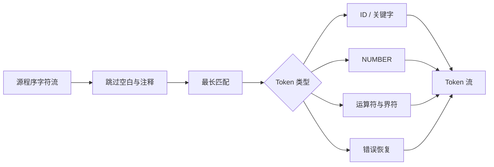

# 第一部分 · 词法分析

## 一、目标

词法分析器读取 ToyC 源程序字符流，输出带有类别、字面量、行号和列号的 Token 流，供后续语法分析使用。



## 二、ToyC 词法规则

- `ID`：`[_A-Za-z][_A-Za-z0-9]*`
- `NUMBER`：`-?(0|[1-9][0-9]*)`
- 关键字：`int`、`void`、`const`、`if`、`else`、`while`、`break`、`continue`、`return`
- 运算符：`+ - * / % = == != < > <= >= && || !`
- 界符：`( ) { } ; ,`
- 注释：`//` 到行尾，或 `/* ... */`；空白与注释均忽略。

负号既可以是 `NUMBER` 的一部分，也可以是 UnaryExpr 的运算符。实现时应根据课程约定统一选择一种策略，并在报告中说明；推荐将 `-` 独立为运算符，由语法分析处理一元负号。

## 三、实现步骤

1. 将每条正则规则转换为 NFA：正则的连接对应边的连接，选择对应 epsilon 分支，重复对应回边；
2. 加入一个新的 NFA 起点，用 epsilon 边连接所有规则起点，并给接受状态标记 Token 类型和规则优先级；
3. 用子集构造计算 DFA 状态的 epsilon-closure 和 move，直到新状态不再产生；可用 Hopcroft 算法合并等价状态；
4. 运行 DFA 时记录“最后一次到达的接受状态”，即使继续读入字符后失败，也要回退到该位置，保证最长匹配；
5. 对关键字使用哈希表，先扫描为 ID，再查表转为关键字；
6. 运算符按长度降序尝试，保证 `<=` 优先于 `<`；
7. 错误时报告位置，跳过一个不可识别字符后继续扫描。

例如输入 `a<=b`：扫描器先从 `a` 的接受状态回退并输出 ID；遇到 `<` 后继续尝试，发现 `<` 和 `<=` 都是接受状态，最终选择更长的 `<=`；最后输出 `b`。输入 `a+++b` 时，最长匹配会先输出 `a`、`++`、`+`、`b`。

推荐的 Token 数据结构如下：

```text
Token {
    kind       // Identifier, KwInt, Number, Plus, LessEqual ...
    lexeme     // 原始字符片段
    line
    column
    value?     // NUMBER 的整数值，关键字和运算符通常为空
}
```

```text
scan_token():
    skip_whitespace_and_comments()
    start = current_position()
    if eof(): return EOF
    if letter(peek()) or peek() == '_':
        lexeme = scan_while(identifier_char)
        return keyword_table.lookup_or_identifier(lexeme)
    if digit(peek()):
        lexeme = scan_while(digit)
        return NUMBER(lexeme)
    for op in operators_sorted_by_length:
        if match(op): return Token(op)
    report_error(start, "unexpected character")
    advance()
    return ERROR
```

`skip_whitespace_and_comments()` 必须更新行列位置：遇到换行时 `line += 1` 并将 `column` 重置为 1，普通字符则递增 `column`。块注释扫描到 `*/`；如果到达文件末尾仍未闭合，应报告注释起始位置而不是只报告 EOF。

## 四、输出格式与测试

```text
<INT, 1, 1, "int">
<ID, 1, 5, "main">
<LPAREN, 1, 9, "(">
```

至少测试：关键字与 ID、整数、所有双字符运算符、注释、空白、非法字符、文件结尾和错误恢复。用 `a+++b`、`a<=b` 等用例验证最长匹配。

## 五、提交物

第一部分必须提交可以在 Linux 下独立编译运行的完整文件，而不是片段或伪代码。程序应从标准输入或命令行文件读取 ToyC 源程序，并按规定格式输出 Token 流。

```bash
cmake -S . -B build
cmake --build build
./compiler --dump-tokens < tests/basic.tc > tokens.txt
```

```text
part1-lexer/
├── src/
├── tests/
├── build.sh
└── report.md
```

报告应包含正则规则、DFA 状态图、Token 数据结构、错误恢复策略和测试结果。
