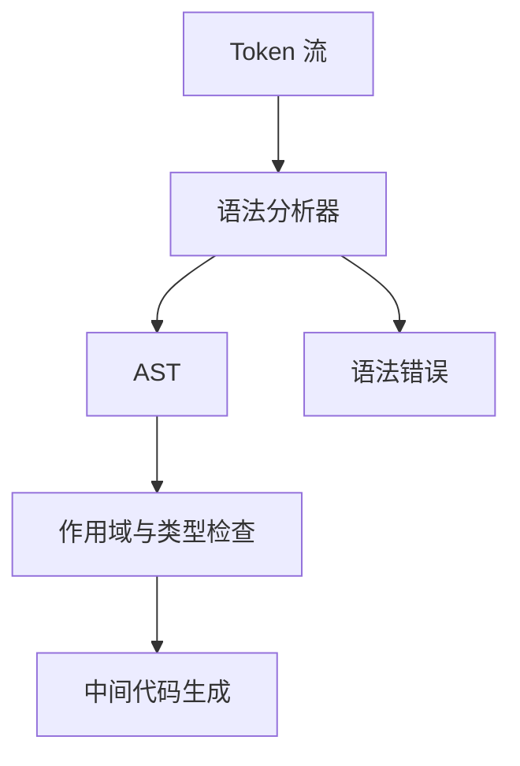
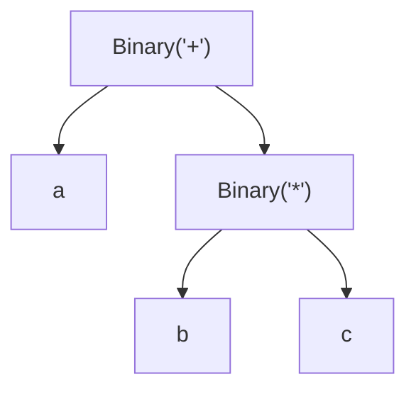

# 第二部分 · 语法分析

## 一、实验目标

语法分析器（parser）读取第一部分产出的 Token 流，检查它是否符合 ToyC 文法，并构造出后续语义分析和 IR 生成要用的抽象语法树（AST）。

:::tip[先建立直觉]
词法分析把程序切成一个个"词"；语法分析接着按语法规则把这些词组织成一棵树，树的形状直接反映了运算的先后顺序。
:::



### 本部分的三条可选技术路线

本部分允许任选一条路线实现，但必须在报告中说明取舍理由：

| 路线 | 基本思路 | 实现难度 | 说明 |
| --- | --- | --- | --- |
| 递归下降 | 每个非终结符对应一个函数 | 低 | 最直观，推荐首选 |
| LL(1) | 预测分析表 + 显式栈 | 中 | 需要计算 FIRST / FOLLOW |
| LR(0) / SLR(1) | 项目集 + ACTION/GOTO 表 | 高 | 分析能力最强，能处理更多文法 |

## 二、ToyC 核心文法

下面使用 EBNF 记号：`*` 表示重复零次或多次，`?` 表示可选，`|` 表示选择。

```text
CompUnit    -> FuncDef+
FuncDef     -> ('int' | 'void') ID '(' [ Param (',' Param)* ] ')' Block
Param       -> 'int' ID
Block       -> '{' BlockItem* '}'
BlockItem   -> Decl | Stmt
Decl        -> VarDecl | ConstDecl
VarDecl     -> 'int' VarDef (',' VarDef)* ';'
VarDef      -> ID [ '=' Expr ]
ConstDecl   -> 'const' 'int' ConstDef (',' ConstDef)* ';'
ConstDef    -> ID '=' Expr
Stmt        -> Block | ';' | Expr ';' | ID '=' Expr ';'
             | 'if' '(' Expr ')' Stmt [ 'else' Stmt ]
             | 'while' '(' Expr ')' Stmt
             | 'break' ';' | 'continue' ';' | 'return' Expr ';'
Expr        -> LOrExpr
LOrExpr     -> LAndExpr | LOrExpr '||' LAndExpr
LAndExpr    -> RelExpr | LAndExpr '&&' RelExpr
RelExpr     -> AddExpr | RelExpr RelOp AddExpr
AddExpr     -> MulExpr | AddExpr AddOp MulExpr
MulExpr     -> UnaryExpr | MulExpr MulOp UnaryExpr
UnaryExpr   -> PrimaryExpr | ('+' | '-' | '!') UnaryExpr
PrimaryExpr -> ID | NUMBER | '(' Expr ')' | ID '(' [ Expr (',' Expr)* ] ')'
```

这是[文法页](../reference/grammar)的等价写法：`RelOp`、`AddOp`、`MulOp` 分别展开为文法页中对应的运算符集合；声明（含 `const`）和语句统一由 `BlockItem` 展开，后面写 FIRST/FOLLOW 集时会方便一些；ToyC 没有全局变量，`CompUnit` 只会展开出一串函数定义。库函数（`getint`、`putint` 等）仍按普通 `ID` 和函数调用解析，不加入文法特殊产生式。

## 三、从 Token 到 AST 的转换逻辑

解析器的每个函数对应一个非终结符：先检查当前 Token 是否能作为该产生式的起始符号，匹配终结符后递归调用子规则，最后构造 AST 节点。AST 不保留没有语义的括号和分号，但保留源位置，用于后续报错。

### 结合性与优先级：以 `a + b * c` 为例

表达式文法按优先级分层：越靠下的规则优先级越高。解析 `a + b * c` 时，先识别加法（`AddExpr`），左侧得到 `a`；看到 `+` 后解析右侧的乘法子表达式，`MulExpr` 又把 `b * c` 组合成一棵子树。因此 AST 是 `+(a, *(b, c))`，而不是 `*(+(a, b), c)`：



如果用错误的方式解析（先算 `a + b` 再乘 `c`），结果就完全错了。这就是为什么文法要分层，以及为什么要区分左结合和右结合。

### 递归下降实现

**算法 1 · 递归下降解析表达式（Recursive-Descent Expression Parsing）**

**输入（Input）：** Token 流（`peek()` 返回当前 Token 但不消耗，`consume()` 消耗并前进）。
**输出（Output）：** 表达式对应的 AST 节点。

```
 1: parseExpr():                                    // Expr -> LOrExpr
 2:     return parseLOrExpr();
 3:
 4: parseAddExpr():                                 // AddExpr -> MulExpr (('+' | '-') MulExpr)*
 5:     left = parseMulExpr();
 6:     while peek() in { '+', '-' } do              // 左结合：用循环表达，而不是左递归
 7:         op = consume();
 8:         right = parseMulExpr();
 9:         left = Binary(op, left, right, loc = op.loc);   // 构造二元节点
10:     end while
11:     return left;
12:
13: parsePrimaryExpr():                            // PrimaryExpr -> ID | NUMBER | '(' Expr ')' | Call
14:     if match(NUMBER) then
15:         return Number(previous().value);
16:     end if
17:     if match(ID) then
18:         name = previous().lexeme;
19:         if match('(') then return parseCallAfterName(name); end if
20:         return Variable(name);
21:     end if
22:     if match('(') then
23:         e = parseExpr();
24:         expect(')');                                // 括号不进 AST，但保留源位置
25:         return e;
26:     end if
27:     error("expected primary expression");           // 出错提示
```

**为什么用循环而不是左递归？** 文法里写的是 `AddExpr -> AddExpr '+' MulExpr`（左递归）。直接写成函数会无限递归，所以要改写成循环（如上），或改写文法为 `E -> T E'`、`E' -> '+' T E' | ε`。两种写法等价，循环写法更直观。

### LL(1)：计算 FIRST / FOLLOW 集

LL(1) 需要一个预测分析表，而表的构造依赖 FIRST 和 FOLLOW 集。

**算法 2 · 计算 FIRST / FOLLOW 集（FIRST / FOLLOW Computation）**

**输入（Input）：** 上下文无关文法 `G`。
**输出（Output）：** 每个非终结符的 FIRST 集与 FOLLOW 集。

```
 1: for each terminal a do FIRST(a) = { a }; end for
 2: for each nonterminal A do FIRST(A) = ∅;  FOLLOW(A) = ∅; end for
 3: FOLLOW(start) = { $ };                           // 起始符号的 FOLLOW 含输入结束符
 4: repeat
 5:     changed = false;
 // ---- FIRST 计算 ----
 6:     for each production A -> X1 X2 ... Xn do
 7:         for i = 1 to n do
 8:             add (FIRST(Xi) \ { ε }) to FIRST(A);
 9:             if ε ∉ FIRST(Xi) then break; end if
10:         end for
11:         if all Xi can derive ε then add ε to FIRST(A); end if
12:     end for
 // ---- FOLLOW 计算 ----
13:     for each production A -> X1 X2 ... Xn do
14:         for i = 1 to n do
15:             if Xi is a nonterminal then
16:                 add (FIRST(X_{i+1} ... Xn) \ { ε }) to FOLLOW(Xi);
17:                 if X_{i+1} ... Xn can derive ε then add FOLLOW(A) to FOLLOW(Xi); end if
18:             end if
19:         end for
20:     end for
21: until not changed                                  // 迭代到不动点
22: return FIRST, FOLLOW;
```

以 `AddExpr -> MulExpr | AddExpr AddOp MulExpr` 为例，可得到 `FIRST(MulExpr) ⊆ FIRST(AddExpr)`、`FOLLOW(AddExpr) ⊇ { '+', '-', ')' , ';' }`，进而填出预测分析表。若表中某个 `M[A, a]` 出现两个产生式（冲突），说明文法不是 LL(1)。

**算法 3 · LL(1) 表驱动解析（Table-Driven LL(1) Parsing）**

**输入（Input）：** Token 流、预测分析表 `M`。
**输出（Output）：** AST 或语法错误。

```
 1: stack = [ '$', start_symbol ];  pos = 0;
 2: while stack not empty do
 3:     X = stack.top();  a = lookahead(pos);
 4:     if X is a terminal then
 5:         if X == a then stack.pop(); pos++;          // 匹配终结符
 6:         else error("expected " + X + ", got " + a); end if
 7:     else if M[X, a] == (A -> Y1 Y2 ... Yk) then
 8:         stack.pop();
 9:         push Yk, ..., Y1;                           // 逆序入栈，保证 Y1 先被展开
10:         build_ast_node(A);
11:     else
12:         recover_by_follow(X);                       // 见算法 6
13:     end if
14: end while
```

### LR：项目集与分析表

LR 分析的能力比 LL(1) 更强，代价是构造更复杂。

**算法 4 · LR(0) 项目集规范族（CLOSURE / GOTO）**

**输入（Input）：** 增广文法 `G'`（新增 `S' -> S`）。
**输出（Output）：** 项目集族（状态集合）与状态转移。

```
 1: I = { CLOSURE({ S' -> · S }) };                  // 初始项目集（· 标记当前解析位置）
 2: worklist = I;
 3: while worklist not empty do
 4:     J = worklist.pop();
 5:     for each grammar symbol X do
 6:         K = GOTO(J, X);                            // 所有形如 A -> α·Xβ 的项目把 · 右移一位
 7:         if K != ∅ and K ∉ I then
 8:             I = I ∪ { K };  worklist.push(K);
 9:         end if
10:     end for
11: end while
12: return I;
```

**算法 5 · LR 移进-归约驱动器（Shift-Reduce Driver）**

**输入（Input）：** Token 流、ACTION/GOTO 分析表。
**输出（Output）：** AST，或移进-归约 / 归约-归约冲突报告。

```
 1: states = [ 0 ];  symbols = [];  pos = 0;
 2: loop
 3:     s = top(states);  a = lookahead(pos);
 4:     if ACTION[s, a] == shift t then
 5:         push(states, t);  push(symbols, a);  pos++;
 6:     else if ACTION[s, a] == reduce (A -> β) then
 7:         pop |β| symbols and states;                 // 弹出右部
 8:         node = build_ast_node(A, popped_symbols);
 9:         push(symbols, node);
10:         push(states, GOTO[ top(states), A ]);       // 按左部转移
11:     else if ACTION[s, a] == accept then
12:         return top(symbols);                        // 语法树根节点
13:     else
14:         report_conflict(s, a);  error_recovery();
15:     end if
16: end loop
```

建议至少实现 LR(0) 项目集和 SLR(1) 表，并在报告中给出移进-归约、归约-归约冲突的分析。

### 错误恢复

**算法 6 · 语法错误恢复（Panic-Mode Error Recovery）**

**输入（Input）：** 出错位置，以及当前非终结符的期望集合。
**输出（Output）：** 完成同步的解析位置。

```
 1: report_error(expect, actual, line, col);          // 报出期望、实际、行列
 2: sync = { ';', '}' } ∪ { 'if', 'while', 'return' };    // 语句级同步集合
 3: while not eof() and lookahead() ∉ sync do
 4:     advance();                                     // 丢弃 Token，直到遇到同步符号
 5: end while
 6: if lookahead() ∈ { ';', '}' } then advance(); end if  // 跳过直至同步符号
 7: return current_position();                         // 继续解析后续语句
```

例如语句解析失败后，跳过到 `;`、`}` 或控制语句关键字，再继续报告后续错误，避免一次错误导致满屏报错。

## 四、AST 设计

```
Program(functions)
Function(return_type, name, params, body)
Block(statements)
Decl(name, initializer, is_const)     // 一条声明语句可含多个声明项，拆成一组节点
If(condition, then_stmt, else_stmt?)
While(condition, body)
Empty / Break / Continue
Assign(name, value)
Binary(op, lhs, rhs)
Unary(op, operand)
Call(name, args)
Number(value)
Variable(name)
Return(value?)
```

AST 应丢弃不影响语义的括号和分隔符，但保留源位置，便于错误报告。

## 五、选做：语义分析

语法分析完成后，可以继续阅读[选做 · 语义分析](./optional-semantic)，在 AST 与 IR 生成之间加入符号表、作用域、类型和控制流约束检查。语义分析不属于本部分的必做提交。

## 六、输入输出规范与统一样例

### 输入形式

- 输入为 ToyC 源代码，从标准输入流读入：

  ```bash
  echo "int a = 1;" | ./compiler --check-ast > test.check-ast
  ```

- 本地调试时用文件重定向：

  ```bash
  ./compiler --check-ast < test.c > test.check-ast
  ```

### 输出形式

所有输出都写到标准输出流；本地调试时用重定向写入文件，例如 `./compiler --check-ast < test.c > test.check-ast`，文件名建议用 `.check-ast` 后缀，便于与助教脚本对账。

源代码没有语法错误时，输出一行：

```text
accept
```

源代码存在语法错误时，先输出一行 `reject`，随后每行给出一个错误位置，按出现顺序排列：

```text
<行号>[ 空格 <报错信息>]
```

报错信息是可选字段，用空格与行号分隔，写不写都不影响判分。例如：

```text
reject
12 Lack of ')'
34 Unterminated comment
56 Lack of ';'
```

也可以只写行号：

```text
reject
12
34
56
```

:::warning[判分只看首行和行号]
自动评测只检查两件事：首行是 `accept` 还是 `reject`，以及 `reject` 之后各行的行号。

- 行号从 `1` 开始（源程序的第一行是第 1 行）；
- 行号取的是解析器发现错误时手上那个意外 Token 所在的行。例如少了 `;`，报出的就是它后面那个 Token 所在的行；
- 每个测试用例里的语法错误都独立成一处，不会出现"一个错误跨多行"或"一行多错"。
:::

### 样例输入

与词法分析、目标代码生成共用同一个样例程序：

```c
// ToyC 综合示例：覆盖文法中的全部成分
/* ToyC 不支持全局变量，所有定义都写在函数里 */

int sum(int n, int from) {
    int s = 0;
    while (from <= n) {
        if (from == 2) {
            from = from + 1;
            continue;
        }
        s = s + from;
        from = from + 1;
    }
    return s;
}

void show(int v) {
    putint(v);
    ;
}

int main() {
    const int LIMIT = 3, STEP = 1;
    int a = 5, b;
    b = +a - -1;
    int c = (a + b) * 2 / 3 % 4;
    {
        int a = 1;
        c = c + a;
    }
    if (a >= b && b != 0 || !(a == LIMIT)) {
        c = c + sum(a, STEP);
    } else {
        c = c - 1;
    }
    while (c > 0) {
        c = c - 1;
        if (c == 5) continue;
        if (c < 2) break;
        show(c);
    }
    return c;
}
```

### 样例输出

这个程序没有语法错误，因此只输出一行：

```text
accept
```

### 错误样例

再给一个故意写错的程序，覆盖几类最常见的语法错误：

```c
int f(int x, int y {
    int z = x + y  / 2 % 3;
    if (z < 10 && z > 0 || z <= 20 && z >= 5 || z == 7 || z != 8) {
        z = z + 1;
    } else {
        z = z - ;
    }
    while (z < 100) {
        z = z + 1;
        if z == 50) break;
        continue;
    }
    return z;


void g() {
    int i = 0;
    i = f(i, i);
}

int main() {
    int result = 0;
    result = f(, 2);
    g();
    return result;
}
```

五处错误逐个说明：

| 行号 | 出错位置 | 语法错误 |
| ---: | --- | --- |
| 1 | `int f(int x, int y {` | 形参列表缺少 `)` |
| 6 | `z = z - ;` | 二元运算符 `-` 缺少右操作数 |
| 10 | `if z == 50) break;` | `if` 的条件缺少 `(` |
| 16 | `void g() {` | 上一个函数体缺少 `}`，`void g()` 被当成 `f` 函数体里的语句 |
| 23 | `result = f(, 2);` | 实参列表里多了一个逗号，缺少实参 |

对应的输出（报错信息可以省略）：

```text
reject
1 Lack of ')'
6 Lack of expression
10 Lack of '('
16 Lack of '}'
23 Lack of expression
```

第 16 行最能说明问题：一个 `}` 没写上，后面整个 `void g()` 就被解析器当成了 `f` 函数体里的语句，
所以报错落在第 16 行的 `void` 上。这提醒你错误恢复必须能继续往下走——报完当前错误后，
跳过 Token 直到语句级同步集合（`;`、`}`、`if`、`while`、`return`）再继续解析，
这样一个错误只产生一条报告，不会刷屏。具体策略见「错误恢复」一节的 panic-mode 恢复。

## 七、提交物

第二部分必须提交可以编译的完整文件。程序应读取 ToyC 源程序，按命令行参数选择解析模式，并按第六节的规定输出 `accept` / `reject`；不能只提交算法片段。

```bash
cmake -S . -B build
cmake --build build
./compiler --check-ast < input.c > input.check-ast
./compiler --check-ast --parser ll1 < input.c > input.check-ast
```

报告需包含：文法改写、FIRST/FOLLOW 集、分析表或递归下降实现、AST 节点设计、错误恢复策略和测试结果。测试应覆盖优先级、结合性、嵌套语句、函数调用和非法输入。