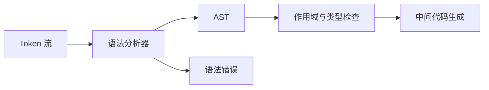
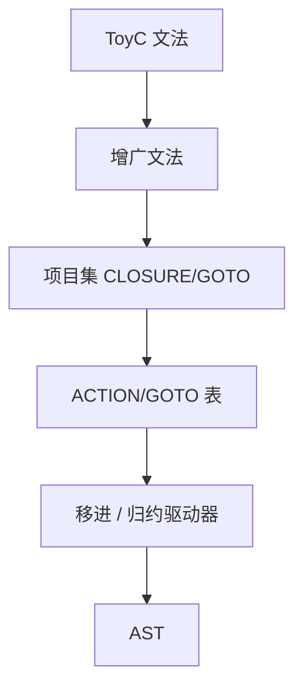

# 第二部分 · 语法分析

## 一、目标

语法分析器读取 Token 流，检查 ToyC 文法，并构造后续语义分析和 IR 生成使用的抽象语法树（AST）。



## 二、核心文法

```text
CompUnit    -> FuncDef+
Stmt        -> Block | ';' | Expr ';' | ID '=' Expr ';'
             | 'int' ID '=' Expr ';'
             | 'if' '(' Expr ')' Stmt [ 'else' Stmt ]
             | 'while' '(' Expr ')' Stmt
             | 'break' ';' | 'continue' ';' | 'return' Expr ';'
Block       -> '{' Stmt* '}'
FuncDef     -> ('int' | 'void') ID '(' [ Param (',' Param)* ] ')' Block
Param       -> 'int' ID
Expr        -> LOrExpr
LOrExpr     -> LAndExpr | LOrExpr '||' LAndExpr
LAndExpr    -> RelExpr | LAndExpr '&&' RelExpr
RelExpr     -> AddExpr | RelExpr RelOp AddExpr
AddExpr     -> MulExpr | AddExpr AddOp MulExpr
MulExpr     -> UnaryExpr | MulExpr MulOp UnaryExpr
UnaryExpr   -> PrimaryExpr | ('+' | '-' | '!') UnaryExpr
PrimaryExpr -> ID | NUMBER | '(' Expr ')' | ID '(' [ Expr (',' Expr)* ] ')'
```

其中 `RelOp`、`AddOp` 和 `MulOp` 分别展开为文法页中的对应运算符集合。库函数仍按普通 ID 和函数调用解析，不加入文法特殊产生式。

## 三、两类分析方法

### 从 Token 到 AST 的转换逻辑

解析器的每个函数对应一个非终结符。函数先检查当前 Token 是否能作为该产生式的起始符号，匹配终结符后递归调用子规则，最后构造 AST 节点。AST 不保留没有语义的括号和分号，但保留源位置。

以 `a + b * c` 为例，解析过程先识别 `AddExpr`，左侧得到 `a`；看到 `+` 后解析右侧 `MulExpr`，而 `MulExpr` 继续把 `b * c` 组合成子树，因此 AST 是 `+(a, *(b, c))`，而不是 `*(+(a,b),c)`。

```text
parse_expr():
  return parse_lor_expr()

parse_add_expr():
  left = parse_mul_expr()
  while peek() in { '+', '-' }:
    op = consume()
    right = parse_mul_expr()
    left = Binary(op, left, right, source_location=op.location)
  return left

parse_primary_expr():
  if match(NUMBER): return Number(previous().value)
  if match(ID):
    name = previous().lexeme
    if match('('): return parse_call_after_name(name)
    return Variable(name)
  if match('('):
    expr = parse_expr()
    expect(')')
    return expr
  error("expected primary expression")
```

遇到错误时，解析器应指出期望 Token、实际 Token、行列位置，并使用同步集合跳过输入。例如语句解析失败后跳过到 `;`、`}` 或控制语句关键字，再继续报告后续错误。

### 递归下降与 LL(1)

ToyC 的表达式文法含有左递归。实现递归下降时，将 `E -> E + T | T` 改写成 `E -> T E'`，或直接用循环表达左结合：

```text
parse_add_expr():
    left = parse_mul_expr()
    while peek() in { '+', '-' }:
        op = consume()
        right = parse_mul_expr()
        left = Binary(op, left, right)
    return left
```

需要计算 FIRST/FOLLOW 集，并用预测分析表检测冲突。错误恢复可以跳过 Token，直到遇到当前非终结符的 FOLLOW 集元素。

### LR 分析

LR 分析使用项目集、CLOSURE、GOTO 和 ACTION/GOTO 表。建议至少实现 LR(0) 项目集和 SLR(1) 表，并报告移进-归约、归约-归约冲突。



## 四、AST 设计

```text
Program(functions)
Function(return_type, name, params, body)
Block(statements)
If(condition, then_stmt, else_stmt?)
While(condition, body)
Assign(name, value)
VarDecl(name, initializer)
Binary(op, lhs, rhs)
Unary(op, operand)
Call(name, args)
Number(value)
Variable(name)
Return(value)
```

AST 应丢弃不影响语义的括号和分隔符，但保留源位置，便于错误报告。

## 五、选做：语义分析

语法分析完成后，可以继续阅读[选做·语义分析](./optional-semantic)，在 AST 与 LLVM IR 生成之间加入符号表、作用域、类型和控制流约束检查。语义分析不属于本部分的必做提交。

## 六、提交物

第二部分必须提交可以编译的完整文件。程序应读取 Token 流或 ToyC 源程序，按命令行参数选择解析模式，并输出规定格式的 AST 或分析过程；不能只提交算法片段。

```bash
cmake -S . -B build
cmake --build build
./compiler --check-ast < input.c > input.check-ast
./compiler --check-ast --parser ll1 < input.c > input.check-ast
```

报告需包含：文法改写、FIRST/FOLLOW 集、分析表或递归下降实现、AST 节点设计、错误恢复策略和测试结果。测试应覆盖优先级、结合性、嵌套语句、函数调用和非法输入。
