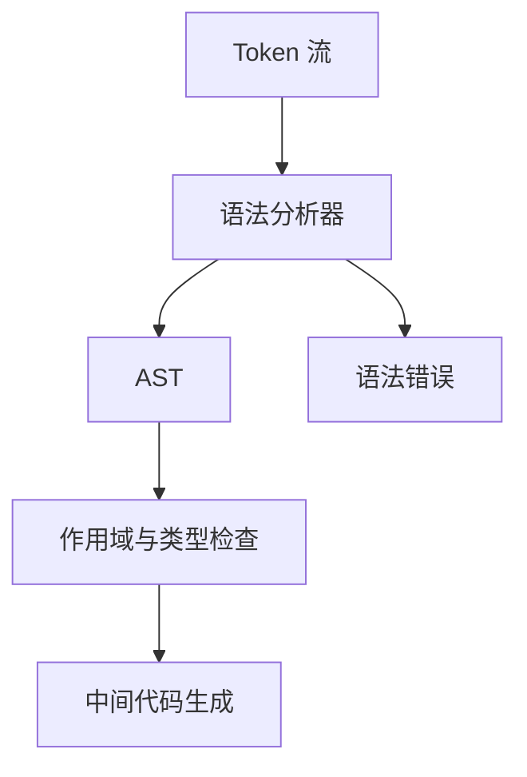
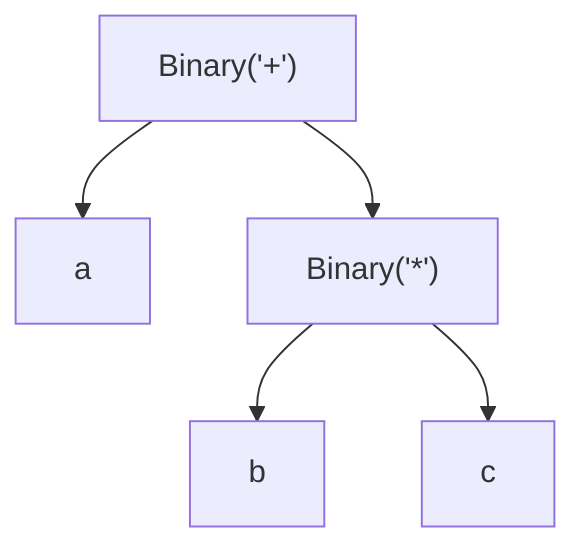
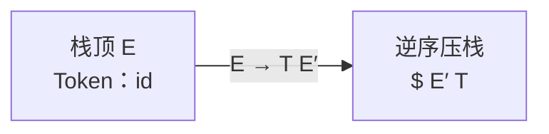
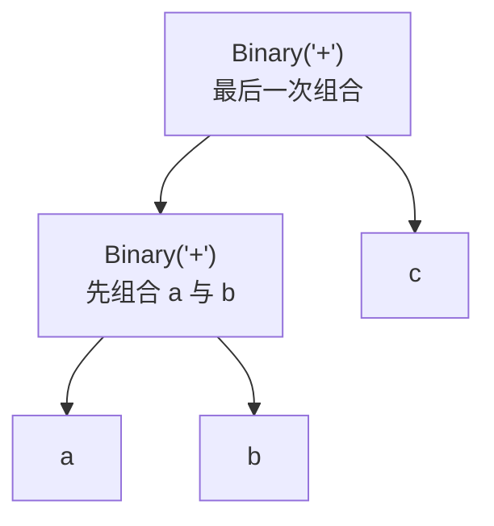
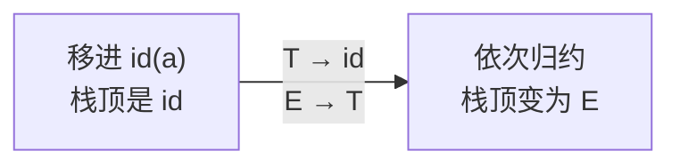
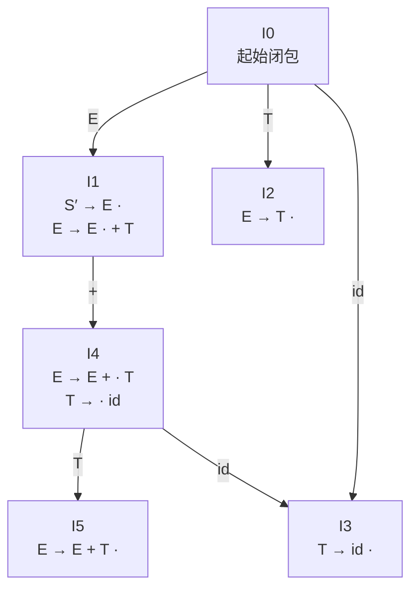
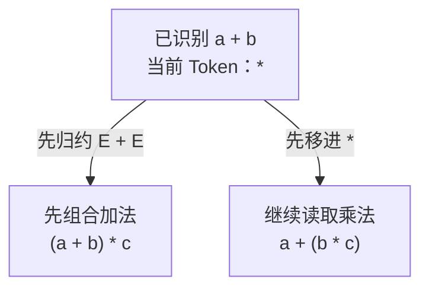

# 第二部分 · 语法分析

## 一、实验目标

语法分析器（parser）读取第一部分产出的 Token 流，检查它是否符合 ToyC 文法，并构造出后续语义分析和 IR 生成要用的抽象语法树（AST）。

:::info[基本原理]
语法分析依据文法将 Token 流组织为抽象语法树；树的层次结构表示运算符的优先级、结合性和程序结构。
:::


```mermaid
flowchart TB
  T[Token 流] --> P[语法分析器]
  P --> A[AST]
  P --> R[语法错误]
  A --> S[作用域与类型检查]
  S --> I[中间代码生成]
```

### 本部分的三条可选技术路线

本部分允许任选一条路线实现，但必须在报告中说明取舍理由：

| 路线 | 基本思路 | 实现难度 | 说明 |
| --- | --- | --- | --- |
| 递归下降 | 每个非终结符对应一个函数 | 低 | 最直观，推荐首选 |
| LL(1) | 预测分析表 + 显式栈 | 中 | 需要计算 FIRST / FOLLOW |
| LR(0) / SLR(1) | 项目集 + ACTION/GOTO 表 | 高 | 可保留左递归，自底向上归约；需要检查表冲突 |

三条路线的输入、输出和文法约定相同：都读取第一部分的 Token 流并生成同一套 AST。若选择 LL(1)，需要先消除左递归并提取左公因子；若选择 LR，则要在报告中说明冲突处理和归约动作。课程实现建议先用递归下降跑通，再把同一组样例用于路线对比。

## 二、ToyC 核心文法

下面使用 EBNF 记号：`*` 表示重复零次或多次，`?` 表示可选，`|` 表示选择。

```text
CompUnit    -> FuncDef+
FuncDef     -> ('int' | 'void') ID '(' [ Param (',' Param)* ] ')' Block
Param       -> 'int' ID
Block       -> '{' BlockItem* '}'
BlockItem   -> Decl | Stmt
Decl        -> VarDecl | ConstDecl
VarDecl     -> 'int' VarDef (',' VarDef)* ';'
VarDef      -> ID [ '=' Expr ]
ConstDecl   -> 'const' 'int' ConstDef (',' ConstDef)* ';'
ConstDef    -> ID '=' Expr
Stmt        -> Block | ';' | Expr ';' | ID '=' Expr ';'
             | 'if' '(' Expr ')' Stmt [ 'else' Stmt ]
             | 'while' '(' Expr ')' Stmt
             | 'break' ';' | 'continue' ';' | 'return' [ Expr ] ';'
Expr        -> LOrExpr
LOrExpr     -> LAndExpr | LOrExpr '||' LAndExpr
LAndExpr    -> RelExpr | LAndExpr '&&' RelExpr
RelExpr     -> AddExpr | RelExpr RelOp AddExpr
AddExpr     -> MulExpr | AddExpr AddOp MulExpr
MulExpr     -> UnaryExpr | MulExpr MulOp UnaryExpr
UnaryExpr   -> PrimaryExpr | ('+' | '-' | '!') UnaryExpr
PrimaryExpr -> ID | NUMBER | '(' Expr ')' | ID '(' [ Expr (',' Expr)* ] ')'
```

这是[文法页](../reference/grammar)的等价写法：`RelOp`、`AddOp`、`MulOp` 分别展开为文法页中对应的运算符集合；声明（含 `const`）和语句统一由 `BlockItem` 展开，后面写 FIRST/FOLLOW 集时会方便一些；ToyC 没有全局变量，`CompUnit` 只会展开出一串函数定义。库函数（`getint`、`putint` 等）仍按普通 `ID` 和函数调用解析，不加入文法特殊产生式。

## 三、从 Token 到 AST 的转换逻辑

三条路线都要把 Token 组织成 AST，但驱动方式不同：递归下降由函数调用推进，LL(1) 根据栈顶和向前看 Token 查预测表，LR 根据状态栈查 ACTION/GOTO 表。AST 不保留没有语义的括号和分号，但保留源位置，用于后续报错。

### 结合性与优先级：以 `a + b * c` 为例

表达式文法按优先级分层：越靠下的规则优先级越高。解析 `a + b * c` 时，先识别加法（`AddExpr`），左侧得到 `a`；看到 `+` 后解析右侧的乘法子表达式，`MulExpr` 又把 `b * c` 组合成一棵子树。因此 AST 是 `+(a, *(b, c))`，而不是 `*(+(a, b), c)`：


```mermaid
flowchart TD
  ADD["Binary('+')"] --> A["a"]
  ADD --> MUL["Binary('*')"]
  MUL --> B["b"]
  MUL --> C["c"]
```

如果用错误的方式解析（先算 `a + b` 再乘 `c`），结果就完全错了。这就是为什么文法要分层，以及为什么要区分左结合和右结合。

### 递归下降实现

**算法 1 · 递归下降解析表达式（Recursive-Descent Expression Parsing）**

**输入（Input）：** Token 流（`peek()` 返回当前 Token 但不消耗，`consume()` 消耗并前进）。
**输出（Output）：** 表达式对应的 AST 节点。

```
 1: parseExpr():                                    // Expr -> LOrExpr
 2:     return parseLOrExpr();
 3:
 4: parseAddExpr():                                 // AddExpr -> MulExpr (('+' | '-') MulExpr)*
 5:     left = parseMulExpr();
 6:     while peek() in { '+', '-' } do              // 左结合：用循环表达，而不是左递归
 7:         op = consume();
 8:         right = parseMulExpr();
 9:         left = Binary(op, left, right, loc = op.loc);   // 构造二元节点
10:     end while
11:     return left;
12:
13: parsePrimaryExpr():                            // PrimaryExpr -> ID | NUMBER | '(' Expr ')' | Call
14:     if match(NUMBER) then
15:         return Number(previous().value);
16:     end if
17:     if match(ID) then
18:         name = previous().lexeme;
19:         if match('(') then return parseCallAfterName(name); end if
20:         return Variable(name);
21:     end if
22:     if match('(') then
23:         e = parseExpr();
24:         expect(')');                                // 括号不进 AST，但保留源位置
25:         return e;
26:     end if
27:     error("expected primary expression");           // 出错提示
```

**为什么用循环而不是左递归？** 文法里写的是 `AddExpr -> AddExpr '+' MulExpr`（左递归）。直接写成函数会无限递归，所以要改写成循环（如上），或改写文法为 `E -> T E'`、`E' -> '+' T E' | ε`。两种写法等价，循环写法更直观。

### LL(1)：计算 FIRST / FOLLOW 集

LL(1) 把递归函数中的“选哪个分支”变成查表：**用栈顶非终结符作为行、当前 Token 作为列，查出要展开的产生式。** 第一个 L 表示从左到右读输入，第二个 L 表示最左推导，1 表示只看一个向前看 Token。

#### 先用小文法看清 FIRST 与 FOLLOW

为了把注意力放在查表过程上，下面只分析 `a + b`，把两个标识符都记作终结符 `id`。这是一份教学用的表达式子文法，不是完整 ToyC 文法。

原来的左递归 `E -> E + T | T` 不能直接用于 LL(1)，先改写为：

```text
(1) E  -> T E′
(2) E′ -> + T E′
(3) E′ -> ε
(4) T  -> id
```

`E′` 表示“读完一个项后，后面还有没有加法”；`ε` 表示这部分为空，`$` 表示输入结束。

| 非终结符 | FIRST：这一部分可能以什么开头 | FOLLOW：这一部分结束后可能看到什么 |
| --- | --- | --- |
| `E` | `{ id }` | `{ $ }` |
| `E′` | `{ +, ε }` | `{ $ }` |
| `T` | `{ id }` | `{ +, $ }` |

例如，在 `E -> T E′` 中，`T` 后面跟着 `E′`：`E′` 可以以 `+` 开头，所以 `+` 进入 `FOLLOW(T)`；`E′` 也可以为空，所以 `E` 后面的 `$` 也进入 `FOLLOW(T)`。FOLLOW 不包含 `ε`。

#### 把集合变成预测分析表

填表时，对每条 `A -> α`：

1. 在 `FIRST(α)` 中每个非空终结符对应的列填入这条产生式；
2. 若 `α` 能推出 `ε`，再把它填入 `FOLLOW(A)` 对应的列；
3. 同一格若需要填两条不同产生式，就发生 LL(1) 冲突。

对上面的子文法，得到：

| 栈顶 / 当前 Token | `id` | `+` | `$` |
| --- | --- | --- | --- |
| `E` | (1) `E -> T E′` | 错误 | 错误 |
| `E′` | 错误 | (2) `E′ -> + T E′` | (3) `E′ -> ε` |
| `T` | (4) `T -> id` | 错误 | 错误 |

关键在 `E′` 这一行：看到 `+` 就继续解析加法，看到 `$` 就结束，不需要猜测或回退。


```mermaid
flowchart LR
  A["栈顶 E<br/>Token：id"] -->|"E → T E′"| B["逆序压栈<br/>$ E′ T"]
```

#### 跟着栈解析一次 a + b

栈在表中从左到右表示“栈底 → 栈顶”，最右边先处理；输入中的 `id` 仍携带 `a`、`b` 的词素信息，构造 AST 时不会丢失。

| 步骤 | 分析栈 | 剩余输入 | 本步动作 |
| ---: | --- | --- | --- |
| 0 | `$ E` | `id + id $` | 查 `M[E, id]`，展开 (1) |
| 1 | `$ E′ T` | `id + id $` | 查 `M[T, id]`，展开 (4) |
| 2 | `$ E′ id` | `id + id $` | 匹配第一个 `id`，消耗 `a` |
| 3 | `$ E′` | `+ id $` | 查 `M[E′, +]`，展开 (2) |
| 4 | `$ E′ T +` | `+ id $` | 匹配 `+` |
| 5 | `$ E′ T` | `id $` | 展开 (4) |
| 6 | `$ E′ id` | `id $` | 匹配第二个 `id`，消耗 `b` |
| 7 | `$ E′` | `$` | 选 (3)，弹出 `E′`，不消耗输入 |
| 8 | `$` | `$` | 输入与栈同时结束，接受 |

展开产生式不消耗 Token；只有匹配终结符才前进。`ε` 不入栈，也不消耗输入。

**构造 AST 要再加语义动作。** 改写后的 `E′` 是右递归尾部，但加法仍应保持左结合：收集尾部各个“操作符 + 项”，再从左向右组合。对 `a + b + c`，依次构造 `Binary('+', a, b)`，再把它作为下一次组合的左孩子。


```mermaid
flowchart TB
  A["Binary('+')<br/>最后一次组合"] --> B["Binary('+')<br/>先组合 a 与 b"]
  A --> C["c"]
  B --> D["a"]
  B --> E["b"]
```

<details>
<summary>算法 2：FIRST / FOLLOW 的通用计算</summary>

输入为上下文无关文法，输出为各符号的 FIRST 与各非终结符的 FOLLOW。`addAll` 向集合加入新元素，并在集合实际变化时返回 true。

```
 1: FIRST(terminal a) = {a}; FIRST(ε) = {ε};
 2: FIRST(nonterminal A) = ∅;
 3: repeat
 4:     changed = false;
 5:     for each production A -> X1 ... Xn do
 6:         changed = addAll(FIRST(A), FIRST(X1 ... Xn)) or changed;
 7:     end for
 8: until not changed
 9: FOLLOW(A) = ∅ for every nonterminal A; FOLLOW(start) = {$};
10: repeat
11:     changed = false;
12:     for each production A -> α B β, where B is a nonterminal do
13:         changed = addAll(FOLLOW(B), FIRST(β) minus {ε}) or changed;
14:         if ε in FIRST(β) then
15:             changed = addAll(FOLLOW(B), FOLLOW(A)) or changed;
16:         end if
17:     end for
18: until not changed
```

计算 `FIRST(X1 ... Xn)` 时，从左向右加入各 `FIRST(Xi)` 的非空元素；遇到不能推出空串的符号就停止。仅当整个序列都可为空时加入 `ε`，空序列的 FIRST 为 `{ε}`。

</details>

<details>
<summary>算法 3：LL(1) 表驱动解析</summary>

下面展示语法识别驱动；要生成 AST，还需在匹配与产生式完成时执行语义动作。

```
 1: stack = ['$', start]; pos = 0;
 2: loop
 3:     X = top(stack); a = lookahead(pos);
 4:     if X == '$' and a == '$' then return accept; end if
 5:     if X is a terminal then
 6:         if X != a then reportSyntaxError(); recover(); continue; end if
 7:         pop(stack); pos += 1;                      // 只在匹配时消耗 Token
 8:     else if M[X, a] contains A -> Y1 ... Yk then
 9:         pop(stack);
10:         push Yk, ..., Y1;                          // ε 的右部为空，不压栈
11:     else
12:         reportSyntaxError(); recover();            // 恢复必须推进输入或弹栈
13:     end if
14: end loop
```

</details>

**应用到 ToyC 时还需检查其它共同前缀。** 例如变量引用 `id` 与调用 `id(...)` 都以 `id` 开头，可先匹配 `id`，再由一个后缀非终结符处理 `(` 或空串。赋值语句与表达式语句的共同前缀、`else` 归属最近的未匹配 `if` 等，也需要明确的文法改写或消歧规则。只消除表达式左递归，并不自动保证整份 ToyC 文法是 LL(1)。

FIRST/FOLLOW 与预测表的定义可参见 [威斯康星大学语法分析讲义](https://pages.cs.wisc.edu/~fischer/cs536.s08/course.hold/html/NOTES/5.PARSING.html)。

### LR：项目集与分析表

LR 走相反的方向：**先把 Token 移到栈里，再把已经识别完整的右部归约成左部。** 不需要像 LL(1) 那样先把左递归改成尾部递归。`ACTION` 决定“移进、归约、接受还是报错”，`GOTO` 决定归约出一个非终结符后进入哪个状态。

#### 移进与归约分别做什么

仍分析 `a + b`，这次直接保留左递归，使用增广文法：

```text
(0) S′ -> E
(1) E  -> E + T
(2) E  -> T
(3) T  -> id
```

移进把一个 Token 及其目标状态压入栈，并消耗输入。归约按 `A -> β` 弹出右部 `β`，构造 `A` 对应的值或 AST，再按 `GOTO` 压入新状态；归约不消耗当前 Token。


```mermaid
flowchart LR
  A["移进 id(a)<br/>栈顶是 id"] -->|"T → id<br/>E → T"| B["依次归约<br/>栈顶变为 E"]
```

#### 项目中的圆点到底表示什么

`E -> E · + T` 表示已经识别了左边的 `E`，接下来期待 `+`；`E -> E + T ·` 表示右部已经完整，可以考虑归约。

从 `S′ -> · E` 开始做 CLOSURE。因为圆点后是 `E`，加入 `E` 的两条产生式；新项目中圆点后又出现 `T`，继续加入 `T -> · id`，直到没有新项目：

```text
I0 = {
    S′ -> · E
    E  -> · E + T
    E  -> · T
    T  -> · id
}
```

`GOTO(I0, id)` 将 `T -> · id` 的圆点右移，得到 `I3 = { T -> id · }`。这里的 GOTO 是构造项目集的函数；运行时的 GOTO 表记录其中“非终结符”对应的状态转移。

下面这张图给出完整的六个状态，边的标签就是本次识别的文法符号：


```mermaid
flowchart TB
  I0["I0<br/>起始闭包"] -->|E| I1["I1<br/>S′ → E ·<br/>E → E · + T"]
  I0 -->|T| I2["I2<br/>E → T ·"]
  I0 -->|id| I3["I3<br/>T → id ·"]
  I1 -->|"+"| I4["I4<br/>E → E + · T<br/>T → · id"]
  I4 -->|T| I5["I5<br/>E → E + T ·"]
  I4 -->|id| I3
```

#### 从状态图填出 SLR(1) 表

对这个子文法，`FOLLOW(E) = FOLLOW(T) = { +, $ }`。`s3` 表示移进并进入状态 3，`r2` 表示按产生式 (2) 归约，空格“—”表示语法错误。

| 状态 | ACTION：`id` | ACTION：`+` | ACTION：`$` | GOTO：`E` | GOTO：`T` |
| ---: | --- | --- | --- | ---: | ---: |
| 0 | s3 | — | — | 1 | 2 |
| 1 | — | s4 | accept | — | — |
| 2 | — | r2 | r2 | — | — |
| 3 | — | r3 | r3 | — | — |
| 4 | s3 | — | — | — | 5 |
| 5 | — | r1 | r1 | — | — |

表从三类信息得到：状态图中的终结符边填 `shift`；完整项目 `A -> β ·` 在 `FOLLOW(A)` 的列填 `reduce`；`S′ -> E ·` 在 `$` 列填 `accept`。非终结符边填入 GOTO 表。

#### 用这张表解析 a + b

两个栈都从左到右表示“栈底 → 栈顶”。状态栈比符号栈多一个起始状态 0，表中不另列符号栈底的结束标记。

| 步骤 | 状态栈 | 符号栈 | 剩余输入 | 本步动作与 AST |
| ---: | --- | --- | --- | --- |
| 0 | `0` | 空 | `id + id $` | s3：移进 `a`，保留词素 |
| 1 | `0 3` | `id` | `+ id $` | r3：`T -> id`，得到叶节点 `a`，GOTO[0, T] = 2 |
| 2 | `0 2` | `T` | `+ id $` | r2：`E -> T`，传递节点 `a`，GOTO[0, E] = 1 |
| 3 | `0 1` | `E` | `+ id $` | s4：移进 `+` |
| 4 | `0 1 4` | `E +` | `id $` | s3：移进 `b` |
| 5 | `0 1 4 3` | `E + id` | `$` | r3：得到叶节点 `b`，GOTO[4, T] = 5 |
| 6 | `0 1 4 5` | `E + T` | `$` | r1：弹出三个符号，构造 `Binary('+', a, b)`，GOTO[0, E] = 1 |
| 7 | `0 1` | `E` | `$` | accept：返回加法 AST |

对照 LL(1)：LL(1) 从 `E` 展开到 `id + id`，LR 从 `id + id` 归约回 `E`。两者最终构造同一棵 AST。

#### LR(0) 和 SLR(1) 的区别，以及冲突怎么看

| 方法 | 完整项目 `A -> β ·` 在哪些 Token 上归约 | 影响 |
| --- | --- | --- |
| LR(0) | 所有终结符列 | 不利用后继 Token 限制，较容易与其它动作冲突 |
| SLR(1) | 仅 `FOLLOW(A)` 中的终结符列 | 用全局 FOLLOW 集排除一部分不该发生的归约 |

上面的小文法两种方法都能处理，但不能据此认为完整 ToyC 文法没有冲突。若 SLR 仍冲突，需要检查文法与消歧规则，或进一步采用 LR(1)/LALR(1) 等方法。

**冲突出现在构造分析表时。** 同一格同时需要 `shift` 与 `reduce`，就是移进-归约冲突；同时需要两种 `reduce`，就是归约-归约冲突。运行时查到空格，则是输入的语法错误，不应再称为“表冲突”。

例如不分优先级的文法 `E -> E + E | E * E | id`，读到 `a + b` 后再看到 `*`，会出现两种解释：


```mermaid
flowchart TB
  A["已识别 a + b<br/>当前 Token：*"] -->|"先归约 E + E"| B["先组合加法<br/>(a + b) * c"]
  A -->|"先移进 *"| C["继续读取乘法<br/>a + (b * c)"]
```

ToyC 规定乘法优先级更高，应形成右侧那种 AST。可以通过分层文法表达优先级；使用分析器生成器时，也可按工具规则显式声明优先级与结合性。`else` 的归属同样需要明确处理，不能任意选择一条动作。

<details>
<summary>算法 4：CLOSURE / GOTO 与 LR(0) 项目集规范族</summary>

```
 1: closure(seed):
 2:     J = seed;
 3:     repeat
 4:         changed = false;
 5:         for each item A -> α · B β in J, where B is a nonterminal do
 6:             for each production B -> γ do
 7:                 changed = addAll(J, {B -> · γ}) or changed;
 8:             end for
 9:         end for
10:     until not changed
11:     return J;
12:
13: goto(J, X):
14:     moved = {A -> α X · β | A -> α · X β is in J};
15:     return closure(moved);
16:
17: states = {closure({S′ -> · E})}; worklist = states;
18: while worklist not empty do
19:     J = pop(worklist);
20:     for each grammar symbol X do
21:         K = goto(J, X);
22:         if K is not empty then
23:             if K is new then add K to states and worklist; end if
24:             recordTransition(J, X, K);
25:         end if
26:     end for
27: end while
```

构造时对项目集合去重，并给每个不同集合分配状态编号。项目相同、集合相同的状态可以复用，不能因为从另一条边到达就重复创建。

</details>

<details>
<summary>算法 5：LR 移进-归约驱动器</summary>

符号栈的每个元素同时记录文法符号与语义值（Token 或 AST 节点）。

```
 1: states = [0]; symbols = []; pos = 0;
 2: loop
 3:     s = top(states); a = lookahead(pos);
 4:     if ACTION[s, a] == shift t then
 5:         push(states, t); push(symbols, tokenAt(pos)); pos += 1;
 6:     else if ACTION[s, a] == reduce (A -> β) then
 7:         children = pop |β| symbols in their original order;
 8:         pop |β| states;                          // ε 归约时弹出 0 个
 9:         value = semanticAction(A -> β, children);
10:         push(symbols, (A, value));
11:         push(states, GOTO[top(states), A]);       // 使用弹栈后的栈顶状态
12:     else if ACTION[s, a] == accept then
13:         return top(symbols).value;
14:     else
15:         reportSyntaxError(); errorRecovery();   // 空格表示语法错误
16:     end if
17: end loop
```

</details>

### 错误恢复

**算法 6 · 语法错误恢复（Panic-Mode Error Recovery）**

**输入（Input）：** 出错位置，以及当前非终结符的期望集合。
**输出（Output）：** 完成同步的解析位置。

```
 1: report_error(expect, actual, line, col);          // 报出期望、实际、行列
 2: sync = { ';', '}' } ∪ { 'if', 'while', 'return' };    // 语句级同步集合
 3: while not eof() and lookahead() ∉ sync do
 4:     advance();                                     // 丢弃 Token，直到遇到同步符号
 5: end while
 6: if lookahead() ∈ { ';', '}' } then advance(); end if  // 跳过直至同步符号
 7: return current_position();                         // 继续解析后续语句
```

例如语句解析失败后，跳过到 `;`、`}` 或控制语句关键字，再继续报告后续错误，避免一次错误导致满屏报错。

## 四、AST 设计

```
Program(functions)
Function(return_type, name, params, body)
Block(statements)
Decl(name, initializer, is_const)     // 一条声明语句可含多个声明项，拆成一组节点
If(condition, then_stmt, else_stmt?)
While(condition, body)
Empty / Break / Continue
Assign(name, value)
Binary(op, lhs, rhs)
Unary(op, operand)
Call(name, args)
Number(value)
Variable(name)
Return(value?)
```

AST 应丢弃不影响语义的括号和分隔符，但保留源位置，便于错误报告。

## 五、选做：语义分析

语法分析完成后，可以继续阅读[选做 · 语义分析](./optional-semantic)，在 AST 与 IR 生成之间加入符号表、作用域、类型和控制流约束检查。语义分析不属于本部分的必做提交。

## 六、输入输出规范与统一样例

### 输入形式

- 输入为 ToyC 源代码，从标准输入流读入：

  ```bash
  echo "int a = 1;" | ./compiler -ast > test.check-ast
  ```

- 本地调试时用文件重定向：

  ```bash
  ./compiler -ast < test.c > test.check-ast
  ```

### 输出形式

所有输出都写到标准输出流；本地调试时用重定向写入文件，例如 `./compiler -ast < test.c > test.check-ast`，文件名建议用 `.check-ast` 后缀，便于与助教脚本对账。

源代码没有语法错误时，输出一行：

```text
accept
```

源代码存在语法错误时，先输出一行 `reject`，随后每行给出一个错误位置，按出现顺序排列：

```text
<行号>[ 空格 <报错信息>]
```

报错信息是可选字段，用空格与行号分隔，写不写都不影响判分。例如：

```text
reject
12 Lack of ')'
34 Unterminated comment
56 Lack of ';'
```

也可以只写行号：

```text
reject
12
34
56
```

:::warning[判分只看首行和行号]
自动评测只检查两件事：首行是 `accept` 还是 `reject`，以及 `reject` 之后各行的行号。

- 行号从 `1` 开始（源程序的第一行是第 1 行）；
- 行号取的是解析器发现错误时手上那个意外 Token 所在的行。例如少了 `;`，报出的就是它后面那个 Token 所在的行；
- 每个测试用例里的语法错误都独立成一处，不会出现"一个错误跨多行"或"一行多错"。
:::

### 样例输入

与词法分析、目标代码生成共用同一个样例程序：

```c
// ToyC 综合示例：覆盖文法中的全部成分
/* ToyC 不支持全局变量，所有定义都写在函数里 */

int sum(int n, int from) {
    int s = 0;
    while (from <= n) {
        if (from == 2) {
            from = from + 1;
            continue;
        }
        s = s + from;
        from = from + 1;
    }
    return s;
}

void show(int v) {
    putint(v);
    ;
}

int main() {
    const int LIMIT = 3, STEP = 1;
    int a = 5, b;
    b = +a - -1;
    int c = (a + b) * 2 / 3 % 4;
    {
        int a = 1;
        c = c + a;
    }
    if (a >= b && b != 0 || !(a == LIMIT)) {
        c = c + sum(a, STEP);
    } else {
        c = c - 1;
    }
    while (c > 0) {
        c = c - 1;
        if (c == 5) continue;
        if (c < 2) break;
        show(c);
    }
    return c;
}
```

### 样例输出

这个程序没有语法错误，因此只输出一行：

```text
accept
```

### 错误样例

再给一个故意写错的程序，覆盖几类最常见的语法错误：

```c
int f(int x, int y {
    int z = x + y  / 2 % 3;
    if (z < 10 && z > 0 || z <= 20 && z >= 5 || z == 7 || z != 8) {
        z = z + 1;
    } else {
        z = z - ;
    }
    while (z < 100) {
        z = z + 1;
        if z == 50) break;
        continue;
    }
    return z;


void g() {
    int i = 0;
    i = f(i, i);
}

int main() {
    int result = 0;
    result = f(, 2);
    g();
    return result;
}
```

五处错误逐个说明：

| 行号 | 出错位置 | 语法错误 |
| ---: | --- | --- |
| 1 | `int f(int x, int y {` | 形参列表缺少 `)` |
| 6 | `z = z - ;` | 二元运算符 `-` 缺少右操作数 |
| 10 | `if z == 50) break;` | `if` 的条件缺少 `(` |
| 16 | `void g() {` | 上一个函数体缺少 `}`，`void g()` 被当成 `f` 函数体里的语句 |
| 23 | `result = f(, 2);` | 实参列表里多了一个逗号，缺少实参 |

对应的输出（报错信息可以省略）：

```text
reject
1 Lack of ')'
6 Lack of expression
10 Lack of '('
16 Lack of '}'
23 Lack of expression
```

第 16 行最能说明问题：一个 `}` 没写上，后面整个 `void g()` 就被解析器当成了 `f` 函数体里的语句，
所以报错落在第 16 行的 `void` 上。这提醒你错误恢复必须能继续往下走——报完当前错误后，
跳过 Token 直到语句级同步集合（`;`、`}`、`if`、`while`、`return`）再继续解析，
这样一个错误只产生一条报告，不会刷屏。具体策略见「错误恢复」一节的 panic-mode 恢复。

## 七、提交物

第二部分必须提交可以编译的完整文件。程序应读取 ToyC 源程序，按命令行参数选择解析模式，并按第六节的规定输出 `accept` / `reject`；不能只提交算法片段。

```bash
cmake -S . -B build
cmake --build build
./compiler -ast < input.c > input.check-ast
./compiler -ast --parser ll1 < input.c > input.check-ast
```

报告需包含：文法改写、FIRST/FOLLOW 集、分析表或递归下降实现、AST 节点设计和错误恢复策略。
