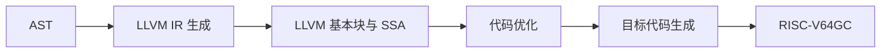

# 第三部分 · 中间代码生成

本部分只要求完成设计和实验报告，不要求提交独立的可编译程序。语法分析产生 AST 后，可以先经过选做的语义分析，再进入 LLVM IR 生成。最终报告必须说明 IR 的设计思路、数据结构、输出格式，以及每一种 ToyC 语法成分如何从 AST 转换为 LLVM IR。

## 一、IR 的作用与选择

AST 适合表达源语言结构，但不适合直接做机器无关优化或指令选择。中间表示把前端和后端隔开：前端生成 IR，优化器处理 IR，后端再把 IR 翻译为 RISC-V64GC。



本部分以 **LLVM IR 作为主要示例**，也可以使用自定义 IR；此时必须在报告中说明模块、函数、基本块、值、指令和控制流边的数据结构，以及如何降低到 RISC-V64GC。

## 二、LLVM IR 格式

```llvm
define i32 @add(i32 %a, i32 %b) {
entry:
    %sum = add i32 %a, %b
    ret i32 %sum
}
```

其中 `Module` 包含函数，函数包含基本块，基本块包含按顺序执行的指令；`%a`、`%b`
和 `%sum` 是 SSA 值，每个 SSA 值只定义一次。ToyC 的变量声明、赋值和表达式可以先
降低到 `alloca`、`load`、`store`，再通过 mem2reg 形成 SSA；条件和循环使用基本块、
条件分支和 `phi` 指令表达。

每个 SSA 临时值只能由一条指令定义；跳转目标使用基本块标签；函数调用必须保留参数顺序和副作用顺序。

### SSA 在本实验中的使用

SSA（Static Single Assignment，静态单赋值）要求每个 SSA 名称在一个函数中只定义一次。它不限制 ToyC 源变量的赋值次数，而是把每次赋值改成新的 SSA 值：

```c
x = a + 1;
x = x * 2;
```

```llvm
%x1 = add i32 %a, 1
%x2 = mul i32 %x1, 2
```

当控制流汇合时使用 `phi`：

```c
if (cond) x = 1;
else      x = 2;
return x;
```

```llvm
br i1 %cond, label %then, label %else
then:
    br label %join
else:
    br label %join
join:
    %x = phi i32 [ 1, %then ], [ 2, %else ]
    ret i32 %x
```

建议先用 `alloca`、`load`、`store` 表示 ToyC 局部变量，再选做地执行 mem2reg 转换为 SSA。这样实现顺序更简单：先保证地址和控制流正确，再处理 `phi` 插入。

## 三、符号表与作用域

### 嵌套作用域的数据结构

ToyC 允许在语句块 `{ ... }` 中声明局部变量，内层可以遮蔽外层同名变量。生成 IR 时需要维护**嵌套作用域栈**，每进入一个块压入新层，退出时弹出：

```text
SymbolTable {
    scopes: List[Dict[str, Symbol]]   // 嵌套作用域栈
    next_address: int                 // 下一个栈槽偏移
}

Symbol {
    name: str
    address: Value                     // alloca 产生的地址（alloca/load/store 模式）
    // 或者：value: Value             // SSA 模式（mem2reg 后）
    is_constant: bool
    scope_level: int                  // 所在作用域深度
}

CodegenContext {
    module: Module
    current_function: Function?
    current_block: BasicBlock
    symbol_table: SymbolTable
    loop_stack: List[LoopContext]     // (continue_block, break_block)
    next_ssa_id: int
}
```

```text
push_scope():
    symbol_table.scopes.append({})

pop_scope():
    symbol_table.scopes.pop()

declare(name, symbol):
    symbol_table.scopes.top[name] = symbol

lookup(name):
    for scope in reversed(symbol_table.scopes):
        if name in scope: return scope[name]
    error: "未声明的标识符: " + name
```

### 内层遮蔽外层的处理

```c
int x = 1;
{
    int x = 2;       // 遮蔽外层 x
    print(x);         // 引用内层 x = 2
}
print(x);             // 引用外层 x = 1
```

IR 生成时内层和外层各有一个 `alloca`，`lookup("x")` 从栈顶向下查找，总是找到最近声明的那个：

```llvm
%x.outer = alloca i32
store i32 1, ptr %x.outer
; 进入内层块
%x.inner = alloca i32          ; 新 alloca
store i32 2, ptr %x.inner
%v1 = load i32, ptr %x.inner   ; → 2
call @print(i32 %v1)
; 退出内层块（x.inner 超出作用域，可选保留或重用）
%v2 = load i32, ptr %x.outer  ; → 1
call @print(i32 %v2)
```

## 四、AST 到 LLVM IR 的转换逻辑

IR 生成器递归访问 AST，维护函数级上下文：

```text
CodegenContext {
    module: Module
    current_function: Function?
    current_block: BasicBlock
    symbol_table: SymbolTable
    loop_stack: List[LoopContext]
    next_ssa_id: int
}
```

整体流程：

1. 创建 LLVM Module，登记目标三元组和外部函数声明；
2. 为每个函数创建 `Function`、入口 `BasicBlock` 和形参映射；
3. 为局部变量创建 `alloca`，再访问初始化表达式并生成 `store`；
4. 表达式访问器返回 LLVM `Value`，必要时用 `load` 把内存地址转换为整数值；
5. 普通表达式按子树顺序产生 SSA 指令；条件表达式接收 true/false 两个目标基本块；
6. 语句访问器负责创建基本块和终结指令 `br`/`ret`；
7. 循环通过 `loop_stack` 解析 break/continue；
8. 验证每个基本块有正确的终结指令，并输出 LLVM IR。

```text
emit_program(AST):
    module = new Module("toyir")
    module.target_triple = "riscv64-unknown-elf"
    declare_external_functions(module)
    for func in AST.functions:
        emit_function(func, module)
    return module

emit_function(func_ast, module):
    func = module.add_function(func_ast.name, func_ast.return_type, func_ast.params)
    ctx.current_function = func
    ctx.current_block = func.new_block("entry")
    ctx.symbol_table.push_scope()
    bind_parameters(func_ast.params, func.arguments)
    emit_declarations(func_ast.body)
    emit_stmt(func_ast.body)
    emit_implicit_return_if_allowed(func_ast.return_type)
    ctx.symbol_table.pop_scope()
    verify(func)
```

### 分支目标的两种策略

LLVM IR 的分支目标必须在基本块创建后确定。有两种实现策略：

**策略一（推荐）：直接绑定**——先创建所有目标基本块，再生成跳转指令，目标块已存在：

```text
emit_stmt(If(cond, then_stmt, else_stmt)):
    then_lbl = new_label(); else_lbl = new_label(); end = new_label()
    emit_cond(cond, then_lbl, else_lbl)   ; 此时 then_lbl/else_lbl 已存在
    emit_label(then_lbl); emit_stmt(then_stmt); emit_br(end)
    emit_label(else_lbl)
    if else_stmt: emit_stmt(else_stmt)
    emit_br(end)
    emit_label(end)
```

**策略二（回填）**——先生成条件跳转，跳转指令的目标暂时未知，记录下来待目标块创建后填入（适合不想提前知道所有块名的实现）：

```text
pending_branches = []   ; (branch_instruction, which_target_is_pending)

create_pending_br(cond_val, true_target_name, false_target_name):
    br_inst = emit_cond_jump(cond_val)    ; 目标暂时填 null
    pending_branches.append((br_inst, true_target_name, false_target_name))

fill_target(label_name, block):
    for (br_inst, true_t, false_t) in pending_branches:
        if br_inst.true_target == label_name: br_inst.true_target = block
        if br_inst.false_target == label_name: br_inst.false_target = block
```

推荐使用策略一，代码更直观。

## 五、表达式转换

### 1. 整数常量

`NUMBER` 节点携带整数值，不需要生成加载指令：

```text
emit_expr(Number(n)): return Constant(n, i32)
```

```llvm
%x = alloca i32
store i32 42, ptr %x
```

### 2. 变量引用

变量引用必须在符号表中查找。引用返回变量对应的 SSA 地址值（alloca 模式）或 SSA 值（SSA 模式）：

```c
return x;
```

```llvm
%addr = load ptr, ptr @x_addr   ; 若是全局变量
%value = load i32, ptr %addr
ret i32 %value
```

### 3. 一元表达式

```text
emit_expr(Unary(op, operand)):
    value = emit_expr(operand)
    if op == '+': return value
    if op == '-': return emit(neg, value)
    if op == '!': return emit(xor, value, 1)
```

```llvm
; -(a + 1)
%t0 = load i32, ptr %a
%t1 = add i32 %t0, 1
%t2 = sub i32 0, %t1
```

### 4. 算术表达式

```text
emit_expr(Binary(op, left, right)):
    lv = emit_expr(left); rv = emit_expr(right)
    return emit_llvm_binary(op, lv, rv)
```

### 5. 关系表达式

关系运算结果为 0 或 1。`icmp` 返回 i1，需要用 `zext` 扩展到 i32：

```llvm
%cmp = icmp slt i32 %a, %b
%result = zext i1 %cmp to i32
```

### 6. 短路求值：逻辑与和逻辑或

`&&` 和 `||` 具有短路语义：求值过程中可能跳过部分子表达式，因此不能简单地递归生成值。

**关键区别**：

| 表达式类型 | `emit_expr` 返回 | `emit_cond` 跳转 |
| --- | --- | --- |
| 逻辑与 `a && b` | — | 若 a 假则跳 false_label，否则继续求值 b |
| 逻辑或 `a \|\| b` | — | 若 a 真则跳 true_label，否则继续求值 b |
| 关系表达式 `a < b` | 返回 SSA 值 | — |

`emit_cond` 接收两个跳转目标（真出口和假出口），不返回值：

```text
emit_cond(expr, true_lbl, false_lbl):
    match expr:
        And(lhs, rhs):
            rhs_lbl = new_label()
            emit_cond(lhs, rhs_lbl, false_lbl)
            emit_label(rhs_lbl)
            emit_cond(rhs, true_lbl, false_lbl)
        Or(lhs, rhs):
            rhs_lbl = new_label()
            emit_cond(lhs, true_lbl, rhs_lbl)
            emit_label(rhs_lbl)
            emit_cond(rhs, true_lbl, false_lbl)
        Relation(lhs, op, rhs):
            lv = emit_expr(lhs); rv = emit_expr(rhs)
            cmp = emit_icmp(op, lv, rv)         ; cmp 是 i1 SSA 值
            emit_br_cond(cmp, true_lbl, false_lbl)
        Variable(name):
            val = emit_expr(Variable(name))
            zero = Constant(0, i32)
            cmp = emit_icmp(ne, val, zero)
            emit_br_cond(cmp, true_lbl, false_lbl)
```

当 `x = a && b;` 需要把结果存入变量时，利用三个基本块收集结果：

```llvm
    %a_val = load i32, ptr %a
    %a_true = icmp ne i32 %a_val, 0
    br i1 %a_true, label %rhs, label %false
rhs:
    %b_val = load i32, ptr %b
    %b_true = icmp ne i32 %b_val, 0
    br i1 %b_true, label %true, label %false
true:
    store i32 1, ptr %x
    br label %end
false:
    store i32 0, ptr %x
    br label %end
end:
```

### 7. 条件表达式（三目运算符）

`a ? b : c` 可以翻译为 if-else 结构：

```c
result = cond ? then_val : else_val;
```

```llvm
    %cond_val = load i32, ptr %cond
    %cond_cmp = icmp ne i32 %cond_val, 0
    br i1 %cond_cmp, label %then, label %else
then:
    %bv = emit_expr(b)
    store i32 %bv, ptr %result
    br label %end
else:
    %ev = emit_expr(c)
    store i32 %ev, ptr %result
    br label %end
end:
```

## 六、语句转换

### 1. 变量声明与常量声明

变量声明可以包含多个声明项。先在当前作用域登记名字，再生成初始化表达式；无初始化则默认为 0：

```c
int x, y = a + 1;
```

```llvm
%x = alloca i32
%y = alloca i32
store i32 0, ptr %x
%a_val = load i32, ptr %a
%y_val = add i32 %a_val, 1
store i32 %y_val, ptr %y
```

```text
emit_stmt(VarDecl(items)):
    for item in items:
        addr = ctx.symbol_table.allocate(item.name, i32)  ; 创建 alloca
    for item in items:
        if item.initializer:
            val = emit_expr(item.initializer)
        else:
            val = Constant(0, i32)
        emit_store(val, item.name)
```

### 2. 赋值语句

```text
emit_stmt(Assign(name, value_ast)):
    value = emit_expr(value_ast)
    emit_store(value, name)
```

### 3. if-else

条件表达式使用 `emit_cond`，then/else 分支结束后跳到结束标签：

```c
if (x < 0) x = 0; else x = x + 1;
```

```llvm
    %x_val = load i32, ptr %x
    %cmp = icmp slt i32 %x_val, 0
    br i1 %cmp, label %then, label %else
then:
    store i32 0, ptr %x
    br label %end
else:
    %next = add i32 %x_val, 1
    store i32 %next, ptr %x
    br label %end
end:
```

### 4. else-if 链

连续的 `if-else-if-else` 结构，翻译为条件跳转的线性链：

```c
if (score >= 90) grade = 'A';
else if (score >= 80) grade = 'B';
else if (score >= 70) grade = 'C';
else grade = 'D';
```

```llvm
    %score_val = load i32, ptr %score
    %c1 = icmp sge i32 %score_val, 90
    br i1 %c1, label %case_a, label %elif1
case_a:
    store i8 65, ptr %grade
    br label %end
elif1:
    %c2 = icmp sge i32 %score_val, 80
    br i1 %c2, label %case_b, label %elif2
case_b:
    store i8 66, ptr %grade
    br label %end
elif2:
    %c3 = icmp sge i32 %score_val, 70
    br i1 %c3, label %case_c, label %else
case_c:
    store i8 67, ptr %grade
    br label %end
else:
    store i8 68, ptr %grade
    br label %end
end:
```

实现上，else-if 链在 AST 中本身就是嵌套的 If 节点（else 部分是另一个 If），递归 `emit_stmt` 自然处理，无需特殊逻辑。

### 5. while、break 和 continue

while 循环：先跳到条件入口，再决定进循环体还是退出：

```c
while (x > 0) x = x - 1;
```

```llvm
    br label %cond
cond:
    %x_val = load i32, ptr %x
    %cmp = icmp sgt i32 %x_val, 0
    br i1 %cmp, label %body, label %exit
body:
    %next = sub i32 %x_val, 1
    store i32 %next, ptr %x
    br label %cond
exit:
```

break 跳到循环退出块，continue 跳到循环条件块：

```text
emit_stmt(While(cond, body)):
    head = new_label(); body_lbl = new_label(); exit = new_label()
    ctx.loop_stack.push(exit, head)
    emit_br(head)
    emit_label(body_lbl)
    emit_stmt(body)
    emit_br(head)
    emit_label(exit)
    ctx.loop_stack.pop()

emit_stmt(Break):
    emit_br(ctx.loop_stack.top.exit)

emit_stmt(Continue):
    emit_br(ctx.loop_stack.top.head)
```

### 6. for 循环

ToyC 的 `for` 循环可以先改写为 while 再生成 IR：

```c
for (init; cond; step) body;
// 等价于
init;
while (cond) { body; step; }
```

### 7. return

```llvm
    %ret_val = emit_expr(expr)
    ret i32 %ret_val
```

## 七、外部函数声明

`getint`、`putint` 等运行时库函数在 ToyC 中以 `declare` 引入，不生成定义：

```llvm
declare i32 @getint()
declare i32 @putint(i32)
declare i32 @getch()
declare i32 @putch(i32)
```

```text
declare_external_functions(module):
    module.declare("getint",  i32, [])
    module.declare("putint",  i32, [i32])
    module.declare("getch",   i32, [])
    module.declare("putch",   i32, [i32])
    module.declare("putarray", i32, [i32, ptr])
    module.declare("getarray", i32, [ptr])
```

函数调用按从左到右生成实参：

```c
putint(add(a, b));
```

```llvm
    %a_val = load i32, ptr %a
    %b_val = load i32, ptr %b
    %sum = call i32 @add(i32 %a_val, i32 %b_val)
    call @putint(i32 %sum)
```

## 八、全局变量

ToyC 支持全局变量（在所有函数之外声明），生成 `global` + `alloca`（在 IR 中表示为全局地址）：

```c
int global_counter = 0;
int get_next() { global_counter = global_counter + 1; return global_counter; }
```

```llvm
@global_counter = global i32 0

define i32 @get_next() {
entry:
    %old = load i32, ptr @global_counter
    %new = add i32 %old, 1
    store i32 %new, ptr @global_counter
    ret i32 %new
}
```

## 九、mem2reg 简介（选做）

`alloca/load/store` 模式实现简单，但 `load` 和 `store` 阻断了 SSA 的 Use-Def 分析。mem2reg 识别"只通过 store 写入、只通过 load 读取、且不逃逸出函数"的局部变量，将内存访问提升为 SSA 值：

```llvm
; 优化前（alloca 模式）
%x = alloca i32
store i32 1, ptr %x
%v = load i32, ptr %x
ret i32 %v
```

```llvm
; 优化后（SSA 模式）
ret i32 1
```

mem2reg 的核心算法是 **dominance-based SSA construction**：
1. 计算每条指令的 dominance 树；
2. 为每个 alloca 计算"第一次 store 之前有 load"的"位置"（位置是一个基本块入口）；
3. 在这些位置插入 `phi` 函数；
4. 重命名所有 SSA 值。

mem2reg 不是本部分必做内容，但完成后可以显著简化后续的常量传播、死代码消除等优化。

## 十、完整转换示例

以下程序演示从 ToyC 源码到 LLVM IR 的完整转换路径：

```c
int factorial(int n) {
    int result = 1;
    int i = 1;
    while (i <= n) {
        if (n > 10) {
            result = 0;
        }
        result = result * i;
        i = i + 1;
    }
    return result;
}
```

```llvm
define i32 @factorial(i32 %n_arg) {
entry:
    %n = alloca i32
    store i32 %n_arg, ptr %n
    %result = alloca i32
    store i32 1, ptr %result
    %i = alloca i32
    store i32 1, ptr %i
    br label %while_cond

while_cond:
    %i_val = load i32, ptr %i
    %n_val = load i32, ptr %n
    %cmp = icmp sle i32 %i_val, %n_val
    br i1 %cmp, label %while_body, label %while_exit

while_body:
    %cond2_val = load i32, ptr %n
    %cmp2 = icmp sgt i32 %cond2_val, 10
    br i1 %cmp2, label %then, label %end_if
then:
    store i32 0, ptr %result
    br label %end_if
end_if:
    %r_val = load i32, ptr %result
    %i_val2 = load i32, ptr %i
    %prod = mul i32 %r_val, %i_val2
    store i32 %prod, ptr %result
    %i_val3 = load i32, ptr %i
    %next = add i32 %i_val3, 1
    store i32 %next, ptr %i
    br label %while_cond

while_exit:
    %ret_val = load i32, ptr %result
    ret i32 %ret_val
}
```

## 十一、报告要求

第三部分不提交独立源码或可执行文件。最终实验报告必须包含：

1. IR 选择理由，以及自定义 IR、LLVM IR 或 MLIR 的格式说明；
2. IR 的模块、函数、基本块、值和指令数据结构；
3. 符号表的数据结构、嵌套作用域如何管理内层遮蔽；
4. 每一种语法成分的文字解释、输入示例、输出 LLVM IR 和转换伪代码；
5. `emit_cond` 与 `emit_expr` 的区别，短路求值如何避免不必要的函数调用；
6. else-if 链的 AST 结构与翻译方式；
7. 至少一个包含嵌套条件、循环、函数调用和短路逻辑的完整转换示例；
8. IR 如何交给第四部分目标代码生成，以及如何在第五部分进行 IR 优化后再次生成代码。
