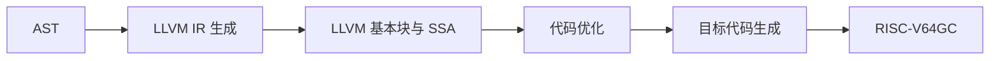
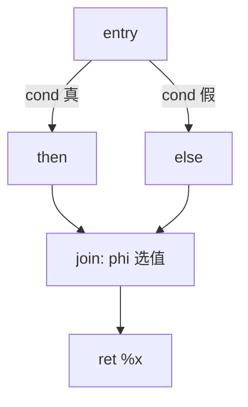
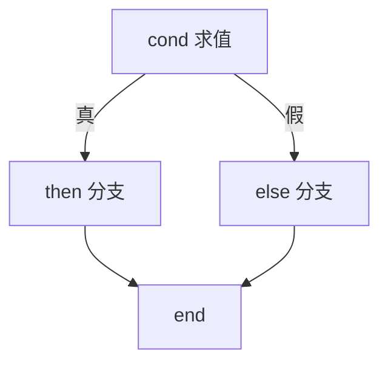
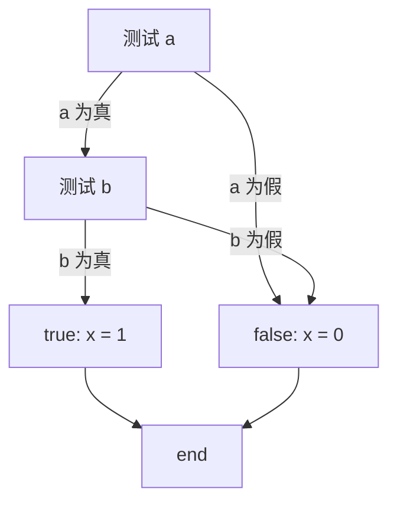
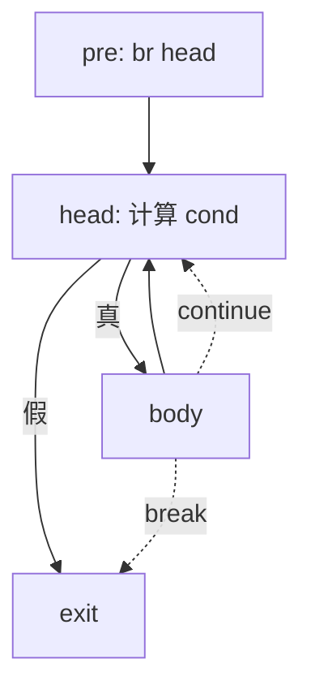
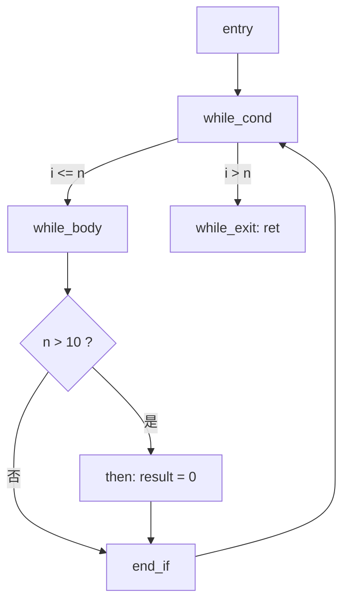

# 第三部分 · 中间代码生成

本部分只要求完成**设计和实验报告**，不要求提交独立的可编译程序。语法分析产生 AST 后，可以先经过选做的语义分析，再进入 LLVM IR 生成。最终报告必须说明 IR 的设计思路、数据结构、输出格式，以及每一种 ToyC 语法成分如何从 AST 转换为 LLVM IR。

:::tip[本节示例基于 LLVM IR]
下面所有示例都用 LLVM IR 编写，方便对照标准写法。这只是**参考**：你也可以设计并实现自己的**三地址码**（例如四元式 `(op, arg1, arg2, result)`）作为中间表示，只要在报告中说明它的数据结构，以及它如何降低到 RISC-V64GC 即可。
:::

## 一、IR 的作用与选择

AST 适合表达源语言结构，但不适合直接做机器无关优化或指令选择。中间表示把前端和后端隔开：前端生成 IR，优化器处理 IR，后端再把 IR 翻译为 RISC-V64GC。



**为什么不让 AST 直接生成汇编？** 因为这样每加一条优化、每换一个目标机器都要重写前端。引入 IR 后，"前端 → IR"只写一次，"IR 优化"是通用的，"IR → 目标机器"可以针对不同机器分别实现，三者解耦。

本部分以 **LLVM IR 作为主要示例**，也可以使用自定义 IR；此时必须在报告中说明模块、函数、基本块、值、指令和控制流边的数据结构，以及如何降低到 RISC-V64GC。

| 选择 | 优点 | 代价 |
| --- | --- | --- |
| LLVM IR | 现成的 SSA、优化器和工具链；语法规范 | 需要理解 SSA、phi 等概念 |
| 自定义 IR | 结构简单、可控 | 需要自己设计并实现全部优化 |

## 二、LLVM IR 格式

```llvm
define i32 @add(i32 %a, i32 %b) {
entry:
    %sum = add i32 %a, %b
    ret i32 %sum
}
```

其中 `Module` 包含函数，函数包含基本块，基本块包含按顺序执行的指令；`%a`、`%b` 和 `%sum` 是 SSA 值，**每个 SSA 值只定义一次**。ToyC 的变量声明、赋值和表达式可以先降低到 `alloca`、`load`、`store`，再通过 mem2reg 形成 SSA；条件和循环使用基本块、条件分支和 `phi` 指令表达。

关键约束：

- 每个 SSA 临时值只能由一条指令定义；
- 跳转目标使用基本块标签；
- 每个基本块必须以终结指令（`br` / `ret`）结尾；
- 函数调用必须保留参数顺序和副作用顺序。

### SSA 在本实验中的使用

SSA（Static Single Assignment，静态单赋值）要求每个 SSA 名称在一个函数中只定义一次。它**不限制 ToyC 源变量的赋值次数**，而是把每次赋值改写成一个新的 SSA 值：

```c
x = a + 1;
x = x * 2;
```

```llvm
%x1 = add i32 %a, 1
%x2 = mul i32 %x1, 2
```

当控制流汇合时，用 `phi` 指令按"从哪条边进来"选择值：

```c
if (cond) x = 1;
else      x = 2;
return x;
```

```llvm
    br i1 %cond, label %then, label %else
then:
    br label %join
else:
    br label %join
join:
    %x = phi i32 [ 1, %then ], [ 2, %else ]   ; 来自 then 取 1，来自 else 取 2
    ret i32 %x
```



:::tip[推荐实现顺序]
建议先用 `alloca`、`load`、`store` 表示 ToyC 局部变量，再选做地执行 mem2reg 转换为 SSA。这样实现顺序更简单：**先保证地址与控制流正确，再处理 `phi` 插入**。
:::

## 三、符号表与作用域

### 3.1 数据结构

ToyC 允许在语句块中声明局部变量，内层可以遮蔽外层同名变量。生成 IR 时需要维护**嵌套作用域栈**，每进入一个块压入新层，退出时弹出：

```
SymbolTable {
    scopes: List<Map<string, Symbol>>   // 嵌套作用域栈 / nested scope stack
    next_offset: int                    // 下一个栈槽偏移
}

Symbol {
    name: string
    address: Value                      // alloca 产生的地址（alloca/load/store 模式）
    // 或者：value: Value               // SSA 模式（mem2reg 后）
    is_constant: bool
    scope_level: int                    // 所在作用域深度
}
```

### 3.2 作用域操作

**算法 1 · 作用域栈操作（Scope Stack Operations）**

**输入（Input）：** 当前作用域栈 `scopes`、名称 `name`。
**输出（Output）：** 命中的符号，或报告"未声明"。

```
 1: pushScope():  scopes.push({});                    // 进入块：压入新层
 2: popScope():   scopes.pop();                       // 离开块：弹出
 3:
 4: declare(name, symbol):
 5:     scopes.top[name] = symbol;                     // 在当前层登记
 6:
 7: lookup(name):
 8:     for scope in reversed(scopes) do                // 从栈顶向下查找
 9:         if name in scope then return scope[name]; end if
10:     end for
11:     error("未声明的标识符: " + name);                // 都没找到 -> 报错
```

### 3.3 内层遮蔽外层的处理

```c
int x = 1;
{
    int x = 2;       // 遮蔽外层 x
    putint(x);        // 引用内层 x = 2
}
putint(x);            // 引用外层 x = 1
```

IR 生成时内层和外层各有一个 `alloca`，`lookup("x")` 从栈顶向下查找，总是找到最近声明的那个：

```llvm
%x.outer = alloca i32
store i32 1, ptr %x.outer
; 进入内层块
%x.inner = alloca i32            ; 新的 alloca
store i32 2, ptr %x.inner
%v1 = load i32, ptr %x.inner     ; -> 2
call void @putint(i32 %v1)
; 退出内层块（x.inner 超出作用域）
%v2 = load i32, ptr %x.outer     ; -> 1
call void @putint(i32 %v2)
```

## 四、AST 到 LLVM IR 的转换逻辑

IR 生成器递归访问 AST，并维护一个函数级的上下文：

```
CodegenContext {
    module: Module
    current_function: Function?
    current_block: BasicBlock
    symbol_table: SymbolTable
    loop_stack: List<LoopContext>     // (continue_block, break_block)
    next_ssa_id: int
}

LoopContext { head: BasicBlock, exit: BasicBlock }
```

**算法 2 · 程序整体生成（emitProgram）**

**输入（Input）：** 程序 AST 与已选定的目标三元组。
**输出（Output）：** 一个完整的 LLVM `Module`。

```
 1: emitProgram(ast):
 2:     module = new Module("toyir");
 3:     module.target_triple = "riscv64-unknown-elf";   // 目标平台 / target
 4:     declareExternalFunctions(module);                // 见第七节
 5:     emitGlobals(ast.globals, module);                // 全局变量 / global variables
 6:     for each func in ast.functions do
 7:         emitFunction(func, module);
 8:     end for
 9:     return module;
```

**算法 3 · 函数生成（emitFunction）**

**输入（Input）：** 函数 AST 节点 `func_ast` 与所属 `module`。
**输出（Output）：** 加入 module 的 LLVM 函数定义。

```
 1: emitFunction(func_ast, module):
 2:     fn = module.addFunction(func_ast.name, func_ast.return_type, func_ast.params);
 3:     ctx.current_function = fn;
 4:     ctx.current_block = fn.newBlock("entry");
 5:     ctx.symbol_table.pushScope();
 6:     bindParameters(func_ast.params, fn.arguments);   // 形参 -> alloca + store
 7:     emitStmt(func_ast.body);                          // 递归生成函数体
 8:     if func_ast.return_type == int then               // 保证基本块有终结指令
 9:         emitImplicitReturn(fn);                        // 语义检查保证所有路径有 return
10:     end if
11:     ctx.symbol_table.popScope();
12:     verify(fn);                                        // 检查每个块都有终结指令
```

### 4.1 分支目标的两种策略

LLVM IR 的分支目标必须在基本块创建后确定，因此有两种实现策略。

**策略一（推荐）：直接绑定**——先创建所有目标基本块，再生成跳转指令，此时目标块已存在：

**算法 4 · if-else 生成（直接绑定策略，Direct Binding）**

**输入（Input）：** `If` 节点的条件、then 语句、可选的 else 语句。
**输出（Output）：** 带基本块与终结指令的 IR。

```
 1: emitStmt(If(cond, then_stmt, else_stmt)):
 2:     then_lbl = newLabel();  else_lbl = newLabel();  end = newLabel();
 3:     emitCond(cond, then_lbl, else_lbl);        // 条件求值并跳转，见算法 8
 4:     emitLabel(then_lbl);  emitStmt(then_stmt);  emitBr(end);
 5:     emitLabel(else_lbl);
 6:     if else_stmt != none then emitStmt(else_stmt); end if
 7:     emitBr(end);
 8:     emitLabel(end);
```

对应控制流：



**策略二（回填）**——先生成条件跳转，跳转目标暂时未知，记录下来待目标块创建后填入：

```
pending_branches = []   // (branch_instruction, true_target_name, false_target_name)

createPendingBr(cond_val, true_name, false_name):
    br_inst = emitCondJump(cond_val);              // 目标暂时填 null
    pending_branches.append((br_inst, true_name, false_name));

fillTarget(label_name, block):                     // 目标块创建后调用
    for (br_inst, true_t, false_t) in pending_branches:
        if true_t  == label_name: br_inst.true_target  = block;
        if false_t == label_name: br_inst.false_target = block;
```

推荐使用**策略一**，代码更直观。

## 五、表达式转换

表达式访问器 `emit_expr` 返回一个 LLVM `Value`；短路逻辑等无法直接产生值的情况改用 `emit_cond`（接收真/假两个目标块，不返回值）。

**算法 5 · 表达式生成的通用结构（emit_expr）**

**输入（Input）：** 表达式 AST 节点。
**输出（Output）：** 表示该表达式结果的 LLVM `Value`。

```
 1: emitExpr(e):
 2:     match e:
 3:         Number(n):            return Constant(n, i32);        // 常量，无需加载
 4:         Variable(name):       return loadVar(lookup(name));   // 从内存/SSA 取值
 5:         Unary(op, x):         return emitUnary(op, emitExpr(x));
 6:         Binary(op, l, r):     return emitBinary(op, emitExpr(l), emitExpr(r));
 7:         Relation(l, op, r):   return zext(emitICmp(op, emitExpr(l), emitExpr(r)));  // i1 -> i32
 8:         Call(name, args):     return emitCall(name, map(emitExpr, args));
 9:     end match
```

### 5.1 一元表达式

```
emitUnary(op, v):
    if op == '+': return v;                       // 不变 / identity
    if op == '-': return emit(neg, v);
    if op == '!': return emit(xor, v, 1);         // 逻辑非：0/1 取反
```

```llvm
; -(a + 1)
%t0 = load i32, ptr %a
%t1 = add i32 %t0, 1
%t2 = sub i32 0, %t1
```

### 5.2 关系表达式

关系运算的结果是 0 或 1。`icmp` 返回 `i1`，需要用 `zext` 扩展到 `i32`：

```llvm
%cmp = icmp slt i32 %a, %b
%result = zext i1 %cmp to i32
```

### 5.3 短路求值：逻辑与和逻辑或

`&&` 和 `||` 具有**短路语义**：求值过程中可能跳过部分子表达式。因此它们不能简单地递归生成值，而要用**带真/假出口的条件生成**方式处理。

| 表达式类型 | `emit_expr` | `emit_cond` 的跳转行为 |
| --- | --- | --- |
| 逻辑与 `a && b` | — | 若 `a` 为假 → 跳假出口；否则继续求值 `b` |
| 逻辑或（`a`、`b` 用两个竖线连接） | — | 若 `a` 为真 → 跳真出口；否则继续求值 `b` |
| 关系表达式 `a < b` | 返回 SSA 值 | 比较后直接跳真/假出口 |

**算法 6 · 条件生成与短路（emit_cond with Short-Circuit）**

**输入（Input）：** 条件表达式 `expr`、真出口标签 `true_lbl`、假出口标签 `false_lbl`。
**输出（Output）：** 生成的条件跳转（无返回值）。

```
 1: emitCond(expr, true_lbl, false_lbl):
 2:     match expr:
 3:         And(lhs, rhs):
 4:             rhs_lbl = newLabel();
 5:             emitCond(lhs, rhs_lbl, false_lbl);       // lhs 假 -> 直接走假出口
 6:             emitLabel(rhs_lbl);
 7:             emitCond(rhs, true_lbl, false_lbl);      // 还要看 rhs
 8:         Or(lhs, rhs):
 9:             rhs_lbl = newLabel();
10:             emitCond(lhs, true_lbl, rhs_lbl);        // lhs 真 -> 直接走真出口
11:             emitLabel(rhs_lbl);
12:             emitCond(rhs, true_lbl, false_lbl);
13:         Relation(l, op, r):
14:             cmp = emitICmp(op, emitExpr(l), emitExpr(r));   // cmp 是 i1 SSA 值
15:             emitBrCond(cmp, true_lbl, false_lbl);
16:         Variable(name):
17:             cmp = emitICmp(ne, emitExpr(Variable(name)), Constant(0, i32));  // 非零为真
18:             emitBrCond(cmp, true_lbl, false_lbl);
19:     end match
```

短路图示（`x = a && b;`）：



当需要把 `a && b` 的结果存入变量时，用三个基本块收集结果：

```llvm
    %a_val = load i32, ptr %a
    %a_true = icmp ne i32 %a_val, 0
    br i1 %a_true, label %rhs, label %false
rhs:
    %b_val = load i32, ptr %b
    %b_true = icmp ne i32 %b_val, 0
    br i1 %b_true, label %true, label %false
true:
    store i32 1, ptr %x
    br label %end
false:
    store i32 0, ptr %x
    br label %end
end:
```


## 六、语句转换

**算法 7 · 变量声明与赋值（VarDecl / Assign）**

**输入（Input）：** 声明节点或赋值节点。
**输出（Output）：** `alloca`、初始化 `store` 及赋值 `store`。

```
 1: emitStmt(VarDecl(items)):
 2:     for item in items do
 3:         ctx.symbol_table.declare(item.name, alloca(i32));   // 先登记名字，分配栈槽
 4:     end for
 5:     for item in items do
 6:         if item.initializer != none then
 7:             val = emitExpr(item.initializer);
 8:         else
 9:             val = Constant(0, i32);                          // 无初始化则默认 0
10:         end if
11:         emitStore(val, lookupAddress(item.name));
12:     end for
13:
14: emitStmt(Assign(name, value_ast)):
15:     emitStore(emitExpr(value_ast), lookupAddress(name));
```

```c
int x, y = a + 1;
```

```llvm
%x = alloca i32
%y = alloca i32
store i32 0, ptr %x
%a_val = load i32, ptr %a
%y_val = add i32 %a_val, 1
store i32 %y_val, ptr %y
```

### 6.1 if-else 与 else-if 链

`if-else` 的翻译见算法 4。连续的 `if-else-if-else` 链在 AST 中本身就是**嵌套的 If 节点**（else 部分又是另一个 If），递归 `emitStmt` 自然处理，无需特殊逻辑：

```c
if (score >= 90) grade = 65;
else if (score >= 80) grade = 66;
else grade = 67;
```

```llvm
    %score_val = load i32, ptr %score
    %c1 = icmp sge i32 %score_val, 90
    br i1 %c1, label %case_a, label %elif1
case_a:
    store i32 65, ptr %grade
    br label %end
elif1:
    %c2 = icmp sge i32 %score_val, 80
    br i1 %c2, label %case_b, label %else
case_b:
    store i32 66, ptr %grade
    br label %end
else:
    store i32 67, ptr %grade
    br label %end
end:
```

### 6.2 while、break 与 continue

**算法 8 · while / break / continue 生成（Loop Generation）**

**输入（Input）：** `While` 节点的条件与循环体。
**输出（Output）：** 循环的基本块结构。

```
 1: emitStmt(While(cond, body)):
 2:     head = newLabel();  body_lbl = newLabel();  exit = newLabel();
 3:     ctx.loop_stack.push(LoopContext(head, exit));      // 供 break/continue 使用
 4:     emitLabel(head);
 5:     emitCond(cond, body_lbl, exit);                     // 条件为真进循环，否则退出
 6:     emitLabel(body_lbl);
 7:     emitStmt(body);
 8:     emitBr(head);                                       // 回到条件入口
 9:     emitLabel(exit);
10:     ctx.loop_stack.pop();
11:
12: emitStmt(Break):     emitBr(ctx.loop_stack.top.exit);   // 跳出循环
13: emitStmt(Continue):  emitBr(ctx.loop_stack.top.head);   // 跳到条件判断
```




### 6.3 return

```
 1: emitStmt(Return(expr)):
 2:     if expr == none then emit("ret void");
 3:     else emit("ret i32 " + emitExpr(expr)); end if
```

## 七、外部函数声明

`getint`、`putint` 等运行时库函数在 ToyC 中以 `declare` 引入，不生成定义：

```llvm
declare i32 @getint()
declare void @putint(i32)
declare i32 @getch()
declare void @putch(i32)
```

```
declareExternalFunctions(module):
    module.declare("getint",  i32,  []);
    module.declare("putint",  void, [i32]);
    module.declare("getch",   i32,  []);
    module.declare("putch",   void, [i32]);
```

函数调用按**从左到右**生成实参（保留副作用顺序）：

```c
putint(add(a, b));
```

```llvm
    %a_val = load i32, ptr %a
    %b_val = load i32, ptr %b
    %sum = call i32 @add(i32 %a_val, i32 %b_val)
    call void @putint(i32 %sum)
```

## 八、全局变量

ToyC 支持全局变量（在所有函数之外声明），生成全局定义的地址：

```c
int global_counter = 0;
int get_next() { global_counter = global_counter + 1; return global_counter; }
```

```llvm
@global_counter = global i32 0

define i32 @get_next() {
entry:
    %old = load i32, ptr @global_counter
    %new = add i32 %old, 1
    store i32 %new, ptr @global_counter
    ret i32 %new
}
```

## 九、mem2reg 简介（选做）

`alloca/load/store` 模式实现简单，但 `load` 和 `store` 阻断了 SSA 的 Use-Def 分析。mem2reg 识别"只通过 store 写入、只通过 load 读取、且不逃逸出函数"的局部变量，把内存访问提升为 SSA 值：

```llvm
; 优化前（alloca 模式）
%x = alloca i32
store i32 1, ptr %x
%v = load i32, ptr %x
ret i32 %v
```

```llvm
; 优化后（SSA 模式）
ret i32 1
```

**算法 9 · mem2reg（dominance-based SSA construction，选做）**

**输入（Input）：** 采用 alloca/load/store 的函数 `func`。
**输出（Output）：** 消除可提升 alloca 后的 SSA 形式函数。

```
 1: mem2reg(func):
 2:     DT = computeDominanceTree(func);                // 1. 计算支配树
 3:     for each alloca a in func do
 4:         if not promotable(a) then continue; end if    // 只处理不逃逸的局部变量
 5:         S = computePhiPlacement(a, DT);               // 2. 计算需要插入 phi 的基本块入口
 6:         for block in S do insertPhi(block, a); end for // 3. 插入 phi
 7:     end for
 8:     renameValues(func, DT);                           // 4. 重命名所有 SSA 值（栈式重命名）
 9:     removeDeadAllocas(func);
```

mem2reg 不是本部分必做内容，但完成后可以显著简化第五部分的常量传播、死代码消除等优化。

## 十、完整转换示例

以下程序演示从 ToyC 源码到 LLVM IR 的完整转换路径：

```c
int factorial(int n) {
    int result = 1;
    int i = 1;
    while (i <= n) {
        if (n > 10) {
            result = 0;
        }
        result = result * i;
        i = i + 1;
    }
    return result;
}
```

```llvm
define i32 @factorial(i32 %n_arg) {
entry:
    %n = alloca i32
    store i32 %n_arg, ptr %n
    %result = alloca i32
    store i32 1, ptr %result
    %i = alloca i32
    store i32 1, ptr %i
    br label %while_cond

while_cond:
    %i_val = load i32, ptr %i
    %n_val = load i32, ptr %n
    %cmp = icmp sle i32 %i_val, %n_val
    br i1 %cmp, label %while_body, label %while_exit

while_body:
    %cond2_val = load i32, ptr %n
    %cmp2 = icmp sgt i32 %cond2_val, 10
    br i1 %cmp2, label %then, label %end_if
then:
    store i32 0, ptr %result
    br label %end_if
end_if:
    %r_val = load i32, ptr %result
    %i_val2 = load i32, ptr %i
    %prod = mul i32 %r_val, %i_val2
    store i32 %prod, ptr %result
    %i_val3 = load i32, ptr %i
    %next = add i32 %i_val3, 1
    store i32 %next, ptr %i
    br label %while_cond

while_exit:
    %ret_val = load i32, ptr %result
    ret i32 %ret_val
}
```



## 十一、报告要求

第三部分不提交独立源码或可执行文件。最终实验报告必须包含：

1. IR 选择理由，以及自定义 IR、LLVM IR 或 MLIR 的格式说明；
2. IR 的模块、函数、基本块、值和指令数据结构；
3. 符号表的数据结构，以及嵌套作用域如何管理内层遮蔽；
4. 每一种语法成分的文字解释、输入示例、输出 LLVM IR 和转换伪代码；
5. `emit_cond` 与 `emit_expr` 的区别，短路求值如何避免不必要的函数调用；
6. else-if 链的 AST 结构与翻译方式；
7. 至少一个包含嵌套条件、循环、函数调用和短路逻辑的完整转换示例；
8. IR 如何交给第四部分目标代码生成，以及如何在第五部分进行 IR 优化后再次生成代码。