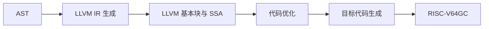

# 第三部分 · 中间代码生成

本部分只要求完成设计和实验报告，不要求提交独立的可编译程序。语法分析产生 AST 后，可以先经过选做的语义分析，再进入 LLVM IR 生成。最终报告必须说明 IR 的设计思路、数据结构、输出格式，以及每一种 ToyC 语法成分如何从 AST 转换为 LLVM IR。

## 一、IR 的作用与选择

AST 适合表达源语言结构，但不适合直接做机器无关优化或指令选择。中间表示把前端和后端隔开：前端生成 IR，优化器处理 IR，后端再把 IR 翻译为 RISC-V64GC。



本部分以 **LLVM IR 作为主要示例**，并在 [LLVM IR 与 MLIR 参考](../reference/llvm-mlir.md) 中先介绍两者的结构和取舍。也可以使用自定义 IR；此时必须在报告中说明模块、函数、基本块、值、指令、类型和控制流边的数据结构，以及如何降低到 RISC-V64GC。

LLVM IR 示例：

```llvm
define i32 @add(i32 %a, i32 %b) {
entry:
    %sum = add i32 %a, %b
    ret i32 %sum
}
```

其中 `Module` 包含函数，函数包含基本块，基本块包含按顺序执行的指令；`%a`、`%b`
和 `%sum` 是 SSA 值，每个 SSA 值只定义一次。ToyC 的变量声明、赋值和表达式可以先
降低到 `alloca`、`load`、`store`，再通过 mem2reg 形成 SSA；条件和循环使用基本块、
条件分支和 `phi` 指令表达。

## 二、LLVM IR 格式

本部分的示例统一使用 LLVM IR 文本格式，而不是四元式。LLVM IR 中，函数由基本块组成，基本块由指令组成；计算结果是 SSA 值，内存变量通过指针、`alloca`、`load` 和 `store` 表示。

```llvm
define i32 @add(i32 %a, i32 %b) {
entry:
    %sum = add i32 %a, %b
    ret i32 %sum
}
```

例如 `a = b + c * d;` 可以表示为：

```llvm
%t0 = load i32, ptr %c
%t1 = load i32, ptr %d
%t2 = mul i32 %t0, %t1
%t3 = load i32, ptr %b
%t4 = add i32 %t3, %t2
store i32 %t4, ptr %a
```

建议的数据结构：

```text
Value       { name, llvm_type, definition, uses }
Instruction { opcode, operands, result?, attributes, source_location }
BasicBlock  { label, instructions, predecessors, successors }
Function    { name, params, return_type, blocks }
Module      { target_triple, globals, declarations, functions }
```

每个 SSA 临时值只能由一条指令定义；跳转目标使用基本块标签；函数调用必须保留参数顺序和副作用顺序。

### SSA 在本实验中的使用

SSA（Static Single Assignment，静态单赋值）要求每个 SSA 名称在一个函数中只定义一次。它不限制 ToyC 源变量的赋值次数，而是把每次赋值改成新的 SSA 值：

```c
x = a + 1;
x = x * 2;
```

```llvm
%x1 = add i32 %a, 1
%x2 = mul i32 %x1, 2
```

当控制流汇合时使用 `phi`：

```c
if (cond) x = 1;
else      x = 2;
return x;
```

```llvm
br i1 %cond, label %then, label %else
then:
    br label %join
else:
    br label %join
join:
    %x = phi i32 [ 1, %then ], [ 2, %else ]
    ret i32 %x
```

建议先用 `alloca`、`load`、`store` 表示 ToyC 局部变量，再选做地执行 mem2reg 转换为 SSA。这样实现顺序更简单：先保证地址和控制流正确，再处理 `phi` 插入、Use-Def 链和 SSA 验证。

## 三、AST 到 LLVM IR 的转换逻辑

IR 生成器不是把 AST 文本逐行改写，而是递归访问 AST，并维护一个函数级生成上下文：

```text
CodegenContext {
    current_function
    current_block
    symbol_to_address
    next_ssa_id
    loop_stack: (continue_block, break_block)*
}
```

整体转换顺序如下：

1. 创建 LLVM Module，登记函数声明和外部函数声明；
2. 为每个函数创建 `Function`、入口 `BasicBlock` 和形参映射；
3. 先为局部变量创建 `alloca` 地址，再访问初始化表达式并生成 `store`；
4. 表达式访问器返回一个 LLVM `Value`，必要时用 `load` 把内存地址转换为整数值；
5. 普通表达式按子树顺序产生 SSA 指令，条件表达式则接收 true/false 两个目标基本块；
6. 语句访问器负责创建基本块和终结指令 `br`/`ret`，循环通过 `loop_stack` 解析 break/continue；
7. 验证每个基本块有正确的终结指令、每个 SSA 值只有一个定义，并输出 LLVM IR。

```text
emit_function(function_ast):
    function = module.add_function(function_ast.signature)
    context.current_function = function
    context.current_block = function.new_block("entry")
    enter_scope()
    bind_parameters(function_ast.params)
    emit_declarations_and_allocas(function_ast.body)
    emit_stmt(function_ast.body)
    emit_implicit_return_if_allowed(function_ast.return_type)
    leave_scope()
    verify(function)

emit_expr(expr):
    visit children from left to right
    return an LLVM SSA Value or a constant

emit_stmt(stmt):
    create or select basic blocks as needed
    emit LLVM instructions
    ensure current block ends with br or ret
```

LLVM IR 的分支目标必须在基本块创建后确定。与四元式回填不同，推荐直接先创建 `then`、`else` 和 `end` 基本块，再把 `br` 指令的目标绑定到这些块；如果实现采用延迟创建，也可以保存待绑定的 `BranchInst` 列表，待目标块生成后统一设置。

## 四、表达式转换

### 1. 整数常量

`NUMBER` 节点已经携带整数值，不需要生成加载指令。比如 `int x = 42;` 可以直接把立即数存入变量的栈槽：

```text
emit_expr(Number(n)):
    return Immediate(n)
```

```llvm
%x = alloca i32
store i32 42, ptr %x
```

### 2. 变量引用

变量引用必须先在符号表中查找，确认变量已经声明。引用本身不产生计算，只返回变量对应的 IR 值；如果变量存储在内存中，则在后端或降低阶段补充 load。

```c
return x;
```

```llvm
%value = load i32, ptr %x
ret i32 %value
```

```text
emit_expr(Variable(name)):
    symbol = lookup(name)
    require symbol exists
    return symbol.value
```

### 3. 一元表达式

一元加号不改变值；一元负号生成 `neg`；逻辑非先把操作数转换为布尔值，再生成 `not` 或与零比较。`-(a + 1)` 必须先生成加法，再生成取负：

```llvm
%t0 = load i32, ptr %a
%t1 = add i32 %t0, 1
%t2 = sub i32 0, %t1
```

```text
emit_expr(Unary(op, operand)):
    value = emit_expr(operand)
    if op == '+': return value
    temp = new_temp()
    emit_llvm_unary(op, value, temp)
    return temp
```

### 4. 算术表达式

二元算术表达式先递归生成左、右子表达式，再创建临时值。`a + b * c` 的 AST 根是 `+`，右子树先产生：

```llvm
%t0 = load i32, ptr %b
%t1 = load i32, ptr %c
%t2 = mul i32 %t0, %t1
%t3 = load i32, ptr %a
%t4 = add i32 %t3, %t2
```

```text
emit_expr(Binary(op, left_ast, right_ast)):
    left = emit_expr(left_ast)
    right = emit_expr(right_ast)
    temp = new_temp()
    emit_llvm_binary(op, left, right, temp)
    return temp
```

### 5. 关系表达式

关系运算结果为 `0/1`。例如 `x = a < b;`：

```llvm
%left = load i32, ptr %a
%right = load i32, ptr %b
%cmp = icmp slt i32 %left, %right
%value = zext i1 %cmp to i32
store i32 %value, ptr %x
```

```text
emit_expr(Relation(op, left_ast, right_ast)):
    left = emit_expr(left_ast)
    right = emit_expr(right_ast)
    temp = new_temp()
    emit_llvm_compare(op, left, right, temp)
    return temp
```

### 6. 逻辑与和逻辑或

`&&` 和 `||` 具有短路语义。`a && f()` 中 `a` 为零时不能调用 `f()`；`a || f()` 中 `a` 非零时不能调用 `f()`。因此条件上下文使用 `true_label` 和 `false_label`：

```text
emit_cond(And(lhs, rhs), true_label, false_label):
    rhs_label = new_label()
    emit_cond(lhs, rhs_label, false_label)
    emit_label(rhs_label)
    emit_cond(rhs, true_label, false_label)

emit_cond(Or(lhs, rhs), true_label, false_label):
    rhs_label = new_label()
    emit_cond(lhs, true_label, rhs_label)
    emit_label(rhs_label)
    emit_cond(rhs, true_label, false_label)
```

逻辑表达式出现在赋值右侧时，在 true 标签用 `store i32 1` 写入结果，在 false 标签用 `store i32 0` 写入结果，再跳到同一结束标签。例如 `x = a && b;`：

```llvm
%a_value = load i32, ptr %a
%a_true = icmp ne i32 %a_value, 0
br i1 %a_true, label %and_rhs, label %logic_false
and_rhs:
    %b_value = load i32, ptr %b
    %b_true = icmp ne i32 %b_value, 0
    br i1 %b_true, label %logic_true, label %logic_false
logic_true:
    store i32 1, ptr %x
    br label %logic_end
logic_false:
    store i32 0, ptr %x
    br label %logic_end
logic_end:
```

## 五、语句转换

### 1. 变量声明与常量声明

变量声明可以包含多个声明项，每一项的初始化表达式都是可选的。先在当前作用域登记名字，再分别生成存在的初始化表达式；没有初始化表达式的变量按文法约定获得默认值 `0`，或者由实现明确规定为未初始化状态。

```c
int x, y = a + 1;
```

```llvm
%x = alloca i32
%y = alloca i32
store i32 0, ptr %x
%a_value = load i32, ptr %a
%y_value = add i32 %a_value, 1
store i32 %y_value, ptr %y
```

```text
emit_decl(VarDecl(items)):
    for item in items:
        declare_current_scope(item.name)
    for item in items:
        value = emit_expr(item.initializer) if item.initializer exists else Immediate(0)
        emit_llvm_store(value, item.name)
```

常量声明的每一项都必须有初始化表达式，并在符号表中标记为不可写。比如：

```c
const int limit = 10, step = 2;
```

```llvm
%limit = alloca i32
%step = alloca i32
store i32 10, ptr %limit
store i32 2, ptr %step
```

```text
emit_decl(ConstDecl(items)):
    for item in items:
        require item.initializer exists
        declare_const_current_scope(item.name)
    for item in items:
        value = emit_expr(item.initializer)
        emit_llvm_store(value, item.name)
```

### 2. 赋值语句

赋值左侧必须是已声明变量，右侧先求值，再覆盖左侧。`x = f(a) + 1;`：

```llvm
%a_value = load i32, ptr %a
%call = call i32 @f(i32 %a_value)
%result = add i32 %call, 1
store i32 %result, ptr %x
```

```text
emit_stmt(Assign(name, value_ast)):
    require_declared(name)
    value = emit_expr(value_ast)
    emit_llvm_store(value, name)
```

### 3. 表达式语句和空语句

空语句 `;` 不生成 IR。表达式语句仍要保留副作用，例如 `f();` 必须保留调用；无副作用的无用计算可在优化阶段删除。

```text
emit_stmt(Empty): return
emit_stmt(ExprStmt(expr)): emit_expr(expr)
```

### 4. 函数调用

调用表达式按从左到右生成实参，再发出参数和调用指令。int 函数将结果写入临时值；void 函数没有结果，不能作为赋值右值或条件值。

```c
x = add(a, b);
```

```llvm
%a_value = load i32, ptr %a
%b_value = load i32, ptr %b
%result = call i32 @add(i32 %a_value, i32 %b_value)
store i32 %result, ptr %x
```

```text
emit_expr(Call(name, args)):
    require_function(name)
    values = [emit_expr(arg) for arg in args]
    result = new_ssa_value() if returns_int(name) else none
    emit_llvm_call(name, values, result)
    return result
```

### 5. if-else

条件表达式使用 `emit_cond` 生成两个分支。then 分支结束后跳过 else；没有 else 时，false 标签直接作为结束位置。

```c
if (x < 0) x = 0; else x = x + 1;
```

```llvm
%x_value = load i32, ptr %x
%cond = icmp slt i32 %x_value, 0
br i1 %cond, label %then, label %else
then:
    store i32 0, ptr %x
    br label %end
else:
    %next = add i32 %x_value, 1
    store i32 %next, ptr %x
    br label %end
end:
```

```text
emit_stmt(If(cond, then_stmt, else_stmt)):
    then_label = new_label(); else_label = new_label(); end = new_label()
    emit_cond(cond, then_label, else_label)
    emit_label(then_label); emit_stmt(then_stmt)
    emit_llvm_br(end)
    emit_label(else_label)
    if else_stmt exists: emit_stmt(else_stmt)
    emit_label(end)
```

### 6. while、break 和 continue

while 先回到条件入口，再决定进入循环体还是退出。循环栈保存当前循环的退出标签和条件标签：`break` 跳到退出标签，`continue` 跳到条件标签。以 `while (x > 0) x = x - 1;` 为例：

```llvm
br label %while_cond
while_cond:
    %x_value = load i32, ptr %x
    %cond = icmp sgt i32 %x_value, 0
    br i1 %cond, label %while_body, label %while_exit
while_body:
    %next = sub i32 %x_value, 1
    store i32 %next, ptr %x
    br label %while_cond
while_exit:
```

```text
emit_stmt(While(cond, body)):
    head = new_label(); body_label = new_label(); exit = new_label()
    emit_label(head)
    emit_cond(cond, body_label, exit)
    emit_label(body_label)
    loop_stack.push(exit, head)
    emit_stmt(body)
    loop_stack.pop()
    emit_llvm_br(head)
    emit_label(exit)

emit_stmt(Break): emit_llvm_br(loop_stack.top.exit)
emit_stmt(Continue): emit_llvm_br(loop_stack.top.head)
```

### 7. return

return 先生成返回表达式，再发出 `return`。int 函数必须返回 int，void 函数不能带返回值；这些约束由语义分析检查，IR 生成阶段也应拒绝不一致的 AST。

```llvm
%result = load i32, ptr %x
ret i32 %result
```

```text
emit_stmt(Return(expr)):
    require_current_function_returns_int()
    value = emit_expr(expr)
    emit_llvm_ret(value)
```

## 六、报告要求

第三部分不提交独立源码或可执行文件。最终实验报告必须包含：

1. IR 选择理由，以及自定义 IR、LLVM IR 或 MLIR 的格式说明；
2. IR 的模块、函数、基本块、值和指令数据结构；
3. 每一种语法成分的文字解释、输入示例、输出 LLVM IR 和转换伪代码；
4. 至少一个包含嵌套条件、循环、函数调用和短路逻辑的完整转换示例；
5. IR 如何交给第四部分目标代码生成，以及如何在第五部分进行 IR 优化后再次生成代码。
