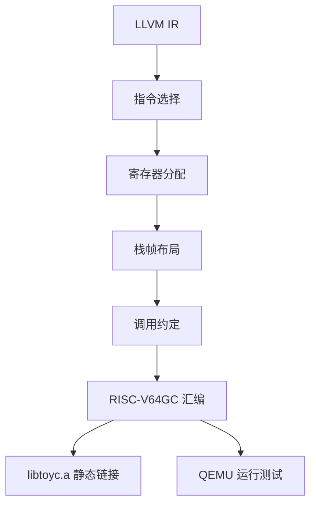
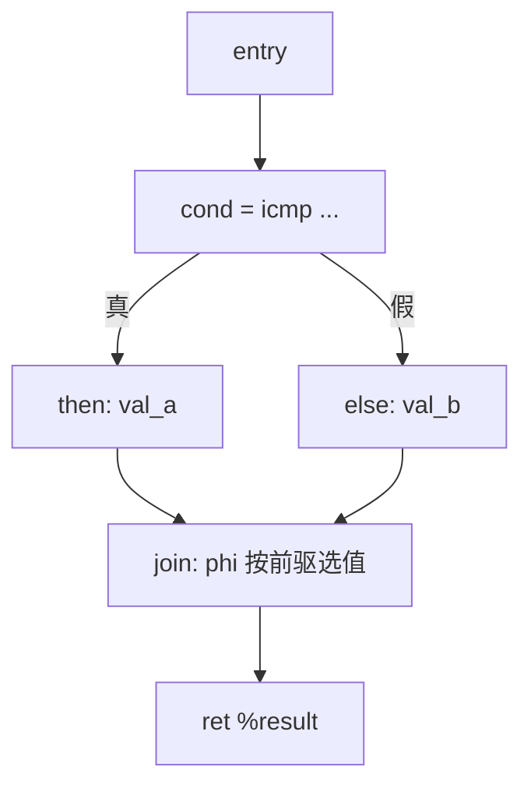
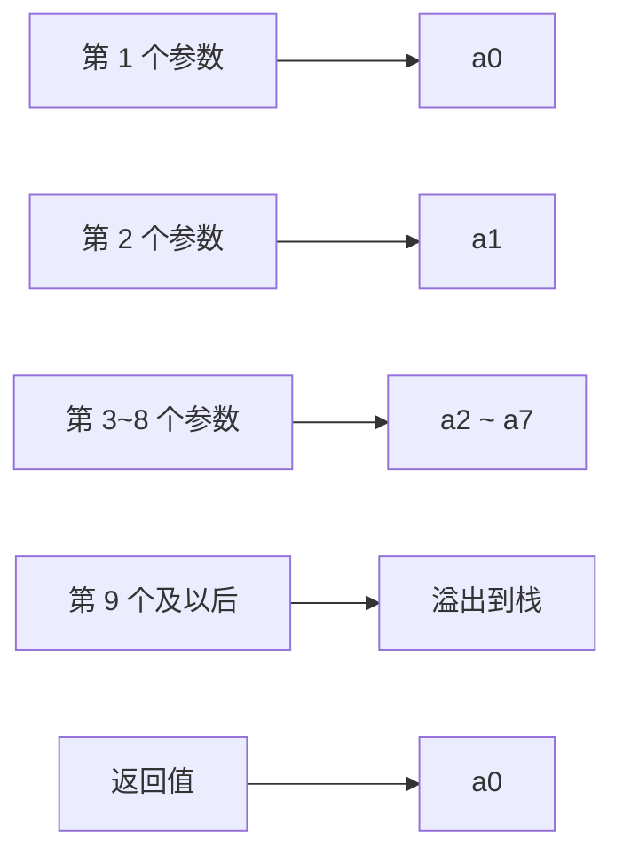

# 第四部分 · 目标代码生成

本部分把第三部分生成的 LLVM IR 翻译为可运行的 RISC-V64GC 汇编。先完成正确的基线后端，再在第五、六部分分别优化 IR 和目标代码。尽管我们把寄存器分配放在了优化部分，但实现寄存器分配的编译器尚且才算一个完整的编译器，因此完成该部分实验，你们必须要实现一种寄存器分配算法。

:::tip[先建立直觉]
目标代码生成是编译的最后一步：把与机器无关的 IR 变成能在 RISC-V 上运行的汇编，主要解决三件事——用哪些指令、每个值放进哪个寄存器、放不下的值放到栈里的什么位置。
:::



## 一、整体流程

后端按"模块 → 函数 → 基本块 → 指令"四级递归处理：

**算法 1 · 后端整体流程（Module → Function → Block）**

**输入（Input）：** LLVM `module`（或自定义 IR）。
**输出（Output）：** RISC-V64GC 汇编文本。

```
 1: codegenModule(module):
 2:     output(".text");
 3:     for each func in module.functions do
 4:         if is_declaration(func) then continue; end if   // 只有声明，跳过
 5:         codegenFunction(func);
 6:     end for
 7:
 8: codegenFunction(func):
 9:     frame = computeFrameLayout(func);        // 第 3 步：先算栈帧（算法 5）
10:     emitPrologue(func, frame);               // 第 1 步：序言（算法 6）
11:     for each block in func.blocks do
12:         codegenBlock(block);                 // 第 2 步：逐块翻译
13:     end for
14:     emitEpilogue(func, frame);               // 第 4 步：尾声
15:
16: codegenBlock(block):
17:     emitLabel(block.name);
18:     for each instr in block.instructions do
19:         codegenInstruction(instr);           // 见算法 3
20:     end for
21:     emitTerminator(block.terminator);        // br / ret
```

:::warning[重要原则]
**寄存器分配和栈帧布局的顺序不能颠倒**——必须先确定哪些值需要 spill 到栈上，再决定栈帧大小和偏移量。
:::

## 二、指令选择

指令选择是后端的核心：把 LLVM IR 的每条指令映射为一条或多条 RISC-V 指令。映射关系并非总是一对一，需要分情况处理。

### 2.1 一对一映射（简单情况）

大多数算术和比较指令可以一一对应：

| LLVM IR | RISC-V | 说明 |
| --- | --- | --- |
| `add i32 %a, %b` | `add a0, a0, a1` | 32 位加法 |
| `sub i32 %a, %b` | `sub a0, a0, a1` | 32 位减法 |
| `mul i32 %a, %b` | `mul a0, a0, a1` | 乘法 |
| `sdiv i32 %a, %b` | `divw a0, a0, a1` | 有符号除法 |
| `srem i32 %a, %b` | `remw a0, a0, a1` | 取模 |
| `icmp slt i32 %a, %b` | `slt a0, a0, a1` | 小于比较 |
| `icmp sgt ...` | `sgt a0, a0, a1` | 大于比较 |
| `and i32 %a, %b` | `and a0, a0, a1` | 按位与 |
| `or i32 %a, %b` | `or a0, a0, a1` | 按位或 |
| `xor i32 %a, %b` | `xor a0, a0, a1` | 按位异或 |
| `shl i32 %a, %b` | `sllw a0, a0, a1` | 左移 |
| `lshr i32 %a, %b` | `srlw a0, a0, a1` | 逻辑右移 |

一对一映射的实现最简单：一条 IR 指令 → 一条 RISC-V 指令。

### 2.2 需要多条指令的映射（复杂情况）

以下 IR 指令无法直接对应一条 RISC-V 指令，需要分解。

#### icmp → 条件跳转或 set 指令

**问题**：`icmp` 把比较结果存进一个 SSA 值（0/1），而 RISC-V 的 `blt` 等跳转指令直接根据比较结果跳转，两者语义不同。要分两种用途处理。

**方案 A（直接翻译成跳转）**：如果 `icmp` 的结果只用于 `br i1`，直接翻译为条件跳转：

```llvm
%cmp = icmp slt i32 %a, %b
br i1 %cmp, label %then, label %else
```

```asm
    lw    t0, offset_a
    lw    t1, offset_b
    blt   t0, t1, .Lthen      ; 比较 + 跳转二合一，无需存放比较结果
    j     .Lelse
```

:::info
RISC-V 的 `blt` / `bge` 等是"先比较、后跳转"，效果等同于"先执行 icmp，再 br i1"。如果 `icmp` 的结果只用于条件跳转，比较结果无需存入寄存器。
:::

**方案 B（翻译为 set 指令）**：如果 `icmp` 的结果需要存入变量：

```llvm
%cmp = icmp slt i32 %a, %b
%result = zext i1 %cmp to i32
store i32 %result, ptr %x
```

```asm
    lw    t0, offset_a
    lw    t1, offset_b
    slt   t2, t0, t1          ; t2 = (a < b) ? 1 : 0
    sw    t2, offset_x
```

#### zext i1 → 直接使用比较结果

把 `i1` 扩展为 `i32`（0 → 0，1 → 1）。RISC-V 寄存器是 64 位，`i1` 在寄存器里本身就是 0/1，因此大多数情况直接复制即可；只有在需要"取反"语义时才用 `seqz` / `snez` 之类的指令：

```llvm
%b = zext i1 %a to i32
```

```asm
    ; 零扩展在寄存器层面就是同一表示，通常无需额外指令
    mv    t1, t0              ; 直接复制

    ; 若语义是 "值为 0 时为真"，可用：
    seqz  t1, t0              ; t1 = (t0 == 0) ? 1 : 0
```

#### load / store

```
load i32, ptr %ptr_val        ->   lw   dest, 0(src_reg)
store i32 %val, ptr %ptr_val  ->   sw   src_reg, 0(dest_reg)
```

注意：LLVM IR 中 load/store 的地址是 SSA 值，RISC-V 中需要先把地址加载到寄存器，再做内存操作。

#### alloca → 栈槽分配

`alloca` 在 IR 生成阶段创建了局部变量的栈槽，后端只需要为其分配固定偏移量：

```llvm
%x = alloca i32
```

```asm
    ; 栈帧布局时计算偏移，例如 x 在 fp-4
    ; 使用时：lw t0, -4(fp)
```

### 2.3 phi 消除

**问题**：`phi` 是 SSA 特有的指令，RISC-V 中没有对应硬件指令。

**分析**：每个 `phi` 出现在基本块入口，表示"从不同前驱边进入时取不同值"。而在顺序执行的 RISC-V 中，进入一个基本块时控制流来自某个确定的前驱块。因此，可以把 phi 的"选值"动作提前到每个前驱块的末尾执行：



```llvm
; 原始 IR
entry:
    br i1 %cond, label %then, label %else
then:
    %val_a = add i32 %x, 1
    br label %join
else:
    %val_b = sub i32 %x, 1
    br label %join
join:
    %result = phi i32 [ %val_a, %then ], [ %val_b, %else ]
    ret i32 %result
```

**消除思路**：`then` 分支把 `%val_a` 复制到 `%result` 的存放位置，`else` 分支把 `%val_b` 复制过去，`join` 入口就不再需要任何指令。

**算法 2 · phi 消除（Phi Elimination）**

**输入（Input）：** 含 `phi` 指令的函数。
**输出（Output）：** 不含 `phi` 的等价函数。

```
 1: eliminatePhi(func):
 2:     for each block in func.blocks do
 3:         for each phi in block.phis do
 4:             dest = allocateLocation(phi.result);         // phi 结果的存放位置
 5:             for each (value, pred) in phi.args do
 6:                 // 在前驱块 pred 的终结指令之前插入复制
 7:                 insertCopyBeforeTerminator(pred, value, dest);
 8:             end for
 9:             remove(phi);                                  // phi 本身不再生成
10:         end for
11:     end for
```

**注意"并行拷贝"问题**：一个基本块入口可能有多条 `phi`，它们之间可能互相引用（例如 `phi1 = phi[phi2, ...]`、`phi2 = phi[phi1, ...]`），必须同时更新，否则会覆盖还没读完的值。解决办法是引入临时寄存器或临时槽，先全部读出、再全部写入：

**算法 3 · 并行拷贝式的 phi 前驱复制（Parallel Copy at Predecessors）**

**输入（Input）：** 基本块 `block` 及其所有前驱。
**输出（Output）：** 在前驱块末尾注入的复制序列。

```
 1: processPhiBlock(block):
 2:     phi_args = Map<dest, List<(value, pred)>>;           // 每个 phi 的各条入边
 3:     for each phi in block.phis do
 4:         for each (val, pred) in phi.args do
 5:             phi_args[phi.result].append((val, pred));
 6:         end for
 7:     end for
 8:     for each pred in block.predecessors do
 9:         for each (val, dest) whose edge comes from pred do
10:             tmp = tempReg(pred);                          // 先写入临时，避免相互覆盖
11:             emitCopy(val, tmp);
12:             emitStore(tmp, slotOf(dest));
13:         end for
14:     end for
```

**保守做法**：如果不想处理并行拷贝，也可以给每个 SSA 值都分配独立栈槽，让 `phi` 退化成"从前驱块写入槽、在入口读出槽"。实现更简单，但会产生较多 `lw` / `sw`，可以作为基线，之后再优化。

### 2.4 指令选择主循环

**算法 4 · 指令选择主循环（Instruction Selection Dispatcher）**

**输入（Input）：** 一条 IR 指令 `instr`。
**输出（Output）：** 对应的 RISC-V 指令序列。

```
 1: codegenInstruction(instr):
 2:     switch instr.opcode:
 3:         case 'add':   emitBinary("add",  instr);  break;   // 算术
 4:         case 'sub':   emitBinary("sub",  instr);  break;
 5:         case 'mul':   emitBinary("mul",  instr);  break;
 6:         case 'sdiv':  emitBinary("divw", instr);  break;
 7:         case 'srem':  emitBinary("remw", instr);  break;
 8:         case 'and':   emitBinary("and",  instr);  break;   // 位运算
 9:         case 'or':    emitBinary("or",   instr);  break;
10:         case 'xor':   emitBinary("xor",  instr);  break;
11:         case 'shl':   emitBinary("sllw", instr);  break;
12:         case 'lshr':  emitBinary("srlw", instr);  break;
13:         case 'icmp':  emitICmp(instr);            break;   // 比较（方案 A/B）
14:         case 'zext':  emitCopy(instr);            break;   // 类型转换
15:         case 'load':  emitLoad(instr);            break;   // 内存
16:         case 'store': emitStore(instr);           break;
17:         case 'br':                                          // 控制流
18:             if arity(instr) == 1 then emit("j " + instr.dest);
19:             else emitCondBr(instr); end if
20:             break;
21:         case 'ret':   emitRet(instr);             break;
22:         case 'call':  emitCall(instr);            break;   // 调用，见算法 5
23:         case 'alloca': /* 在栈帧布局中处理，此处不生成代码 */ break;
24:         case 'phi':    /* 已在前置 pass 消除 */ break;
25:         default:      error("unsupported instruction: " + instr.opcode);
26:     end switch
```

其中二元指令的统一处理为：

```
emitBinary(mnemonic, instr):
    lhs = resolve(instr.operand[0]);          // SSA 值 -> 实际位置（寄存器或栈槽）
    rhs = resolve(instr.operand[1]);
    loadToRegister(lhs, t0);
    loadToRegister(rhs, t1);
    emit(mnemonic + " t2, t0, t1");
    storeToLocation(t2, instr.result);        // 写回目标位置
```

## 三、函数调用与参数传递

### 3.1 RISC-V 调用约定（RV64GC LP64D）



| 参数位置 | 整数参数 | 浮点参数 |
| --- | --- | --- |
| 第 1 个 | `a0` | `fa0` |
| 第 2 个 | `a1` | `fa1` |
| 第 3–8 个 | `a2–a7` | `fa2–fa7` |
| 第 9 个起 | 溢出到栈 | 溢出到栈 |

返回值：`a0`（整数）/ `fa0`（浮点）。此外还要遵守：栈 16 字节对齐、保存/恢复返回地址 `ra`、被调用者保存寄存器（`s0–s11`）。

### 3.2 参数传递的实现

**算法 5 · 函数调用生成（emitCall）**

**输入（Input）：** `call` 指令（被调函数与实参列表）。
**输出（Output）：** 准备参数、调用、取返回值的指令序列。

```
 1: emitCall(instr):
 2:     func = instr.callee;  args = instr.arguments;
 3:     // 1. 溢出参数（第 9 个及以后）写入栈溢出区
 4:     for i = 8 to len(args) - 1 do
 5:         loc = resolve(args[i]);
 6:         storeToStack(loc, frame.arg_slots[i]);
 7:     end for
 8:     // 2. 前 8 个参数放入 a0 ~ a7
 9:     for i = 0 to min(7, len(args) - 1) do
10:         loadToRegister(resolve(args[i]), arg_reg[i]);   // arg_reg[i] = a0..a7
11:     end for
12:     // 3. 如果调用会破坏 caller-saved 寄存器中的活跃值，先保存
13:     emitPushLiveCallerSaved();
14:     emit("call " + func.name);                         // 4. 调用
15:     emitPopLiveCallerSaved();                          // 5. 恢复
16:     // 6. 取返回值
17:     if instr.result != none then
18:         storeToLocation(a0, instr.result);              // 返回值在 a0
19:     end if
```

**溢出参数的具体做法**：

- **调用者**负责在栈上分配溢出区（在当前栈帧内）；
- 溢出参数按从右到左的顺序压栈，使第 9 个参数落在最低地址（`sp + 0`），被调函数用 `sp` + 固定偏移访问。

```asm
    ; 假设有 9 个整数参数 arg0 ~ arg8
    ; arg0->a0, arg1->a1, ..., arg7->a7, arg8 溢出到栈
    addi  sp, sp, -16        ; 分配溢出区（16 字节，容纳 arg8）
    lw    t0, offset_arg8
    sw    t0, 0(sp)          ; arg8 溢出到 sp+0
    lw    a0, offset_arg0
    lw    a1, offset_arg1
    ; ... 其余参数 -> a2 ~ a7
    call  my_func
    addi  sp, sp, 16         ; 回收溢出区
```

### 3.3 extern 库函数调用

`getint`、`putint` 等运行时库函数通过 `declare` 引入，调用方式与普通函数完全相同：

```llvm
declare i32 @getint()
declare void @putint(i32)
```

```asm
    ; x = getint()
    call   getint            ; 返回值在 a0
    sw     a0, offset_x      ; 存入变量槽

    ; putint(x)
    lw     a0, offset_x      ; 参数放入 a0
    call   putint
```

## 四、栈帧布局

### 4.1 栈帧结构

```
高地址 ──────────────────────── 低地址
│ 溢出参数区(第9+个参)           │ ← 由调用者分配（调用其他函数时）
├─────────────────────────────┤ ← sp 入口
│ 保存的 ra                    │ 8 bytes
├─────────────────────────────┤
│ 保存的 s0 (fp)               │ 8 bytes
├─────────────────────────────┤
│ 保存的 s1~s11(若使用)         │ 每个 8 bytes
├─────────────────────────────┤
│ 局部变量槽(alloca)            │
├─────────────────────────────┤
│ 临时寄存器 spill 槽           │ 溢出时
├─────────────────────────────┤
│ 对齐填充(保证16字节对齐)       │
└─────────────────────────────┘ ← 最终 sp
```

### 4.2 栈帧布局算法

**算法 6 · 栈帧布局（computeFrameLayout）**

**输入（Input）：** 函数 `func`（含 alloca 列表、用到的被调用者保存寄存器、需要 spill 的 SSA 值）。
**输出（Output）：** 栈帧大小与各槽偏移 `FrameLayout`。

```
 1: computeFrameLayout(func):
 2:     frame = FrameLayout();  off = 0;
 3:     // 1. 为每个 alloca 分配栈槽
 4:     for each alloca a in func.allocas do
 5:         frame.slot_offsets[a] = off;
 6:         off += alignedSize(a.type);              // 按 8 字节对齐累加
 7:     end for
 8:     // 2. 保存返回地址与帧指针
 9:     frame.ra_offset = off;  off += 8;
10:     frame.fp_offset = off;  off += 8;
11:     // 3. 保存被调用者保存寄存器（用到才保存）
12:     for each reg in usedCalleeSaved(func) do
13:         frame.saved_reg_offsets[reg] = off;  off += 8;
14:     end for
15:     // 4. 为需要 spill 的 SSA 值分配槽（寄存器分配阶段填入）
16:     for each v in func.spilled_values do
17:         frame.slot_offsets[v] = off;  off += 8;
18:     end for
19:     // 5. 栈帧大小按 16 字节对齐
20:     frame.frame_size = align16(off);
21:     return frame;
```

### 4.3 序言和尾声

**算法 7 · 函数序言与尾声（Prologue / Epilogue）**

**输入（Input）：** 函数 `func` 与栈帧 `frame`。
**输出（Output）：** 汇编序言与尾声。

```
 1: emitPrologue(func, frame):
 2:     emit(".text");
 3:     emit(".globl " + func.name);
 4:     emit(func.name + ":");
 5:     emit("  addi sp, sp, -" + frame.frame_size);   // 开栈帧
 6:     emit("  sd   ra, " + frame.ra_offset + "(sp)"); // 保存返回地址
 7:     emit("  sd   s0, " + frame.fp_offset + "(sp)"); // 保存旧帧指针
 8:     emit("  add  s0, sp, zero");                    // fp = sp
 9:
10: emitEpilogue(func, frame):
11:     emit(func.name + "_epilogue:");
12:     emit("  ld   ra, " + frame.ra_offset + "(sp)"); // 恢复返回地址
13:     emit("  ld   s0, " + frame.fp_offset + "(sp)"); // 恢复帧指针
14:     emit("  addi sp, sp, " + frame.frame_size);     // 关栈帧
15:     emit("  ret");
```

## 五、常量与数据段

### 5.1 常量声明 `const int`

ToyC 不支持全局变量，`const int` 只能写在函数体内。它的值在编译期就已经确定，
因此不必占用单独的存储单元：把值当成立即数用，或者直接折叠进表达式，生成的代码里就看不到这个变量了。

```c
const int LIMIT = 3;
int x = LIMIT * 2 + 1;
```

```asm
        li    t0, 7              ; 3 * 2 + 1 在编译期折叠为 7
```

:::tip[也可以当普通局部变量]
像普通局部变量那样为它分配栈槽、写入初值同样正确（语言保证常量不会再被赋值），
本部分后面的样例汇编就是这么处理的。两种做法任选一种，在报告里说明即可。
:::

### 5.2 大型立即数（常量池）

`li` 伪指令能用 `lui` + `addiw` 拼出任意 32 位立即数，所以 `int` 常量一般都能直接装进寄存器；
只有超出这个范围（例如 64 位常量），或者同一个大常量被多处复用时，才有必要放进常量池（`.rodata` 段）：

```llvm
%big = mul i64 %a, 305419896305419896
```

```asm
    .section .rodata
big_const:
    .dword 305419896305419896

    .text
    la    t0, big_const
    ld    t1, 0(t0)              ; t1 = 大常量
```

常量池是后端自己生成的只读数据，与源语言有没有全局变量无关。

### 5.3 字符串常量（超出基础 ToyC 文法）

:::note
基础 ToyC 文法不含字符串字面量，运行时库也只提供 `getint` / `putint`。本小节仅在你自行扩展语言特性、需要输出字符串时参考。
:::

```llvm
@.str = private constant [6 x i8] c"Hello\00"
```

```asm
    .section .rodata
.str:
    .asciz "Hello"
```

### 5.4 如果自行扩展了全局变量

ToyC 的程序只由函数组成，没有全局变量，所以基线后端的汇编里只有 `.text` 段。
如果你在后续实验中扩展了全局变量（例如对齐 SysY），才需要在 `.data` 段生成存储单元：

```asm
    .data
    .globl global_var
global_var:
    .word 0
```

数组等类型再按元素个数预留空间：

```asm
    .globl array
array:
    .zero 40                     ; 例如 10 个 int：10 * 4 = 40 字节
```

## 六、输入输出规范与统一样例

### 输入形式

- 输入为 ToyC 源代码，从标准输入流读入：

  ```bash
  echo "int main() { return 1; }" | ./compiler --dump-asm > test.s
  ```

- 本地调试时用文件重定向：

  ```bash
  ./compiler --dump-asm < test.c > test.s
  ```

### 输出形式

- 把源文件的 RISC-V64GC 汇编写到标准输出流，不做其它处理（本地调试时用重定向写入文件，例如 `./compiler --dump-asm < test.c > test.s`）：

  ```text
  <RISC-V64GC assembly lines...>
  ```

- 评测用例保证没有词法、语法、语义错误，所以 `--dump-asm` 正常路径上只输出汇编，不需要处理报错路径；
- 命令行可以带一个可选参数 `-opt`：
  - 不带 `-opt`：以功能正确为主，不要求实现优化；
  - 带 `-opt`：可以启用若干基础优化（常量折叠、简单的局部死代码消除、表达式化简等），也可以直接忽略该参数。
    是否实现优化不影响正确性判定，但你可以在实验报告里说明实现了哪些优化。
- 本地调试时把输出重定向到文件，再链接、运行：

  ```bash
  ./compiler --dump-asm < test.c > test.s
  riscv64-unknown-elf-gcc -march=rv64gc -mabi=lp64d \
    -nostdlib -static test.s third_party/toyc/libtoyc.a -o test
  ./test < test.in > test.out
  ```

### 样例输入

与词法分析、语法分析共用同一个样例程序：

```c
// ToyC 综合示例：覆盖文法中的全部成分
/* ToyC 不支持全局变量，所有定义都写在函数里 */

int sum(int n, int from) {
    int s = 0;
    while (from <= n) {
        if (from == 2) {
            from = from + 1;
            continue;
        }
        s = s + from;
        from = from + 1;
    }
    return s;
}

void show(int v) {
    putint(v);
    ;
}

int main() {
    const int LIMIT = 3, STEP = 1;
    int a = 5, b;
    b = +a - -1;
    int c = (a + b) * 2 / 3 % 4;
    {
        int a = 1;
        c = c + a;
    }
    if (a >= b && b != 0 || !(a == LIMIT)) {
        c = c + sum(a, STEP);
    } else {
        c = c - 1;
    }
    while (c > 0) {
        c = c - 1;
        if (c == 5) continue;
        if (c < 2) break;
        show(c);
    }
    return c;
}
```

### 样例输出

汇编的具体写法由你自己决定：用哪些寄存器、栈帧开多大、标号怎么起名都可以不同，
只要能通过 `riscv64-unknown-elf-gcc` 汇编链接、运行结果与源程序语义一致即可。
下面给出一份基线输出（不做优化，中间结果用 `t0`/`t1` 传递，每个局部变量占一个栈槽、用 `s0` 作帧指针访问），
可以直接对照第 2、4 节的算法阅读：

```asm
.text

.globl sum
sum:
        addi  sp, sp, -48
        sd    ra, 24(sp)
        sd    s0, 32(sp)
        add   s0, sp, zero
        sw    a0, 0(s0)
        sw    a1, 8(s0)
        li    t0, 0
        sw    t0, 16(s0)
.L0:
        lw    t0, 8(s0)
        lw    t1, 0(s0)
        sgt   t0, t0, t1
        xori  t0, t0, 1
        beq   t0, zero, .L2
        lw    t0, 8(s0)
        li    t1, 2
        xor   t0, t0, t1
        seqz  t0, t0
        beq   t0, zero, .L1
        lw    t0, 8(s0)
        li    t1, 1
        addw  t0, t0, t1
        sw    t0, 8(s0)
        j     .L0
.L1:
        lw    t0, 16(s0)
        lw    t1, 8(s0)
        addw  t0, t0, t1
        sw    t0, 16(s0)
        lw    t0, 8(s0)
        li    t1, 1
        addw  t0, t0, t1
        sw    t0, 8(s0)
        j     .L0
.L2:
        lw    t0, 16(s0)
        mv    a0, t0
        j     sum_epilogue
sum_epilogue:
        ld    ra, 24(sp)
        ld    s0, 32(sp)
        addi  sp, sp, 48
        ret

.text

.globl show
show:
        addi  sp, sp, -32
        sd    ra, 8(sp)
        sd    s0, 16(sp)
        add   s0, sp, zero
        sw    a0, 0(s0)
        lw    a0, 0(s0)
        call  putint
show_epilogue:
        ld    ra, 8(sp)
        ld    s0, 16(sp)
        addi  sp, sp, 32
        ret

.text

.globl main
main:
        addi  sp, sp, -80
        sd    ra, 48(sp)
        sd    s0, 56(sp)
        add   s0, sp, zero
        li    t0, 3
        sw    t0, 0(s0)
        li    t0, 1
        sw    t0, 8(s0)
        li    t0, 5
        sw    t0, 16(s0)
        lw    t0, 16(s0)
        li    t1, 1
        negw  t1, t1
        subw  t0, t0, t1
        sw    t0, 24(s0)
        lw    t0, 16(s0)
        lw    t1, 24(s0)
        addw  t0, t0, t1
        li    t1, 2
        mulw  t0, t0, t1
        li    t1, 3
        divw  t0, t0, t1
        li    t1, 4
        remw  t0, t0, t1
        sw    t0, 32(s0)
        li    t0, 1
        sw    t0, 40(s0)
        lw    t0, 32(s0)
        lw    t1, 40(s0)
        addw  t0, t0, t1
        sw    t0, 32(s0)
        lw    t0, 16(s0)
        lw    t1, 24(s0)
        slt   t0, t0, t1
        xori  t0, t0, 1
        beq   t0, zero, .L3
        lw    t0, 24(s0)
        li    t1, 0
        xor   t0, t0, t1
        snez  t0, t0
        beq   t0, zero, .L3
        li    t0, 1
        j     .L4
.L3:
        li    t0, 0
.L4:
        bne   t0, zero, .L5
        lw    t0, 16(s0)
        lw    t1, 0(s0)
        xor   t0, t0, t1
        seqz  t0, t0
        seqz  t0, t0
        bne   t0, zero, .L5
        li    t0, 0
        j     .L6
.L5:
        li    t0, 1
.L6:
        beq   t0, zero, .L7
        lw    t0, 32(s0)
        sw    t0, 64(s0)
        lw    a0, 16(s0)
        lw    a1, 8(s0)
        call  sum
        mv    t0, a0
        mv    t1, t0
        lw    t0, 64(s0)
        addw  t0, t0, t1
        sw    t0, 32(s0)
        j     .L8
.L7:
        lw    t0, 32(s0)
        li    t1, 1
        subw  t0, t0, t1
        sw    t0, 32(s0)
.L8:
.L9:
        lw    t0, 32(s0)
        li    t1, 0
        sgt   t0, t0, t1
        beq   t0, zero, .L12
        lw    t0, 32(s0)
        li    t1, 1
        subw  t0, t0, t1
        sw    t0, 32(s0)
        lw    t0, 32(s0)
        li    t1, 5
        xor   t0, t0, t1
        seqz  t0, t0
        beq   t0, zero, .L10
        j     .L9
.L10:
        lw    t0, 32(s0)
        li    t1, 2
        slt   t0, t0, t1
        beq   t0, zero, .L11
        j     .L12
.L11:
        lw    a0, 32(s0)
        call  show
        j     .L9
.L12:
        lw    t0, 32(s0)
        mv    a0, t0
        j     main_epilogue
main_epilogue:
        ld    ra, 48(sp)
        ld    s0, 56(sp)
        addi  sp, sp, 80
        ret
```

对照阅读要点：

- 每个函数都是 `.text` + `.globl <函数名>` + `<函数名>:`，紧跟 4.3 节的序言：`addi sp, sp, -<帧大小>` 开栈帧，`sd ra` / `sd s0` 保存返回地址与旧帧指针，`add s0, sp, zero` 把 `s0` 指向栈顶；
- 局部变量按 4.2 节的顺序分配栈槽（`LIMIT` 在 `0(s0)`、`STEP` 在 `8(s0)`、`a` 在 `16(s0)`……），读写都是 `lw` / `sw`；
- 函数末尾是 `<函数名>_epilogue:` 标号 + 尾声：恢复 `ra`、`s0`，`addi sp, sp, <帧大小>` 关栈帧，最后 `ret`；有返回值的函数先 `mv a0, t0` 再跳尾声；
- `void` 函数 `show` 没有返回值，末尾直接落进尾声；其中 `call putint` 是 3.3 节说的库函数外部调用；
- 控制流用 `beq` / `bne` / `j` + 标号实现，循环回边跳到循环头，`break` / `continue` 分别跳到出口和循环头。

再单独看一条赋值语句，理解"表达式求值 → 存回变量"的过程。源程序 `b = +a - -1;` 生成 5 条指令：

```asm
        lw    t0, 16(s0)     ; t0 = a
        li    t1, 1
        negw  t1, t1         ; t1 = -1（一元负号）
        subw  t0, t0, t1     ; t0 = a - (-1)（一元正号不产生指令）
        sw    t0, 24(s0)     ; b = t0
```

`+a` 是恒等运算，直接取 `a` 的值；`-1` 先装立即数再取负；`a >= b && b != 0 || !(a == LIMIT)` 这类短路表达式则用 `beq`/`bne` 跳过不求值的分支。

## 七、错误处理与退出码

基线后端在遇到错误时必须给出明确的错误信息并正常退出，不允许崩溃：

| 错误类型 | 处理方式 |
| --- | --- |
| 未识别的 opcode | 向 stderr 输出 `error: unsupported instruction`，退出码 1 |
| 调用未声明函数 | 向 stderr 输出 `error: undefined function: <name>`，退出码 1 |
| 引用未声明变量 | 向 stderr 输出 `error: undefined variable: <name>`，退出码 1 |
| 除零 | 由 RISC-V 硬件 trap 或运行时库处理 |

## 八、命令行与提交物

```bash
cmake -S . -B build
cmake --build build
./compiler --dump-asm < input.c > input.s
riscv64-unknown-elf-gcc -march=rv64gc -mabi=lp64d \
  -nostdlib -static input.s third_party/toyc/libtoyc.a -o input
./input < input.in > result.out
```

必须提交可编译的完整文件：

```text
toyc-cpp/           # 仓库目录名由你决定，此处以 toyc-cpp 为例
├── CMakeLists.txt
├── src/
│    ├── asm_backend.cpp     # 主要后端逻辑
│    ├── frame_layout.cpp    # 栈帧布局
│    ├── instruction_sel.cpp # 指令选择
│    └── riscv_abi.cpp       # 调用约定
├── third_party/toyc/libtoyc.a
├── README.md                # 简要说明编译器架构
```

`README.md` 应包含指令选择表、phi 消除策略、参数传递方式、栈帧布局和基线测试结果。基线测试应包含至少 5 个测试用例的汇编输出。

寄存器分配改进和窥孔优化放到第六部分。