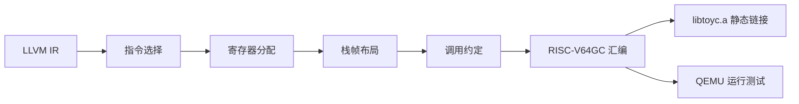

# 第四部分 · 目标代码生成

本部分把第三部分生成的 LLVM IR 翻译为可运行的 RISC-V64GC 汇编。先完成正确的基线后端，再在第五、六部分分别优化 IR 和目标代码。



## 一、整体流程

后端按以下顺序处理每个函数：

```text
codegen_module(module):
    output ".text"
    for func in module.functions:
        codegen_function(func)

codegen_function(func):
    compute_stack_layout(func)        ; 第3步：先算栈帧
    emit_prologue(func)               ; 第1步：序言
    for block in func.blocks:
        codegen_block(block)          ; 第2步：翻译基本块
    emit_epilogue(func)               ; 第4步：尾声

codegen_block(block):
    emit_label(block.name)
    for instr in block.instructions:
        codegen_instruction(instr)
    emit_terminator(block.terminator) ; br / ret
```

**重要原则**：寄存器分配和栈帧布局的顺序不能颠倒——必须先确定哪些值需要 spill 到栈上，再决定栈帧大小和偏移量。

## 二、指令选择：LLVM IR → RISC-V

指令选择是后端的核心：将 LLVM IR 的每条指令映射为一条或多条 RISC-V 指令。映射关系并非总是一对一，需要分情况处理。

### 2.1 一对一映射（简单情况）

大多数算术和比较指令可以一一对应：

| LLVM IR | RISC-V | 说明 |
| --- | --- | --- |
| `add i32 %a, %b` | `add a0, a0, a1` | 32位加法 |
| `sub i32 %a, %b` | `sub a0, a0, a1` | 32位减法 |
| `mul i32 %a, %b` | `mul a0, a0, a1` | 乘法 |
| `sdiv i32 %a, %b` | `divw a0, a0, a1` | 有符号除法 |
| `srem i32 %a, %b` | `remw a0, a0, a1` | 取模 |
| `icmp slt i32 %a, %b` | `slt a0, a0, a1` | 小于比较 |
| `icmp sgt ...` | `sgt a0, a0, a1` | 大于比较 |
| `and i32 %a, %b` | `and a0, a0, a1` | 按位与 |
| `or i32 %a, %b` | `or a0, a0, a1` | 按位或 |
| `xor i32 %a, %b` | `xor a0, a0, a1` | 按位异或 |
| `shl i32 %a, %b` | `sllw a0, a0, a1` | 左移 |
| `lshr i32 %a, %b` | `srlw a0, a0, a1` | 逻辑右移 |

一对一映射的实现最简单：一条 IR 指令 → 一条 RISC-V 指令。

### 2.2 需要多条指令的映射（复杂情况）

以下 IR 指令无法直接对应一条 RISC-V 指令，需要分解：

#### icmp → RISC-V 条件跳转 + 寄存器设置

**问题**：`icmp` 比较结果存在 SSA 值中（0/1），而 RISC-V 的 `blt` 等跳转指令直接根据比较结果跳转，两者语义不同。

**方案 A（直接翻译跳转）**：如果 `icmp` 只用于 `br i1`，直接翻译为条件跳转：

```llvm
%cmp = icmp slt i32 %a, %b
br i1 %cmp, label %then, label %else
```

```asm
    lw    t0, offset_a
    lw    t1, offset_b
    blt   t0, t1, .Lthen      ; 比较+跳转二合一，无需比较结果
    j     .Lelse
```

:::info
RISC-V 的 `blt`/`bge` 等是"先比较、后跳转"，效果等同于"先执行 icmp，再 br i1"。如果 `icmp` 的结果只用于条件跳转，则比较结果无需存入寄存器。
:::

**方案 B（翻译为 set 指令）**：如果 `icmp` 结果需要存入变量：

```llvm
%cmp = icmp slt i32 %a, %b
%result = zext i1 %cmp to i32
store i32 %result, ptr %x
```

```asm
    lw    t0, offset_a
    lw    t1, offset_b
    slt   t2, t0, t1          ; t2 = (a < b) ? 1 : 0
    sw    t2, offset_x         ; store i32
```

#### zext i1 → 条件 move / 异或

将 i1 扩展为 i32（0→0, 1→1）：

```llvm
%b = zext i1 %a to i32
```

```asm
    ; 方案1：异或 0 保持不变，比较产生 0/1 后直接用
    ; %a 此时在 t0，结果放 t1
    seqz  t1, t0    ; t1 = (t0 == 0) ? 1 : 0  （根据 icmp 的具体语义选择）
    ; 方案2：条件 move（RV64I 无条件 move，但可用伪指令）
    ; 方案3：使用 sltiu（无符号小于后跟异或）
```

#### load / store

```
load i32, ptr %ptr_val   →   lw  dest, offset(src_reg)
store i32 %val, ptr %ptr_val  →   sw  src_reg, offset(dest_reg)
```

注意：LLVM IR 中 load/store 的地址是 SSA 值，RISC-V 中需要先加载到寄存器，再做内存操作。

#### alloca → 栈槽分配

`alloca` 在 IR 生成阶段创建了局部变量的栈槽，后端只需要为其分配固定偏移量：

```llvm
%x = alloca i32
```

```asm
    ; 栈帧布局时计算偏移量，例如 x 在 fp-4
    ; 使用时：lw t0, -4(fp)
```

### 2.3 phi 消除

**问题**：`phi` 是 SSA 特有的指令，在 RISC-V 中没有对应硬件指令。

**分析**：每个 `phi` 出现在基本块入口，表示"从不同前驱边进入时取不同值"。在顺序执行的 RISC-V 中，同一基本块只有一条执行路径——从唯一的前驱块沿 fall-through 进入。因此，phi 可以**在发源地（即每个前驱块的末尾）提前复制**：

```llvm
; 原始 IR
entry:
    br label %if_merge
if_merge:
    %result = phi i32 [ %val_a, %if_true ], [ %val_b, %if_false ]
    ret i32 %result
if_true:
    %val_a = add i32 %x, 1
    br label %if_merge
if_false:
    %val_b = sub i32 %x, 1
    br label %if_merge
```

**消除方法**：在每个前驱块的分支目标之前插入 `select` 或直接复制：

```asm
; if_true 末尾（原 br label %if_merge 之前）
    add   t0, t5, 1      ; val_a
    ; 原来直接 j if_merge，现在改为：
    beq   zero, zero, if_merge_post ; 跳过 phi 取值
if_merge:
    ; phi 原来的位置——但这里我们把 phi 值放到前驱块
    ; 实际上更简单的做法是：
if_merge_post:
    ; 合并后 t0 已经是正确的 phi 值（从 val_a 来）
    ret  t0
```

**标准 phi 消除算法（CSSA）**：

```text
phi_eliminate(func):
    for block in func.blocks:
        // 1. 分析每个 phi 的来源值
        for phi in block.phis:
            for (value, pred) in phi.args:
                // value 是前驱块中定义的 SSA，在该前驱块末尾的 br 之前，
                // 将 value 复制到一个临时栈槽（或专用寄存器）
                insert_copy(block, value, phi.result.slot)

        // 2. 原来的 phi 指令不再生成（已被前驱块复制替代）
        block.phis.clear()

        // 3. 验证：所有 phi.result 的使用者现在访问栈槽
```

**更简单的实现（保守策略）**：每个 SSA 临时值都分配一个独立的栈槽，phi 的多个来源值分别存到不同槽，phi 本身变成从各槽 load 的选择：

```asm
; 前驱块 if_true 末尾
    add   t0, t5, 1
    sw    t0, -8(sp)     ; phi_arg_slot_0 = val_a
    j     if_merge

; 前驱块 if_false 末尾
    sub   t0, t5, 1
    sw    t0, -12(sp)    ; phi_arg_slot_1 = val_b
    j     if_merge

; if_merge 入口
    ; phi：按前驱边选择
    ; 方式：在前驱块中已处理好，这里只需要把正确的值取出来
    ; 实际更简单：在前驱块末尾直接按边写入不同槽
    ; then 边写入 slot_a，else 边写入 slot_b
    ; join 入口：需要知道从哪个边来
    ; → 解决方案：保守地把每个 SSA 值都分配栈槽，phi 取值变成 load
```

**推荐实现**：用**并行拷贝（parallel copy）**算法。核心思想：
1. 分析每个基本块所有前驱块对当前块 phi 参数的提供值
2. 按前驱块顺序把值写入临时寄存器
3. 在当前块入口按顺序读出到 phi 的结果槽

```text
process_phi_block(block):
    // 收集每个 phi 的参数（来自前驱块的 SSA 值）
    phi_args = {}   ; phi_result → [(value, pred_block)]
    for phi in block.phis:
        for (val, pred) in phi.args:
            phi_args[phi.result].append((val, pred))

    // 在前驱块末尾注入复制操作
    for pred in block.predecessors:
        for (val, p) in all_args_for_pred(pred):
            emit_copy(val, temp_reg[pred])
            emit_sw(temp_reg[pred], slot_for(val))

    // 当前块入口：把每个 phi 的值从 slot 加载出来
    for phi in block.phis:
        emit_lw(slot_for(phi.result), phi.result.reg)
```

### 2.4 指令选择的数据结构

```text
CodegenContext {
    module: Module
    current_function: Function
    current_block: AsmBlock
    value_to_loc: Dict[SSA_Value, Location]   ; SSA → 寄存器或栈槽
    frame_layout: FrameLayout
}

FrameLayout {
    frame_size: int
    slot_offsets: Dict[Alloca, int]           ; alloca → fp 偏移（负数）
    saved_regs: List[Reg]
    arg_slots: Dict[int, int]                 ; 第 N 个参数溢出槽的偏移
}

Location = Reg(RegName) | StackSlot(int offset) | Immediate(int)
```

```text
codegen_instruction(instr):
    match instr.opcode:
        'add':  emit_add(instr)
        'sub':  emit_sub(instr)
        'mul':  emit_mul(instr)
        'icmp': emit_icmp(instr)
        'br':   emit_br(instr)
        'ret':  emit_ret(instr)
        'load': emit_load(instr)
        'store': emit_store(instr)
        'call': emit_call(instr)
        'alloca': handle in frame_layout (no code emitted here)
        'phi':  skip (already eliminated before codegen)

emit_add(instr):
    lhs_loc = resolve(instr.operand[0])     ; SSA → 实际位置
    rhs_loc = resolve(instr.operand[1])
    dest_loc = allocate_dest(instr.result)
    load_to_register(lhs_loc, t0)
    load_to_register(rhs_loc, t1)
    emit("add {dest_loc}, {t0}, {t1}")
    move_to_dest(t0, dest_loc)              ; 写回目标位置
```

## 三、函数调用与参数传递

### 3.1 RISC-V 调用约定（RV64GC LP64D）

| 参数位置 | 整数参数 | 浮点参数 |
| --- | --- | --- |
| 第 1 个 | `a0` | `fa0` |
| 第 2 个 | `a1` | `fa1` |
| 第 3–8 个 | `a2–a7` | `fa2–fa7` |
| 第 9 个起 | 溢出到栈 | 溢出到栈 |

返回值：`a0`（整数）/ `fa0`（浮点）。

### 3.2 参数传递的实现

```text
emit_call(instr):
    func = instr.callee
    args = instr.arguments

    // 1. 溢出参数（超过8个，或无法放入寄存器的）
    for i, arg in enumerate(args[8:], start=8):
        arg_loc = resolve(arg)
        slot_offset = frame.arg_slots[i]
        emit_store_to_stack(arg_loc, slot_offset)

    // 2. 前8个参数放入 a0-a7
    for i, arg in enumerate(args[:8]):
        arg_loc = resolve(arg)
        load_to_register(arg_loc, a_i)     ; a0..a7
        emit_move(a_i, arg_reg[i])

    // 3. 溢出参数需要更新 a0 为溢出区的栈指针偏移（由 callee 读取）
    //    但在 RV64GC 中，溢出区由 callee 在其栈帧中分配，
    //    调用者只需要把参数放入对应偏移的栈槽

    // 4. 保护 caller-saved 寄存器（如果有的话）
    emit_push_caller_saved()

    // 5. 调用
    emit("call {func.name}")

    // 6. 恢复
    emit_pop_caller_saved()

    // 7. 取返回值
    if instr.result:
        dest_loc = allocate_dest(instr.result)
        emit_move(dest_loc, a0)
```

**溢出参数的具体做法**（按 RISC-V 调用约定）：

- **调用者**负责在栈上分配溢出区（通常在当前栈帧顶部或调用者保存的 spill 区）
- 溢出参数按**从右到左**的顺序压栈（最后一个参数地址最低），使 callee 可以通过 `sp` + 固定偏移访问

```asm
    ; 假设有 9 个整数参数：arg0~arg8
    ; arg0→a0, arg1→a1, ..., arg7→a7, arg8 溢出
    addi  sp, sp, -16       ; 分配溢出区（16字节，容纳 arg8）
    sw    a8, 0(sp)         ; arg8 溢出到 sp+0（RV64 中 a8=a2）
    mv    a0, t0            ; arg0
    mv    a1, t1            ; arg1
    ; ...
    call  my_func
    addi  sp, sp, 16        ; 回收溢出区
```

### 3.3 extern 库函数调用

`getint` 和 `putint` 等运行时库函数通过 `declare` 引入，调用方式与普通函数相同：

```llvm
declare i32 @getint()
declare i32 @putint(i32)
```

```asm
    ; x = getint()
    call   getint           ; 返回值在 a0
    sw     a0, offset_x     ; 存入变量槽

    ; putint(x)
    lw     a0, offset_x     ; 参数放入 a0
    call   putint
```

## 四、栈帧布局

### 4.1 栈帧结构

```
高地址 ─────────────────────────── 低地址
│ 溢出参数区（第9+个参数）          │ ← 由调用者分配（调用其他函数时）
├─────────────────────────────┤ ← sp 入口
│ 保存的 ra                   │ 8 bytes
├─────────────────────────────┤
│ 保存的 s0 (fp)              │ 8 bytes
├─────────────────────────────┤
│ 保存的 s1~s11（若使用）      │ 每个 8 bytes
├─────────────────────────────┤
│ 局部变量槽                   │
│ (alloca 对应的栈槽)          │
├─────────────────────────────┤
│ 临时寄存器 spill 槽          │ 溢出时
├─────────────────────────────┤
│ 对齐填充（保证 16 字节对齐） │
└─────────────────────────────┘ ← 最终 sp
```

### 4.2 栈帧布局算法

```text
compute_frame_layout(func):
    frame = FrameLayout()

    // 1. 先收集所有需要的槽
    for alloca in func.allocas:
        size = alloca.type.allocated_size
        frame.slot_offsets[alloca] = frame.next_offset
        frame.next_offset += size    ; 按 8 字节对齐

    // 2. 保存 ra 和 fp（如果不叶函数，可能需要）
    frame.ra_offset = frame.next_offset; frame.next_offset += 8
    frame.fp_offset = frame.next_offset; frame.next_offset += 8

    // 3. 保存被调用者保存寄存器（若使用 s0-s11）
    for reg in used_callee_saved_regs(func):
        frame.saved_reg_offsets[reg] = frame.next_offset
        frame.next_offset += 8

    // 4. 临时寄存器 spill 槽（寄存器分配阶段填入）
    for tmp in func.ssa_values:
        if tmp needs spill:
            frame.slot_offsets[tmp] = frame.next_offset
            frame.next_offset += 8

    // 5. 对齐到 16 字节
    if frame.next_offset % 16 != 0:
        frame.next_offset = (frame.next_offset + 15) & ~15

    frame.frame_size = frame.next_offset
    return frame
```

### 4.3 序言和尾声

```asm
func_prologue(func):
    frame = func.frame
    emit("  .text")
    emit("  .globl {func.name}")
    emit("{func.name}:")
    emit("  addi sp, sp, -{frame_size}")
    if frame.ra_offset is not None:
        emit("  sd ra, {ra_offset}(sp)")   ; 负偏移
    if frame.fp_offset is not None:
        emit("  sd s0, {fp_offset}(sp)")
    emit("  add s0, sp, zero")              ; fp = sp

func_epilogue(func):
    frame = func.frame
    emit("{func.name}_epilogue:")
    if frame.ra_offset is not None:
        emit("  ld ra, {ra_offset}(sp)")
    if frame.fp_offset is not None:
        emit("  ld s0, {fp_offset}(sp)")
    emit("  addi sp, sp, {frame_size}")
    emit("  ret")
```

## 五、全局变量与常量

### 5.1 全局变量的生成

```llvm
@global_var = global i32 0
@array = global [10 x i32] zeroinitializer
```

```asm
    .data
    .globl global_var
global_var:
    .word 0

    .globl array
array:
    .zero 40                     ; 10 * 4 = 40 bytes
```

### 5.2 大型立即数（常量池）

RISC-V 的立即数指令 `lui` + `addi` 最多表示 32 位有符号立即数（`-2^31 ~ 2^31-1`）。超出范围的常量需要放在**常量池**（`.rodata` 段）中，用 `la` 加载：

```llvm
@big_const = constant i32 0x12345678
%val = load i32, ptr @big_const
```

```asm
    .section .rodata
big_const:
    .word 0x12345678

    .text
    ; 加载 big_const 的地址到 t0，再加载值
    la    t0, big_const
    lw    t1, 0(t0)              ; t1 = 0x12345678
```

常量池的取舍：RV64GC `lui` 加载 12 位高位，`addi` 加 12 位低位，配合后可达 `20+12=32` 位，所以 -2048~2047 范围内的立即数可以用 `li` 伪指令直接编码，不需要常量池。超过此范围才需要。

### 5.3 字符串常量

```c
puts("Hello");
```

```llvm
@.str = private constant [6 x i8] c"Hello\00"
call @puts(ptr @.str)
```

```asm
    .section .rodata
    .globl .str
.str:
    .asciz "Hello"
```

## 六、指令选择决策树

实际实现中，建议按以下顺序匹配 LLVM IR 指令：

```text
codegen_instr(instr):
    switch instr.opcode:
        // 算术
        case 'add':  emit_riscv_binary("add", instr); break
        case 'sub':  emit_riscv_binary("sub", instr); break
        case 'mul':  emit_riscv_binary("mul", instr); break
        case 'sdiv': emit_riscv_binary("divw", instr); break
        case 'srem': emit_riscv_binary("remw", instr); break

        // 位运算
        case 'and':  emit_riscv_binary("and", instr); break
        case 'or':   emit_riscv_binary("or",  instr); break
        case 'xor':  emit_riscv_binary("xor", instr); break
        case 'shl':  emit_riscv_binary("sllw", instr); break
        case 'lshr': emit_riscv_binary("srlw", instr); break

        // 比较
        case 'icmp':
            // 如果是条件跳转的 operand：直接生成条件跳转
            // 如果需要存储结果：生成 slt + seqz/nez
            emit_icmp(instr); break

        // 类型转换
        case 'zext':
            if instr.dest_type == i32 and instr.src_type == i1:
                emit_seqz(instr)   ; set if (operand == 0) → 1 : 0
            else:
                emit_copy(instr)   ; 直接复制（零扩展在寄存器层面是同一表示）
            break

        case 'sext':
            emit_sign_extend(instr); break

        // 内存
        case 'load':  emit_load(instr); break
        case 'store': emit_store(instr); break

        // 控制流
        case 'br':
            if instr.operands.length == 1:
                emit("j {dest}")        ; 无条件跳转
            else:
                emit_cond_br(instr)     ; 条件跳转
            break
        case 'ret': emit_ret(instr); break

        // 调用
        case 'call': emit_call(instr); break
        case 'phi':  skip; break       ; 已消除

        default: error("unsupported opcode: " + instr.opcode)
```

## 七、错误处理与退出码

基线后端在遇到错误时必须优雅退出，不允许崩溃：

| 错误类型 | 处理方式 |
| --- | --- |
| 未识别 opcode | 输出 `error: unsupported instruction` 到 stderr，退出码 1 |
| 未声明函数调用 | 输出 `error: undefined function: name` 到 stderr，退出码 1 |
| 未声明变量引用 | 输出 `error: undefined variable: name` 到 stderr，退出码 1 |
| 除零 | 运行时由 RISC-V 硬件 trap 或库函数处理 |

## 八、命令行与提交物

```bash
cmake -S . -B build
cmake --build build
./compiler --dump-asm < input.c > input.s
riscv64-unknown-elf-gcc -march=rv64gc -mabi=lp64d \
  -nostdlib -static input.s third_party/toyc/libtoyc.a -o input
./input < runtime.in > input.out
```

必须提交可编译的完整文件：

```text
toyc-cpp/           # 仓库目录名由你决定，此处以 toyc-cpp 为例
├── CMakeLists.txt
├── src/
│    ├── asm_backend.cpp    # 主要后端逻辑
│    ├── frame_layout.cpp   # 栈帧布局
│    ├── instruction_sel.cpp # 指令选择
│    └── riscv_abi.cpp      # 调用约定
├── third_party/toyc/libtoyc.a
├── README.md
└── group.csv
```

`README.md` 应包含指令选择表、phi 消除策略、参数传递方式、栈帧布局和基线测试结果。基线测试应包含至少 5 个测试用例的汇编输出。

寄存器分配改进和窥孔优化放到第六部分。
