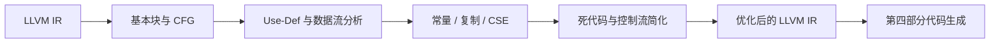

# 第五部分 · 中间代码优化

本部分优化第三部分生成的 LLVM IR，输入和输出都保持 LLVM IR 格式。优化后的 IR 再交给第四部分目标代码生成，从而可以和未优化基线进行对比。



## 一、基本块与数据流

基本块只有一个入口和一个出口。函数入口、跳转目标和跳转后继都是基本块入口。

```text
BasicBlock {
    label
    instructions
    predecessors
    successors
    use, def
    live_in, live_out
}
```

活跃变量分析使用：

```text
live_out[B] = union(live_in[S] for S in successors[B])
live_in[B]  = use[B] union (live_out[B] - def[B])
```

构造 CFG 时先扫描每个函数的基本块标签和终结指令：条件 `br` 有两个后继，非条件 `br` 有一个后继，`ret` 没有后继。再根据后继关系反向计算 `live_in/live_out`，直到集合不再变化。

Use-Def 链提供每个 SSA 值的定义和使用位置。例如：

```llvm
%t0 = add i32 %a, 1
%t1 = mul i32 %t0, 2
ret i32 %t1
```

`%t0` 的唯一 Def 是第一条指令，Use 是第二条指令；`%t1` 的唯一 Def 是第二条指令，Use 是 `ret`。优化器可以沿这条链替换值，但不能删除仍有副作用的 `call` 或 `store`。

## 二、机器无关优化

- 常量折叠：`%t0 = add i32 2, 3` -> `%t0 = add i32 5, 0`，或直接替换所有 Use 为 `5`；
- 常量传播：把已知常量替换到后续使用；
- 复制传播：`x = y` 后用 `y` 替代 `x`；
- 公共子表达式消除：操作数未改变且表达式无副作用时复用结果；
- 死代码消除：删除结果没有 Use 且没有副作用的计算；
- 控制流简化：删除不可达块、合并跳转、折叠恒真或恒假分支；
- 循环优化：循环不变代码外提、强度削弱和归纳变量分析。

函数调用、赋值到可观察位置和 I/O 都要视为可能有副作用，不能仅凭结果未使用删除。

例如：

```llvm
%x = add i32 2, 3
%y = mul i32 %x, 4
ret i32 %y
```

常量传播和折叠后可以直接变为：

```llvm
ret i32 20
```

优化过程应先建立 Use-Def，再替换操作数，最后删除没有 Use 且无副作用的指令，避免先删除 Def 导致悬空 Use。

## 三、验证命令

```bash
cmake -S . -B build
cmake --build build
./compiler --dump-ir < input.c > input.ll
./compiler --dump-ir --opt < input.c > input.opt.ll
./compiler --dump-asm < input.c > input.s
./compiler --dump-asm -opt < input.c > input.opt.s
```

分别链接并运行两个版本，比较输出和退出码；同时报告 IR 指令数、基本块数和优化前后差异。

## 四、提交物

第五部分必须提交可编译的完整优化器文件：

```text
toyc-cpp/           # 仓库目录名由你决定，此处以 toyc-cpp 为例
├── CMakeLists.txt
├── src/
├── third_party/toyc/libtoyc.a
├── README.md
└── group.csv
```

`README.md` 需要说明 LLVM IR 输入输出格式、优化等级和命令行参数。

## 五、本部分优化项速查

机器无关代码优化已在侧边栏「**机器无关代码优化**」分类下展开为独立子页面，每页深入讲解一种优化主题：

| 子页面 | 涵盖主题 | 关键考点 |
| --- | --- | --- |
| [基本块与 CFG](../optim/ir-cfg) | 基本块划分、控制流图、活跃变量 | 所有优化的前置 |
| [死代码消除](../optim/ir-dce) | 活跃分析 DCE、Use-Def DCE、不可达代码 | 与 CFG 简化配合迭代 |
| [常量折叠 / 传播 / 复制传播](../optim/ir-cprop) | 编译期折叠、SSA 传播、代数恒等式 | 优化管线第一档 |
| [公共子表达式消除（CSE）](../optim/ir-cse) | 可用表达式分析、局部/全局 CSE、GVN 简介 | 支配路径上复用 |
| [控制流简化](../optim/ir-cfg-simplify) | 不可达块、恒真分支、块合并、phi 退化 | 与 DCE 配对执行 |
| [循环不变代码外提（LICM）](../optim/ir-licm) | 自然循环、预头、不变指令判定、外提 | 减少循环体指令 |
