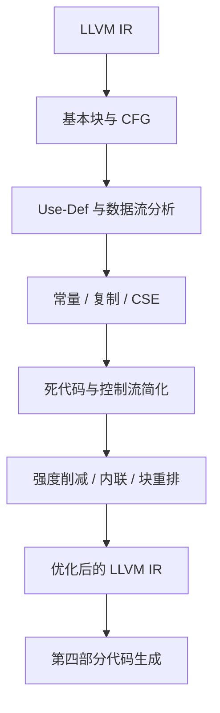
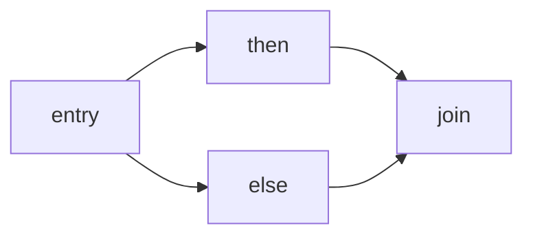
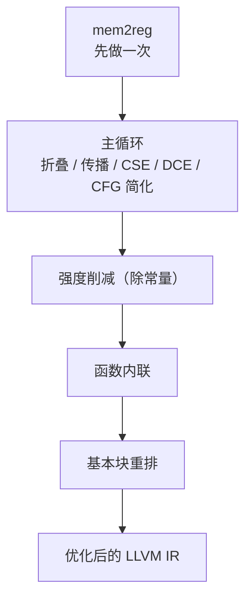
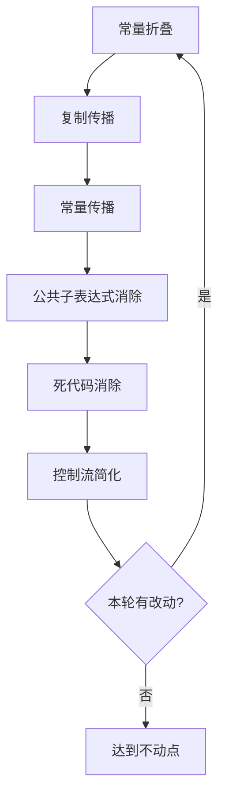

# 第五部分 · 中间代码优化

本部分优化第三部分生成的 LLVM IR，输入和输出都保持 LLVM IR 格式。优化后的 IR 再交给第四部分目标代码生成，从而可以和未优化基线进行对比。

:::tip[先建立直觉]
中间代码优化是在 IR 上做等价变换：能提前算的提前算掉，没人用的删掉，重复的合并。目标是让代码更短更快，而程序结果保持不变。
:::



## 一、基本块与数据流

基本块（Basic Block）是单入口、单出口的最大连续指令序列；控制流图（CFG）以基本块为节点、以跳转关系为有向边。几乎所有机器无关优化都以 CFG 为基础。



**算法 1 · 划分基本块并构造 CFG（Build CFG）**

**输入（Input）：** 一个函数的线性 IR 指令序列。
**输出（Output）：** 基本块列表及其前驱 / 后继关系。

```
 1: buildCFG(func):
 2:     leaders = { func.first_instruction };              // 1. 找所有"首领"指令
 3:     for each instruction I in func do
 4:         if I is a jump then leaders.add(I.target); end if     // 跳转目标
 5:         if I is a terminator and I.next exists then
 6:             leaders.add(I.next);                              // 终结指令的后一条
 7:         end if
 8:     end for
 9:     blocks = splitInstructionsAt(func, leaders);       // 2. 按首领切成基本块
10:     for each block B in blocks do
11:         for each target T in successorsOf(B.terminator) do
12:             B.successors.add(T);  T.predecessors.add(B);  // 3. 建立双向边
13:         end for
14:     end for
15:     return blocks;
```

基本块的数据结构：

```
BasicBlock {
    label
    instructions
    predecessors
    successors
    use, def            // 向上暴露的使用、块内定义
    live_in, live_out   // 入口/出口活跃集合
}
```

`use` 收集在任何定义之前就被引用的 SSA 值；`def` 收集块内新定义的值。`phi` 指令既不计入 `use` 也不计入 `def`。

### 活跃变量分析

活跃变量分析是一个反向数据流问题：一个值在某点"活跃"，当且仅当它在这点之后还会被使用。其数据流方程为：

```text
live_out[B] = ∪ live_in[S]              for all S in successors[B]
live_in[B]  = use[B] ∪ (live_out[B] − def[B])
```

**算法 2 · 活跃变量分析（Liveness Analysis，迭代到不动点）**

**输入（Input）：** 函数 CFG 与每个基本块的 `use` / `def` 集合。
**输出（Output）：** 每个基本块的 `live_in` / `live_out`。

```
 1: liveness(cfg):
 2:     for each block B in cfg do
 3:         B.live_in = ∅;  B.live_out = ∅;
 4:     end for
 5:     repeat
 6:         changed = false;
 7:         for each block B in reversePostOrder(cfg) do     // 反向传播更快收敛
 8:             new_out = ∅;
 9:             for each S in B.successors do
10:                 new_out = new_out ∪ S.live_in;           // meet：并集
11:             end for
12:             new_in = B.use ∪ (new_out − B.def);          // transfer 函数
13:             if new_in != B.live_in or new_out != B.live_out then
14:                 B.live_in = new_in;  B.live_out = new_out;  changed = true;
15:             end if
16:         end for
17:     until not changed
18:     return cfg;
```

Use-Def 链记录每个 SSA 值的定义与使用位置：

```llvm
%t0 = add i32 %a, 1
%t1 = mul i32 %t0, 2
ret i32 %t1
```

`%t0` 的唯一 Def 是第一条指令，Use 是第二条指令；`%t1` 的唯一 Def 是第二条指令，Use 是 `ret`。优化器可以沿这条链替换值，但不能删除仍有副作用的 `call` 或 `store`。

## 二、机器无关优化

| 优化 | 作用 | 依据 |
| --- | --- | --- |
| mem2reg | 把栈上的局部变量提升为 SSA 值，变量直接待在寄存器 | 支配树 / 支配边界 |
| 常量折叠 | 编译期直接算出常量表达式 | 操作数都是常量 |
| 常量传播 | 把已知常量替换到后续使用 | Use-Def 链 |
| 复制传播 | `x = y` 后用 `y` 替代 `x` | SSA 等价性 |
| 公共子表达式消除 | 重复的相同计算复用一次结果 | 可用表达式分析 |
| 死代码消除 | 删除结果没人用、且无副作用的计算 | 活跃变量分析 |
| 控制流简化 | 删不可达块、折叠恒真分支、合并跳转 | CFG |
| 循环不变代码外提 | 把循环体内不变的计算移到循环外 | 自然循环 |
| 强度削减 | 乘常量换移位，除常量换“乘魔数 + 移位” | 常量传播 / 自然循环 |
| 函数内联 | 把被调函数的函数体展开到调用点 | 调用图 + 成本模型 |
| 基本块重排 | 把热路径排成顺序执行，删掉多余跳转 | 边权重估计 |

**函数调用、赋值到可观察位置和 I/O 都要视为可能有副作用**，不能仅凭"结果未被使用"就删除。

### 2.1 常量折叠与传播

**算法 3 · 常量折叠与传播（Constant Folding & Propagation）**

**输入（Input）：** 函数 IR。
**输出（Output）：** 折叠/传播后的 IR。

```
 1: foldAndPropagate(func):
 2:     worklist = allInstructions(func);
 3:     while worklist not empty do
 4:         I = worklist.pop();
 5:         if allOperandsAreConstant(I) and isPure(I) then
 6:             value = evaluate(I.opcode, I.operands);    // 编译期求值
 7:             replaceAllUsesWith(I.result, Constant(value));
 8:             markDead(I.result);                         // 原指令变为死代码
 9:         else if I.opcode == 'phi' then
10:             if allIncomingValuesEqual(I) then replaceAllUsesWith(I.result, I.incoming[0]); end if
11:         end if
12:         pushUsersIntoWorklist(I.result);                // 使用者可能因替换而变得可折叠
13:     end while
```

例如：

```llvm
%x = add i32 2, 3
%y = mul i32 %x, 4
ret i32 %y
```

常量传播和折叠后可以直接变为：

```llvm
ret i32 20
```

**替换顺序很重要**：应先建立 Use-Def，再替换操作数，最后删除没有 Use 且无副作用的指令，避免先删除 Def 导致悬空 Use。此外 `phi` 节点必须所有入边常量一致才能传播。

### 2.2 死代码消除

**算法 4 · 死代码消除（Dead Code Elimination, DCE）**

**输入（Input）：** 函数 IR。
**输出（Output）：** 删除无用指令后的 IR。

```
 1: dce(func):
 2:     worklist = [];
 3:     for each I in func do
 4:         if hasNoUses(I.result) and isPure(I) then worklist.push(I); end if
 5:     end for
 6:     while worklist not empty do
 7:         I = worklist.pop();
 8:         if I is already removed then continue; end if
 9:         for each operand V of I do
10:             removeUse(V, I);
11:             if hasNoUses(V) and isPure(definingInstruction(V)) then
12:                 worklist.push(definingInstruction(V));    // 连锁删除
13:             end if
14:         end for
15:         remove(I);
16:     end while
```

一条指令是"死"的，当且仅当：它的结果不出现在任何活跃变量集合中，且它本身没有可观察副作用（不是 `store`、`call`、`br`、I/O 等）。

### 2.3 公共子表达式消除（CSE）

如果同一表达式在支配路径上被求值多次，且操作数没有改变，第二次及以后可以直接复用第一次的结果：

```llvm
%a = add i32 %x, 1
%b = mul i32 %a, 2
%c = add i32 %x, 1      ; 与 %a 完全相同 -> CSE 候选
%d = mul i32 %c, 3      ; 改写为 mul %a, 3
```

CSE 依赖可用表达式分析（一个前向数据流问题）：

```text
AE_gen[B]  = { expr(I) : I 是块 B 中的纯表达式指令 }
AE_kill[B] = { expr(I') : I' 是块 B 中对某操作数有重定义的指令 }
AE_in[B]   = AE_gen[B] ∪ (AE_out[B] − AE_kill[B])
AE_out[B]  = ∩ AE_in[P]                for all P in successors[B]
```

若 `expr(I) ∈ AE_in[B]`，说明该表达式在到达 `B` 的支配路径上已经求过值，可删除 `I` 并把后续 use 替换为之前的 SSA 值。更激进的版本是 GVN（Global Value Numbering），它能识别"字面不同但等价"的表达式（如 `x+y` 与 `y+x`）。

### 2.4 控制流简化

把"没意义"或"过于复杂"的控制流压扁：

```llvm
; 恒真分支
br i1 true, label %T, label %F     ; 等价于 br label %T；%F 变为不可达
; 跳转到跳转
br label %L1
L1: br label %L2                   ; 等价于把前一条 br 改为 br label %L2
```

简化后，不可达块内的指令会被 DCE 全部删除；`phi` 若只剩一条入边则退化为普通 move。控制流简化通常与 DCE 配合成对迭代，直到不再变化。

### 2.5 循环不变代码外提（LICM）

如果一条指令的所有操作数在循环外都已知，它的结果每次迭代都相同，可以安全地把它移到循环外（通常移到循环的预头块 preheader）执行一次。注意：循环内的 `store` / `call` 可能有副作用，禁止外提。

（自然循环与预头、不变指令判定、外提变换的细节见 [循环不变代码外提](../optim/ir-licm)。）

### 2.6 mem2reg：把内存访问提升为 SSA {/* #mem2reg */}

第三部分生成的 IR 是内存访问型的：每个局部变量一个 `alloca`，赋值发 `store`，读值发 `load`。这样实现简单、正确性容易保证，但变量始终保存在栈上，寄存器只用于在 `load` / `store` 之间传递数据，无法承载计算；同时 `load` 得到的是内存中的值而非某条指令的结果，SSA 的 Use-Def 链因此被切断，后面几个 pass 的效果都会受限。

mem2reg（memory to register）就是把这些变量从内存搬到寄存器：它识别“只被 `store` 写入、只被 `load` 读取、地址不逃逸出函数”的局部变量，把它们替换成一串 SSA 值。

```llvm
; 提升前：变量在栈上，读一次写一次都要访存
%x = alloca i32
store i32 1, ptr %x
%v = load i32, ptr %x
ret i32 %v
```

```llvm
; 提升后：变量直接是寄存器里的 SSA 值
ret i32 1
```

实现要点分三步：计算支配树，用迭代支配边界确定在哪些块的入口插入 `phi`（分支汇合处需要按入边选择值），最后做栈式重命名，把每条 `load` 替换为当时最新的 SSA 值。完整推导、伪代码、带循环的转换示例与验证方法见 [mem2reg：把内存访问提升为 SSA](../optim/ir-mem2reg)。

这是本部分建议最先实现的优化：缺少它，后面几个 pass 的效果会明显受限。

### 2.7 强度削减：把除法换成乘法

循环中每轮都要执行一次的除法代价很高：RISC-V 上 `div` / `rem` 的延迟可以达到加法、移位的十几倍。当除数是编译期常量时，除法可以改写为“乘一个魔数再右移若干位”：

```text
s = ceil(log2 d)                        // 移位量
M = floor(2^(32+s) / d) + 1             // 魔数，恰好落在 (2^32, 2^33] 内
x / d  =  (x * M) >> (32 + s)
```

在 RISC-V 上它对应三条指令 `mulhu + add + srli`：例如 `x / 10` 的魔数低 32 位是 `0x9999999A`、移位量是 4。取余再由商反算：`r = x − q * d`。乘法的强度削减（`x * 2^k` 换成 `slli`）没有正确性风险，除法则不同：`div` 向零截断，`srli` 与 `srai` 都不是同一个运算（`-1 / 2 = 0`，而 `-1 >> 1 = -1`），因此只有除数是编译期常量时才按魔数法替换。

原理推导、魔数表、算法与正确性陷阱见 [强度削减：乘法换移位与魔数法除法](../optim/ir-strength-reduction)。

### 2.8 函数内联

把被调函数的函数体直接展开到调用点，并用实参替换形参。短函数的调用开销可能超过函数体本身；更重要的是 `call` 形成了一层边界：常量传不进去、结果传不出来，死代码消除与公共子表达式消除都无法跨越。内联消除这层边界后，常量传播、CSE、DCE、LICM 可以在原本跨过程的位置继续工作。

内联会增加代码体积，必须用成本模型（函数体指令数、调用点个数、是否在循环内、实参是否常量、是否递归）控制。详见 [函数内联](../optim/ir-inline)。

### 2.9 基本块重排

顺序执行的指令没有额外代价，跳转才有。基本块重排不改变任何计算，只调整基本块的输出顺序：用静态启发式估计每条边的权重（循环回边权重最高，`then` 比 `else` 更常执行，向前跳的分支多为退出或报错这类冷路径），再把权重大的边固定为相邻关系。热路径因此成为顺序执行、其中的无条件跳转被删除，而 `break` / `continue`、错误处理等冷块集中到函数末尾。

它只改变布局、不改变语义，收益取决于权重估计的准确性。细节见 [基本块重排](../optim/ir-block-layout)。

## 三、优化管线与迭代

各优化之间存在依赖，通常需要循环迭代到不动点。整体顺序可以这样安排：



主循环内部的关系是：



几个观察：

- mem2reg 排在最前且只做一次：它把变量从内存提升到寄存器，是后续所有基于 Use-Def 的优化的前提；
- 折叠 → 传播：折叠产生新的常量定义后，传播才能继续替换；
- 传播 → DCE：传播后旧定义失去 use，由 DCE 删除；
- 强度削减排在常量传播之后：只有除数与乘数被传播为常量，才能替换；
- 内联与块重排放在最后：内联会改变代码规模与块的热度分布，因此排在主循环稳定之后；
- 这套循环通常只需 2~3 轮即可达到不动点。

## 四、验证命令

```bash
cmake -S . -B build
cmake --build build
./compiler --dump-ir < input.c > input.ll
./compiler --dump-ir --opt < input.c > input.opt.ll
./compiler --dump-asm < input.c > input.s
./compiler --dump-asm -opt < input.c > input.opt.s
```

分别链接并运行两个版本，比较输出和退出码；同时报告 IR 指令数、基本块数和优化前后差异。

几条值得单独统计的指标：

```bash
grep -c 'alloca'          input.ll         input.opt.ll   # mem2reg 是否生效
grep -cE '\b(load|store)\b' input.ll     input.opt.ll   # 访存指令是否减少
grep -cE '\b(sdiv|srem|udiv|urem)\b' input.ll input.opt.ll   # 除法是否被魔数法消掉
grep -cE '\bcall\b'      input.ll        input.opt.ll   # 内联是否减少了调用
```

## 五、提交物

第五部分必须提交可编译的完整优化器文件：

```text
toyc-cpp/           # 仓库目录名由你决定，此处以 toyc-cpp 为例
├── CMakeLists.txt
├── src/
├── third_party/toyc/libtoyc.a
├── README.md       # 简要说明编译器架构
```

`README.md` 需要说明本阶段实现的优化内容与实现思路。

## 六、本部分优化项速查

| 子页面 | 涵盖主题 | 关键考点 |
| --- | --- | --- |
| [基本块与 CFG](../optim/ir-cfg) | 基本块划分、控制流图、活跃变量 | 所有优化的前置 |
| [死代码消除](../optim/ir-dce) | 活跃分析 DCE、Use-Def DCE、不可达代码 | 与 CFG 简化配合迭代 |
| [常量折叠 / 传播 / 复制传播](../optim/ir-cprop) | 编译期折叠、SSA 传播、代数恒等式 | 优化管线第一档 |
| [公共子表达式消除（CSE）](../optim/ir-cse) | 可用表达式分析、局部/全局 CSE、GVN 简介 | 支配路径上复用 |
| [控制流简化](../optim/ir-cfg-simplify) | 不可达块、恒真分支、块合并、phi 退化 | 与 DCE 配对执行 |
| [循环不变代码外提（LICM）](../optim/ir-licm) | 自然循环、预头、不变指令判定、外提 | 减少循环体指令 |
| [mem2reg：内存提升为 SSA](../optim/ir-mem2reg) | 支配树、支配边界、phi 插入、栈式重命名 | 所有优化的第一步 |
| [强度削减（魔数法除法）](../optim/ir-strength-reduction) | 乘常量换移位、除常量换乘魔数、取余反算 | 除数必须是编译期常量 |
| [函数内联](../optim/ir-inline) | 调用图、成本模型、实参替换、局部值重命名 | 打开跨过程优化 |
| [基本块重排](../optim/ir-block-layout) | 静态分支预测、链式布局、fall-through | 只改布局、不改语义 |