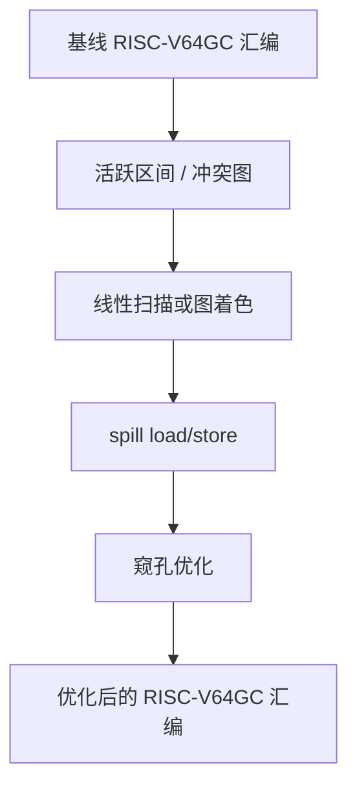
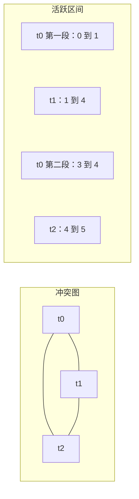
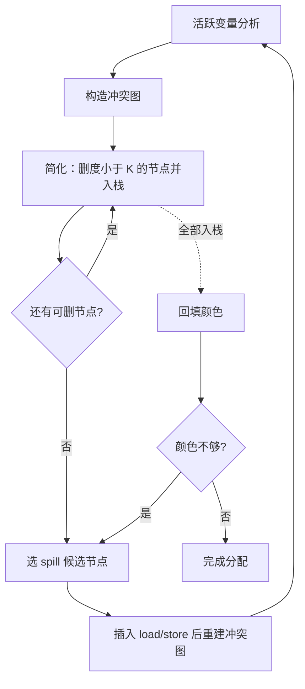

# 第六部分 · 目标代码优化

本部分处理第四部分生成的 RISC-V64GC 汇编。重点是寄存器分配、溢出处理和窥孔优化，目标是在保持语义的前提下减少内存访问和指令数量。

:::tip[先建立直觉]
IR 中的临时值数量不受限制，物理寄存器却只有几十个。寄存器分配解决的就是这个矛盾：哪些值留在寄存器，哪些值写回内存；窥孔优化则负责删除局部可见的冗余指令。
:::

**优化顺序应固定为**：先建立第四部分的正确基线 → 在目标指令上计算活跃信息和寄存器冲突 → 完成寄存器分配 → 最后执行不依赖全局信息的窥孔规则。每一步都要保留输入输出，便于定位错误。



## 一、从 Use-Def 到活跃区间

对每条目标指令编号，记录每个寄存器的"第一次定义位置"和"最后一次使用位置"，就得到一个活跃区间（live range）：

```asm
0: lw   t0, 0(fp)        ; 定义 v
1: add  t1, t0, a0       ; 使用 v
2: sw   t1, 4(fp)
3: add  t0, t1, a0       ; t0 重新定义
4: mul  t2, t0, t1       ; 使用新的 t0
```

上面的 `t0` 其实有两段活跃区间：第一段 `[0, 1]`（值 v），第二段 `[3, 4]`。

**算法 1 · 构造活跃区间（Build Live Ranges）**

**输入（Input）：** 带指令编号的目标汇编代码。
**输出（Output）：** 每个值（寄存器）的活跃区间列表。

```
 1: buildLiveRanges(code):
 2:     last_use = Map<Reg, int>();                     // 每个寄存器的最后使用位置
 3:     for i = 0 to len(code) - 1 do
 4:         for each r in usesOf(code[i]) do last_use[r] = i; end for
 5:     end for
 6:     first_def = Map<Reg, int>();                     // 每个寄存器的第一次定义
 7:     for i = 0 to len(code) - 1 do
 8:         for each r in defsOf(code[i]) do
 9:             if r ∉ first_def then first_def[r] = i; end if
10:         end for
11:     end for
12:     ranges = [];
13:     for each (r, def) in first_def do
14:         if r ∈ last_use then
15:             ranges.push( LiveRange(r, start = def, end = last_use[r] + 1) );   // 半开区间
16:         end if
17:     end for
18:     return ranges;
```

上面的算法是单个基本块内的局部活跃区间。真正的活跃区间要跨基本块扩展：先做一次反向数据流分析求出每个块入口/出口活跃的寄存器，再与块内的区间取并集。

## 二、冲突图（Interference Graph）

两个值的活跃区间一旦重叠，就不能分配同一个物理寄存器。把这种约束建模为图：

- **节点**：每个活跃区间对应的寄存器；
- **边**：`A` 和 `B` 在某个程序点同时活跃 → 连一条边。

**算法 2 · 构造冲突图（Build Interference Graph）**

**输入（Input）：** 活跃区间列表。
**输出（Output）：** 冲突图 `G`。

```
 1: buildInterference(ranges):
 2:     G = new Graph();
 3:     for each r in ranges do G.addNode(r.reg); end for
 4:     for each pair (r1, r2) in ranges do
 5:         if r1.reg == r2.reg then continue; end if
 6:         if r1.start < r2.end and r2.start < r1.end then
 7:             G.addEdge(r1.reg, r2.reg);              // 区间重叠 -> 冲突
 8:         end if
 9:     end for
10:     return G;
```

下面这张图把示例代码的活跃区间、重叠位置以及导出的冲突图一次性画出来：



### 2.1 特殊约束：调用约定

不是所有物理寄存器都能随便用：

| 类型 | 行为 |
| --- | --- |
| 调用者保存 `t0~t6` | 调用前后值不保留，被调函数可任意修改 |
| 被调用者保存 `s0~s11` | 被调函数必须保留，跨调用活跃的值优先放这里 |
| 参数寄存器 `a0~a7` | 函数入口接收参数，随后可作临时使用 |
| 返回值寄存器 `a0, a1` | 函数出口返回结果 |
| `zero` | 永远为 0，不能作为分配目标 |
| `sp`, `gp`, `tp`, `fp` | 保留给栈指针等，不能分配 |

如果一个值跨越函数调用还活跃，它要么用被调用者保存寄存器（首选），要么在调用前后保存/恢复。

### 2.2 move-aware 冲突图

`mv t0, t1` 这类传送指令的两端"天然不冲突"（它们本来就该放到同一个寄存器，从而删掉这条 `mv`）。因此在构造冲突图时，可以对 move 相关的一对寄存器不连边，给后续的合并（coalescing）留出机会。

## 三、线性扫描寄存器分配

线性扫描的思路：把所有活跃区间按起点排序，从左到右扫描，维护"当前活跃区间"集合。

**算法 3 · 线性扫描寄存器分配（Linear Scan Allocation）**

**输入（Input）：** 活跃区间列表、可用物理寄存器数量 `K`。
**输出（Output）：** 每个区间分配到的寄存器或栈槽。

```
 1: linearScan(code, K):
 2:     intervals = sortByStart(buildLiveRanges(code));
 3:     active = [];                                   // 当前仍活跃的区间，按 end 排序
 4:     for each interval in intervals do
 5:     // 1. 让已经过期的区间释放寄存器
 6:         expireOldIntervals(active, interval.start);
 7:     // 2. 有空闲寄存器就直接分配
 8:         if freeRegisterExists() then
 9:             assignRegister(interval, takeFreeRegister());
10:             active.pushSortedByEnd(interval);
11:         else
12:     // 3. 否则选一个"结束最晚"的区间去 spill
13:             spill = intervalWithLatestEnd(active ∪ { interval });
14:             if spill == interval then
15:                 assignStackSlot(interval);                 // 自己就溢出
16:             else
17:                 moveRegisterTo(interval, spill.reg);       // 抢占它的寄存器
18:                 assignStackSlot(spill);
19:                 replace(active, spill, interval);
20:             end if
21:         end if
22:     end for
```

需要处理的细节：调用者保存 / 被调用者保存寄存器、参数寄存器、跨调用活跃值、spill 槽对齐。

## 四、图着色寄存器分配

图着色（Graph Coloring）是经典的最优性更好的寄存器分配算法：把活跃区间视为节点、冲突视为边，用 `K` 种颜色（即 `K` 个物理寄存器）着色，使每条边的两端颜色不同。`K ≥ 3` 的图着色是 NP 完全问题，所以实际实现使用启发式：



**算法 4 · 图着色寄存器分配（Graph Coloring，简化 + 回填）**

**输入（Input）：** 冲突图 `G`、可用颜色数 `K`。
**输出（Output）：** 每个节点的颜色（物理寄存器）或 spill 标记。

```
 1: graphColoring(G, K):
 2:     stack = [];
 3:     // ---- 简化阶段：反复删除度数 < K 的节点 ----
 4:     loop
 5:         v = nodeWithDegreeLessThan(G, K);
 6:         if v != none then
 7:             stack.push(v);  G.removeNode(v);
 8:         else
 9:             if G not empty then
10:                 v = chooseSpillCandidate(G);       // 例如 cost = 使用次数 / 度数，取最小
11:                 markForSpill(v);  stack.push(v);  G.removeNode(v);
12:             end if
13:             break;
14:         end if
15:     end loop
16:     // ---- 回填阶段：按压栈逆序分配颜色 ----
17:     while stack not empty do
18:         v = stack.pop();
19:         used = colorsOfNeighbors(v);
20:         c = firstColorNotIn(used, K);
21:         if c != none then assign(v, c);
22:         else markForSpill(v); end if              // 颜色不够 -> spill
23:     end while
```

若节点被标记 spill，就把它在定义处 `store` 到栈槽、在每次使用前 `load` 回来，然后重建冲突图并重新分配，直到所有节点都能着色。

## 五、Spill / Reload

被 spill 的值需要在定义附近插入 `store`，在下一次使用前插入 `load`：

```asm
    sw   t0, 16(sp)      ; spill v（把值写回栈槽）
    ...
    lw   t0, 16(sp)      ; reload v（重新读回寄存器）
```

选择 spill 候选时通常综合考虑：区间长度（短区间优先）、跨调用次数（少跨越的优先）、使用次数（少使用的优先）、是否可 rematerialize（可重算的最适合 spill）。

## 六、目标代码窥孔优化

窥孔优化在寄存器分配后观察相邻的少量指令，做局部替换。

| 规则 | 变换 |
| --- | --- |
| 无操作 | `add t0, t0, zero` → 删除 |
| 跳到跳转 | `j L1` / `L1: j L2` → `j L2` |
| 冗余 store | `lw t0, slot` / `sw t0, slot` → 删除 `sw` |
| 条件反转 | `beq t0, zero, Lfalse` / `j Ltrue` → `bne t0, zero, Ltrue` / `j Lfalse` |
| 算术恒等 | `mul t0, t0, 1`、`sll t0, t0, 0` → 退化为 move 后删除 |

**算法 5 · 窥孔优化主循环（Peephole Optimization）**

**输入（Input）：** 汇编指令序列与规则集合。
**输出（Output）：** 替换后的汇编。

```
 1: peephole(code):
 2:     repeat
 3:         changed = false;  i = 0;
 4:         while i + 2 <= len(code) do
 5:             matched_len = 0;
 6:             for each rule R in rules do                 // 窗口大小 2 ~ 3
 7:                 if matches(code, i, R) and guardOk(code, i, R) then
 8:                     apply(code, i, R);  changed = true;
 9:                     matched_len = len(R.pattern);
10:                     break;
11:                 end if
12:             end for
13:             i += max(1, matched_len);                   // 替换后回退一个窗口
14:         end while
15:     until not changed            // 一轮无变化即停止
```

只有在不改变内存可见性、函数调用副作用和控制流的前提下才能应用规则。每条规则必须有正例、反例和回归测试。

## 七、命令行与提交物

```bash
cmake -S . -B build
cmake --build build
./compiler --dump-asm < input.c > input.s
./compiler --dump-asm -opt < input.c > input.opt.s
riscv64-unknown-elf-gcc -march=rv64gc -mabi=lp64d \
  -nostdlib -static input.opt.s third_party/toyc/libtoyc.a -o input
./input < input.in > result.out
```

第六部分必须提交可编译的完整文件：

```text
toyc-cpp/           # 仓库目录名由你决定，此处以 toyc-cpp 为例
├── CMakeLists.txt
├── src/
├── third_party/toyc/libtoyc.a
├── README.md       # 简要说明编译器架构
```

`README.md` 必须包含寄存器分配算法描述（线性扫描或图着色）以及窥孔优化规则。

## 八、本部分优化项速查

| 子页面 | 涵盖主题 | 关键考点 |
| --- | --- | --- |
| [活跃区间与冲突图](../optim/asm-liveness) | 虚拟寄存器活跃区间、冲突图、调用约定、move-aware | 寄存器分配的前置 |
| [线性扫描寄存器分配](../optim/asm-linear-scan) | 扫描算法、跨调用处理、栈槽分配 | 实现简单、性能足够 |
| [图着色寄存器分配](../optim/asm-graph-coloring) | 简化、合并、冻结、spill 选择、回填颜色 | 加分项 |
| [Spill / Reload](../optim/asm-spill) | 溢出代码模式、rematerialization、栈槽分配、spill 优化 | 不可避免的副产品 |
| [窥孔优化](../optim/asm-peephole) | 局部模式匹配、规则迭代、典型规则 | 与寄存器分配配合 |
| [强度削减](../optim/asm-strength-reduction) | 乘常量换移位与加法、派生归纳变量 | 只做可直接验证等价的局部替换；除常量换魔数属于[第五部分](../optim/ir-strength-reduction) |