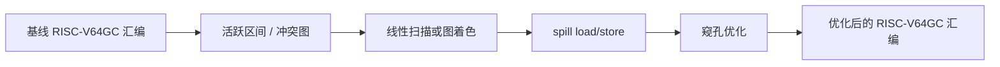
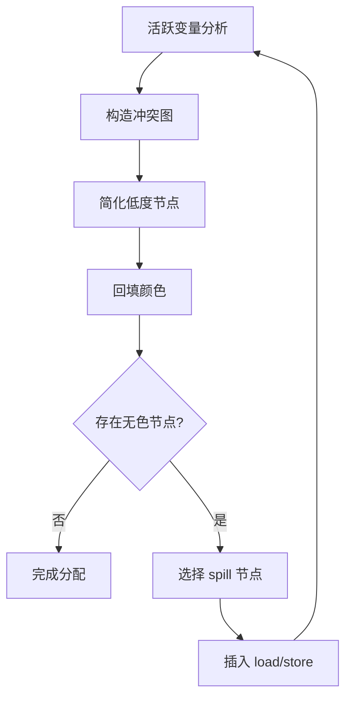

# 第六部分 · 目标代码优化

本部分处理第四部分生成的 RISC-V64GC 汇编。重点是寄存器分配、溢出处理和窥孔优化，目标是在保持语义的前提下减少内存访问和指令数量。

优化顺序应固定为：先建立第四部分的正确基线，再在目标指令上计算活跃信息和寄存器冲突，完成寄存器分配，最后执行不依赖全局信息的窥孔规则。每一步都要保留输入输出，便于定位错误。



## 一、从 Use-Def 到活跃区间

对每条目标指令编号，记录每个值第一次定义的位置和最后一次使用的位置。例如：

```asm
0: lw   t0, 0(fp)       # 定义 v
1: add  t1, t0, a0      # 使用 v
2: sw   t1, 4(fp)
```

值 `v` 的活跃区间可以记为 `[0, 1]`。两个区间重叠时不能分配同一寄存器；如果值跨越函数调用，还必须避开调用者保存寄存器，或在调用前后保存它。

## 二、线性扫描

```text
intervals = sort_by_start(build_live_intervals(assembly))
active = []
for interval in intervals:
    expire_old_intervals(active, interval.start)
    if free_register_exists():
        assign_register(interval, take_free_register())
    else:
        spill = interval_with_latest_end(active + interval)
        if spill == interval:
            assign_stack_slot(interval)
        else:
            move_register_to(interval, spill.register)
            assign_stack_slot(spill)
            replace(active, spill, interval)
```

需要处理调用者保存寄存器、被调用者保存寄存器、参数寄存器、跨调用活跃值和 spill 槽对齐。

如果没有空闲寄存器，选择结束位置最晚或溢出代价最低的区间。被 spill 的值需要在定义附近插入 store，在下一次使用前插入 load：

```asm
sw   t0, 16(sp)      # spill v
...
lw   t0, 16(sp)      # reload v
```

## 三、图着色

同时活跃的值在冲突图中连边，寄存器数量为颜色数 `K`：



可以实现 Briggs 或 George 风格的简化、合并、冻结和 spill 选择，并与线性扫描比较代码质量、复杂度和运行时间。

## 四、目标代码窥孔优化

窥孔优化在寄存器分配后观察相邻指令：

```text
add t0, t0, zero  ->  删除

j L1
L1: j L2           ->  j L2

load t0, slot
store t0, slot     ->  删除 store

beq t0, zero, Lfalse
j Ltrue            ->  bne t0, zero, Ltrue
                     j Lfalse
```

只有在不改变内存可见性、函数调用副作用和控制流的情况下才能应用规则。每条规则必须有正例、反例和回归测试。

窥孔优化的执行过程是：扫描固定窗口，匹配规则，确认寄存器和内存依赖条件，替换窗口；替换后回退一个窗口位置，以便发现新形成的模式，直到一轮没有变化。

```text
changed = true
while changed:
  changed = false
  for window in instruction_windows(code, size=2..3):
    if matches_safe_rule(window):
      replace(window, optimized_sequence(window))
      changed = true
```

## 五、命令行与提交物

```bash
cmake -S . -B build
cmake --build build
./compiler --dump-asm < input.c > input.s
./compiler --dump-asm -opt < input.c > input.opt.s
riscv64-unknown-elf-gcc -march=rv64gc -mabi=lp64d \
  -nostdlib -static input.opt.s third_party/toyc/libtoyc.a -o input
./input < input.in > result.out
```

第六部分必须提交可编译的完整文件：

```text
toyc-cpp/           # 仓库目录名由你决定，此处以 toyc-cpp 为例
├── CMakeLists.txt
├── src/
├── third_party/toyc/libtoyc.a
├── README.md       # 简要说明编译器架构
```

`README.md` 必须包含寄存器分配算法描述（可以是线性扫描也可以是图着色寄存器分配）、窥孔优化规则。

## 六、本部分优化项速查


| 子页面 | 涵盖主题 | 关键考点 |
| --- | --- | --- |
| [活跃区间与冲突图](../optim/asm-liveness) | 虚拟寄存器活跃区间、冲突图、调用约定、move-aware | 寄存器分配的前置 |
| [线性扫描寄存器分配](../optim/asm-linear-scan) | 扫描算法、跨调用处理、栈槽分配 | 实现简单、性能足够 |
| [图着色寄存器分配](../optim/asm-graph-coloring) | 简化、合并、冻结、spill 选择、回填颜色 | 加分项 |
| [Spill / Reload](../optim/asm-spill) | 溢出代码模式、rematerialization、栈槽分配、spill 优化 | 不可避免的副产品 |
| [窥孔优化](../optim/asm-peephole) | 局部模式匹配、规则迭代、典型规则 | 与寄存器分配配合 |
| [强度削减](../optim/asm-strength-reduction) | 乘法/除法替换、归纳变量、循环展开配合 | 循环优化收益大 |
