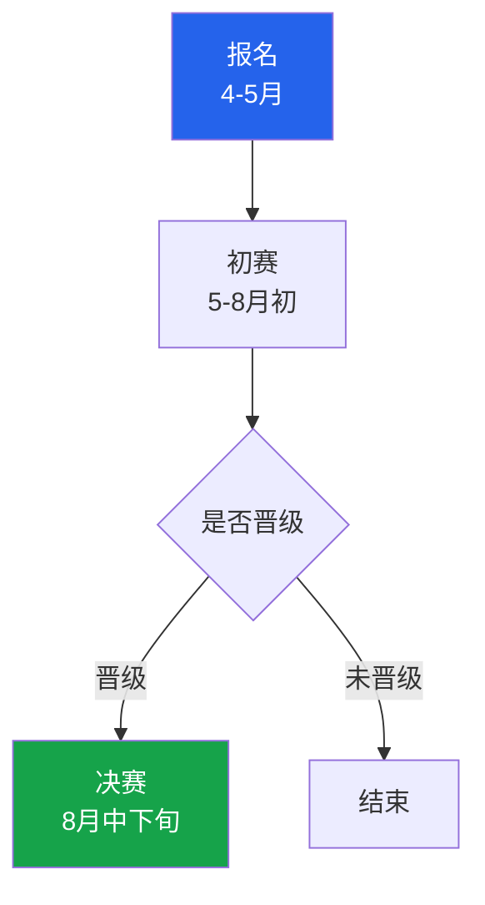
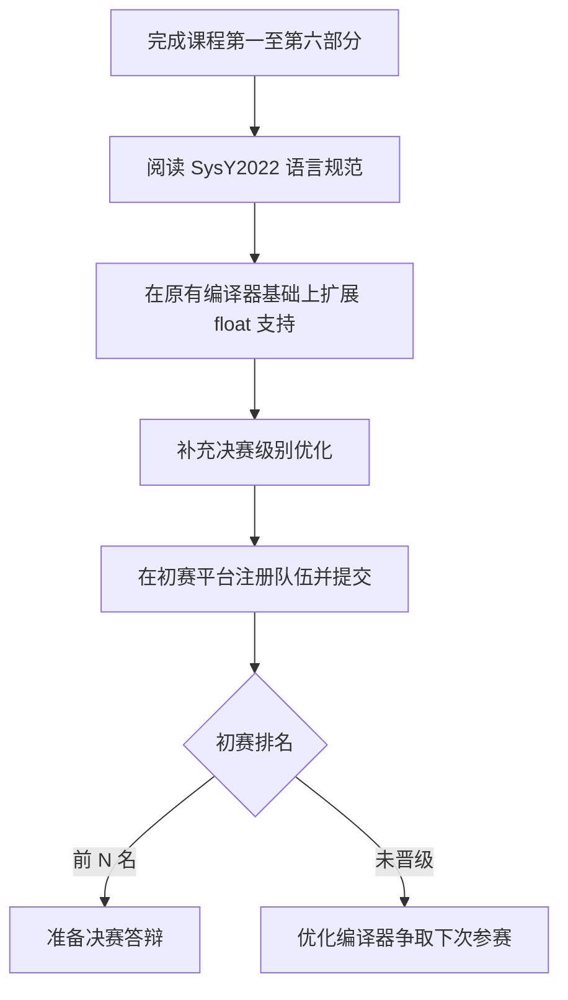

# 第七部分 · 编译系统赛

:::tip[比赛与课程的关联]

本课程的 ToyC 编译器正好对应编译系统赛的编译器实现要求。
如果你已经完成了第一至第六部分，恭喜你，你已经具备了参加编译系统实现赛的核心能力。
:::

## 一、比赛简介

**全国大学生计算机系统能力大赛**（Computer System Development Capability Competition，CSCC）是由全国高等学校计算机教育研究会主办、系统能力培养研究专家组发起、华为技术有限公司与"101计划"编译原理课程虚拟教研室等单位协办的全国性学科竞赛。

其中编译系统赛是大赛的六个赛道之一，分为两条赛道：

| 赛道 | 面向对象 | 内容 | 后端平台 |
| --- | --- | --- | --- |
| **编译系统实现赛** | 高等院校在校本科生 | 实现一个完整的编译器，将 SysY 源码编译为可运行的机器码 | ARM / RISC-V |
| **编译系统挑战赛** | 高等院校在校本科生、研究生 | 在已有框架基础上完成高难度优化挑战 | 依赛题而定 |

**官方网站**：[https://compiler.educg.net/](https://compiler.educg.net/)

## 二、为什么值得参加

- **课程即备赛**：本课程的六个实验部分与编译系统实现赛的考察内容高度重合——词法分析、语法分析、语义分析、IR 生成、IR 优化、目标代码生成，完成课程实验就等于完成了比赛的主体工作。
- **团队协作**：比赛 4 人一组，锻炼大型项目的分工协作与代码整合能力。
- **简历亮点**：编译器实现是计算机科学的核心能力之一，完成比赛是对工程能力的有力证明。
- **荣誉与机会**：全国总决赛获奖者将获得主办方颁发的证书，部分高校将其视为保研加分项。
- **奖金丰厚**：税前特等奖五万人民币、一等奖三万、二等奖一万、三等奖三千。

## 三、赛制与时间线

### 3.1 竞赛阶段



1. **报名**：每年 4–5 月开放（4 人一队）。
2. **初赛**：5–8 月初在线评测——在评测平台上提交编译器，平台自动运行功能测试与性能测试，按得分排名。
3. **决赛**：8 月中下旬现场举行。实现赛比赛两天、挑战赛一天，均含答辩和颁奖环节。

### 3.2 评分方式

| 维度 | 说明 |
| --- | --- |
| **功能正确性** | 编译器对测试用例生成的汇编能否正确运行（与参考输出比对） |
| **性能优化** | 编译器生成的代码在规定测试用例上的运行效率（运行时间 / 内存占用） |

:::info[初赛以功能正确性为主，性能分为辅。决赛阶段性能权重显著提高。]
:::

## 四、比赛语言：SysY

SysY（System Language Y）是比赛官方指定的源语言，是一种 C 语言子集，经过适度扩展而成。

### 4.1 基本特性

| 特性 | 说明 |
| --- | --- |
| 数据类型 | `int`（32 位有符号整数）、`float`（32 位单精度浮点） |
| 复合类型 | 多维数组（按行优先存储） |
| 常量修饰符 | `const` |
| 程序入口 | 必须有且仅有一个 `main` 函数，无参数，返回 `int` |
| 注释 | C 风格 `// 单行` 和 `/* 多行 */` |

### 4.2 支持的语句

- 变量 / 常量声明（局部 / 全局）
- 赋值语句、表达式语句
- `if / if-else` 条件分支
- `while` 循环、`break`、`continue`
- `return` 语句
- 语句块（`{}`）

### 4.3 运算符

- 算术运算：`+ - * / %`
- 关系运算：`== != < > <= >=`
- 逻辑运算：`! && ||`
- 赋值运算：`=`

### 4.4 运行时库

比赛提供标准运行时库（类似本课程的 `libtoyc.a`），I/O 与计时通过库函数实现：

#### I/O 函数

| 函数 | 说明 | 返回值 |
|---|---|---|
| `int getint()` | 从标准输入读取一个整数 | 读取到的整数值 |
| `int getch()` | 从标准输入读取一个字符 | 字符对应的 ASCII 码 |
| `float getfloat()` | 从标准输入读取一个浮点数 | 读取到的浮点数值 |
| `int getarray(int[])` | 第 1 个整数表示后续要输入的整数个数 n，返回 n；后续 n 个整数写入传入的数组。注：不检查数组空间是否足够 | 输入的整数个数 |
| `int getfarray(float[])` | 第 1 个整数表示后续要输入的浮点数个数 n，返回 n；后续 n 个浮点数写入传入的数组。注：不检查数组空间是否足够 | 输入的浮点数个数 |
| `void putint(int value)` | 向标准输出写入一个整数值 | 无 |
| `void putch(int ascii)` | 将整数参数作为 ASCII 码输出对应字符（参数范围 0~255，不做合法性检查） | 无 |
| `void putfloat(float value)` | 向标准输出写入一个浮点数值 | 无 |
| `void putarray(int n, int[])` | 输出 n 个整数，整数之间安插空格。注：不检查参数合法性 | 无 |
| `void putfarray(int n, float[])` | 输出 n 个浮点数，浮点数之间安插空格。注：不检查参数合法性 | 无 |
| `void putf(char[], int, ...)` | 第 1 个参数是格式串，仅支持 `%d`（整数）、`%c`（字符）、`%f`（浮点）；普通字符原样输出，格式符依次取后续参数值输出 | 无 |

#### 计时函数

| 函数 | 说明 | 返回值 |
|---|---|---|
| `void starttime()` | 开启计时器，应与 `stoptime()` 配对使用。不支持嵌套调用 | 无 |
| `void stoptime()` | 停止计时器。程序结束时统一输出各计时器的累计时间，格式为 `Timer#编号@开启行号-停止行号: 时-分-秒-微秒`，最后输出 TOTAL 行 | 无 |

:::info
本课程使用的 ToyC 语言与 SysY 基本一致，可以直接用课程实验代码处理 SysY 源码。如果比赛中遇到 ToyC 不支持的语法（如 `float` 类型、`const` 全局变量），按需扩展即可。
:::

### 4.5 SysY2026 扩展

2026 年赛题在 SysY2022 基础上新增了张量（tensor）类型：

```c
tensor int a[4] = {1, 2, 3, 4};
tensor float b[2][3];

// 矩阵乘法运算符 @
tensor int C[2][2] = A @ B;
```

课程实验暂不要求支持张量类型，有余力的同学可以尝试扩展。

## 五、目标代码平台

编译系统实现赛的后端平台依赛题而定，参赛队需按当年赛题要求生成对应目标代码。

- **RISC-V（RV64GC）**：本课程全程使用的目标平台，工具链为 `riscv64-unknown-elf-*`，运行环境为 QEMU RISC-V。
- **ARM（ARM Cortex-A53）**：另一个后端平台。

:::tip[推荐选 RISC-V]
本课程实验全程使用 RISC-V 工具链，选择 RISC-V 赛道可以直接复用课程积累的工具链、运行时库和测试经验。不过往年RISC-V都是热门赛道，可能会出现参赛队伍较多，竞争压力比较大的情况。
:::

## 六、往届参赛经验

来自开源仓库的参赛经验：

| 队伍 | 学校 | 备注 |
| --- | --- | --- |
| [不队](https://github.com/AdUhTkJm/sysy-competition) | 剑桥大学 | 2025 年编译系统赛 RISC-V 特等奖|
| [0x676e616c63](https://gitlab.eduxiji.net/T202510614205710/gnalc) | 电子科技大学 | 2025 年编译系统赛 ARM 特等奖 |

### 6.1 初赛优化建议（参考）

| 优化项 | 说明 | 优先级 |
| --- | --- | :---: |
| 死代码消除（DCE） | 删除不可达的基本块 | 高 |
| 常量折叠（CF） | 编译期计算常量表达式 | 高 |
| 代数简化 | 如 `a*1 → a`、`a+0 → a` | 中 |
| 分支优化 | 消除恒真/恒假分支 | 中 |
| Mem2Reg | 将栈上局部变量提升到 SSA 寄存器 | 高 |

### 6.2 决赛优化建议（参考）

| 优化项 | 说明 | 优先级 |
| --- | --- | :---: |
| 强度削减 | 将高代价运算替换为低代价等价运算 | 高 |
| 公共子表达式消除（CSE） | 避免重复计算相同表达式 | 高 |
| 循环不变代码外提（LICM） | 将循环内不变计算移到循环外 | 中 |
| 循环并行化 | 识别可并行执行的循环 | 低 |
| 图着色寄存器分配 | 将虚拟寄存器映射到物理寄存器 | 高 |

## 七、如何开始备赛

如果你已经完成本课程的前六个实验部分，备赛路径已经相当清楚：



### 7.1 参考文档

以下文档可从 [开发环境与工具链](../guide/environment#附参考文档下载) 页面下载：

- **SysY2022 语言定义**：官方语言规范，所有测试用例的出题依据
- **SysY2022 运行时库**：了解运行时函数接口
- **QEMU 本地调试指南**：在 QEMU 中单步调试编译器生成的汇编代码
- **SysY2026 扩展规范**：最新赛题语法扩展

### 7.2 推荐学习路径

| 阶段 | 内容 | 时间参考 |
| --- | --- | --- |
| 1 | 完成课程第一至第四部分（词法 → 代码生成） | 学期内完成 |
| 2 | 阅读 SysY 语言规范，对照课程实验做语言适配 | 1–2 周 |
| 3 | 在初赛平台注册，熟悉在线提交与评分流程 | 1 周 |
| 4 | 补充 IR 优化与目标代码优化（第五、六部分 + 决赛优化） | 2–3 周 |
| 5 | 大量测试，发现并修复 bug，冲性能分 | 初赛前 2 周 |

## 八、常见问题

### Q：课程用的是 ToyC，比赛用的是 SysY，区别大吗？

区别不大。ToyC 是 SysY 的简化版本，两者语法基本一致。课程实验中如果遇到 ToyC 不支持的特性（如 `float` 类型、`const` 全局变量），按 SysY 规范扩展即可。

### Q：4 人队伍如何分工？

一个常见的分工模式：

**前期（前端阶段）**：4 人一起实现，词法分析、语法分析、语义分析这 3 块并行推进，互相 review 与集成。

| 阶段 | 成员 | 主要负责 |
| --- | --- | --- |
| 前期 | 成员 A、B、C、D | 前端：词法分析、语法分析、语义分析（4 人一起实现） |
| 中后端 | 成员 A、B | 中端：IR 生成、IR 优化（2 人实现） |
| 中后端 | 成员 C、D | 后端：目标代码生成与目标代码优化（2 人实现） |

:::info
中端、后端阶段的拆分可以按个人兴趣与方向调整，但前期建议 4 人全员投入前端，这样大家对编译器整体架构了解比较清楚，方便决赛修改。
:::

决赛前需要提前合并（前后端联调），建议至少留出 2 周整合时间。

### Q：没有学过体系结构能参加吗？

可以。RISC-V 工具链已经将指令选择与汇编生成封装好，你只需要输出符合 RISC-V ABI 的汇编代码，不需要手工编写指令；体系结构知识可以在参赛过程中补充。

### Q：决赛现场答辩需要准备什么？
- 一份讲解ppt的答辩视频
- 一份 10–15 分钟的 PPT，介绍编译器的整体架构与核心设计
- 准备回答专家提问：优化策略、数据结构选择、遇到的困难等
- 带好代码（已开源到 Gitlab）和笔记本，现场接受答辩老师提问

## 九、参赛邀请

:::info
**加入全国大学生计算机系统能力大赛编译系统赛，与全国高校学子同台竞技！**

完成课程实验的你，已经拥有了参赛的核心能力。
报名地址：[https://compiler.educg.net/](https://compiler.educg.net/)
:::

:::success[祝各位同学参赛顺利，期待在获奖名单见到你们！]
:::
