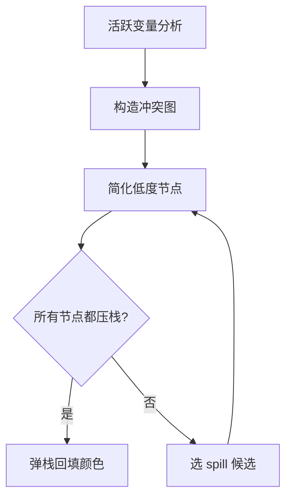

# 图着色寄存器分配（Graph Coloring）

图着色（Graph Coloring）是经典的最优寄存器分配算法。
把活跃区间视为节点、冲突视为边，目标是用 K 个物理寄存器（颜色数）给图着色，
使任意边的两个端点颜色不同。

## 一、问题形式化

```text
输入：冲突图 G = (V, E)，可用物理寄存器集合 R，|R| = K
输出：函数 color: V → R，使得 {u, v} ∈ E ⇒ color(u) ≠ color(v)
```

如果 |R| 个颜色足以覆盖图 G，则 G 是 K-可着色的。

## 二、K 着色是 NP 完全问题

任意 K ≥ 3 的图着色是 NP 完全问题。所以实际分配器都用启发式：

- 简化（Simplify）：删掉度 < K 的节点（剩余邻居一定能用剩余颜色覆盖），压入栈；
- 选择（Select）：删到没有可删节点时挑一个节点"可能需要 spill"（启发式）；
- 回填（Select）：从栈中弹回节点，按邻居颜色挑一个未用颜色；
- Spill：发现颜色不够时回溯引入 spill。



## 三、Briggs 简化

Briggs 提出的简化顺序：

```text
push_worklist = []
for v in nodes(G) sorted by degree:
    if degree(v) < K:
        push_worklist.append(v)
while push_worklist not empty:
    v = pop(push_worklist)
    stack.push(v)
    G.remove(v)
```

简化后剩余的图要么是 K-可着色的（每点度 < K），要么必须 spill。

## 四、合并（Coalescing）

`mv t0, t1` 形式的 move 指令把 `t0` 和 `t1` 关联起来。如果 `t0` 和 `t1` 没有冲突（即不在对方邻居中），可以合并为一个节点，删除这条 `mv`。

合并需要谨慎——激进合并可能引入新的 spill。George 风格保守，Briggs 风格激进但带保守回滚。

## 五、冻结（Freeze）

合并机会耗尽时，"低度但合并受阻"的节点被冻结——不再尝试合并，但仍参与简化。

## 六、Spill 选择

如果简化到所有节点度 ≥ K 都无法删除，就要选 spill 候选：

```text
优先级考虑：
1. 区间长度（短区间优先 spill，因为代价低）
2. 跨调用次数（少跨越调用的优先 spill）
3. 使用次数（少使用的优先 spill）
4. 已有 spill 次数（避免反复 spill）
5. 是否可 rematerialize（可重算的最适合 spill）
```

Chaitin 的 cost heuristic：

```cpp
double spill_cost(LiveRange r) {
    double uses = count_uses(r);
    double degree = r.interference_degree;
    return uses / (degree + 1);
}
```

`cost` 越小越适合 spill。

## 七、回填颜色

栈中节点按压栈逆序弹回，每个节点扫描邻居已用颜色，挑第一个未用的：

```cpp
while (!stack.empty()) {
    int v = stack.pop();
    auto used = colors_of(v.neighbors);
    for (int c : allocatable_registers) {
        if (!used.count(c)) {
            assign(v, c);
            break;
        }
    }
}
```

如果所有 K 个颜色都已被用，v 就 spill——分配失败，回退到插入 `sw/lw` 后重做冲突图。

## 八、与线性扫描的对比

| 维度 | 图着色 | 线性扫描 |
| --- | --- | --- |
| 寄存器效率 | 通常更高 5%~10% | 略低 |
| 代码量 | 超过 1000 行 | 少于 300 行 |
| 编译时间 | 长：多次图遍历 | 短 |
| 实现难度 | 高 | 低 |
| 课程加分 | 是 | 基础 |

## 九、实现建议

ToyC 实现图着色的最低要求：

```text
1. 构造冲突图（见 [活跃区间与冲突图](asm-liveness)）
2. 简化阶段：删度 < K 的节点
3. Spill 选择：cost = use_count / degree，删 cost 最低的
4. 回填：按压栈逆序分配颜色
5. 处理 move 合并：保守版（只在不引入新 spill 时合并）
6. 处理 spill：插入 sw/lw，重新构造冲突图迭代
7. 处理调用约定：分配前后过滤跨调用活跃的候选寄存器
```

## 十、测试与对比

```bash
# 同一份输入，比较线性扫描 vs 图着色的代码质量
./compiler --dump-asm -regalloc=linear < input.c > input.linear.s
./compiler --dump-asm -regalloc=graph  < input.c > input.graph.s

# 比较：
# 1. lw/sw 数量（spill 越少越好）
# 2. 实际运行时间
# 3. 二进制大小
```

## 十一、参考资料

- Chaitin, G. J. et al. *Register allocation via coloring*. Computer Languages, 1981.
- Briggs, P. *Register allocation via graph coloring*. PhD thesis, Rice University, 1992.
- George, L. & Appel, A. W. *Iterated register coalescing*. TOPLAS, 1996.

下一步阅读：[Spill / Reload](asm-spill)。
