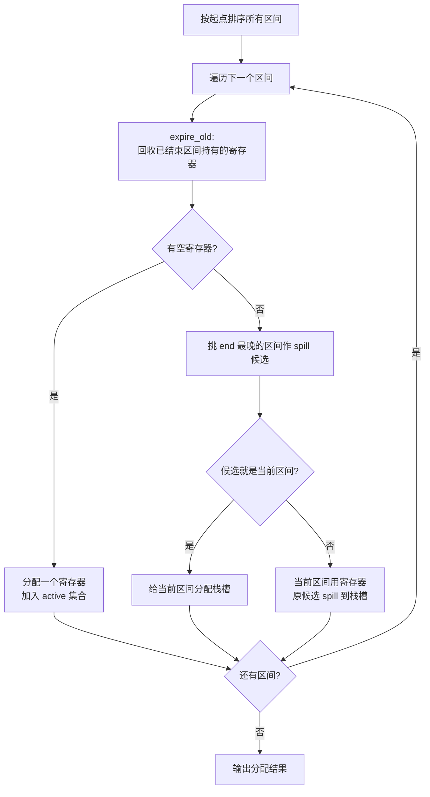

# 线性扫描寄存器分配（Linear Scan）

线性扫描（Linear Scan）是 Waddell 于 1994 年提出的寄存器分配算法，
复杂度近线性、实现简单，是 LLVM 早期以及很多 JIT 默认的分配器。
核心思想：按起点排序活跃区间，单次扫描把过期区间让出的寄存器分配给新区间。

## 一、伪代码

```text
intervals = sort_by_start(build_live_intervals(assembly))
active = []                                // 当前活跃的区间集合
free_registers = all_allocatable_registers

for interval in intervals:
    expire_old_intervals(active, interval.start)
    if not free_registers.empty():
        reg = free_registers.pop()
        assign(interval, reg)
        add_to_active(active, interval)
    else:
        spill = interval_with_latest_end(active ∪ {interval})
        if spill == interval:
            assign_stack_slot(interval)              // 当前区间 spill
        else:
            assign_register(interval, spill.reg)     // 当前区间用寄存器
            assign_stack_slot(spill)                  // 把晚结束的 spill
            replace(active, spill, interval)
```

两个关键操作：

- `expire_old_intervals`：把 `active` 中 `end ≤ current.start` 的区间移除，回收它们的寄存器；
- `spill`：没有空闲寄存器时，比较所有活跃区间与当前区间的 `end`，让结束最晚的占据寄存器，其它 spill。



## 二、与图着色的区别

| 维度 | 线性扫描 | 图着色 |
| --- | --- | --- |
| 时间复杂度 | O(N log N)，接近线性 | NP 完全问题（K 着色），需要启发式 |
| 实现难度 | 低 | 高（简化、合并、冻结、spill 选择） |
| 寄存器使用率 | 略差（贪心决策） | 通常更优 |
| 适合场景 | JIT、短寿命程序 | AOT、追求极致性能 |
| 实现复杂度 | 几百行 | 一两千行 |

ToyC 推荐先实现线性扫描——代码量小、易调试、性能足够应付课程实验。

## 三、寄存器类型与活跃区间跨调用

```text
活跃区间 = [start, end) ∩ function_body
```

跨越函数调用的活跃区间要按调用约定处理：

```cpp
bool crosses_call(LiveRange r, const vector<Instruction>& code) {
    for (int i = r.start; i < r.end; i++) {
        if (code[i].is_call()) return true;
    }
    return false;
}
```

- 跨越调用的值优先分配被调用者保存寄存器（`s0~s11`），无需额外保存；
- 如果被调用者保存寄存器都被占用，就在调用前后插入 `sw/lw` 把值保存在栈上。

```asm
; 调用前保存
addi sp, sp, -16
sd   s5, 8(sp)            ; 主动保存 s5 给被调函数
call foo
ld   s5, 8(sp)
addi sp, sp, 16
```

## 四、spill 实现

spill 的值需要在定义点附近插入 `store`，在使用点之前插入 `load`：

```asm
; spill 前
%v = addi t0, 1           ; %v 被 spill
mul  t1, %v, a0
```

```asm
; spill 后（%v 在栈上槽位 16(sp)）
addi t0, t0, 1            ; 立即 store 到栈
sw   t0, 16(sp)
lw   t1, 16(sp)
mul  t1, t1, a0
```

- 重复 spill：如果 `start` 和 `end` 距离远，spill 后每次 use 都要 load。更好的策略是在第一次 use 前 load 一次到新虚拟寄存器，所有 use 都用这个临时寄存器，最后 store 回去——"rematerialization"。
- rematerialization：`%v = addi t0, 1` 这种"简单定义的"可以重算，不必真 spill。

## 五、栈槽分配

spill 的值需要栈槽：

```cpp
int stack_slot(LiveRange r) {
    if (r.size == 4) return alloc_slot(4);      // int/float
    if (r.size == 8) return alloc_slot(8);      // long/double
    return alloc_slot(round_up_16(r.size));     // 数组/结构
}
```

RISC-V ABI 要求栈 16 字节对齐，每个槽位 8 字节起步。

## 六、伪代码到 ToyC 的映射

```cpp
class LinearScan {
    vector<LiveRange> intervals;
    vector<LiveRange> active;
    set<int> free_regs;
public:
    void allocate(Assembly& asm_code) {
        intervals = build_live_ranges(asm_code);
        sort_by_start(intervals);
        for (auto& r : intervals) {
            expire_old(r.start);
            if (!free_regs.empty()) {
                int reg = *free_regs.begin();
                free_regs.erase(reg);
                r.reg = reg;
                active.push_back(r);
            } else {
                auto spill = pick_spill(active, r);
                if (spill == &r) {
                    r.spill_slot = alloc_slot(r);
                } else {
                    r.reg = spill->reg;
                    spill->spill_slot = alloc_slot(*spill);
                }
                active.push_back(r);
            }
        }
        emit_spill_code(asm_code);
    }
};
```

## 七、测试

```bash
./compiler --dump-asm        < input.c > input.s       # 不优化
./compiler --dump-asm -opt   < input.c > input.opt.s   # 含寄存器分配
diff input.s input.opt.s                               # 观察寄存器替换与 spill

# 统计寄存器使用
grep -c "lw\|sw" input.s
grep -c "lw\|sw" input.opt.s
```

如果 `input.opt.s` 的 `lw/sw` 数显著多于 `input.s`，说明 spill 偏多，可能要换更优的活跃区间构建策略，或者减少活跃区间数量（缩短跨调用活跃）。

下一步阅读：[图着色寄存器分配](asm-graph-coloring) 或 [Spill / Reload](asm-spill)。
