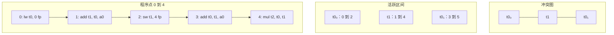

# 活跃区间与冲突图

寄存器分配的目标是把虚拟寄存器映射到物理寄存器。两个值如果同时活跃，
就不能分配同一个寄存器；表示这种约束的结构叫冲突图（interference graph）。
构造冲突图依赖活跃区间（live range）——一个值从定义点到最后一次使用的连续区间。

## 一、为什么从汇编而不是 LLVM IR？

第四部分生成的目标汇编中，每条指令都已绑定到具体的虚拟寄存器。
IR 层的 SSA 值是无限的，到了汇编层才有"寄存器压力"的概念。
所以寄存器分配的对象是汇编层的虚拟寄存器，不是 IR 层的 SSA 值。

## 二、活跃区间

### 2.1 概念

```text
活跃区间 [start, end)
  start: 某个值版本被定义的指令编号
  end:   该值版本最后一次被使用位置的后一位
```

```asm
0: lw   t0, 0(fp)        ; 定义 v
1: add  t1, t0, a0       ; 使用 v
2: sw   t1, 4(fp)        ; 写 t1
3: add  t0, t1, a0       ; t0 重新定义；旧值 v 的活跃区间 [0, 2) 结束
4: mul  t2, t0, t1       ; t2 用 t0 和 t1
```

上面的 `t0` 实际上有两个区间：第一个 `[0, 2)`（v 用途）、第二个 `[3, 5)`；`t2` 在示例中没有后续使用，可以不进入冲突图。

### 2.2 构造

对每条汇编指令编号，扫描指令序列：

**算法 1 · 构造活跃区间（Build Live Ranges）**

**输入（Input）：** 已编号的汇编指令序列。
**输出（Output）：** 每个值版本的活跃区间 `[start, end)`。

```
 1: buildLiveRanges(code):
 2:     open = Map<Reg, LiveRange>();                     // 当前寄存器值版本
 3:     ranges = [];
 4:     for each incoming value r do open[r] = LiveRange(reg = r, start = 0, end = 1, used = false); end for
 5:     for i = 0 to len(code) - 1 do
 6:         for each r in usesOf(code[i]) do
 7:             if r in open then open[r].end = i + 1; open[r].used = true; end if
 8:         end for
 9:         for each r in defsOf(code[i]) do
10:             if r in open and open[r].used then ranges.push(open[r]); end if // 重新定义：结束旧版本
11:             open[r] = LiveRange(reg = r, start = i, end = i + 1, used = false);
12:         end for
13:     end for
14:     for each range in open do if range.used then ranges.push(range); end if end for
15:     return ranges;                                    // 半开区间 [start, end)
```

### 2.3 跨越基本块

上面的算法是单基本块内的局部活跃区间。真正的活跃区间要跨基本块扩展：

```text
活区间 = union(块内 [def, last_use]) ∪ block-entry-live ∪ block-exit-live
```

实现时先做反向数据流分析（与 [基本块与 CFG](ir-cfg) 中的活跃变量类似，但对象是虚拟寄存器），再用上面的算法在块内构造。

## 三、冲突图（Interference Graph）

两个值版本的活跃区间重叠时，这两个版本不能共用同一个物理寄存器。
把这种约束建模为图：

```text
节点：每个活跃区间对应的值版本
边：A 和 B 同时在某个程序点活跃 → (A, B) ∈ E
```

构造：

**算法 2 · 构造冲突图（Build Interference Graph）**

**输入（Input）：** 活跃区间列表。
**输出（Output）：** 冲突图 `G`。

这里的 `id` 是值版本的唯一编号；同一寄存器的不同定义必须有不同 `id`。

```
 1: buildInterference(ranges):
 2:     G = new Graph();
 3:     for each r in ranges do G.addNode(r.id); end for
 4:     for each pair (r1, r2) in ranges do
 5:         if r1.id == r2.id then continue; end if
 6:         if r1.start < r2.end and r2.start < r1.end then
 7:             G.addEdge(r1.id, r2.id);                  // 区间重叠 -> 连边
 8:         end if
 9:     end for
10:     return G;                                        // move 相关边在合并阶段再处理
```

下面这张图把上面汇编示例的活跃区间、它们彼此重叠的位置，以及由此导出的冲突图一次性画出来：


```mermaid
%% 每个值版本使用独立节点，避免把同名寄存器的两段区间误合并。
flowchart TB
  subgraph 冲突图
    A[t0₀] --- B[t1]
    B --- C[t0₁]
  end
  subgraph 活跃区间
    R0["t0₀：0 到 2"] ~~~ R1["t1：1 到 4"]
    R1 ~~~ R2["t0₁：3 到 5"]
  end
  subgraph 程序点 0 到 4
    P0[0: lw t0, 0 fp] --> P1[1: add t1, t0, a0]
    P1 --> P2[2: sw t1, 4 fp]
    P2 --> P3[3: add t0, t1, a0]
    P3 --> P4[4: mul t2, t0, t1]
  end
```

## 四、特殊约束：调用约定

不是所有物理寄存器都可以随便用：

| 类型 | 行为 |
| --- | --- |
| 调用者保存 `t0~t6` | 调用前后值不保留，被调函数可任意修改 |
| 被调用者保存 `s0~s11` | 被调函数必须保留，跨调用活跃的值可以放在这里 |
| 参数寄存器 `a0~a7` | 函数入口接收参数，前几条指令活跃；之后可作为临时 |
| 返回值寄存器 `a0, a1` | 函数出口返回结果 |
| `zero` | 永远为 0，不能作为分配目标 |
| `sp`, `gp`, `tp`, `fp` | 保留给栈指针等，不能分配 |

```cpp
bool is_allocatable(int phys_reg) {
    return phys_reg != SP && phys_reg != GP && phys_reg != TP
        && phys_reg != ZERO && phys_reg != FP;
}
```

如果一个值跨越函数调用还活跃，它要么用被调用者保存寄存器（首选），要么在调用前后保存/恢复。

## 五、move-aware 冲突图

普通的 `mv t0, t1` 指令被关联到 `t0` 和 `t1` 的活跃区间，从而在冲突图中加一条边。
但 `mv` 的两个操作数其实是关联的（move-related），可以分配到同一物理寄存器以消除这条 move。
现代分配器（如 `regalloc2`）会标记 move 相关对，并在合并时尝试合并。

```cpp
for (auto& I : code) {
    if (I.is_move()) {
        move_pairs.push_back({I.dst(), I.src()});    // 标记 move 相关
    }
}
```

后续分配时若发现两个 move-related 的虚拟寄存器分到了同一物理寄存器，就删除这条 `mv`。

## 六、应用

得到冲突图后，分配算法即可工作：

- [线性扫描](asm-linear-scan)：按活跃区间起点扫描，无需冲突图；
- [图着色](asm-graph-coloring)：直接在冲突图上做 K 着色。

下一步阅读：[线性扫描寄存器分配](asm-linear-scan)。
