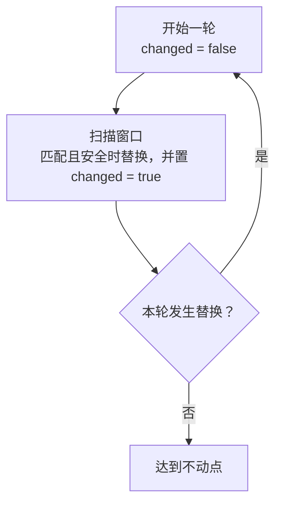
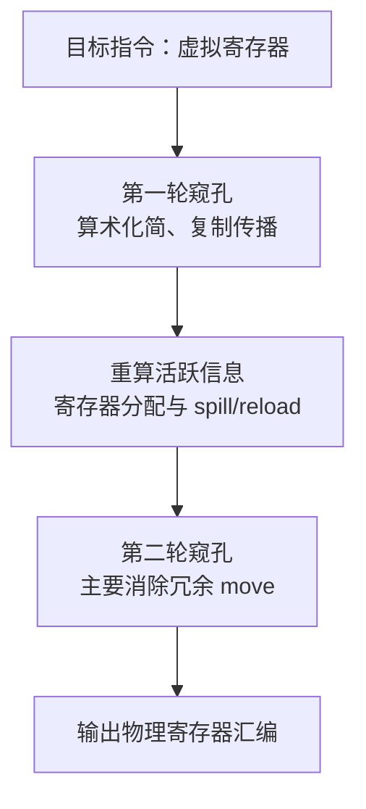

# 窥孔优化（Peephole）

窥孔优化（Peephole Optimization）在相邻的少量目标指令上匹配模式、检查依赖并做局部替换。可以在寄存器分配前、后各执行一轮：第一轮利用虚拟寄存器明确的值依赖简化代码，第二轮主要清理分配产生或暴露的冗余 `move`。

## 一、窥孔的特点

- 局部性：通常观察相邻 1～4 条指令，不必重写整个函数；
- 模式匹配：每条规则同时定义“看到什么”“换成什么”和安全条件；
- 分阶段：分配前检查虚拟寄存器的 Use-Def，分配后检查物理寄存器的重定义、活跃值和调用约束；
- 可迭代：一次替换可能产生新模式，每个阶段可以扫描到不动点。

窗口局部不意味着无需分析。例如删除复制要确认目标值没有遗漏的使用，消除访存要确认地址与内存副作用；需要的信息可以来自局部扫描，也可以来自活跃性和别名分析。

## 二、典型规则

### 2.1 无操作与复制

```text
addi r, r, 0       → 删除
mv   r, r          → 删除

addi dst, src, 0   → mv dst, src
slli dst, src, 0   → mv dst, src
```

`r`、`dst`、`src` 是操作数占位符。目的寄存器与源寄存器不同时，结果仍需要搬运，不能把整个定义删掉。`add` 的第三个操作数是寄存器，加零应写 `add dst, src, zero`；立即数版本应写 `addi`。

### 2.2 跳转合并

```text
j L1                  → j L2
...
L1: j L2

beq  r, zero, L1       → bne r, zero, L2
j    L2                 j L1

beqz r, L1            → j L1
bnez r, L1
```

第一条规则跳过只含无条件跳转的中间块；保留该块供其它入边使用，且确认边上没有尚未执行的 phi 复制。第二条只反转分支条件并互换目标，是否进一步删掉 `j` 要看下一块的布局。第三条要求两次判断之间没有改变 `r`。

### 2.3 冗余 load/store

```text
lw r, slot            → lw r, slot
sw r, slot
```

要求两条指令访问同一个普通内存地址、宽度相同，期间地址寄存器和值都未改变。设备内存或 volatile 访问不能按这条规则删除。

### 2.4 算术恒等与位宽

```text
li    one, 1
mul   dst, src, one   → mv dst, src

li    z, 0
sub   dst, src, z     → mv dst, src
```

这里的 `one`、`z` 是已知常量的寄存器。`mul` 没有“乘立即数 1”的指令形式。只有这些常量寄存器没有其它使用时，才可顺带删除前面的 `li`。

RV64 上，`addiw dst, src, 0`、`slliw dst, src, 0` 会将低 32 位符号扩展，不能无条件替换为保留全部 64 位的 `mv`；需要维持 ToyC 的 32 位整数语义。

### 2.5 局部复制传播

第一轮可以沿虚拟寄存器的依赖消除中间副本：

```text
mv  v1, v0            → add v2, v0, v3
add v2, v1, v3
```

前提是 `v0` 到使用点没有被重新定义，且 `v1` 没有其它使用。虚拟寄存器若使用 SSA 值版本，这个检查通常更直接；若不是 SSA，同样要追踪重定义。分配后若要传播 `mv t0, t1`，还得检查 `t1` 是否在后续使用前被复用，以及 `t0` 是否有其它活跃使用。

### 2.6 内存顺序与屏障

`fence` 会约束内存访问的可见顺序，不能仅凭相邻关系删除或合并。除非已经证明两条屏障的域和顺序完全等价，否则把它们视为不可移动、不可消除的指令。

## 三、规则匹配器

### 3.1 单条规则的数据结构

```cpp
struct Rule {
    string name;
    vector<Pattern> match;       // 长度 1~4
    vector<Pattern> replace;     // 替换模板
    function<bool(Window)> guard; // 安全条件
};
```

### 3.2 模式匹配

```cpp
bool match(Window w, const vector<Pattern>& pats) {
    for (int i = 0; i < pats.size(); i++) {
        if (!match_one(w[i], pats[i])) return false;
    }
    return true;
}
```

`match_one` 处理：

- 字面量立即数（`addi _, _, 0`）
- 寄存器通配（`_` 表示任意寄存器）
- 操作数相等约束（同一条规则里要求某些位置必须相同寄存器）

### 3.3 变量绑定

```text
add t0, t1, t2
↓
add %x, %y, %z
```

变量绑定允许匹配中"捕获"寄存器名，并在替换中引用。

## 四、迭代执行

**算法 · 窥孔优化主循环（Peephole Optimization）**

**输入（Input）：** 汇编指令序列与规则集合 `rules`。
**输出（Output）：** 应用规则后的汇编。

```
 1: peephole(code):
 2:     repeat
 3:         changed = false;  i = 0;
 4:         while i < len(code) do
 5:             matched = 0;
 6:             for each rule R in rules do                 // 窗口大小 1 ~ 4
 7:                 if match(code, i, R) and guardOk(code, i, R) then
 8:                     apply(code, i, R);
 9:                     changed = true;
10:                     matched = len(R.pattern);
11:                     break;
12:                 end if
13:             end for
14:             if matched > 0 then i = max(0, i - 1);         // 从原窗口起点回退一个位置
15:             else i += 1; end if
16:         end while
17:     until not changed                                   // 一轮无变化即结束
18:     return code;
```

替换后从原窗口起点回退一个位置，使新指令能与前一条形成新模式。仅在指令实际改变时置 `changed = true`，并避免两条规则互相反向替换，否则不动点循环可能无法结束。



## 五、安全条件

每条规则必须有 guard 函数确保替换不改变可观察行为：

| 替换 | 需要证明的条件 |
| --- | --- |
| 删除 `mv r, r` | 完全自复制，没有其它隐式副作用 |
| 传播 `mv dst, src` 并删除定义 | `src` 到使用点仍是同一个值，`dst` 的所有使用都已处理 |
| 删除冗余 `sw` | 访问宽度、地址和值相同，内存未被修改，且没有 volatile/设备内存语义 |
| 合并条件跳转 | 判断值不变，分支目标和 fall-through 路径正确 |
| 跳过只含跳转的块 | 原控制流边上的 phi 复制或其它动作不会丢失 |

## 六、两轮分别使用哪些规则

| 规则 | 第一轮：虚拟寄存器 | 第二轮：物理寄存器 |
| --- | --- | --- |
| 加零、移位零位等算术化简 | 先减少无效计算，保留正确位宽 | 清理分配后仍保留的同类冗余 |
| 局部复制传播 | 依赖值版本更清晰，优先处理 | 仅在物理寄存器重定义与活跃性允许时处理 |
| `mv r, r` | 两端仍是不同虚拟值时看不出来 | 分配/复制合并后显现，直接删除 |
| 参数和返回值搬运 | 必须保留调用约定要求的复制 | 仅消除映射后多余的搬运，必要的 `mv` 仍保留 |
| 局部访存与跳转化简 | 满足安全条件即可处理 | 也可清理 spill/reload 等新暴露的模式 |

验证规则时既看成功化简的例子，也检查源寄存器被覆盖、目标值还有其它使用、访问宽度不同等反例。

## 七、与寄存器分配的顺序



第一轮面对的虚拟寄存器可以使用独立的值版本，Use-Def 更容易追踪，也没有普通临时值之间的物理寄存器复用干扰。提前消除复制和无效计算，还能减少活跃值数量。完成第一轮后更新或重算活跃性，再进行寄存器分配。

第二轮面对已经确定的物理映射，能发现“不同虚拟寄存器被分到同一个物理寄存器”形成的自复制，以及参数搬运、spill/reload 处理产生或暴露的冗余。它不重新分配寄存器；每条替换仍需检查物理寄存器依赖，涉及指令或控制流变化时也应维护相关分析信息。

例如 `mv v1, v0` 在分配前是两个不同的名字；若复制合并允许它们都放入 `t0`，分配后就成为 `mv t0, t0`，第二轮可以删除。若得到的是 `mv t1, t0` 且后续仍使用 `t1`，这条搬运必须保留。

这种分配前、后都进行机器指令优化的安排也可参见 [LLVM 代码生成阶段说明](https://llvm.org/docs/CodeGenerator.html#the-high-level-design-of-the-code-generator)。

下一步阅读：[强度削减](asm-strength-reduction)。
