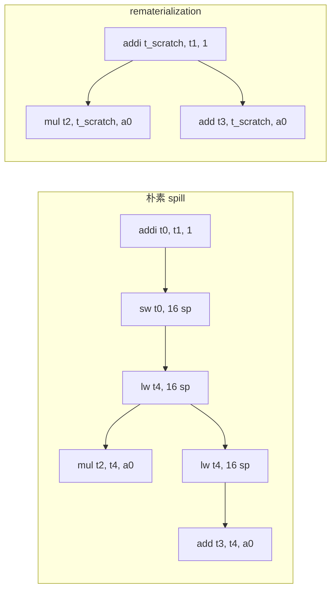

# Spill / Reload

Spill 是寄存器分配不可避免的副产品：可用物理寄存器数量有限，
当活跃区间数量超过 K 时，部分值必须放到内存里。
这一节专门讲 spill 怎么生成代码、选择栈槽、减少代价。

## 一、为什么需要 spill？

```text
可用物理寄存器：s0~s11（12 个）+ t0~s6（7 个）+ a0~a7（参数，1~2 个可用作临时）≈ 18 个
ToyC 函数体内常见活跃寄存器：超过 18 个
```

如果函数有 25 个活跃区间同时存在，分配器就要把多余的 7 个值 spill 到栈上。

## 二、Spill 代码模式

spill 的值在定义点附近写栈，使用点之前从栈读回：

```asm
; 原始（理想情况，所有值都在寄存器）
addi t0, t1, 1
mul  t2, t0, a0
add  t3, t2, a0

; t0 被 spill（槽位 16(sp)）
addi t0, t1, 1
sw   t0, 16(sp)              ; 定义点附近 store
lw   t4, 16(sp)              ; 使用点之前 load
mul  t2, t4, a0
lw   t4, 16(sp)              ; 每次使用前都要 load
add  t3, t4, a0
```

观察到一种朴素 spill 在每次 use 前都要 `lw` 一次，代价较大。



## 三、Rematerialization

对定义简单且无副作用的值，更好的策略是重算而不是真 spill：

```text
%v = addi %a, 1         ; 简单定义
; 每次使用 %v 时改写为：addi t_scratch, %a, 1
```

不需要 store/load，每次 use 直接重算。代价是额外的算术指令，但省掉了 `lw/sw`。

ToyC 中适合重算的：

- 整数立即数 `addi %a, N`（只要 `a` 仍可用）
- 整数 `addi %a, 0`（等价于 `mv`，但实际不生成）
- 简单函数参数加载（`lw %v, offset(sp)`）

## 四、栈槽分配

spill 的值需要分配栈槽：

```cpp
class StackFrame {
    int size = 0;
    vector<Slot> slots;            // 槽位列表
public:
    int alloc(int bytes, int align = 8) {
        size = align_up(size, align);
        int offset = size;
        slots.push_back({offset, bytes});
        size += bytes;
        return offset;
    }
};
```

RISC-V ABI 要求栈 16 字节对齐。每个槽位至少 8 字节，复杂的（结构体）按需对齐。

```asm
addi sp, sp, -64          # 分配 64 字节栈帧（含 spilled values）
sd   ra, 56(sp)           # 保存返回地址
sd   s0, 48(sp)           # 保存帧指针（如用）
sw   t0, 16(sp)           # spilled value #1
sd   t1, 8(sp)            # spilled value #2
```

## 五、Spill 优化

### 5.1 共享相邻 store/load

```asm
; 朴素
sw t0, 16(sp)
lw t1, 16(sp)
mul t2, t1, a0

; 优化：spill 后第一个 use 后 load 到新虚拟寄存器
; 这样只在 spill/第一次 use 配对
addi s_scratch, zero, ...
sw   t0, 16(sp)
lw   s_scratch, 16(sp)
mul  t2, s_scratch, a0
```

### 5.2 Hoist 跨调用 spill

如果一个 spilled 值在调用点前后都需要，可以把 store 提前到调用前一次，load 推迟到调用后一次：

```asm
; 朴素
sw   t0, 16(sp)
call foo
lw   t1, 16(sp)
mul  t2, t1, a0
sw   t0, 16(sp)
call bar
lw   t1, 16(sp)
mul  t3, t1, a0

; 优化
sw   t0, 16(sp)              ; 一次 store
call foo
call bar                      ; 两次调用之间不重 load
lw   t1, 16(sp)
mul  t2, t1, a0
mul  t3, t1, a0
```

这种"spill coalescing"需要活跃区间分析支持跨调用合并。

### 5.3 避免重复 spill

如果同一个虚拟寄存器被 spill 两次，会产生两个独立的栈槽。改进：

```text
1. 在第一次 spill 时记录槽位
2. 后续对同一虚拟寄存器的 spill 复用同一槽位
3. 使用活跃区间分析判断两次 spill 之间没有其它定义
```

## 六、Spill Cost 模型

评估 spill 质量：

```text
cost = Σ (load_count + store_count) × frequency_of_block
```

其中 `frequency_of_block` 可由循环深度估算（如循环内 ×10）。

理想分配器应优先 spill 循环外或短活跃区间的值。

## 七、Spill 调试

```bash
# 1. 查看汇编中 lw/sw 数量
./compiler --dump-asm -opt < input.tc | grep -c "lw\|sw"

# 2. 对比无优化版本
./compiler --dump-asm < input.tc | grep -c "lw\|sw"

# 3. 输出每条 spill 的位置
./compiler --dump-asm -opt --debug-spill < input.tc > after.s
```

如果 `after.s` 比 `before.s` 多很多 `lw/sw`，说明分配器选择 spill 不当，可能要重新设计活跃区间或升级到图着色。

下一步阅读：[窥孔优化](asm-peephole)。
