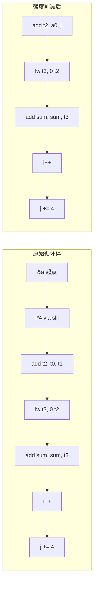

# 强度削减（Strength Reduction）

强度削减把高代价的指令替换为等价但更便宜的指令。
最典型的应用场景是循环：循环体的代价会被放大，节省每条指令的开销都很值得。

## 一、典型替换

| 原指令 | 替换后 | 收益 |
| --- | --- | --- |
| `mul t0, t1, 2` | `slli t0, t1, 1` | 乘法 → 移位 |
| `mul t0, t1, 4` | `slli t0, t1, 2` | 乘法 → 移位 |
| `mul t0, t1, 8` | `slli t0, t1, 3` | 乘法 → 移位 |
| `mul t0, t1, N` | `add t0, t1, t1` (N=2) / 多个 slli/add | 灵活 |
| `div t0, t1, 2` | `srli t0, t1, 1` | 除法 → 移位 |
| `rem t0, t1, N` | `mul t0, t1, M` 当 N=2^k | 替换为乘常量 |
| `pow t0, t1, 2` | `mul t0, t1, t1` | 库函数 → 一次乘法 |
| `pow t0, t1, N` (N 编译期常量) | N-1 次乘法 | 库函数 → 多次乘法 |

ToyC 主要处理整数，浮点相关的 sqrt → 倒数近似可放在进阶项。

## 二、常量传播前置

强度削减依赖常量已知。下面两条指令的对比：

```llvm
; 情况 1：常量已知
%t = mul i32 %i, 4       ; ToyC 后端 → slli t, i, 2

; 情况 2：常量未知
%t = mul i32 %i, %k      ; 只能发 mul 指令
```

所以中端 [常量传播](ir-cprop) 是强度削减的基础——传播得越彻底，后端能削的越多。

## 三、循环归纳变量与强度削减

循环体中的"基本归纳变量"特别适合强度削减：

```c
int sum = 0;
for (int i = 0; i < n; i++) {
    sum += a[i * 4];
}
```

`i * 4` 在每次迭代增加 4，编译器可以把 `i*4` 替换为另一个归纳变量 `j`，每次迭代 `j += 4`：

```c
int sum = 0;
int j = 0;
for (int i = 0; i < n; i++) {
    sum += a[j];
    j += 4;
}
```

汇编上的差别：

```asm
; 原始
loop:
  lw   t0, 0(a0)           ; a 起点
  slli t1, i, 2            ; i * 4
  add  t2, t0, t1          ; &a[i]
  lw   t3, 0(t2)           ; a[i]
  add  sum, sum, t3
  addi i, i, 1
  blt  i, n, loop

; 强度削减后
  addi j, zero, 0          ; j = 0 一次
loop:
  add  t2, a0, j           ; &a[j / 4]
  lw   t3, 0(t2)
  add  sum, sum, t3
  addi i, i, 1
  addi j, j, 4
  blt  i, n, loop
```

每次迭代节省一条 `slli`，对于长循环收益显著。



## 四、归纳变量检测

**算法 · 归纳变量检测（Detect Induction Variables）**

**输入（Input）：** 自然循环 `L`。
**输出（Output）：** 基础归纳变量与派生归纳变量列表。

```
 1: detectIndVars(L):
 2:     result = [];
 3:     for each phi in L.phis do
 4:         // 基础归纳变量：phi 的一个入边是常量，另一个入边是 "phi + 常量 c"
 5:         if isConstant(phi.incoming[0]) and isAddWithConstant(phi.incoming[1], c) then
 6:             result.push( IndVar(base = phi, step = c, initial = phi.incoming[0]) );
 7:         end if
 8:     end for
 9:     for each inst I in L.instructions do
10:         // 派生归纳变量：i * k、i + c、i - c
11:         if isMulWithConstant(I, iv, k) then
12:             result.push( IndVar(base = iv, derived = I, step = iv.step * k) );
13:         end if
14:     end for
15:     return result;
```

## 五、循环展开配合

```c
; 展开 4 次
for (int i = 0; i < n; i += 4) {
    sum += a[i*4] + a[(i+1)*4] + a[(i+2)*4] + a[(i+3)*4];
}
```

展开后可以发现 `(i+1)*4`、`(i+2)*4`、`(i+3)*4` 是 `i*4 + 4/8/12`，
进一步强化强度削减的效果——这是 [LICM](ir-licm) 后的常见搭配。

## 六、与寄存器分配的冲突

强度削减改变了活跃区间，必须在寄存器分配前完成：

```text
推荐顺序：
1. 常量传播、循环不变代码外提
2. 归纳变量分析
3. 强度削减（增加派生归纳变量）
4. 寄存器分配
5. Spill 处理
6. 窥孔优化
```

如果在寄存器分配后再做强度削减，会引入新的活跃区间，破坏已有的寄存器映射。

## 七、正确性陷阱

| 陷阱 | 处理 |
| --- | --- |
| 溢出语义 | ToyC 是 64-bit 有符号整数；乘法指令需 `mul` 而非 `mulh`，不要错误替换 |
| 浮点 | 浮点 `* 2.0` 可以用 `add`,但 `x * 2.0` 不等于 `x + x`（IEEE 754 舍入差异）——ToyC 不涉及 |
| `srai` 对负数是算术右移，`srli` 是逻辑右移 | ToyC 默认有符号，可放心使用 `srai` |
| `mul` 指令延迟较高 | RISC-V 上乘法的延迟比 add 高 3~4 倍，强度削减的收益更大 |

## 八、测试

```bash
# 生成带循环的输入
cat > loop.c <<EOF
int sum = 0;
for (int i = 0; i < 1000; i++) sum += i * 4;
return sum;
EOF

# 对比无优化 vs 有强度削减的指令数
./compiler --dump-asm        < loop.c > loop.s
./compiler --dump-asm -opt   < loop.c > loop.opt.s
diff loop.s loop.opt.s

# 链接并运行（qemu-user 快速验证）
riscv64-unknown-elf-gcc -march=rv64gc -mabi=lp64d \
  -nostdlib -static loop.s     third_party/toyc/libtoyc.a -o loop
riscv64-unknown-elf-gcc -march=rv64gc -mabi=lp64d \
  -nostdlib -static loop.opt.s third_party/toyc/libtoyc.a -o loop.opt
./loop     < loop.in > loop_result.out
./loop.opt < loop.in > loop_result_opt.out

# 如需完整虚拟机环境，使用 qemu-system 启动
qemu-system-riscv64 \
  -machine virt \
  -cpu rv64gc \
  -nographic -m 4G -smp 4 \
  -kernel /usr/lib/u-boot/qemu-riscv64_smode/uboot.elf \
  -device virtio-net-device,netdev=eth0 \
  -netdev user,id=eth0,hostfwd=tcp::2222-:22 \
  -device virtio-rng-pci \
  -drive file=ubuntu-24.04-riscv64.img,format=raw,if=virtio
```

回到：[目标代码优化总览](../labs/part6-target-optimization)。
