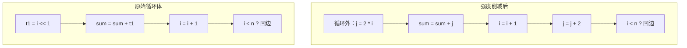

# 强度削减（Strength Reduction）

强度削减用代价更低的等价指令替换代价较高的指令。它的收益主要体现在循环体内：循环体的开销随迭代次数线性放大，每条指令都值得省。

目标代码层的强度削减只做局部、等价的指令替换；需要数学推导的变换属于机器无关优化，见 [IR 层强度削减](ir-strength-reduction)。

## 一、典型替换

后端的规则表只收集能直接验证等价的替换，其中最常见的一条是乘 2 的幂：

| 原指令 | 替换后 | 说明 |
| --- | --- | --- |
| `mul t0, t1, 2^k` | `slli t0, t1, k` | 乘 2 的幂换成移位，循环中最常见 |

乘数是常量且能拆成少数几个 2 的幂时同样可以拆解（例如 `x * 7` 写成 `(x << 3) - x`）；乘数是负数时先按它的绝对值替换，最后取负（`sub t0, zero, t0`）。这些替换与操作数的正负无关：`x * 2^k` 与 `x << k` 在 32 位补码下的低 32 位和符号位都一致。

除法不能照搬这个思路。`div` 是向零截断的有符号除法，`srli`（逻辑右移）与 `srai`（向下取整的算术右移）在负数上都不等于 `div`，`rem` 也没有等价的单条指令。除数是编译期常量时，改由 [强度削减（魔数法）](ir-strength-reduction) 把 `div` / `rem` 换成"乘魔数 + 移位"，后端不做这类替换。

## 二、常量传播是前置条件

强度削减要求乘数在编译期已知，因此依赖中端的常量传播：

```llvm
%t = mul i32 %i, 4        ; 乘数已知：后端可以换成 slli
%u = mul i32 %i, %k       ; 乘数未知：只能保留乘法
```

[常量传播](ir-cprop) 传播得越充分，后端能替换掉的乘法越多。

## 三、循环中的派生归纳变量

循环里每轮都要执行一次的乘法是主要目标。以 `sum = sum + i * 2` 为例（ToyC 没有 `for`，这里用 `while` 书写）：

```c
int main() {
    int n = getint();
    int sum = 0;
    int i = 0;
    while (i < n) {
        sum = sum + i * 2;
        i = i + 1;
    }
    putint(sum);
    return 0;
}
```

`i` 是基本归纳变量（每轮加常量 1），`i * 2` 是派生归纳变量，它的变化规律同样已知（每轮加 2）。既然规律已知，就不必每轮重新计算乘法，可以在进入循环前算出 `j = i * 2`，循环内只做 `j = j + 2`：



每轮迭代省下一条 `slli`，迭代次数越多收益越大。循环展开会进一步放大这类收益：把两轮迭代合到一轮后，每轮只需给 `j` 加 4，乘法在循环体中的比例更低。

## 四、归纳变量检测

**算法 · 归纳变量检测（Detect Induction Variables）**

**输入（Input）：** 自然循环 `L`（IR 层或汇编层都可以做）。
**输出（Output）：** 基本归纳变量与派生归纳变量列表。

```
 1: detectIndVars(L):
 2:     result = [];
 3:     for each value v defined at the loop header do  // SSA 形式下通常是 phi
 4:         // 基本归纳变量：一次定义来自循环外的常量 init，另一次是 "v + 常量 c"
 5:         if hasLoopInvariantInit(v, init) and isAddWithConstant(loopDef(v), c) then
 6:             result.push( IndVar(base = v, step = c, initial = init) );
 7:         end if
 8:     end for
 9:     for each instruction I in L.instructions do
10:         // 派生归纳变量：i * k、i + c、i - c
11:         if isMulWithConstant(I, iv, k) then
12:             result.push( IndVar(base = iv, derived = I, step = iv.step * k) );
13:         end if
14:     end for
15:     return result;
```

## 五、与寄存器分配的先后关系

强度削减会引入派生归纳变量，从而产生新的活跃区间，因此必须在寄存器分配之前完成：

```text
推荐顺序：
1. 常量传播、循环不变代码外提
2. 归纳变量分析
3. 强度削减（把乘常量换成移位与加法，并引入派生归纳变量）
4. 寄存器分配
5. Spill 处理
6. 窥孔优化
```

若放在寄存器分配之后进行，新引入的活跃区间会破坏已经确定的寄存器映射。

## 六、正确性陷阱

| 陷阱 | 处理 |
| --- | --- |
| 负数除法与取余 | `div` / `rem` 向零截断，不能换成移位；只有能证明被除数非负时才有 `x / 2^k ≡ x >> k`，除常量统一交给 IR 层的魔数法 |
| 补码回绕 | `int` 是 32 位有符号；`mul x, 2^k` 与 `slli` 在回绕语义下等价，换成 `mulh` / `mulhu` 反而会错 |
| 乘数不是常量 | 运行期才能确定的乘数无法拆成移位，不要匹配这类指令 |
| 位宽 | 目标平台是 RV64，但 `int` 是 32 位，乘移位要用 32 位语义（`mulw` / `sllw`，或先 `sext` 再移位） |
| 常量拆解过长 | `c` 的 2 的幂分解项数多于直接乘法时不再划算，规则中应设一个上限 |
| 指令延迟 | RISC-V 上 `mul` 的延迟是加法、移位的数倍，`div` 更高，替换乘法的收益明显 |
| 活跃区间变化 | 新增派生归纳变量会改变活跃区间，必须在寄存器分配之前完成 |

## 七、测试

```bash
# 生成带循环的 ToyC 输入（注意 ToyC 没有 for，用 while）
cat > loop.c <<EOF
int main() {
    int n = getint();
    int sum = 0;
    int i = 0;
    while (i < n) {
        sum = sum + i * 2;
        i = i + 1;
    }
    putint(sum);
    return 0;
}
EOF

# 对比无优化 vs 有强度削减的汇编，并检查是否还有残留的乘/除
./compiler --dump-asm        < loop.c > loop.s
./compiler --dump-asm -opt   < loop.c > loop.opt.s
diff loop.s loop.opt.s
grep -nE '\b(mul|mulw|div|divw|rem|remw)\b' loop.opt.s

# 链接并运行（qemu-user 快速验证）
riscv64-unknown-elf-gcc -march=rv64gc -mabi=lp64d \
  -nostdlib -static loop.s     third_party/toyc/libtoyc.a -o loop
riscv64-unknown-elf-gcc -march=rv64gc -mabi=lp64d \
  -nostdlib -static loop.opt.s third_party/toyc/libtoyc.a -o loop.opt

# 同一组输入，两个可执行文件的输出必须完全一致
echo 10000 | ./loop     > loop_result.out
echo 10000 | ./loop.opt > loop_result_opt.out
diff loop_result.out loop_result_opt.out

# 如需完整虚拟机环境，使用 qemu-system 启动
qemu-system-riscv64 \
  -machine virt \
  -cpu rv64gc \
  -nographic -m 4G -smp 4 \
  -kernel /usr/lib/u-boot/qemu-riscv64_smode/uboot.elf \
  -device virtio-net-device,netdev=eth0 \
  -netdev user,id=eth0,hostfwd=tcp::2222-:22 \
  -device virtio-rng-pci \
  -drive file=ubuntu-24.04-riscv64.img,format=raw,if=virtio
```

:::tip[每条规则都要有正例和反例]
强度削减的规则存在"看似等价、实则不等价"的风险。建议为每条规则准备三类测试：正例（确实应当被替换）、反例（负数、`INT_MIN` 等边界不应被替换）、回归用例（替换前后程序输出完全一致）。
:::

回到：[目标代码优化总览](../labs/part6-target-optimization)。
