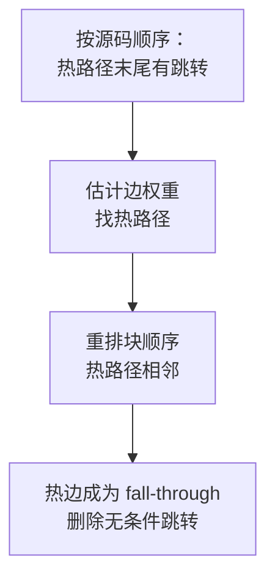
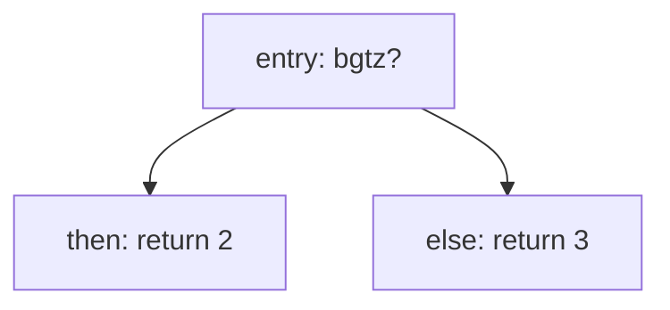

# 基本块重排（Basic Block Layout）

基本块重排（也叫代码布局）不改变任何计算，只调整基本块在目标文件中的排列顺序。同样的控制流，不同的排列会带来不同的指令条数与分支预测表现。

## 一、必要性

顺序执行的指令没有额外代价，跳转才有：

- 处理器（以及 QEMU 的翻译缓存）更希望下一条指令紧接在当前指令之后；一条 `j` 意味着重新取指；
- 条件分支预测失败时流水线需要冲刷，代价为十几到几十个周期；
- 跳转还会拉大标签与指令地址的距离，降低指令缓存局部性。

而"哪个分支更可能被进入"是可以估计的，常用的静态经验规则包括：

- 循环的回边几乎总会走（循环体要执行多次）；
- `if` 的 `then` 分支通常比 `else` 更常执行；
- 向前跳的分支（forward branch）常常是出错退出、提前返回这类冷路径；
- 向后跳的分支（backward branch）常常是循环回边，属于热路径。

据此可以把热路径排成顺序执行，把跳转留给冷路径。

```c
if (x > 0) {
    /* 热路径：绝大多数输入走这里 */
    y = x * 2;
} else {
    /* 冷路径：罕见的边界情况 */
    y = -1;
}
```

按源代码顺序直接生成（`then` 在前）：

```asm
    blez a0, ELSE        # 不成立就跳走
THEN:
    slli a1, a0, 1       # 热路径
    j    END             # 热路径末尾还有一条无条件跳转
ELSE:
    li   a1, -1
END:
    ret
```

重排之后（把冷路径移到前面，热路径落在顺序执行的位置）：

```asm
    bgtz a0, THEN        # 改为"成立才跳"，跳向热路径
ELSE:
    li   a1, -1
    j    END
THEN:
    slli a1, a0, 1       # 热路径顺序执行，直接落入 END
END:
    ret
```

热路径上少了一条 `j`，且不跳转的路径正好是预测最准的那条。



## 二、可用的重排手段

| 手段 | 效果 |
| --- | --- |
| 热边相邻 | 删除该边上的无条件跳转（fall-through） |
| 反转条件分支 | 让常走的边走顺序路径，冷边去跳 |
| 冷块后移 | `break` / `continue` / 错误处理等冷块集中到函数末尾，不打断热路径 |
| 循环布局 | 把循环条件判断放在末尾，每轮少一条跳转 |
| 合并单链块 | 只有一条前驱和一条后继的链式块尽量排在一起 |

这些手段都不改变程序语义，只影响性能，因此容易被忽略：不实现也能通过功能测试，实现之后才有性能收益。

## 三、示例

```c
int classify(int x) {
    if (x > 0) {
        return 2;
    } else {
        return 3;
    }
}
```

按照 CFG 顺序自然排列（`entry` → `then` → `else` → `end`）：



```asm
classify:
    blez a0, ELSE        # 分支方向与热路径相反
    li   a0, 2
    ret                  # 热路径在这里返回
ELSE:
    li   a0, 3
    ret
```

重排后把 `else`（冷路径）移到跳转之后：

```asm
classify:
    bgtz a0, THEN        # 条件为真时直接跳向热路径
    li   a0, 3           # 冷路径：顺序执行
    ret
THEN:
    li   a0, 2           # 热路径：跳入后顺序执行
    ret
```

两条路径的指令条数相同，差别在于连续调用时的取指行为：重排后热路径完全连续，不会被冷路径的指令隔开。

循环的情形（ToyC 的 `while`）：

```c
while (i < n) {
    sum = sum + i;
    i = i + 1;
}
```

一种常见布局把循环体排在前面、条件判断放在末尾：

```asm
    j    COND
BODY:
    add  sum, sum, i
    addi i, i, 1
COND:
    blt  i, n, BODY      # 条件成立就跳回循环体（向后分支，热）
    # 循环退出后直接从下一行继续，不需要额外跳转
AFTER:
```

这样每次迭代只有一条条件分支，没有无条件跳转。若把 `COND` 放在前面、`BODY` 放在后面，每轮循环还要多执行一条 `j`。

## 四、算法

重排分两步：先估计每条边的权重（哪个出口更可能被进入），再按权重把块串成链并确定最终顺序。

**算法 1 · 静态分支预测（Static Branch Prediction，估计边权重）**

**输入（Input）：** 函数控制流图 `cfg`。
**输出（Output）：** 每条边 `E` 的权重 `E.weight`。

```
 1: estimateEdgeWeights(cfg):
 2:     for each edge E = (P -> S) in cfg do
 3:         w = 1;
 4:         if S dominates P then w = w * 10; end if          // 回边（循环体）：权重最高
 5:         if indexOf(S) < indexOf(P) then w = w * 2; end if // 向后分支：多为循环继续
 6:         if isConditionalBranch(P) and E is the "then" edge then
 7:             w = w * 2;                                    // if 的 then 通常比 else 更常执行
 8:         end if
 9:         if isExitEdge(E) then w = 1; end if               // 循环出口、提前返回：冷路径
10:         E.weight = w;
11:     end for
12:     return cfg;
```

上面的系数是一组常见的启发式取值，可以按经验调整。若评测环境提供 profile 信息（例如采样数据），代入真实频率会更准确。

**算法 2 · 链式块布局（Chain-based Layout）**

**输入（Input）：** 带边权重的控制流图 `cfg`。
**输出（Output）：** 基本块的新排列顺序 `order`，以及需要反转的条件分支集合。

```
 1: layoutBlocks(cfg):
 2:     estimateEdgeWeights(cfg);                              // 1. 估计边权重
 3:     for each block B in cfg do
 4:         B.chain = newChain(B);                             // 每个块先自成一个链
 5:     end for
 6:     heap = maxHeap(allEdges(cfg));                         // 按权重取边
 7:     while heap not empty do
 8:         E = heap.pop();                                    // 2. 贪心合并权重最大的边
 9:         if E.tail.chain == E.head.chain then continue; end if        // 合并会成环，跳过
10:         if E.tail is not the last block of its chain then continue; end if
11:         if E.head is not the first block of its chain then continue; end if
12:         mergeChains(E.tail.chain, E.head.chain);           // 3. 串成一个更长的链
13:     end while
14:     order = [];
15:     for each chain C in descendingOrderOfWeight(cfg) do
16:         order.pushBlocksOf(C);                             // 4. 热链在前，冷链在后
17:     end for
18:     for each edge E = (P -> S) in cfg do
19:         if S is the block right after P in order then
20:             removeJump(P, S);                              // 5. 相邻：删除跳转（fall-through）
21:         else if isConditionalBranch(P) then
22:             considerInvertBranch(P, S);                    //    反转条件，让热边走顺序路径
23:         end if
24:     end for
25:     return order;
```

该算法的思路与最大生成树类似：按权重从大到小把边固定为相邻关系，最终拼出若干条链，再按热度排列这些链。只有链内相邻的边才能成为 fall-through，因此权重估计的准确性直接决定收益。

:::tip[布局放在哪一层]
- 在 IR 层重排：只改变块的输出顺序，`phi` 的语义不受影响，实现安全，适合作为第一版实现；
- 在汇编层重排：可以顺带处理分支距离问题（RISC-V 条件分支的范围有限），但需要保证标签与栈偏移的对应关系正确。

建议在 IR 层完成，把布局结果作为后端发射基本块的顺序。
:::

## 五、优化效果

- 减少跳转：热边成为 fall-through 后，热路径上的无条件跳转被删除；循环体每轮少一条 `j`。
- 改善分支预测：条件分支的方向与常走的边对齐后，静态预测命中率提高，动态预测器也更容易收敛。
- 改善指令缓存局部性：热块彼此相邻，冷块（错误处理、`break` 出口）集中到末尾，不会打断热路径。
- 代价与风险：布局只改顺序、不改语义，因此不会导致程序出错；但若权重估计偏差过大（把冷路径当作热路径），效果可能不如原始顺序。这也是重排通常与窥孔优化、内联一起放在"收益不确定时保持保守"的位置上的原因。

## 六、正确性陷阱

| 陷阱 | 说明 |
| --- | --- |
| 漏掉补跳转 | 只有相邻的块可以 fall-through；不相邻的边必须显式保留跳转，否则控制流不完整 |
| 反转条件分支 | RISC-V 只有"成立就跳"，反转 `beq` / `bne`、`blt` / `bge` 时必须成对处理 |
| 分支距离 | 跳转目标过远时工具链会插入跳转桩，冷块不宜挪得太远 |
| 循环出口 | 循环出口通常是冷边，不要因为位置顺就把它排成热路径 |
| `break` / `continue` | 它们指向的块往往很冷，但语义上必须保留跳转，不能只靠布局省掉 |
| 不可达块 | 先用[控制流简化](ir-cfg-simplify)删除不可达块再布局，避免把死块插入热路径 |
| 与 `phi` 的关系 | IR 层重排只改块顺序，`phi` 的入边按前驱匹配，不受块顺序影响；但输出时不要依赖块的先后 |

## 七、动手验证

```bash
# 优化前后的汇编
./compiler --dump-asm      < test.c > base.s
./compiler --dump-asm -opt < test.c > opt.s

# 1. 统计无条件跳转条数（应当减少）
grep -cE '^\s*j\s' base.s opt.s

# 2. 对比块的出现顺序，确认热块被排到了前面
diff <(grep -nE '^\s*(blt|bge|beq|bne|blez|bgtz)' base.s) \
     <(grep -nE '^\s*(blt|bge|beq|bne|blez|bgtz)' opt.s)

# 3. 功能对拍：布局不改变语义，输出必须逐字节一致
```

判定标准有两层：功能上输出与优化前完全一致；性能上热路径的跳转条数下降、指令地址更集中。只有第一层成立时，说明布局至少是安全的；要获得性能收益，第二层也需要成立。

下一步阅读：[活跃区间与冲突图](asm-liveness) 进入目标代码优化章节。（[死代码消除](ir-dce) 与[控制流简化](ir-cfg-simplify) 是布局的前置清理——块越少、越干净，布局效果越明显。）
