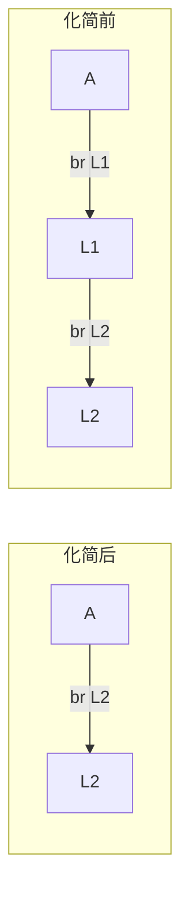
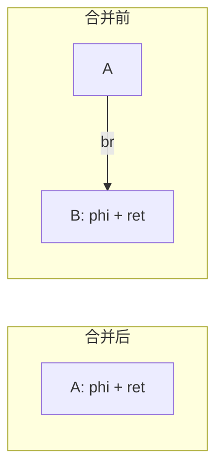
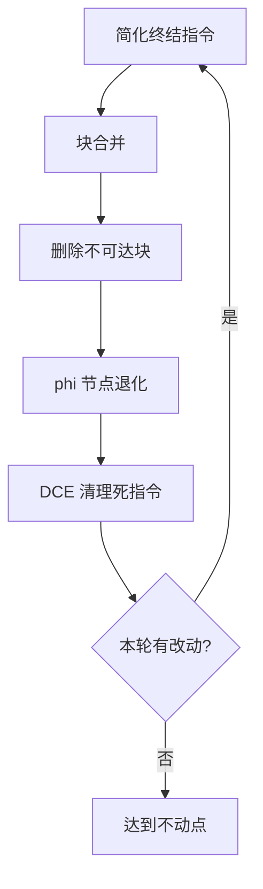

# 控制流简化（CFG Simplification）

控制流简化把"没意义"或"过于复杂"的控制流压扁成更简单的形式。
它通常与 [死代码消除](ir-dce) 配合成对执行，每次优化都可能让对方产生新机会。

## 一、典型模式

```llvm
; 模式 1：恒真分支
br i1 true, label %T, label %F
; 等价于： br label %T
; 块 %F 变为不可达

; 模式 2：相同目标
br label %X
L: br label %X       ; L 不可达
; 等价于： 删除 L，直接 fallthrough 到 X

; 模式 3：跳转到下一块
br label %N          ; 其中 N 就是下一条指令
; 等价于： 删除 br，让控制流 fallthrough

; 模式 4：跳转到无条件跳转
br label %L1
L1: br label %L2     ; "跳到跳转"
; 等价于： 把前一条 br 改为 br label %L2
```



改写后：

- 不可达块内的指令会被 DCE 全部删除；
- `phi` 节点失去某条入边，会被 DCE 一并清理（如果仅剩一条入边，则 `phi` 退化为普通 move）；
- 基本块数量减少，数据流分析的不动点收敛更快。

## 二、phi 节点退化

```llvm
entry:
  %x = add i32 %a, %b
  br label %L

L:
  %y = phi i32 [%x, %entry], [%x, %other]   ; 两条入边都是 %x
  ret i32 %y
```

如果 `%y` 的所有入边都是同一个值，可以把 `phi` 替换为该值本身：

```llvm
L:
  ret i32 %x
```

更一般地，如果某条入边所在的基本块被删除，phi 就少了入边，需要相应更新——或者整条 phi 直接删除。

## 三、块合并

```llvm
A:
  ...               ; 无终结跳转
  br label %B

B:
  %y = phi i32 [...]    ; 入边仅来自 A
  ...
  ret i32 %y
```

`A` 的唯一后继是 `B`，且 `B` 没有其它前驱。可以把 `B` 的指令合并到 `A` 末尾，删除 `B` 本身。前提是 `B` 的 phi 节点只来自 `A`，否则合并会丢失信息。



## 四、if-then 折叠

```llvm
%c = icmp ...                       ; 已经传播为常量
br i1 %c, label %T, label %F
```

若 `%c` 是 `true`，删除 `F`，把 `T` 的指令复制到 `br` 之后；若 `%c` 是 `false`，反之。ToyC 中这条通常由 [常量传播](ir-cprop) 直接触发。

## 五、执行顺序与迭代



几个观察：

- DCE 让分支条件变成常量 → 触发 if-then 折叠 → 产生新的不可达块 → DCE 再清理；
- 块合并后块内的活跃变量 / 可用表达式集合需要重新计算——所以整轮要循环到不动点；
- 实现时不必严格分阶段，可以在一个 pass 内对每个基本块做局部简化并记录修改标志。

### 5.1 简化算法

**算法 · 控制流简化（CFG Simplification）**

**输入（Input）：** 函数 CFG。
**输出（Output）：** 简化后的 CFG。

```
 1: simplifyCFG(func):
 2:     repeat
 3:         changed = false;
 4:         for each block B in func do
 5:             T = B.terminator;
 6:             // 1. 折叠恒真的条件分支
 7:             if T is (br i1 c, %X, %Y) and c is a constant then
 8:                 B.terminator = br (c ? %X : %Y);  changed = true;
 9:             end if
10:             // 2. 跳到跳转：替换为最终目标
11:             if T jumps to L and L 只有一条 br 跳到 L2 then
12:                 T.target = L2;  changed = true;
13:             end if
14:         end for
15:         // 3. 合并 A -> B 且 B 仅有 A 一个前驱的块
16:         for each edge (A -> B) do
17:             if B.predecessors has only A and B has no phi then
18:                 inline B into A;  changed = true;
19:             end if
20:         end for
21:         // 4. 删除不可达块，并把只剩一条入边的 phi 退化
22:         changed |= removeUnreachableBlocks(func);
23:     until not changed
24:     return func;
```
## 六、正确性陷阱

| 陷阱 | 处理 |
| --- | --- |
| `volatile load` / `call io` | 不能删除不可达块中的副作用指令；扫描时按"假设不可达块内副作用仍要执行"的安全语义处理 |
| `unreachable` 之后的块 | 严格意义上未定义，但 LLVM IR 的 `unreachable` 明确告诉优化器可以删 |
| 块合并破坏 phi 唯一性 | 合并前要确认 phi 的所有入边都来自同一前驱 |
| `invoke` / `landingpad` | 涉及异常处理的指令不能随便合并；ToyC 暂不涉及 |

下一步阅读：[循环不变代码外提](ir-licm)。
