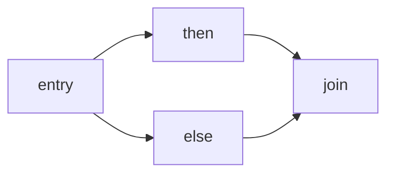

# 基本块与 CFG

基本块（Basic Block）是单入口、单出口的最大连续指令序列；
控制流图（Control Flow Graph, CFG）以基本块为节点，以跳转关系为有向边。
几乎所有机器无关优化都建立在 CFG 之上：死代码消除、公共子表达式消除、活跃变量分析都依赖它。

## 一、基本块的划分规则

LLVM IR 是 SSA 形式的线性指令列表，但函数中包含标签（label）和终结指令。
划分基本块时遵守以下规则：

1. 入口：函数第一指令；每条终结指令的目标标签；紧跟一条终结指令的下一条指令。
2. 出口：终结指令之前的所有指令都属于当前基本块。
3. 终结指令：`br`、`ret`、`switch` 等会改变控制流的指令。

```llvm
define i32 @f(i32 %x) {
entry:
  %cmp = icmp slt i32 %x, 0
  br i1 %cmp, label %then, label %else

then:
  %a = sub i32 0, %x
  br label %join

else:
  %b = add i32 %x, 1
  br label %join

join:
  %r = phi i32 [%a, %then], [%b, %else]
  ret i32 %r
}
```

上面的 IR 一共划分为 4 个基本块：`entry`、`then`、`else`、`join`。

## 二、基本块的数据结构

```cpp
struct BasicBlock {
    std::string label;                       // 块名
    std::vector<Instruction> instructions;    // 块内非终结指令
    Instruction terminator;                  // 终结指令
    std::vector<BasicBlock*> predecessors;   // 前驱
    std::vector<BasicBlock*> successors;     // 后继
    std::set<Value*> use;                    // 向上暴露的使用
    std::set<Value*> def;                    // 块内定义
    std::set<Value*> live_in;                // 入口活跃
    std::set<Value*> live_out;               // 出口活跃
};
```

`use` 收集在任何定义之前就被引用的 SSA 值；
`def` 收集块内新定义的值。`phi` 指令既不计入 `use` 也不计入 `def`。

## 三、CFG 的构造

CFG 的构造分两步：

```text
1. 扫描函数，识别所有标签和终结指令，把 IR 切成基本块列表。
2. 遍历每个基本块的终结指令：
   - br i1 %c, label %T1, label %T2    → successors = [T1, T2]
   - br label %T                       → successors = [T]
   - switch ...                        → successors = [每个 case + default]
   - ret / unreachable                 → successors = []
3. 反向遍历添加 predecessors，建立双向链接。
```

构造完成的 CFG 形如：



## 四、活跃变量分析

在 CFG 上做反向数据流分析，能识别在某点之后仍会被使用的值。
数据流方程：

```text
live_out[B] = ∪ live_in[S]   for all S in successors[B]
live_in[B]  = use[B] ∪ (live_out[B] − def[B])
```

迭代计算直到不动点：

```cpp
bool changed = true;
while (changed) {
  changed = false;
  for (auto& B : postorder(cfg)) {
    auto new_out = set_union(live_in_of_successors(B));
    auto new_in = use[B] | (new_out - def[B]);
    if (new_out != B.live_out || new_in != B.live_in) {
      B.live_out = new_out; B.live_in = new_in; changed = true;
    }
  }
}
```

反向后序遍历能让信息尽快传播到前驱，但反向数据流的标准做法是反向后序或 RPO。

## 五、应用与延伸

构造 CFG 之后，几乎所有机器无关优化都以它作为输入：

- 死代码消除：删除结果未出现在任何 `live_out` 中的指令；
- 公共子表达式消除：在支配路径上复用相同操作的结果；
- 循环优化：识别回边（back edge）以识别自然循环，进而做 LICM、强度削减；
- 寄存器分配：活跃区间正是从 CFG 的 `live_in/live_out` 派生出来的。

下一步阅读：[死代码消除](ir-dce)。
