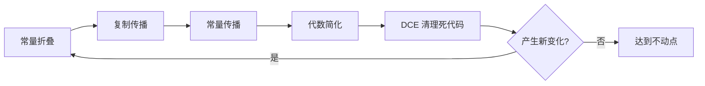

# 常量折叠、常量传播与复制传播

这是三个紧密相关的纯局部 / 半全局优化，常作为优化管线最前面的一档：
能立刻把 `%t0 = add i32 2, 3` 折叠成常量，并把已知常量沿 Use-Def 链替换到下游。

## 一、常量折叠（Constant Folding）

在编译期直接计算所有操作数都是常量或符号常量的指令：

| 模式 | 折叠结果 |
| --- | --- |
| `add i32 2, 3` | `i32 5` |
| `mul i32 4, 5` | `i32 20` |
| `icmp sgt i32 5, 3` | `i1 true` |
| `sub i32 7, 7` | `i32 0` |

实现时为每条指令尝试求值：操作数都是常量时直接算结果，否则保持原样。

```cpp
Constant* try_fold(Instruction* I) {
    if (!all_of(I->operands(), is_const)) return nullptr;
    switch (I->op) {
        case Op::Add: return ConstInt::get(lhs + rhs);
        case Op::Mul: return ConstInt::get(lhs * rhs);
        case Op::ICmp: return ConstInt::get(lhs.icmp(rhs));
        // ... 其它指令
    }
}
```

注意：带溢出语义的 `sadd_with_overflow` 等需要额外标志位的指令，ToyC 通常不实现，直接交由后端处理。

## 二、常量传播（Constant Propagation）

沿 Use-Def 链追踪每个 SSA 值的"已知常量"。形式上：

```text
const[v] = c
当 v = f(const[a], const[b]) 且 f 是纯函数时，const[f(a,b)] = eval(f, c, d)
```

构造常量表的过程：

```text
1. 初始化：常量字面量本身的 const 为自身。
2. 迭代：对每条指令，若所有操作数 const 都已知且指令是纯函数，
   则 const[result] = eval(instruction)。
3. 直到不再产生新的常量。
```

例如：

```llvm
%x = add i32 2, 3        ; const[%x] = 5
%y = mul i32 %x, 4       ; 操作数都是常量 → const[%y] = 20
ret i32 %y               ; 用 %y 的常量值替换 → ret i32 20
```

替换下游 use 时要小心 phi 节点：phi 的常量值必须来自所有入边都是相同常量，否则不能传播。

## 三、复制传播（Copy Propagation）

SSA 中的复制形如 `x = y`（或 LLVM 里的 `%t = add i32 %y, 0` / `%t = bitcast %y to i32`）。
把 `x` 替换为 `y` 通常能让 `y` 直接被后续优化看到：

```llvm
%a = add i32 %x, 0      ; %a == %x
%b = mul i32 %a, 2       ; 替换为 mul %x, 2
%c = mul i32 %a, 3       ; 替换为 mul %x, 3
```

合并后：

```llvm
%x = ...
%t1 = mul i32 %x, 2
%t2 = mul i32 %x, 3
```

两次 `mul` 的左操作数相同，可能触发后续的 CSE。

## 四、代数恒等式

折叠/传播之外，还有一类代数简化（Algebraic Simplification），把已知模式替换为更简单的形式：

| 模式 | 化简 |
| --- | --- |
| `x + 0`, `0 + x` | `x` |
| `x - 0`, `x * 1`, `x / 1` | `x` |
| `x * 0` | `0`（除非 `x` 是 NaN / volatile） |
| `x - x` | `0` |
| `x ^ x` | `0` |
| `x & 0` | `0` |
| `x | -1` | `-1`（全 1） |
| `x == x` | `true`（非 NaN 类型） |
| `x != x` | `false` |

这套规则对整数和浮点语义略有差异（比如 IEEE 754 下 `x - x = NaN`，要谨慎处理），
ToyC 只支持整数，可以放心应用。

## 五、迭代执行顺序

```text
loop:
    changed = false
    changed |= fold_constants()         // 1. 局部折叠
    changed |= propagate_copies()       // 2. 复制传播
    changed |= propagate_constants()    // 3. 常量传播（依赖 1+2 的成果）
    changed |= simplify_algebraic()     // 4. 代数简化
    changed |= dce()                    // 5. 死代码清理
    if changed: goto loop
```

几个观察：

- 折叠 → 传播：折叠后才能产生新的常量定义，传播才能进一步替换；
- 传播 → DCE：传播后旧定义失去 use，交给 DCE 删除；
- 这套循环通常只需 2~3 轮就达到不动点。



## 六、正确性陷阱

| 陷阱 | 解释 |
| --- | --- |
| 浮点 NaN / 溢出 | 整数算术总是良定义的；浮点要考虑 IEEE 754 的异常语义 |
| `nuw` / `nsw` 标志 | LLVM 上的 `add nuw i32 %a, 0` 比无标志版本强，ToyC 暂不涉及 |
| 函数调用操作数 | 调用 `f(const)` 不能折叠——可能改变函数行为（如 `f` 读全局） |
| `phi` 节点 | 必须所有入边常量一致才能传播 |

下一步阅读：[公共子表达式消除（CSE）](ir-cse)。
