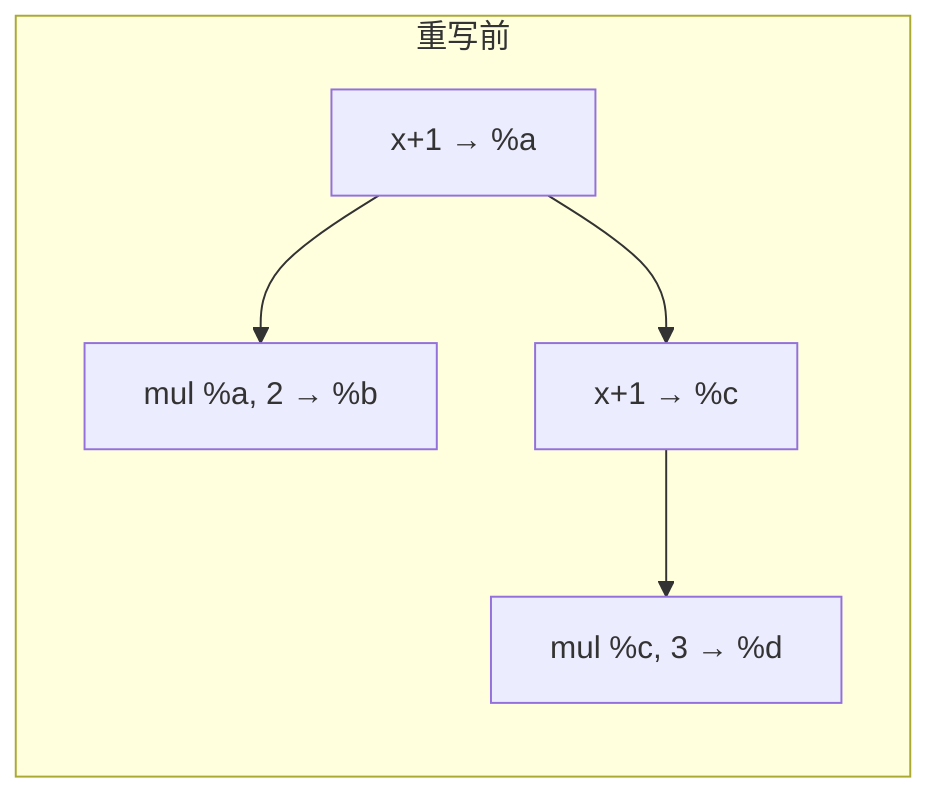
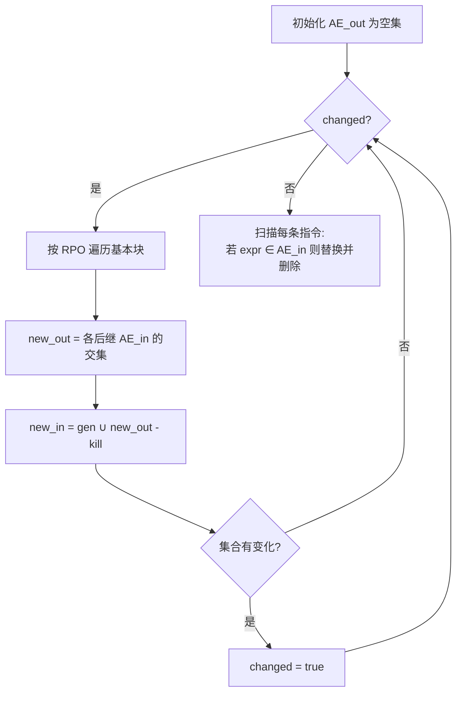

# 公共子表达式消除（Common Subexpression Elimination, CSE）

如果同一表达式在支配路径上被求值多次，且操作数没有改变，
那么第二次及以后的求值可以直接复用第一次的结果。

## 一、基本思想

```llvm
%a = add i32 %x, 1
%b = mul i32 %a, 2
%c = add i32 %x, 1      ; 与 %a 完全相同 → CSE 候选
%d = mul i32 %c, 3      ; 改写为 mul %a, 3
```

改写后：

```llvm
%a = add i32 %x, 1
%b = mul i32 %a, 2
%d = mul i32 %a, 3      ; 复用 %a，跳过 %c
```

`%c` 这条指令彻底删除，下游对 `%c` 的引用替换为 `%a`。



## 二、形式化条件

CSE 的两个条件：

1. 操作数可用性：沿当前路径从入口到当前点，每个操作数都未在两条求值之间被重定义；
2. 表达式等价：两条指令的 opcode 和所有操作数都相同（字面相同即可，无需别名分析）。

这等价于"表达式在支配路径上"且"两次求值之间操作数未被 kill"。

```text
available[B] = ∩ available[P] for P in predecessors[B]  ∪  expr(B)
```

## 三、基于可用表达式分析的 CSE

类似活跃变量分析，可用表达式（Available Expressions Analysis）也是
一个前向数据流问题：

```text
AE_gen[B]  = { expr(I) : I 是块 B 中纯表达式指令 }
AE_kill[B] = { expr(I') : I' 是块 B 中对操作数有重定义的指令 }
AE_in[B]   = AE_gen[B] ∪ (AE_out[B] − AE_kill[B])
AE_out[B]  = ∩ AE_in[P]                       for all P in successors[B]
```

不动点算法：

**算法 · 基于可用表达式的 CSE（Available-Expressions CSE）**

**输入（Input）：** 函数 CFG。
**输出（Output）：** 消除重复表达式后的 IR。

```
 1: cse(func):
 2:     for each block B in func do AE_in[B] = ∅;  AE_out[B] = U; end for   // 初值：入口空、出口全集
 3:     repeat
 4:         changed = false;
 5:         for each block B in reversePostOrder(func) do
 6:             new_out = U;                                    // 交集初值取全集 U
 7:             for each S in B.successors do
 8:                 new_out = new_out ∩ AE_in[S];               // meet：交集
 9:             end for
10:             new_in = AE_gen[B] ∪ (new_out − AE_kill[B]);    // transfer 函数
11:             if new_in != AE_in[B] or new_out != AE_out[B] then
12:                 AE_in[B] = new_in;  AE_out[B] = new_out;  changed = true;
13:             end if
14:         end for
15:     until not changed
16:     for each block B in func do                             // 应用：删除冗余表达式
17:         for each pure instruction I in B do
18:             if expr(I) ∈ AE_in[B] then
19:                 replaceAllUsesWith(I.result, availableExpr(I));  delete(I);
20:             end if
21:         end for
22:     end for
```

对每条表达式指令 `I`，若 `expr(I) ∈ AE_in[块 B]`，则说明 `I` 在支配路径上已经求过值——可以删除 `I`，并把后续 use 替换为之前的 SSA 值。



## 四、局部 CSE 与全局 CSE

| 类型 | 范围 | 实现 |
| --- | --- | --- |
| 局部 CSE | 单个基本块内 | 在块内维护 `unordered_map<Expr, Value*>` |
| 全局 CSE | 整个函数 | 依赖可用表达式分析 + 支配树 |

ToyC 实现全局 CSE 就足够。先做可用表达式，再扫描每条指令复用即可。

## 五、与 GVN 的关系

更激进的版本叫 GVN（Global Value Numbering）：

- CSE 只识别字面相同的表达式；
- GVN 给每个表达式计算一个 hash 值（VN），等价的表达式即使字面不同也能合并：

  ```llvm
  %a = add i32 %x, %y
  %b = add i32 %y, %x     ; 字面不同但交换律下等价
  ```

- GVN 还会跟踪 `phi` 节点上的等价性，是更通用的 CSE。

如果时间允许，可以把 CSE 升级为 GVN，性价比很高。

## 六、与其它优化的关系

- CSE 之前：建议先做常量折叠/传播——把 `%a = add i32 2, 3` 折叠后下游字面相同，便于匹配；
- CSE 之后：替换 use 后旧定义可能失去 use，交给 DCE 清理；
- CSE 与循环：循环体内的不变量会被 CSE 自动识别（在支配路径上），无需单独的循环优化。

## 七、实现注意事项

| 问题 | 处理 |
| --- | --- |
| `load` 指令 | ToyC 暂不实现；如果实现，要做内存别名分析确认两次 `load` 之间没有 `store` |
| 函数调用 | 调用是表达式边界，调用后的表达式不能与调用前的合并 |
| `phi` 节点 | phi 是合并点，不参与 CSE 的"等价表达式"集合 |
| 浮点 | IEEE 754 下 `+` 不严格满足结合律，CSE 可能改变 NaN 行为；整数无此问题 |

下一步阅读：[控制流简化](ir-cfg-simplify)。
