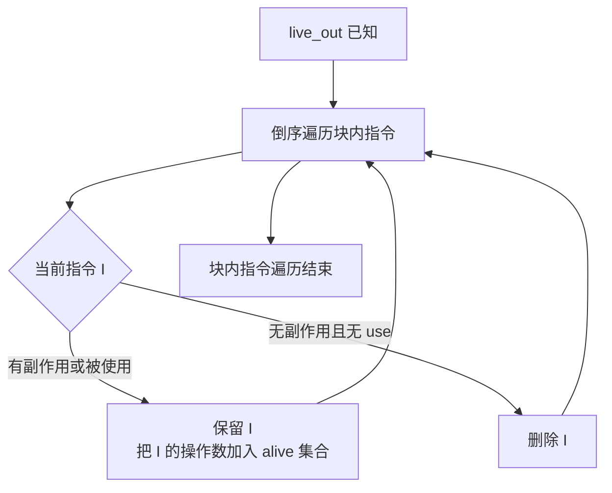
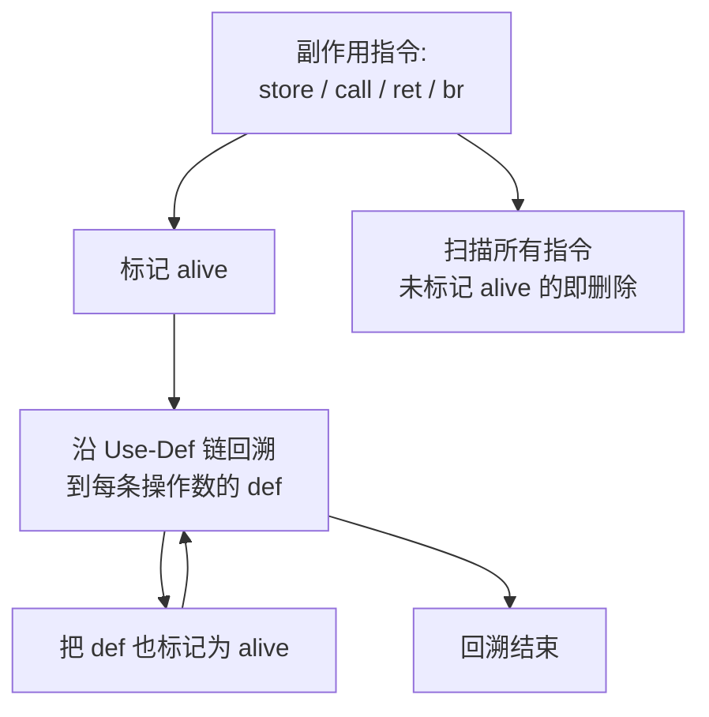
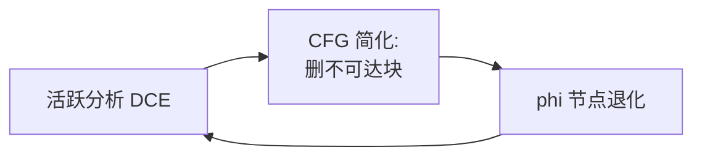

# 死代码消除（Dead Code Elimination, DCE）

死代码指计算结果无人使用且本身没有副作用的指令。
删除它们既不改变程序语义，又能缩减指令数和寄存器压力。

## 一、什么是"死"？

一条指令是"死"的，当且仅当：

1. 它的结果值不出现在任何活跃变量集合（出口处无 use）；
2. 它本身没有可观察的副作用（不是 `store`、`call`、`br`、I/O、内存屏障）。

例如：

```llvm
%t0 = add i32 2, 3        ; 结果 %t0 没有被任何指令使用，且无副作用
%t1 = mul i32 %t0, 4      ; %t1 也没被使用
ret i32 0                  ; 只有这条指令有副作用
```

`%t0`、`%t1` 都是死代码，可以整体删除。

但要注意：

```llvm
call void @foo(i32 %x)    ; 即使返回值未使用，也不能删除
store i32 %y, i32* %p     ; 即使写入位置未再读取，也不能删除
```

函数调用可能影响 I/O、volatile 内存、全局状态，删除会改变程序行为。

## 二、基于活跃分析的 DCE

利用 [基本块与 CFG](ir-cfg) 计算出的 `live_out`，对每条指令检查其结果是否在 `live_out` 中：

```cpp
void eliminate_dead_in_block(BasicBlock& B) {
    auto alive = B.live_out;
    // 倒序扫描块内指令，最后使用的最先生效
    for (auto it = B.instructions.rbegin(); it != B.instructions.rend(); ++it) {
        auto uses = it->operands();
        auto defs = it->results();
        bool has_side_effect = it->is_call() || it->is_store()
                            || it->is_volatile() || it->diverges();
        bool result_used = any_of(defs, [&](Value* v) {
            return alive.count(v) > 0;
        });
        if (!has_side_effect && !result_used) {
            B.erase(it);
        } else {
            alive.insert(uses.begin(), uses.end());
        }
    }
}
```

倒序扫描是关键——后面的"使用"先于前面的"定义"被看到。下面这张图展示了在单个基本块内，从 `live_out` 开始逐条反向扫描的传播过程：



## 三、基于 Use-Def 链的 DCE

另一种思路是反向遍历：从每个有副作用的"根"（store、call、ret、br）出发，沿 Use-Def 链把所有结果"标记为活"，未被标记的就是死代码：

**算法 2 · 基于 Use-Def 链的标记-清除 DCE（Mark & Sweep DCE）**

**输入（Input）：** 函数 CFG。
**输出（Output）：** 只保留"活"指令的 CFG。

```
 1: mark(I):                                       // 后向遍历 Use-Def 链
 2:     if I.alive then return; end if             // 已经标记过
 3:     I.alive = true;
 4:     for each operand V of I do
 5:         if V is defined by instruction D then mark(D); end if
 6:     end for
 7:
 8: markLive(func):                                 // 从有副作用的"根"出发
 9:     for each block B in func do
10:         for each inst I in B do
11:             if I.has_side_effect or I.is_terminator then mark(I); end if
12:         end for
13:     end for
14:
15: sweep(func):                                    // 清除未标记的指令
16:     for each block B in func do
17:         for each inst I in B do
18:             if not I.alive then delete(I); end if
19:         end for
20:     end for
21:
22: dce(func):   markLive(func);   sweep(func);
```



这种"反向标记"风格天然支持全局 DCE，能跨基本块传播。

## 四、不可达代码

DCE 的常见副作用是触发不可达代码（unreachable code）：当条件分支的两个目标相同，或者某分支永远为真/假，控制流图会出现空块。

```llvm
br i1 true, label %L1, label %L2   ; L2 永远不可达
br label %L1                        ; 紧跟空块的 br 也可以删除
```

控制流简化（见 [控制流简化](ir-cfg-simplify)）通常与 DCE 配合成一对迭代：先删死代码再压扁空块，再算新的活跃集合，再删新的死代码，直到不动点。



## 五、正确性保证

DCE 不能简单地删除所有"无人使用"的指令，必须同时考虑：

| 指令类型 | 是否可删 | 理由 |
| --- | :---: | --- |
| 纯算术（`add/mul/icmp`） | 是 | 结果未用且无副作用 |
| `store` | 否 | 写内存有副作用 |
| `call` | 否 | 可能影响 I/O / 全局状态 |
| `volatile load` | 否 | 必须保留 |
| `br` / `ret` | 否 | 控制流指令 |
| `unreachable` 之后 | 是 | 不可达块的指令全部可删 |

## 六、与其它优化的关系

DCE 是其它优化的"清扫工"：

- 常量折叠后，多余的算术往往没有 use，需要 DCE 清理；
- CSE 替换后，旧定义可能失去 use，需要 DCE 删除；
- 控制流简化删除空块后，块内的 `phi` 失去某条入边，需要 DCE 一并清掉。

把 DCE 放在优化管线末尾（或迭代到不动点）能持续回收空间。

下一步阅读：[常量折叠与传播](ir-cprop)。
