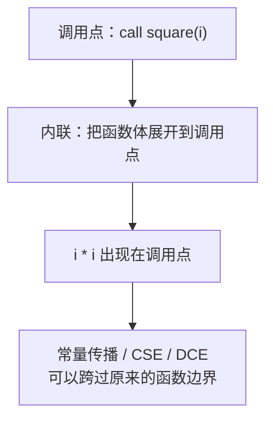
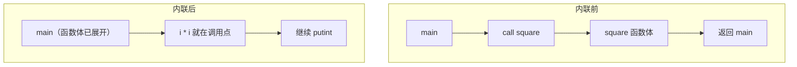

# 函数内联（Function Inlining）

内联是把被调函数的函数体直接展开到调用点，用实参替换形参，使原本跨函数的代码变成同一个函数内的代码。

## 一、必要性

ToyC 中的函数调用在 IR 上看只是一条 `call`，但落到 RISC-V 上有若干固定开销：

| 开销 | 内容 |
| --- | --- |
| 跳转 | `call` / `jal` 与 `ret`，打断取指流水线 |
| 传参 | 实参按 ABI 放入 `a0 ~ a7`，超出部分需要压栈 |
| 栈帧 | 保存返回地址、调整 `sp`，必要时保存被调用者保存寄存器 |
| 返回 | 返回值从 `a0` 搬回调用点 |

当被调函数只有两三条指令时，调用开销可能大于函数体本身。除此之外，调用还会阻断多项优化：

- 常量传不进去：`square(2)` 在调用点看是一次调用，在函数体内看是形参 `x`，常量传播无法跨过 `call`；
- 结果传不出来：函数体内的 `x * x` 与调用点得到的返回值，在 IR 上是两个互不相关的值；
- 死代码无法删除：调用可能有副作用，DCE 只能保守地保留；
- 公共子表达式跨不过去：两次 `square(i)` 看起来是两次调用，CSE 无法判定它们等价。

```c
int square(int x) { return x * x; }

int main() {
    int i = getint();
    int s = 0;
    while (s < 100) {
        s = s + square(i);      // 循环中的调用，开销随迭代次数放大
        i = i + 1;
    }
    putint(s);
    return 0;
}
```

把 `square` 内联之后，`square(i)` 变成 `i * i`，上面四个障碍同时消失。



## 二、内联需要完成的工作

内联一个函数需要做四件事：

1. 复制函数体：把被调函数的指令搬到调用点；
2. 重命名局部值：被调函数的局部 SSA 值与形参都需要改名，避免与调用者中的值冲突；
3. 实参替换形参：把形参的每一次使用替换为对应的实参值；
4. 接好控制流：把原来的 `ret` 改为"把返回值赋给临时值并跳转到调用点的后继"，再删除 `call`。

正确性要求可以概括为两点：副作用顺序不变，控制流等价。

## 三、示例

```c
int square(int x) { return x * x; }

int main() {
    int i = getint();
    putint(square(i + 1));
    return 0;
}
```

内联前（两个函数，中间隔着一次调用）：

```llvm
define i32 @square(i32 %x) {
entry:
    %t = mul i32 %x, %x
    ret i32 %t
}

define i32 @main() {
entry:
    %i = call i32 @getint()
    %a = add i32 %i, 1
    %r = call i32 @square(i32 %a)     ; 跨函数的边界
    call void @putint(i32 %r)
    ret i32 0
}
```

内联后（只剩一个函数）：

```llvm
define i32 @square(i32 %x) { ... }    ; 原函数保留，其它调用点仍会用到

define i32 @main() {
entry:
    %i = call i32 @getint()
    %a = add i32 %i, 1
    %t1 = mul i32 %a, %a              ; square 的函数体，%x 被替换为 %a
    %r = %t1                          ; 返回值即 %t1
    call void @putint(i32 %r)
    ret i32 0
}
```

内联之后 `%a` 与 `%t1` 位于同一个函数，常量传播与 CSE 可以继续处理。若 `%a` 恰好是常量，下一步就能把 `%t1` 折叠为常量。



## 四、算法

**算法 1 · 函数内联（Function Inlining）**

**输入（Input）：** 模块 `M`（含调用图 call graph）与内联判据 `shouldInline(callee, callsite)`。
**输出（Output）：** 已内联的模块。

```
 1: inline(M, shouldInline):
 2:     CG = buildCallGraph(M);                              // 1. 建立调用图
 3:     repeat
 4:         changed = false;
 5:         for each function F in bottomUpOrder(CG) do        // 2. 自底向上处理
 6:             for each callsite C inside F do
 7:                 callee = C.callee;
 8:                 if callee has no body then continue; end if      // 外部函数（getint/putint）不内联
 9:                 if callee == F then continue; end if             // 直接递归不展开
10:                 if not shouldInline(callee, C) then continue; end if
11:                 clone = cloneBody(callee);
12:                 renameLocalValues(clone, uniqueSuffix);         // 3. 局部值与形参重命名
13:                 for each (param, arg) in zip(callee.params, C.args) do
14:                     replaceAllUsesWith(clone.param, arg);      // 4. 实参替换形参
15:                 end for
16:                 splitBlockAt(C);                                // 5. 在调用点切分基本块
17:                 spliceBodyAt(C, clone);                         //    插入克隆的函数体
18:                 replaceAllUsesWith(C.result, clone.returnValue);
19:                 remove(C);                                      //    删除 call
20:                 changed = true;
21:             end for
22:         end for
23:     until not changed
24:     return M;
```

第 12 行的重命名必不可少：被内联函数的局部值名（`%t`、`%x`）在调用者中可能已经存在，重命名后才是两个独立的值。

**算法 2 · 内联判据（shouldInline，成本模型）**

**输入（Input）：** 被调函数 `callee`、调用点 `C`。
**输出（Output）：** 是否内联（true / false）。

```
 1: shouldInline(callee, C):
 2:     if callee is external or callee.isRecursive then return false; end if
 3:     if callee.size > SIZE_LIMIT then                        // 函数过大时不内联
 4:         if not (C.isInLoop or callee.isHot) then return false; end if
 5:     end if
 6:     score = 0;
 7:     score += (callee.size <= SIZE_LIMIT) ? 40 : 0;          // 小函数收益最高
 8:     score += (callee.callCount == 1) ? 30 : 0;              // 只被调用一次时一定划算
 9:     score += (C.isInLoop) ? 20 : 0;                         // 在循环中时收益被放大
10:     score += (allArgsAreConstant(C)) ? 20 : 0;               // 实参为常量时可直接折叠
11:     score += (callee.isLeaf) ? 10 : 0;                      // 叶子函数不会引入新的调用点
12:     return score >= INLINE_THRESHOLD;                       // 例如阈值取 50
```

常用的静态判据：

| 判据 | 依据 | 建议 |
| --- | --- | --- |
| 函数体指令数 | 越大内联越不划算 | 小函数（例如不超过 20 条）优先 |
| 调用点个数 | 只有一处调用时内联必然减少代码总量 | 1 处时可放心内联 |
| 是否在循环内 | 循环中的调用开销乘以迭代次数 | 优先内联 |
| 实参是否常量 | 内联后可直接常量折叠、DCE | 优先内联 |
| 是否叶子函数 | 不会因内联引入更多调用点 | 优先内联 |
| 是否递归 | 会无限展开 | 用深度上限截断 |
| 是否外部函数 | 没有函数体可复制 | 禁止内联 |

:::tip[为什么按自底向上的顺序扫描]
先内联最内层的叶子函数，内联后外层的函数体虽然变大，但其中已经不再包含小函数调用，后续判据更容易判断；若自顶向下内联，往往刚内联完就被体积阈值挡住。
:::

## 五、优化效果

- 直接收益：消除 `call` / `ret`、传参与栈帧开销，短函数的开销可以降到原来的几分之一。
- 间接收益：`call` 这层边界消失后，同一批优化可以跨过原来的函数边界工作。
  - 常量传播：常量实参直接进入函数体；
  - 死代码消除：内联进来的分支若条件为常量，整条分支可以删除；
  - 公共子表达式消除：两个调用点变成两段重复代码，CSE 可以合并；
  - 循环优化：被内联进循环体的代码可以做 LICM 与强度削减。
- 代价：代码膨胀。同一函数在多个调用点内联会明显增加指令总量，可能挤占指令缓存，编译时间与目标文件大小也会增加。因此内联必须由成本模型控制。

## 六、正确性陷阱

| 陷阱 | 说明 |
| --- | --- |
| 副作用顺序 | 实参求值顺序、调用前后的 I/O 顺序都不能改变；有副作用的表达式不应重复求值 |
| 局部名冲突 | 被内联函数的局部值与形参必须重命名，否则会与调用者中的同名值混淆 |
| 遮蔽（shadowing） | 被内联函数的内层作用域变量遮蔽外层同名变量时，重命名需要按作用域层次处理 |
| 递归 | 直接或间接递归必须有内联深度上限，否则会无限展开 |
| 外部函数 | `getint` / `putint` 没有函数体，不能内联 |
| 调用点切分 | 调用点位于基本块中间时必须先切块再插入，否则会破坏块的单出口性质 |
| `main` 中的调用 | 内联由被调方驱动还是调用方驱动，决定了 `main` 中的调用是否也会被处理 |

## 七、动手验证

```bash
# 内联与其它优化之后的 IR / 汇编
./compiler --dump-ir  --opt < test.c > after.ll
./compiler --dump-asm -opt < test.c > after.s

# 1. call 条数是否下降（I/O 调用的 call 会保留）
grep -cE '\bcall\b' after.ll

# 2. 短函数是否已不再被调用
grep -nE '\b(jal|call)\b' after.s

# 3. 功能对拍：优化前后链接运行，输出必须逐字节一致
./compiler --dump-asm      < test.c > base.s
./compiler --dump-asm -opt < test.c > opt.s
```

内联不改变程序语义，只改变代码的组织形式。正确性用输出对拍验证，收益用汇编指令数与 `call` 条数衡量。

下一步阅读：[基本块重排](ir-block-layout)。
