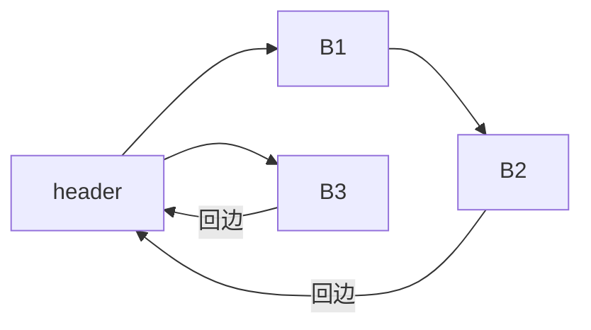
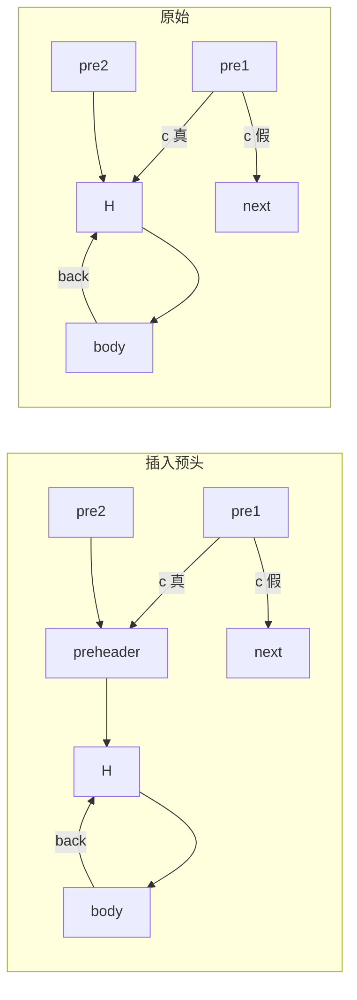
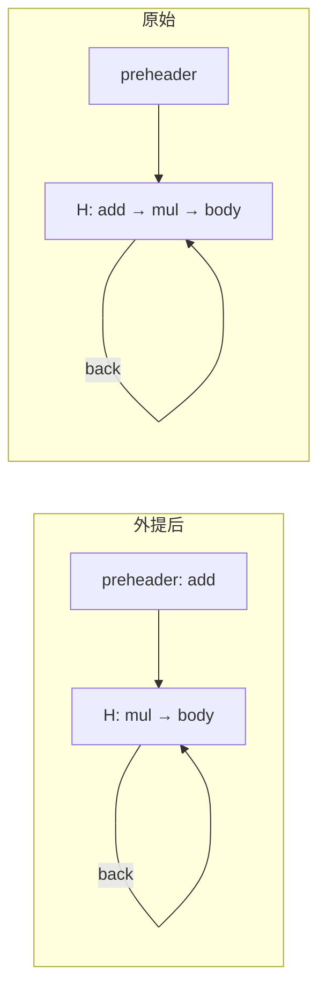
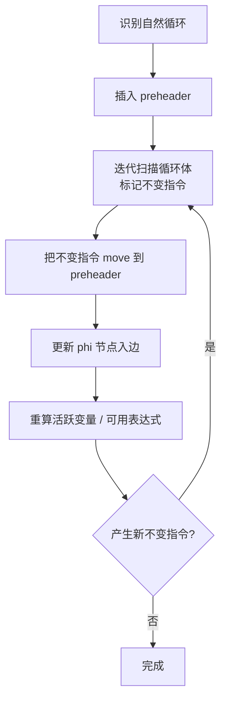

# 循环不变代码外提（LICM）

如果一条指令所有操作数在循环外都已知（即"循环不变"），那么它的结果在每次迭代都相同，
可以安全地把计算外提（hoist）到循环前驱块（预头 preheader），只算一次。

## 一、自然循环与回边

LICM 的第一步是识别循环：

```text
自然循环（Natural Loop）：
  - 有唯一的循环头 header
  - 回边（back edge）：从某个块 B 跳到 header，且 B 支配自己之外的、header 的某个前驱
  - 循环体 = 所有能从 header 出发到达回边起点，且不经过 header 的块
```



上图中 `{B1, B2}` 构成以 `H` 为头的自然循环（`B3` 与 `H` 之间的边不是回边——它是从 `H` 出发的正向分支）。

## 二、预头（Preheader）

LICM 必须把不变代码放到一个只在循环外执行一次的位置。
对没有预头的循环，需要先插入预头：

```llvm
; 原始
pre1: br i1 %c, label %H, label %next
pre2: br label %H
H: ...

; 插入预头
pre1: br i1 %c, label %preheader, label %next
pre2: br label %preheader
preheader:
  br label %H
H: ...
```



现在所有进入循环的边都先经过 `preheader`，它是循环外唯一的入口。

## 三、不变指令的判定

一条指令 `I` 是循环不变的，当且仅当：

1. 所有操作数要么是常量，要么定义在循环外；
2. 指令本身是纯函数（无副作用）；
3. 如果指令是 `load`，要确认没有 `store` 在循环内写到同一地址（别名分析）；
4. 指令不是 `phi`、`br`、`ret` 等控制流指令。

**算法 · 循环不变指令判定（Detect Loop-Invariant Instructions）**

**输入（Input）：** 自然循环 `L`（含循环体块集合）。
**输出（Output）：** 被标记为 `is_invariant` 的指令集合。

```
 1: markInvariants(L):
 2:     repeat
 3:         changed = false;
 4:         for each inst I in postorder(L.body) do
 5:             if I.is_invariant then continue; end if
 6:             if not I.is_pure() then continue; end if        // 有副作用 -> 不外提
 7:             if allOperandsOutside(I, L) then                 // 操作数都是常量或定义在循环外
 8:                 I.is_invariant = true;  changed = true;
 9:             end if
10:         end for
11:     until not changed                       // 某条不变后可能让下游也变得不变
12:     return L.invariants;
```

迭代几次直到集合稳定——因为某条指令变为不变后，可能让它的下游也变得不变。

## 四、外提变换

```llvm
; 原始
preheader:
  br label %H
H:
  %a = add i32 %x, 1          ; 不变（%x 在循环外）
  %b = mul i32 %a, %i          ; 不变（%i 在循环内变化）
  ...                          ; 假设循环体里用 %b
```

改写后：

```llvm
preheader:
  %a.pre = add i32 %x, 1       ; 外提到预头
  br label %H
H:
  %b = mul i32 %a.pre, %i      ; 现在 %b 仍依赖 %i，但只算一次 %a.pre
```

外提后：

- 减少了循环体的指令数；
- `%a.pre` 可以被寄存器分配器识别为跨调用的"非活跃"，更易优化；
- 副作用：循环外多了一条指令，但总执行次数下降，净收益为正。



## 五、SSA 形式下的简化

由于 SSA 形式每个定义只被赋值一次，识别"操作数定义在循环外"非常直接：

```cpp
bool is_loop_invariant(Instruction* I, Loop* L) {
    if (!I->is_pure()) return false;
    for (auto* op : I->operands()) {
        if (auto* op_inst = dyn_cast<Instruction>(op)) {
            if (L->contains(op_inst)) return false;   // 操作数定义在循环内
        }
    }
    return true;
}
```

不需要专门的 SSA 破坏（`mem2reg` 的逆操作），LICM 在 SSA 上几乎是机械操作。

## 六、与其它优化的关系

| 优化 | 关系 |
| --- | --- |
| [常量传播](ir-cprop) | 先传播常量，LICM 能识别更多不变指令 |
| [DSE](ir-dce) | LICM 后循环体内可能多出死代码，交 DCE 清理 |
| [强度削减](ir-strength-reduction) | LICM 后的循环体是强度削减的良好输入（除常量换魔数乘法，见[魔数法](ir-strength-reduction)、[目标代码层](asm-strength-reduction)） |
| 归纳变量分析 | LICM 把循环不变量外提后，剩下的循环变量更易识别为归纳变量 |

## 七、实现步骤



## 八、正确性陷阱

| 陷阱 | 处理 |
| --- | --- |
| 循环内的 `store` / `call` | 可能有副作用，外提会改变观察到的状态——禁止外提 |
| `volatile load` | 必须每次执行，不能外提 |
| 浮点运算的中间舍入 | ToyC 只支持整数，不涉及此问题 |
| 嵌套循环 | 内层外提的指令在外层仍是不变的，可以被外层 LICM 继续外提 |

下一步阅读：[强度削减：乘法换移位与魔数法除法](ir-strength-reduction)——循环体是不变代码外提之后最需要强度削减的地方。
