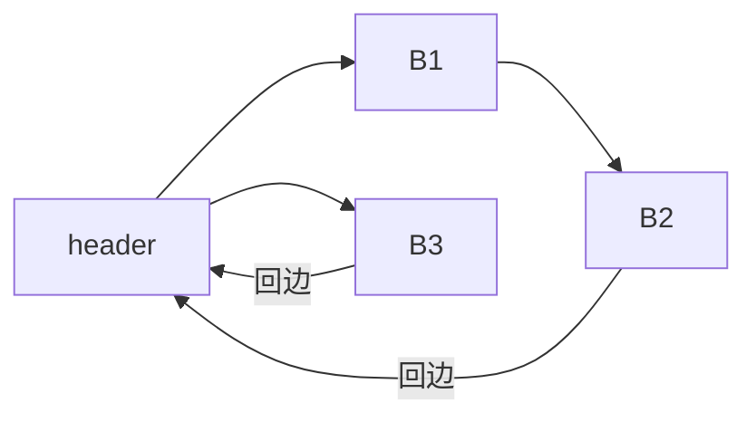
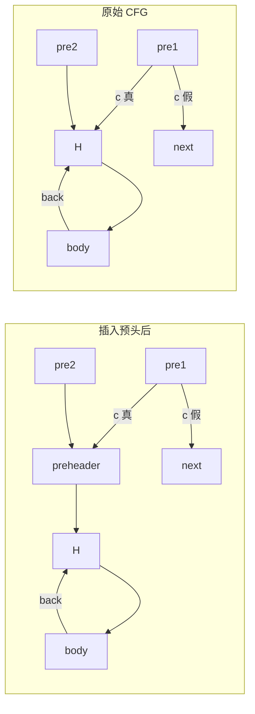
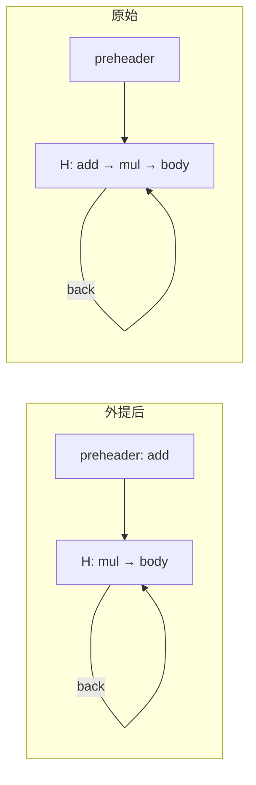
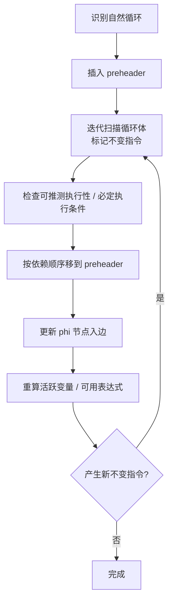

# 循环不变代码外提（LICM）

如果一条指令的操作数是循环不变量，那么它的结果在每次迭代都相同。还要确认提前执行不会引入新的副作用或陷阱，才能把它外提（hoist）到预头块 preheader，只算一次。

## 一、自然循环与回边

LICM 的第一步是识别循环：

```text
自然循环（Natural Loop）：
  - 有唯一的循环头 header
  - 回边（back edge）：B -> header，且 header 支配 B
  - 循环体 = header、B，以及从 B 沿前驱反向可达、遍历在 header 停止的块
```


```mermaid
flowchart LR
  H[header] --> B1
  B1 --> B2
  B2 -- 回边 --> H
  B3 -- 回边 --> H
  H --> B3
```

假设入口先到 `H`，且图中没有其它入边，则 `B2 -> H` 和 `B3 -> H` 都是回边。它们分别形成 `{H, B1, B2}` 与 `{H, B3}` 两个同头自然循环，循环分析可以合并其块集合。

## 二、预头（Preheader）

LICM 必须把不变代码放到一个只在循环外执行一次的位置。
对没有预头的循环，需要先插入预头：

```llvm
; 原始
pre1: br i1 %c, label %H, label %next
pre2: br label %H
H: ...

; 插入预头
pre1: br i1 %c, label %preheader, label %next
pre2: br label %preheader
preheader:
  br label %H
H: ...
```


```mermaid
flowchart LR
  subgraph After["插入预头后"]
    direction TB
    A3[pre1] -- c 真 --> PH[preheader]
    A3 -- c 假 --> N2[next]
    A4[pre2] --> PH
    PH --> H2[H]
    H2 --> B2[body]
    B2 -- back --> H2
  end
  subgraph Before["原始 CFG"]
    direction TB
    A1[pre1] -- c 真 --> H1[H]
    A1 -- c 假 --> N[next]
    A2[pre2] --> H1
    H1 --> B1[body]
    B1 -- back --> H1
  end
```

现在所有进入循环的边都先经过 `preheader`，它是循环外唯一的入口。

## 三、不变指令的判定

先判断一条指令 `I` 的结果是否循环不变，再检查是否可安全外提：

1. 所有操作数是常量、定义在循环外，或来自已经判定为不变的指令；
2. 指令本身是纯函数（无副作用）；
3. 如果指令是 `load`，要排除循环内 `store` / `call` 的别名写入，并证明提前读取地址有效；
4. 指令不是 `phi`、`br`、`ret` 等控制流指令。

循环可能执行零次，指令也可能只在某个条件分支内执行。因此，外提还必须证明指令可推测执行（speculatable），或每次进入循环必定执行该指令。初版可只处理无溢出标志的 `add` / `sub` / `mul` / 比较等安全整数运算，保留可能除零的除法和内存访问。

**算法 · 循环不变指令判定（Detect Loop-Invariant Instructions）**

**输入（Input）：** 自然循环 `L`（含循环体块集合）。
**输出（Output）：** 被标记为 `is_invariant` 的指令集合。

```
 1: markInvariants(L):
 2:     repeat
 3:         changed = false;
 4:         for each inst I in postorder(L.body) do
 5:             if I.is_invariant then continue; end if
 6:             if not I.is_pure() then continue; end if        // 有副作用 -> 不外提
 7:             if allOperandsOutsideOrInvariant(I, L) then     // 允许依赖已标记的不变量
 8:                 I.is_invariant = true;  changed = true;
 9:             end if
10:         end for
11:     until not changed                       // 某条不变后可能让下游也变得不变
12:     return L.invariants;
```

迭代几次直到集合稳定——因为某条指令变为不变后，可能让它的下游也变得不变。

## 四、外提变换

```llvm
; 原始
preheader:
  br label %H
H:
  %a = add i32 %x, 1          ; 不变（%x 在循环外）
  %b = mul i32 %a, %i          ; 非不变：%i 在循环内变化
  ...                          ; 假设循环体里用 %b
```

改写后：

```llvm
preheader:
  %a.pre = add i32 %x, 1       ; 外提到预头
  br label %H
H:
  %b = mul i32 %a.pre, %i      ; 现在 %b 仍依赖 %i，但只算一次 %a.pre
```

外提后：

- 减少了循环体的指令数；
- `%a.pre` 的活跃区间可能变长，要重新评估寄存器压力；
- 若循环经常执行，重复计算次数会下降；循环执行零次时，安全但无用的外提计算可能增加开销。


```mermaid
flowchart LR
  subgraph 外提后
    PH2[preheader: add] --> H2[H: mul → body]
    H2 -- back --> H2
  end
  subgraph 原始
    PH1[preheader] --> H1[H: add → mul → body]
    H1 -- back --> H1
  end
```

## 五、SSA 形式下的简化

由于 SSA 形式每个定义只被赋值一次，识别"操作数定义在循环外"非常直接：

```cpp
bool is_loop_invariant(Instruction* I, Loop* L) {
    if (!I->is_pure()) return false;
    for (auto* op : I->operands()) {
        if (auto* op_inst = dyn_cast<Instruction>(op)) {
            if (L->contains(op_inst)) return false;   // 操作数定义在循环内
        }
    }
    return true;
}
```

这段代码只判断操作数是否已在循环外；完整实现仍须检查内存别名、可推测执行性和定义对使用的支配关系。移动指令后要保持 SSA 与 CFG 一致。

## 六、与其它优化的关系

| 优化 | 关系 |
| --- | --- |
| [常量传播](ir-cprop) | 先传播常量，LICM 能识别更多不变指令 |
| [DCE](ir-dce) | LICM 后可能出现失去使用的定义，交 DCE 清理 |
| [强度削减](ir-strength-reduction) | LICM 后的循环体是强度削减的良好输入（除常量换魔数乘法，见[魔数法](ir-strength-reduction)、[目标代码层](asm-strength-reduction)） |
| 归纳变量分析 | LICM 把循环不变量外提后，剩下的循环变量更易识别为归纳变量 |

## 七、实现步骤


```mermaid
flowchart TD
  A[识别自然循环] --> B[插入 preheader]
  B --> C[迭代扫描循环体<br/>标记不变指令]
  C --> S[检查可推测执行性 / 必定执行条件]
  S --> D[按依赖顺序移到 preheader]
  D --> E[更新 phi 节点入边]
  E --> F[重算活跃变量 / 可用表达式]
  F --> Q{产生新不变指令?}
  Q -- 是 --> C
  Q -- 否 --> End[完成]
```

## 八、正确性陷阱

| 陷阱 | 处理 |
| --- | --- |
| 循环内的 `store` / `call` | 可能有副作用，外提会改变观察到的状态——禁止外提 |
| `volatile load` | 必须每次执行，不能外提 |
| 零次循环 / 条件执行 | 不变不代表可提前执行；除法和内存读取需要额外安全证明 |
| 浮点运算的中间舍入 | ToyC 只支持整数，不涉及此问题 |
| 嵌套循环 | 内层外提的指令在外层仍是不变的，可以被外层 LICM 继续外提 |

下一步阅读：[强度削减：乘法换移位与魔数法除法](ir-strength-reduction)——循环体是不变代码外提之后最需要强度削减的地方。
