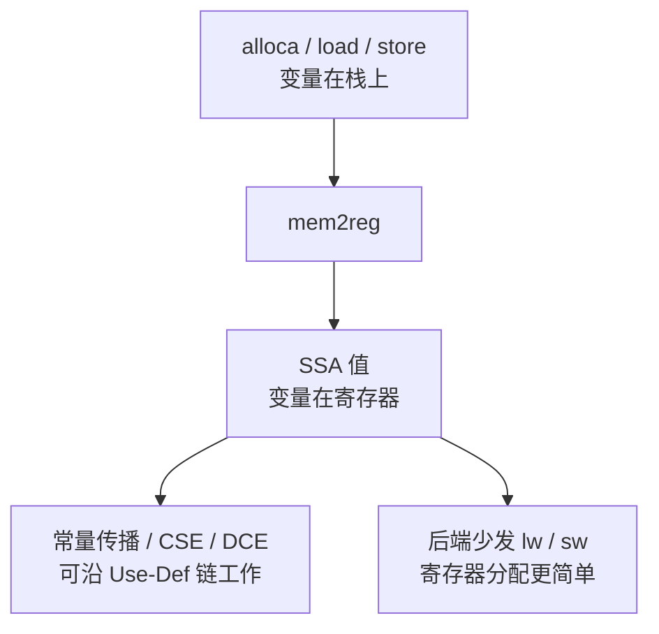
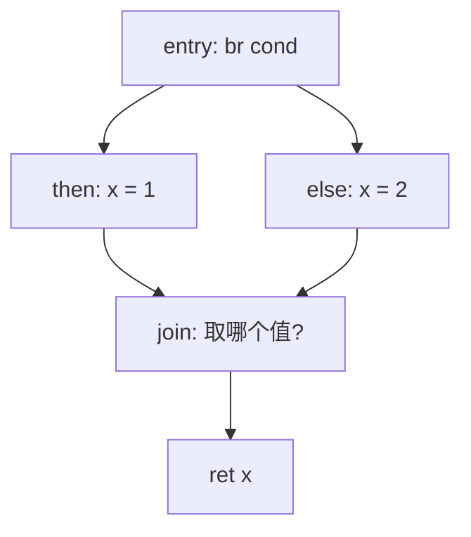
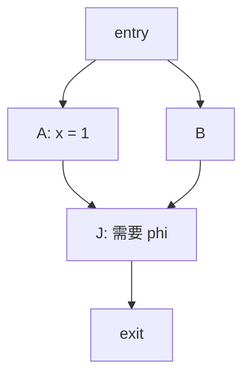
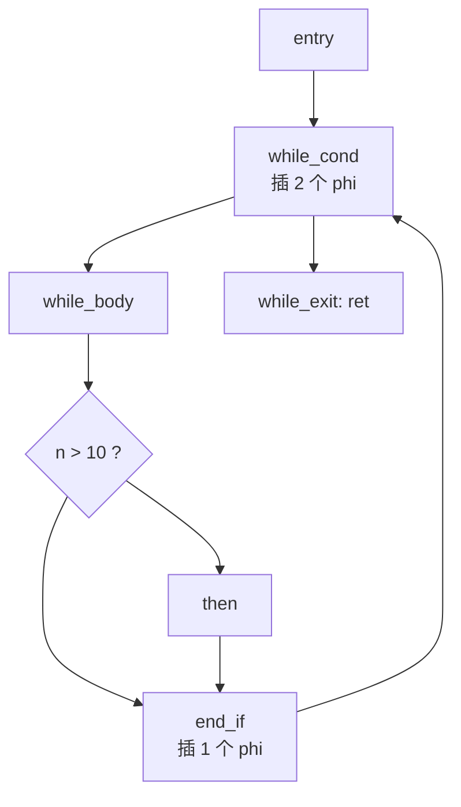

# mem2reg：把内存访问提升为 SSA

mem2reg 是 memory-to-register 的缩写。它是机器无关优化的第一步：第三部分生成的 IR 是内存访问型的，变量保存在栈上；mem2reg 把符合条件的局部变量替换为 SSA 值，后面的常量传播、公共子表达式消除和死代码消除才有可用的 Use-Def 链。



:::info[与第三部分的分工]
第三部分只要求生成内存访问型 IR，不要求实现 mem2reg。本页介绍的算法属于第五部分的机器无关优化，也是这一章建议最先实现的一个 pass。
:::

## 一、为什么需要 mem2reg

第三部分把 ToyC 的局部变量统一放在栈上：声明处发 `alloca`，赋值处发 `store`，读值处发 `load`。下面这个只有两行语句的函数：

```c
int f(int a) {
    int x = a + 1;
    int y = x * 2;
    return y;
}
```

对应的 IR 有 12 条指令：

```llvm
define i32 @f(i32 %a_arg) {
entry:
    %a = alloca i32
    store i32 %a_arg, ptr %a       ; 形参也先写回栈
    %x = alloca i32
    %y = alloca i32
    %a0 = load i32, ptr %a
    %t1 = add i32 %a0, 1
    store i32 %t1, ptr %x
    %x0 = load i32, ptr %x
    %t2 = mul i32 %x0, 2
    store i32 %t2, ptr %y
    %y0 = load i32, ptr %y
    ret i32 %y0
}
```

这段 IR 在语法和语义上都没有问题，但存在三个缺陷：

1. 计算与数据搬运的比例失衡。`add` 和 `mul` 只有两条，其余指令都在访存：`alloca` 只负责分配栈槽，`load` / `store` 只负责在寄存器与栈之间传递数据。
2. 访存次数本可以更少。`x` 只被写过一次、读过一次，却完整地经历了一次栈往返；这类模式出现在被反复调用的函数里时开销会明显放大。
3. SSA 的 Use-Def 链被切断。`%t1 = add ...` 的结果立即被 `store` 消费，`load` 得到的 `%x0` 在文本上与 `%t1` 没有可见的对应关系，因此常量传播、CSE、DCE 无法沿着 Use-Def 链工作。

mem2reg 之后的 IR：

```llvm
define i32 @f(i32 %a) {
entry:
    %t1 = add i32 %a, 1
    %t2 = mul i32 %t1, 2
    ret i32 %t2
}
```

9 条指令被消除，函数变成 SSA 形式，变量的值直接由寄存器承载。

## 二、哪些 alloca 可以被提升

mem2reg 只提升同时满足下列条件的局部变量：

| 条件 | 含义 | 不成立的情形 |
| --- | --- | --- |
| 地址不逃逸 | `alloca` 得到的指针只在本函数内使用 | 把 `&x` 传给其它函数 |
| 只被 load / store 触碰 | 指针没有参与其它运算 | 做了 `getelementptr`、`ptrtoint` 后当地址使用 |
| 是标量 | 提升后正好对应一条 SSA 值 | 数组、结构体需要拆成多份或保留在内存中 |
| 无别名 | 没有其它指针可能指向同一块栈空间 | 指针形参可能正好指向它 |

ToyC 满足这些条件：语言没有取地址运算，因此没有指针形参、数组和别名，函数内每个局部变量都可以提升。需要注意的情形出现在后续的 SysY 扩展（数组、指针）中。

## 三、控制流汇合与 phi

如果变量在直线代码中只被写入一次，提升过程很直接：删除 `alloca`，把每个 `load` 替换为那次 `store` 写入的值。

```llvm
; 提升前
%x = alloca i32
store i32 1, ptr %x
%v = load i32, ptr %x
ret i32 %v

; 提升后（alloca / store / load 全部消失）
ret i32 1
```

分支汇合处需要额外处理。下面这段 `if / else` 中，`x` 有两个可能的来源：

```c
int x;
if (cond) x = 1;
else      x = 2;
return x;
```



从 `then` 进入时 `x` 是 1，从 `else` 进入时 `x` 是 2。SSA 要求每个值只定义一次，因此不能在 `join` 中重新赋值，只能用 `phi` 指令按入边选择：

```llvm
join:
    %x = phi i32 [ 1, %then ], [ 2, %else ]
    ret i32 %x
```

`phi i32 [1, %then], [2, %else]` 的含义是：从 `%then` 这条边进入时取 1，从 `%else` 这条边进入时取 2。`phi` 只能在候选值中做选择，因此 mem2reg 需要先确定两件事：

1. 在哪些基本块的入口插入 `phi`，由支配边界（dominance frontier）决定；
2. `phi` 的入边值填什么，由随后的重命名（renaming）填入。

## 四、支配与支配边界

支配（dominance）：如果从入口块到块 `B` 的每一条路径都经过块 `D`，就称 `D` 支配 `B`（记作 `D dom B`）。严格支配指 `D ≠ B`。入口块支配所有块。

支配边界（dominance frontier）：`DF(D)` 描述 `D` 的影响力边界。

```text
DF(D) = { S | D 支配 S 的某个前驱 P，但 D 不严格支配 S }
```

含义是：如果块 `S` 既能从 `D` 支配的区域进入，又能从其它位置进入，那么 `S` 中该变量的值就可能有两个来源，需要插入 `phi`。



```text
DF(A) = { J }        // A 支配入边 A -> J，但 J 还有一条来自 B 的边
DF(entry) = ∅        // entry 支配所有块，没有边界
```

把支配边界的定义迭代使用（记作 `DF+`，即支配边界的闭包），就得到从变量定义点出发、所有可能的汇合点，这些块就是 `phi` 的插入位置。

## 五、算法

完整流程分四步：计算支配树、定位 `phi`、重命名、清理已提升的 `alloca`。

**算法 1 · 主流程（mem2reg）**

**输入（Input）：** 使用 alloca / load / store 的函数 `func`。
**输出（Output）：** 消除可提升 alloca 之后的 SSA 形式函数。

```
 1: mem2reg(func):
 2:     DT = computeDominanceTree(func);                 // 1. 计算支配树
 3:     promoted = [];
 4:     for each alloca a in func do
 5:         if not promotable(a) then continue; end if     // 只处理不逃逸的标量局部变量
 6:         promoted.push(a);
 7:     end for
 8:     for each a in promoted do
 9:         S = computePhiPlacement(a, DT);                // 2. 用迭代支配边界定位 phi
10:         for each block B in S do
11:             insertPhi(B, a);                           // 插入空 phi，入边待填
12:         end for
13:     end for
14:     rename(func.entry, DT, promoted);                  // 3. 栈式重命名，填满 phi 入边
15:     removeDeadAllocas(func);                           // 4. 删除已提升的 alloca / load / store
16:     return func;
```

**算法 2 · 定位 phi 插入点（iterated dominance frontier）**

**输入（Input）：** 变量 `a` 的定义点块集合 `DefSites(a)`，以及支配边界 `DF`。
**输出（Output）：** 需要插入 phi 的块集合 `PhiBlocks`。

```
 1: computePhiPlacement(a, DT):
 2:     W = queue(a.definingBlocks);                       // 工作集：该变量的所有定义点
 3:     PhiBlocks = ∅;
 4:     while W not empty do
 5:         B = W.dequeue();
 6:         for each S in DF(B) do                          // 遍历 B 的支配边界
 7:             if S ∉ PhiBlocks then
 8:                 PhiBlocks.add(S);
 9:                 insertPhi(S, a);                        // 在 S 的入口插入 phi
10:                 if S is not a defining block then
11:                     W.enqueue(S);                       // phi 本身也是一次新的定义
12:                 end if
13:             end if
14:         end for
15:     end while
16:     return PhiBlocks;
```

第 10 行到第 12 行是关键：新插入的 `phi` 会定义一个新值，因此它也是一个新的定义点，需要继续向外扩散。这就是"迭代"的含义，也是必须用工作集队列反复处理的原因。

**算法 3 · 重命名（renaming）**

**输入（Input）：** 已插好空 phi 的函数、支配树 `DT`、可提升变量表 `promoted`。
**输出（Output）：** 所有 `load` 被替换为对应 SSA 值，`phi` 入边被填满。

```
 1: rename(B, DT, promoted):
 2:     for each a in promoted do
 3:         valueStack[a].push(currentValue(a));            // 进入块，记录当前值
 4:     end for
 5:     for each instruction I in B do
 6:         if I is a load from promoted alloca a then
 7:             replaceAllUsesWith(I, peek(valueStack[a])); // 读：取栈顶的当前值
 8:             remove(I);
 9:         else if I is a store of v into promoted alloca a then
10:             valueStack[a].push(v);                       // 写：压入新定义
11:             remove(I);
12:         end if
13:     end for
14:     for each successor S of B do                         // 先为后继的 phi 填入入边值
15:         for each phi in S do
16:             phi.addIncoming(peek(valueStack[phi.alloca]), B);
17:         end for
18:     end for
19:     for each child C of B in DT do                       // 再深度优先递归支配树的子树
20:         rename(C, DT, promoted);
21:     end for
22:     for each a in promoted do
23:         valueStack[a].pop();                             // 回溯：恢复进入本块之前的状态
24:     end for
```

用栈记录当前值是这一步的核心：沿支配树深度优先递归，进块压入一个值、出块弹出一个值，栈顶始终是"该程序点上变量的最新定义"。第 14 行到第 18 行必须在递归子块之前完成，因为 `phi` 的入边值要按边的来路填写。

**算法 4 · 清理（removeDeadAllocas）**

**输入（Input）：** 已完成重命名的函数。
**输出（Output）：** 所有已提升的 `alloca` 及其残留 `load` / `store` 被删除。

```
 1: removeDeadAllocas(func):
 2:     for each alloca a in func do
 3:         if a is promoted then
 4:             for each remaining use U of a do remove(U); end for   // 此时只可能剩 load/store
 5:             remove(a);                                         // 删除这个栈槽
 6:         end if
 7:     end for
```

:::tip[不实现支配树时的替代方案]
若暂时不想实现支配树，可用可达定义（reaching definition）数据流分析做简化版：对每个程序点求出该变量的最新定义。由于 ToyC 没有指针和别名，简化版足够正确，代价是 O(n²) 量级，对课程规模的程序仍然够用。
:::

## 六、完整示例

以第三部分的 factorial 为例（原始的内存访问型 IR 见 [第三部分 · 完整转换示例](../labs/part3-ir#十完整转换示例)）：

```c
int factorial(int n) {
    int result = 1;
    int i = 1;
    while (i <= n) {
        if (n > 10) result = 0;
        result = result * i;
        i = i + 1;
    }
    return result;
}
```

三个变量的定义点分布如下：

- `n` 只在 `entry` 被写一次，属于直线提升，不需要 `phi`；
- `i` 在 `entry` 写 1、在 `end_if` 写 `i + 1`，而 `end_if` 有回边指向 `while_cond`，因此在 `while_cond` 插入 `phi`；
- `result` 在 `entry` 写 1、在 `then` 写 0、在 `end_if` 写 `result * i`，因此在 `end_if`（`if` 汇合处）和 `while_cond`（循环汇合处）各插入一个 `phi`。

mem2reg 之后：

```llvm
define i32 @factorial(i32 %n) {
entry:
    br label %while_cond

while_cond:
    %i      = phi i32 [ 1, %entry ], [ %next, %end_if ]
    %result = phi i32 [ 1, %entry ], [ %.result, %end_if ]
    %cmp = icmp sle i32 %i, %n
    br i1 %cmp, label %while_body, label %while_exit

while_body:
    %cond2 = icmp sgt i32 %n, 10
    br i1 %cond2, label %then, label %end_if

then:
    br label %end_if

end_if:
    %.result = phi i32 [ 0, %then ], [ %result, %while_body ]
    %prod = mul i32 %.result, %i
    %next = add i32 %i, 1
    br label %while_cond

while_exit:
    ret i32 %result
}
```



与原始 IR 的对比：

| 项目 | 提升前 | 提升后 |
| --- | --- | --- |
| 指令总数 | 26 | 13 |
| `alloca` | 3 | 0 |
| `load` | 7 | 0 |
| `store` | 6 | 0 |
| `phi` | 0 | 3 |
| 访存指令合计 | 16 | 0 |

## 七、优化效果

- 指令数下降。上例由 26 条降到 13 条，且循环体内的访存全部消失，循环次数越多收益越大。
- 为后续优化创造条件。变量成为 SSA 值之后，定义与使用关系在 IR 中显式可见，常量传播、CSE、DCE、LICM 才有效果可言；缺少 mem2reg 时这些 pass 的作用会明显受限。
- 减轻后端负担。栈槽消失后函数栈帧更小，后端不必为每个局部变量生成"取地址 + 访存指令"序列，寄存器分配面对的活跃区间也更少。
- 实现成本。需要计算支配树与迭代支配边界，实现难度高于常量传播、DCE 等 pass；`phi` 在后端还需要一步并行复制（parallel copy）消解才能落到真实指令，这一点会在[第四部分代码生成](../labs/part4-codegen)与目标代码优化中再次出现。

## 八、正确性陷阱

| 陷阱 | 说明 |
| --- | --- |
| 提升逃逸的 `alloca` | 一旦 `&x` 传给其它函数，栈地址必须真实存在，不能只保留 SSA 值 |
| 忽略循环 | 循环头通常需要插 `phi`，只做直线提升会在循环上得到错误结果 |
| `phi` 入边漏填或错填 | 入边按来源边计数，漏一条会导致后端的并行复制错位 |
| 重命名未做回溯 | 支配树递归必须进块压栈、出块弹栈，否则兄弟分支之间会相互污染 |
| 参数也是 `alloca` | 第三部分常把形参先写回栈，mem2reg 同样需要提升它们，否则函数入口仍保留访存 |
| 混淆源变量与 SSA 值 | 源变量可以多次赋值，SSA 值只能定义一次；改名后的 `%i`、`%next` 是不同的值 |

## 九、动手验证

```bash
# 分别打印优化前后的 IR
./compiler --dump-ir        < test.c > before.ll
./compiler --dump-ir --opt  < test.c > after.ll

# 关注三个指标：alloca 条数、load/store 条数、phi 条数
grep -c 'alloca'  before.ll   after.ll
grep -cE '\b(load|store)\b' before.ll after.ll
grep -c 'phi'     before.ll   after.ll
```

判定标准：`after.ll` 中不应再出现 `alloca`，`load` / `store` 只剩对外部数据或 I/O 的访问，且功能不变——把两份 IR 分别生成汇编、链接后运行同一组测试数据，输出应当完全一致。

下一步阅读：[死代码消除](ir-dce)。
