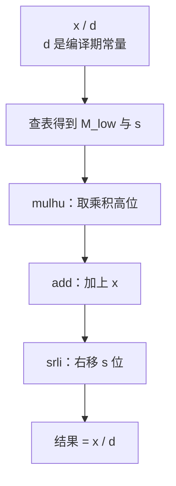
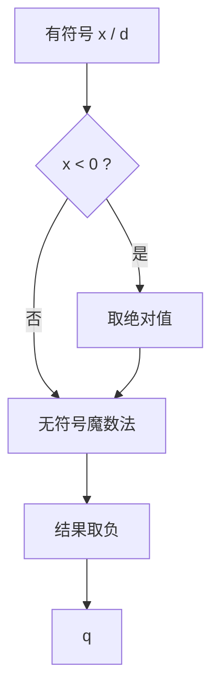

# 强度削减：乘法换移位与魔数法除法

强度削减（strength reduction）指用代价更低的等价运算替换代价较高的运算。在循环中收益最大，因为循环体的开销随迭代次数线性放大。

RISC-V 上整数运算的代价差别很大：

| 运算 | 典型延迟（周期） | 说明 |
| --- | --- | --- |
| `add` / `sub` / `slli` 等 | 1 | 最低 |
| `mul` | 3 ~ 5 | 流水线乘法器 |
| `div` / `rem` | 20 ~ 40，且延迟不固定 | 逐位试商，代价最高 |

因此强度削减有两个方向：把乘法换成移位与加法，把除法换成乘法。后者即魔数法（magic number division）。

:::tip[与目标代码优化的分工]
[目标代码层的强度削减](asm-strength-reduction)只做局部、可直接验证等价的替换（例如乘 2 的幂换成移位）；需要数学推导的"除法换乘法"放在 IR 层，也就是本页。
:::

## 一、必要性：除法与取余的代价

一个常见的 ToyC 片段：

```c
int digit_sum(int n) {
    int sum = 0;
    while (n > 0) {
        sum = sum + n % 10;
        n = n / 10;
    }
    return sum;
}
```

循环体内各有一条 `div` 和一条 `rem`。若一次 `div` 需要约 30 个周期，循环执行 100 万次就是 3000 万周期，而循环体其余指令的总和可能只有几个周期。

在目标代码层，`div` 已经是一条硬件指令，没有更便宜的等价形式可以替换，因此这项工作只能由编译器在 IR 层完成：当除数是编译期常量时，除法等价于“乘一个魔数再右移若干位”，这就是魔数法。

## 二、乘法换移位与加法

乘法这一类没有正确性风险：32 位补码乘法满足回绕语义，移位与加减的结果与乘法逐位一致，下列替换总是安全的：

| 原式 | 替换为 | 说明 |
| --- | --- | --- |
| `x * 2^k` | `x << k` | 2 的幂直接换移位，后端也实现这条 |
| `x * 3` | `(x << 1) + x` | 拆成 2 + 1 |
| `x * 7` | `(x << 3) − x` | 用减法比 `(x<<2)+(x<<1)+x` 更短 |

更一般的常量 `c` 可按二进制分解：把 `c` 中为 1 的位对应的移位结果相加（如 `x * 5` 写成 `(x << 2) + x`、`x * 10` 写成 `(x << 3) + (x << 1)`）；若“减去最高位”的写法更短，则优先用减法，例如 `x * 22 = (x << 4) + (x << 2) + (x << 1)`，三条指令替换一条 `mul`。

## 三、魔数法：把除以常量变成乘法

### 3.1 最简单的特例

无符号数除以 `2^k` 就是逻辑右移 `k` 位：

```text
x / 2^k  ≡  x >> k        （x 为无符号数，>> 为逻辑右移）
```

对非负数而言，丢掉低 `k` 位就是整除，不存在误差。需要处理的是任意除数（3、7、10 等）和有符号的负数。

### 3.2 用定点小数表示 1/d

目标是把 `x / d` 改写为乘法。注意 `1/d` 可以表示为

```text
1/d ≈ M / 2^(32+s)      （M 为整数，s 为选定的移位量）
```

于是

```text
x / d ≈ (x * M) >> (32 + s)
```

只要 `M` 足够精确，这个近似式向下取整的结果就与整数除法完全相等。取

```text
s = ceil(log2 d)                       // 保证精度足够，同时尽量小
M = floor(2^(32+s) / d) + 1            // 向上取整，用于消除截断误差
```

即可对全部 32 位 `x` 精确成立。

这里有一个便于实现的性质：由于 `2^s / d ∈ (1/2, 1]`，`M` 总是落在 `(2^32, 2^33]` 之间，即 `M` 只需 33 位——最高位固定为 1，低 32 位单独保存即可。

### 3.3 RISC-V 上的指令形式

把 `M = 2^32 + M_low` 代入：

```text
(x * M) >> 32 = (x * 2^32 + x * M_low) >> 32
             = x + ((x * M_low) >> 32)
             = x + mulhu(x, M_low)
```

其中 `mulhu` 取 32×32 乘积的高 32 位，正好等于 `(x * M_low) >> 32`。再右移 `s` 位：

```text
q = (x * M) >> (32 + s) = (x + mulhu(x, M_low)) >> s
```

对应 RISC-V 指令序列：

```asm
  li    t0, M_low        # 魔数低 32 位
  mulhu t1, a0, t0       # t1 = (x * M_low) >> 32
  add   t1, t1, a0       # t1 = (x * M) >> 32
  srli  a0, t1, s        # a0 = 无符号 x / d
```

四条低延迟指令替换一条约 30 周期的 `div`。



### 3.4 有符号数

有符号除法按向零截断（`-7 / 2 = -3`），不能直接套用无符号公式。有两种处理方式。

除数为 2 的幂时，加一个偏置再算术右移即可：

```text
t = x >> 31              // x 为负时 t = -1，否则 t = 0（算术右移）
t = t & (d - 1)          // 取下界偏置
q = (x + t) >> k         // 算术右移 k 位（d = 2^k）
```

以 `x = -7, d = 2` 为例：`t = -1`，`t & 1 = 1`，`(-7 + 1) >> 1 = -3`，与 `-7 / 2` 一致；而直接计算 `-7 >> 1` 得到 `-4`，相差 1。这就是除法不能直接换成移位的原因。

除数为一般常量时，先取绝对值，套用无符号魔数法，最后按原符号取负：

```text
sign = x >> 31                   // x < 0 时为 -1，否则为 0
ax   = (x ^ sign) - sign         // 取绝对值
q    = unsigned_magic(ax, d)     // 3.3 节的三条指令
q    = (q ^ sign) - sign         // 按符号取负
```



### 3.5 取余

`%` 的值由商决定，算出商之后只需两条指令：

```text
r = x − q * d        // mul + sub
```

`x % 10` 这类"取十进制末位"的写法在程序中很常见，魔数法把它从 `rem` 降为乘加。

### 3.6 常用除数的魔数表（32 位）

| 除数 `d` | 移位 `s` | 魔数 `M` | `M_low`（十六进制） |
| --- | --- | --- | --- |
| 3 | 2 | 5726623062 | `0x55555556` |
| 6 | 3 | 5726623062 | `0x55555556` |
| 7 | 3 | 4908534053 | `0x24924925` |
| 10 | 4 | 6871947674 | `0x9999999A` |
| 100 | 7 | 5497558139 | `0x47AE147B` |
| 1000 | 10 | 4398046512 | `0x0624DD30` |

:::note[表中数值的来源]
以 `d = 10` 为例：`s = ceil(log2 10) = 4`，`M = floor(2^36 / 10) + 1 = 6871947674`，`M_low = 6871947674 − 2^32 = 2576980378`（`0x9999999A`）。换成 `mulhu t, x, 0x9999999A`、`add t, t, x`、`srli t, t, 4` 之后，对全部 32 位无符号 `x` 都精确等于 `x / 10`；验证方法见第八节。
:::

## 四、算法

**算法 · 除法强度削减（Strength Reduction for Division）**

**输入（Input）：** 函数 IR，其中包含 `sdiv` / `udiv` / `srem` / `urem` 指令。
**输出（Output）：** 除数为编译期常量的除法与取余被替换为"乘魔数 + 移位 + 加减"的 IR。

```
 1: strengthReduceDivision(func):
 2:     for each instruction I in func do
 3:         if I.opcode ∉ {sdiv, udiv, srem, urem} then continue; end if
 4:         if not isConstant(I.divisor) then continue; end if      // 除数必须是编译期常量
 5:         d = I.divisor.value;
 6:         if isPowerOfTwo(|d|) then                                 // 特例 1：2 的幂
 7:             rewriteByShift(I, d);                                 // srai + 偏置 / srli
 8:             continue;
 9:         end if
10:         if |d| = 1 then                                           // 特例 2：除以 ±1
11:             rewriteByNegate(I, d);
12:             continue;
13:         end if
14:         s  = ceilLog2(|d|);
15:         M  = floor(2^(32+s) / |d|) + 1;                           // 魔数，恒为 33 位
16:         Ml = M − 2^32;                                            // 只保留低 32 位
17:         if I is unsigned then
18:             q = emitUnsignedMagic(I.numerator, Ml, s);            // mulhu + add + srli
19:         else
20:             q = emitSignedMagic(I.numerator, Ml, s);              // 取绝对值 + 上式 + 按符号取负
21:         end if
22:         if I.opcode is a division then
23:             replaceAllUsesWith(I, q);
24:         else                                                      // 取余：r = x − q * d
25:             r = emitSub(I.numerator, emitMul(q, |d|));
26:             replaceAllUsesWith(I, r);
27:         end if
28:         remove(I);
29:     end for
30:     return func;
```

"乘魔数取商"这一步可以封装为：

```
 1: emitUnsignedMagic(x, Ml, s):                        // q = (x * M) >> (32 + s)
 2:     hi = mulhu(x, Ml);                              // x * M_low 的高 32 位
 3:     t  = add(hi, x);                                // 等于 (x * M) >> 32
 4:     return srli(t, s);                              // 再逻辑右移 s 位
```

:::tip[实现建议]
`M_low` 与 `s` 只与除数有关，可用一张编译期常量表（`d → (M_low, s)`）缓存，避免对同一除数重复推导；除数超出表的范围时再现场计算。这也解释了为什么强度削减通常排在常量传播之后：除数越"确定"，能替换的除法越多。
:::

## 五、完整示例

```c
int f(int x) {
    return x / 10;
}
```

基线汇编：

```asm
    li   t0, 10
    div  a0, a0, t0       # 约 20 ~ 40 个周期，延迟不固定
```

强度削减后（有符号路径，8 条低延迟指令）：

```asm
    srai t0, a0, 31       # t0 = x < 0 ? -1 : 0
    xor  t1, a0, t0
    sub  t1, t1, t0       # t1 = |x|
    li   t2, 0x9999999A   # M_low（d = 10）
    mulhu t3, t1, t2
    add  t3, t3, t1
    srli t3, t3, 4        # t3 = |x| / 10
    xor  a0, t3, t0
    sub  a0, a0, t0       # 按原符号取负
```

若编译期能证明 `x >= 0`（例如 `x` 由 `n % 100` 得到，或前面已有 `if (x < 0) return`），有符号路径可以退化为三条指令：

```asm
    li    t0, 0x9999999A
    mulhu t1, a0, t0
    add   t1, t1, a0
    srli  a0, t1, 4       # a0 = x / 10
```

## 六、优化效果

- 指令级：一条 `div` / `rem` 换成 3 ~ 8 条 1 ~ 3 周期指令，循环体内收益随迭代次数线性放大。
- 与常量传播配合：传播把除数变成常量，强度削减才能命中；替换后又产生新的常量与可折叠表达式，因此应放在迭代管线中反复执行。
- 与归纳变量配合：若除数恒定而分子是归纳变量，强度削减后往往还能把"乘法 + 移位"进一步变成归纳变量的自增（见[目标代码层的强度削减](asm-strength-reduction)）。
- 代价：指令条数增加会略微加大寄存器压力，对迭代次数极少的循环可能得不偿失，因此工业编译器通常只在循环内或能确认收益时启用。

## 七、正确性陷阱

| 陷阱 | 说明 |
| --- | --- |
| 除数是运行期变量 | 魔数法只对编译期常量除数成立，`x / y` 只能保留 `div` |
| 有符号按无符号处理 | 有符号除法向零截断，直接套用无符号公式会在负数上相差 1 |
| `d = -1` 与 `INT_MIN` | `INT_MIN / -1` 溢出（C 语言中为未定义行为，RISC-V `div` 返回 `INT_MIN`），取绝对值的写法在此处会溢出，必须特判 `d = ±1` |
| 取余的符号 | ToyC 与 C 一致：余数符号跟随被除数，必须用 `r = x − q * d` 反算，不能直接搬用无符号取余 |
| 位宽假设 | 本页公式针对 32 位 `int`（ToyC 的 `int` 为 32 位有符号）；扩展到 64 位时 `M`、`s` 与移位量都要按 64 位重新计算 |
| 移位指令语义 | 无符号商用 `srli`（逻辑右移）；取绝对值前的 `x >> 31` 用 `srai`（算术右移），两者不能混用 |
| 溢出标志 | 若 IR 带有 `nsw` / `nuw` 标志，替换后需保证标志语义仍然成立 |

## 八、动手验证

魔数法的正确性适合用对拍验证，但也容易因为符号位处理不当出错，因此测试是必要的：

```bash
# 1. 检查优化后的汇编是否还残留除法
./compiler --dump-asm -opt < test.c > after.s
grep -nE '\b(div|divw|rem|remw)\b' after.s     # 除数全是常量时应当没有输出

# 2. 对拍：优化前后分别链接运行，比较输出
./compiler --dump-asm      < test.c > base.s
./compiler --dump-asm -opt < test.c > opt.s
```

建议再写一个范围测试程序：把 `x` 从 `-2147483648` 到 `2147483647` 分段取样（包含 `0`、`±1`、`INT_MIN`、`INT_MAX` 以及每个除数倍数附近的值），逐个比较 `x / d`、`x % d` 与优化后的结果。本页给出的魔数表就是用这种方法在全部 32 位取值上验证过的。

下一步阅读：[函数内联](ir-inline)。前序知识：[常量传播](ir-cprop) 负责把除数变成常量，[循环不变代码外提](ir-licm) 决定这些除法是否需要留在循环中。
